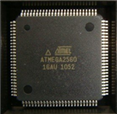

# Micro Processor
최근 마이크로프로세서(MicroProcessor)의 급격한 기술 발전으로 전자·IT 제품이 고기능화·다양화되고 있습니다. 최초의 인텔 마이크로프로세서 이후 기술이 고도화되면서, 이를 지칭하는 용어도 성격과 성능에 따라 Microprocessor / Microcontroller / SoC 등으로 세분화되었습니다.

일반적으로 마이크로프로세서는 CPU 코어를 하나의 칩에 집적한 형태를 뜻하며, 컴퓨터의 발전과 함께 고성능화(최근엔 64비트 대세)되었습니다. 반면 가전과 IoT 기기의 지능화·소형화 수요에 맞춰 CPU에 **메모리와 주변장치(I/O, ADC, 타이머 등)** 까지 통합한 **마이크로컨트롤러(MCU)** 가 등장했고, 이는 시스템 부품 수를 줄여 소형·저전력·저비용을 달성하며 개발기간을 단축해 줍니다.

## Micro Processor와 Micro Controller
- Micro Processor (MPU) : CPU 코어만을 하나의 칩에 집적한 형태로, 주로 PC나 서버와 같이 고성능 연산이 필요한 분야에 사용됩니다. (예: Intel i7, AMD Ryzen)
- Micro Controller (MCU) : CPU뿐 아니라 **메모리와 주변장치(I/O 포트, ADC, 타이머 등)**까지 하나의 칩에 통합한 형태입니다. 소형·저전력·저비용 장치에 적합하며, 가전제품·자동차 ECU·IoT 기기 등에 널리 활용됩니다. (예: ATMega2560, STM32)
- SoC (System on Chip) : CPU, GPU, 메모리, 주변장치를 모두 하나의 칩에 집적한 형태로, 사실상 하나의 컴퓨터를 한 칩 안에 구현한 것입니다. (예: 스마트폰 AP, Raspberry Pi, Jetson 시리즈)

| 구분 | MPU (Micro Processor) | MCU (Micro Controller) | SoC (System on Chip)   |
| --- | --- | --- | --- |
| 구성 | CPU만 | CPU + 메모리 + 주변장치 | CPU + GPU + 메모리 + 주변장치 |
| 장점 | 고성능 | 저가·저전력·간단 | 고집적·다기능 |
| 예시 | Intel i7, AMD Ryzen | ATMega2560, STM32 | Raspberry Pi, 스마트폰 AP |
| 활용 | PC, 서버 | 가전제품, IoT, 제어장치 | 스마트폰, 임베디드 AI |

## CPU 아키텍처: RISC vs CISC
### CISC (Complex Instruction Set Computer)
- 특징: 복잡·다기능 명령어, 가변 길이 인스트럭션, 다양한 주소지정 방식.
- 구현: 마이크로코드 기반 제어(명령을 내부에서 여러 미소동작으로 분해).
- 장점: 코드 밀도↑(짧은 프로그램 크기), 고급 기능 내장.
- 예시: x86/AMD64 계열(PC·서버).

### RISC (Reduced Instruction Set Computer)
- 특징: 단순·고정 길이 명령어, 풍부한 범용 레지스터, 하드와이어드 제어.
- 파이프라인 효율이 좋아 CPI(명령당 사이클) 낮음, 클럭 대비 성능 효율↑.
- 장점: 저전력·고효율, 컴파일러 친화적, 예측 가능한 실행 시간(실시간 제어 유리).
- 예시: AVR(ATmega), ARM Cortex-M/A, RISC-V 등.

### 하버드 vs 폰 노이만
- 하버드 구조(AVR/ATmega): 프로그램 메모리와 데이터 메모리 분리 → 한 사이클에 명령 페치+데이터 접근 동시 가능(처리율↑).
- 폰 노이만 구조: 프로그램·데이터가 동일 버스 공유(일반적 컴퓨터 구조).

## ATmega2560
ATmega2560은 Microchip(전 Atmel)의 8비트 AVR RISC MCU로, 하버드 구조, 32×8비트 범용 레지스터, 단일 사이클 ALU를 기반으로 합니다. Arduino Mega 보드의 핵심 칩으로 교육·프로토타이핑·산업 제어에 폭넓게 사용됩니다.

### ATmega2560 주요 특징 
- 성능 및 아키텍처
    - 고성능 저전력 AVR 8bit RISC 구조
    - 최대 16MIPS @ 16MHz 동작
    - 파이프라인 구조로 명령어 실행 속도 최적화
    - 135종 단일 사이클 명령어 집합
- 메모리
    - Flash : 256KB (ISP 지원, Boot Code 영역 분리 가능)
    - SRAM : 8KB
    - EEPROM : 4KB
    - 최대 64KB 외부 메모리 확장 가능
- 타이머 및 카운터
    - 2개의 8비트 Timer/Counter
    - 4개의 16비트 Timer/Counter (캡처/비교 모드 지원)
    - 총 12채널의 PWM 출력 지원
    - Real-Time Counter(RTC) 및 Output Compare 기능
- 아날로그 기능
    - 16채널, 10비트 ADC (최대 샘플링 속도 약 15kS/s)
    - 아날로그 비교기 내장
- 통신 인터페이스
    - UART(시리얼 포트) × 4
    - SPI (Master/Slave 모드)
    - I²C (Two-Wire Interface)
    - JTAG 디버그 지원
- 전력 관리
    - 6종 Sleep Mode (Idle, ADC Noise Reduction, Power Down, Power Save, Standby, Extended Standby)
    - Watchdog Timer 지원
