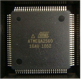

# Micro Processor
최근 마이크로프로세서(MicroProcessor)의 급격한 기술 발전으로 전자·IT 제품이 고기능화·다양화되고 있습니다. 최초의 인텔 마이크로프로세서 이후 기술이 고도화되면서, 이를 지칭하는 용어도 성격과 성능에 따라 Microprocessor / Microcontroller / SoC 등으로 세분화되었습니다.

일반적으로 마이크로프로세서는 CPU 코어를 하나의 칩에 집적한 형태를 뜻하며, 컴퓨터의 발전과 함께 고성능화(최근엔 64비트 대세)되었습니다. 반면 가전과 IoT 기기의 지능화·소형화 수요에 맞춰 CPU에 **메모리와 주변장치(I/O, ADC, 타이머 등)** 까지 통합한 **마이크로컨트롤러(MCU)** 가 등장했고, 이는 시스템 부품 수를 줄여 소형·저전력·저비용을 달성하며 개발기간을 단축해 줍니다.

## Micro Processor와 Micro Controller
- Micro Processor (MPU) : CPU 코어만을 하나의 칩에 집적한 형태로, 주로 PC나 서버와 같이 고성능 연산이 필요한 분야에 사용됩니다. (예: Intel i7, AMD Ryzen)
- Micro Controller (MCU) : CPU뿐 아니라 **메모리와 주변장치(I/O 포트, ADC, 타이머 등)**까지 하나의 칩에 통합한 형태입니다. 소형·저전력·저비용 장치에 적합하며, 가전제품·자동차 ECU·IoT 기기 등에 널리 활용됩니다. (예: ATMega2560, STM32)
- SoC (System on Chip) : CPU, GPU, 메모리, 주변장치를 모두 하나의 칩에 집적한 형태로, 사실상 하나의 컴퓨터를 한 칩 안에 구현한 것입니다. (예: 스마트폰 AP, Raspberry Pi, Jetson 시리즈)

| 구분 | MPU (Micro Processor) | MCU (Micro Controller) | SoC (System on Chip)   |
| --- | --- | --- | --- |
| 구성 | CPU만 | CPU + 메모리 + 주변장치 | CPU + GPU + 메모리 + 주변장치 |
| 장점 | 고성능 | 저가·저전력·간단 | 고집적·다기능 |
| 예시 | Intel i7, AMD Ryzen | ATMega2560, STM32 | Raspberry Pi, 스마트폰 AP |
| 활용 | PC, 서버 | 가전제품, IoT, 제어장치 | 스마트폰, 임베디드 AI |

## CPU 아키텍처: RISC vs CISC
### CISC (Complex Instruction Set Computer)
- 특징: 복잡·다기능 명령어, 가변 길이 인스트럭션, 다양한 주소지정 방식.
- 구현: 마이크로코드 기반 제어(명령을 내부에서 여러 미소동작으로 분해).
- 장점: 코드 밀도↑(짧은 프로그램 크기), 고급 기능 내장.
- 예시: x86/AMD64 계열(PC·서버).

### RISC (Reduced Instruction Set Computer)
- 특징: 단순·고정 길이 명령어, 풍부한 범용 레지스터, 하드와이어드 제어.
- 파이프라인 효율이 좋아 CPI(명령당 사이클) 낮음, 클럭 대비 성능 효율↑.
- 장점: 저전력·고효율, 컴파일러 친화적, 예측 가능한 실행 시간(실시간 제어 유리).
- 예시: AVR(ATmega), ARM Cortex-M/A, RISC-V 등.

### 하버드 vs 폰 노이만
- 하버드 구조(AVR/ATmega): 프로그램 메모리와 데이터 메모리 분리 → 한 사이클에 명령 페치+데이터 접근 동시 가능(처리율↑).
- 폰 노이만 구조: 프로그램·데이터가 동일 버스 공유(일반적 컴퓨터 구조).

## ATmega2560
ATmega2560은 Microchip(전 Atmel)의 8비트 AVR RISC MCU로, 하버드 구조, 32×8비트 범용 레지스터, 단일 사이클 ALU를 기반으로 합니다. Arduino Mega 보드의 핵심 칩으로 교육·프로토타이핑·산업 제어에 폭넓게 사용됩니다.



### ATmega2560 주요 특징 
- 성능 및 아키텍처
    - 고성능 저전력 AVR 8bit RISC 구조
    - 최대 16MIPS @ 16MHz 동작
    - 파이프라인 구조로 명령어 실행 속도 최적화
    - 약 130여 종의 명령어 집합을 제공하며, 많은 명령이 1사이클에 실행되지만 분기/메모리 접근 등 일부 명령은 추가 사이클이 필요할 수 있음.
- 메모리
    - Flash : 256KB (ISP 지원, Boot Code 영역 분리 가능)
    - SRAM : 8KB
    - EEPROM : 4KB
    - 최대 64KB 외부 메모리 확장 가능
- 타이머 및 카운터
    - 2개의 8비트 Timer/Counter
    - 4개의 16비트 Timer/Counter (캡처/비교 모드 지원)
    - 총 12채널의 PWM 출력 지원
    - Output Compare 기능을 지원하며, 타이머/카운터(예: 비동기 타이머 구성)를 이용해 RTC와 유사한 시간 기반 동작을 구현 가능
- 아날로그 기능
    - 16채널, 10비트 ADC
    - 아날로그 비교기 내장
- 통신 인터페이스
    - UART(시리얼 포트) × 4
    - SPI (Master/Slave 모드)
    - I²C (Two-Wire Interface)
    - JTAG 디버그 지원
- 전력 관리
    - 6종 Sleep Mode (Idle, ADC Noise Reduction, Power Down, Power Save, Standby, Extended Standby)
    - Watchdog Timer 지원

# 아두이노(Arduino)란?
## 아두이노의 탄생 배경과 개념
**Arduino**는 오픈소스 하드웨어(Open Source Hardware) 기반의 마이크로컨트롤러(MCU) 개발 플랫폼입니다. 아두이노는 단순히 하나의 칩이나 보드를 의미하는 것이 아니라,

- 하드웨어(개발 보드)
- 소프트웨어(IDE 및 라이브러리)
- 커뮤니티와 생태계

를 모두 포함하는 통합 개발 환경을 의미합니다.

아두이노는 2005년 이탈리아 이브레아(Ivrea)에 위치한 디자인 학교에서 시작되었습니다. 당시 학생들이 마이크로컨트롤러 기반 인터랙티브 작품을 제작하기 위해 AVR MCU를 사용했는데, 기존 개발 환경은 가격이 비싸고 사용법이 복잡해 비전공자나 예술·디자인 계열 학생들이 접근하기 어려운 문제가 있었습니다.

이러한 문제를 해결하기 위해 저렴하고, 쉽게 프로그래밍할 수 있으며, 누구나 수정·확장 가능한 보드가 필요했고, 그 결과물이 바로 아두이노입니다.

아두이노의 핵심 철학은 다음 세 가지로 요약할 수 있습니다.

- 접근성(Accessibility): 전자·임베디드 비전공자도 쉽게 사용 가능
- 확장성(Extensibility): 센서·모듈·통신 장치 등을 자유롭게 연결
- 개방성(Openness): 하드웨어 회로도와 소프트웨어가 모두 공개

이러한 특징 덕분에 아두이노는 교육, 취미, 연구, 프로토타이핑, 나아가 소규모 상용 제품 개발까지 폭넓게 활용되고 있습니다.

## 아두이노와 마이크로컨트롤러(MCU)의 관계
아두이노는 MCU를 기반으로 한 개발 플랫폼입니다. 즉, 아두이노 보드의 중심에는 항상 하나의 마이크로컨트롤러 칩이 존재합니다. 대표적인 예는 다음과 같습니다.

- Arduino Uno → ATmega328P
- Arduino Mega → ATmega2560
- Arduino Due → ARM Cortex-M 기반 MCU
- Arduino Nano 33 → ARM 또는 ESP 계열 MCU

아두이노는 이러한 MCU를 직접 다루지 않아도 되도록 추상화된 함수와 라이브러리를 제공합니다.
예를 들어, AVR MCU에서 포트를 직접 제어하려면 레지스터를 이해해야 하지만, 아두이노에서는 단순한 코드를 작성하면 됩니다. 

```cpp
ex)
digitalWrite(13, HIGH);
```

이러한 **하드웨어 추상화(Hardware Abstraction)**가 아두이노의 가장 큰 장점 중 하나입니다.

## 아두이노 보드의 구성과 특징
아두이노 보드는 MCU 외에도 개발과 실습을 쉽게 만들어 주는 부가 회로들을 포함되어 있습니다.

- MCU 칩: 프로그램이 실행되는 핵심 장치
- 클럭 회로: MCU 동작 주파수 제공(일반적으로 16MHz)
- 전원 회로: USB 또는 외부 전원 입력
- USB-시리얼 변환기: PC와 MCU 간 통신 및 프로그램 업로드
- 리셋 회로: 프로그램 재시작
- 핀 헤더: 센서·모듈 연결을 위한 인터페이스

이러한 구성 덕분에 사용자는 전원 연결과 USB 케이블만으로 즉시 실습을 시작할 수 있습니다.

## 아두이노의 라이브러리와 생태계
아두이노의 강력함은 방대한 라이브러리와 커뮤니티에서 나옵니다. 공식으로 제공되는 라이브러리부터 사용자가 제작해 배포하기도 합니다. 

- 센서 제어(DHT, 초음파, 가속도 등)
- 디스플레이(LCD, OLED, TFT)
- 통신(Wi-Fi, Bluetooth, Ethernet, MQTT)
- 모터 제어(DC, 서보, 스텝 모터)

대부분의 라이브러리는 함수 호출 몇 줄만으로 동작하며, 내부 구현을 몰라도 사용할 수 있습니다.

또한 다양한 확장 보드를 통해 손쉽게 기능을 확장하거나 원하는 장치를 연결하여 활용할 수 있습니다. 

- Ethernet Shield
- Motor Shield
- Wi-Fi Shield
- Sensor Shield

쉴드는 보드 위에 꽂기만 하면 기능이 확장되는 구조로, 하드웨어 설계 부담을 크게 줄여줍니다.

