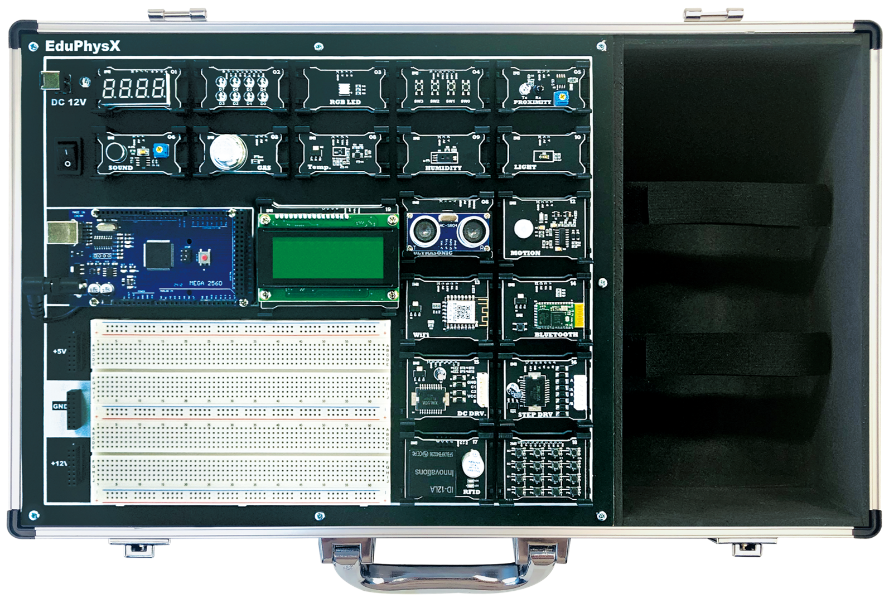
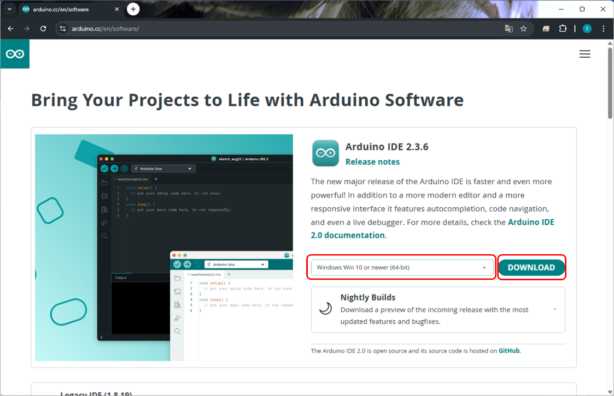
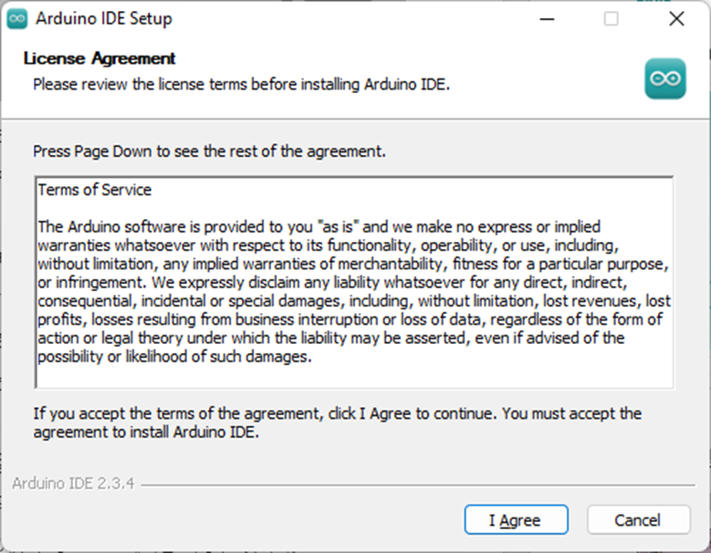
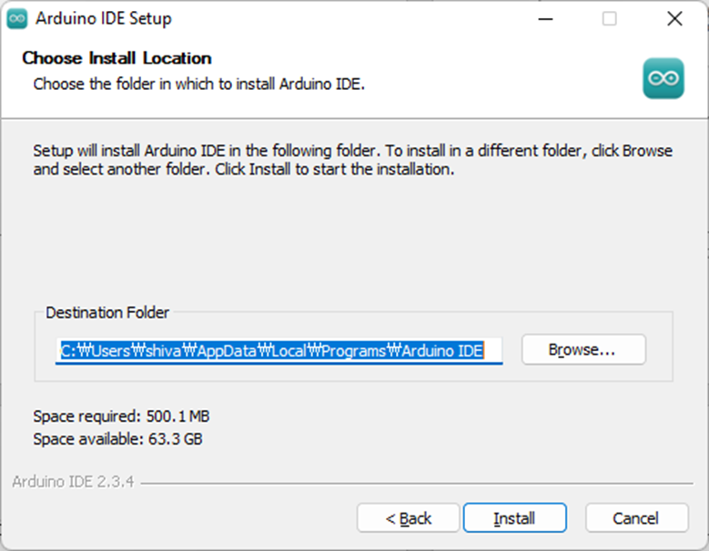
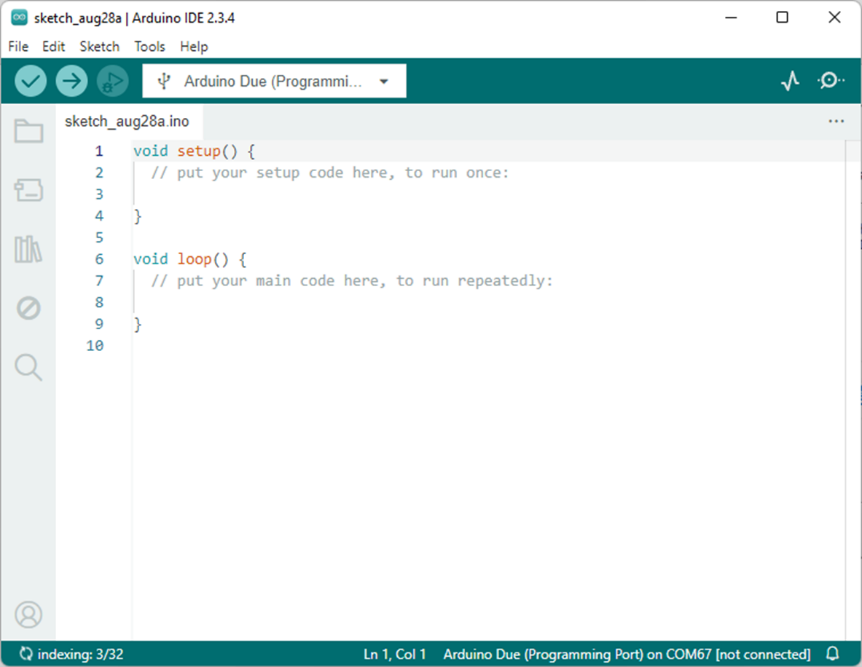
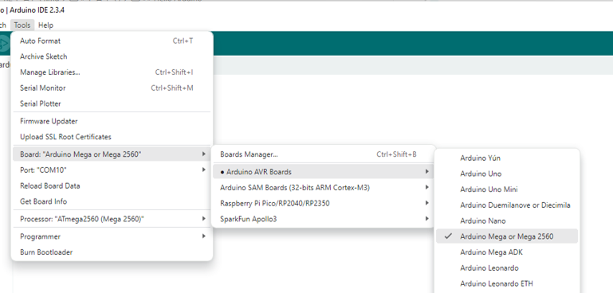
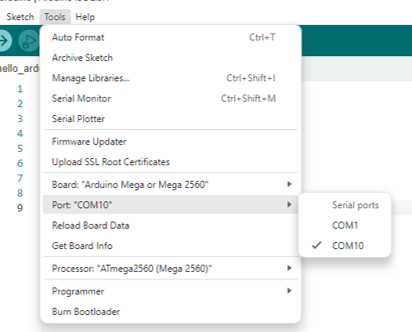
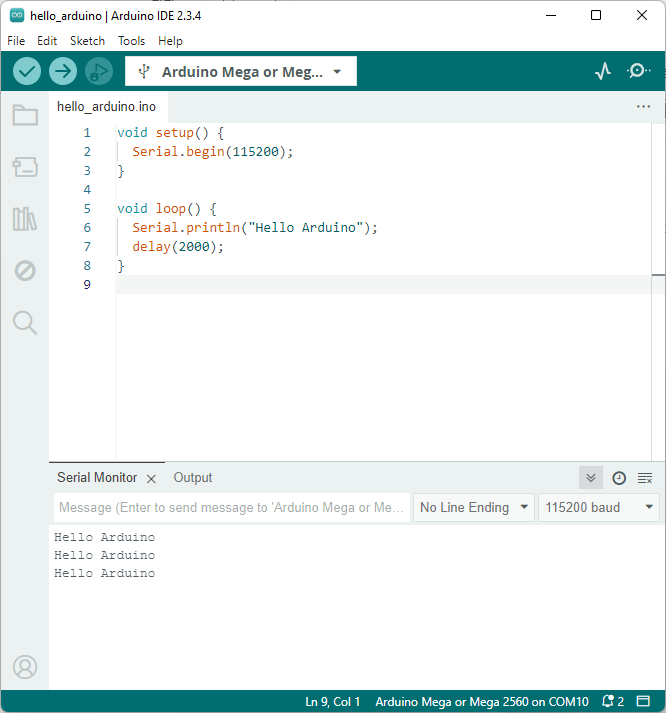

# 실습 환경 
마이크로컨트롤러를 활용하시기 위해서는 CPU에서 실행될 프로그램이 필요하며, 이 프로그램을 기계어로 변환해 주는 컴파일러와 프로그램의 오류를 확인·수정하기 위한 디버깅 도구가 요구됩니다. 또한, 칩 내부에 내장된 플래시 메모리에 프로그램을 기록하기 위한 ISP 도구 역시 필요하게 됩니다. 이처럼 마이크로컨트롤러 기반 임베디드 시스템 개발에 필요한 일련의 소프트웨어와 도구들을 통틀어 ‘개발환경’이라고 부릅니다.

## 실습 장비 소개 
EduPhysX 는 브레드보드를 기반으로 하여 납땜 과정 없이도 다양한 IoT 캡스톤 시나리오를 즉시 구현하실 수 있도록 설계된 모듈형 피지컬 컴퓨팅 실습 플랫폼입니다. 8-bit RISC Harvard 구조의 메인 프로세서를 채택하여 빌드 시간을 크게 단축하였으며, 풍부한 I/O 확장성과 함께 복잡한 프로젝트까지 처리할 수 있는 성능을 제공합니다.

브레드보드 기반의 자유로운 배선 환경을 통해 센서와 액추에이터를 신속히 교체할 수 있어, 프로젝트 기반 학습(PBL) 반복 실험에 최적화되어 있습니다. 또한 UART, SPI, I2C, 외부 인터럽트 등 다양한 하드웨어 인터페이스가 내장되어 있어, 단순 MCU 학습을 넘어 실제 IoT·임베디드 시스템 수준의 프로젝트 구현까지 확장하실 수 있습니다.

센서·액추에이터 제어를 위한 5V 전원뿐만 아니라 DC 모터, 서보 모터, 스텝 모터 구동에 필요한 12V 고출력 전원도 함께 제공하여 폭넓은 하드웨어 실습이 가능합니다. 더불어 RF 기반 식별 기능을 활용하면 물류, 출입통제, 스마트시티 등 전문적인 시나리오까지 자연스럽게 확장할 수 있습니다.

또한 PC와의 연동을 통해 Python 환경에서 센싱 → 처리 → 제어 → 액추에이터 동작의 전체 파이프라인을 몇 줄의 코드로 구현하실 수 있어, 피지컬 AI 메이킹 및 지능형 프로젝트로의 확장에도 유리합니다.



## Arduino IDE 설치 
아두이노 IDE 는 아두이노 홈페이지를 통해 간편하게 다운로드 하여 설치할 수 있습니다. 

- [Arduino Homepage](https://www.arduino.cc/)



다운로드 받은 설치파일을 실행하면 IDE 설치 화면을 볼 수 있습니다. 



설치경로는 기본적으로 'C:\Users\{USER_NAME}\AppData\Local\Programs \Arduino IDE' 에 설치되도록 되어 있습니다. 설치 경로는 임의로 변경해도 되며, 설치시 하드 여유공간은 약 500MB 정도 필요합니다. 



설치가 완료되고 아두이노 IDE 를 실행하면 다음 그림과 같이 프로그램이 실행 됩니다. 



## Hello Arduino 
이제 첫번째 프로그램을 작성해서 업로드 해보도록 하겠습니다. 

```cpp
void setup() {
  Serial.begin(115200);
}

void loop() {
  Serial.println("Hello Arduino");
  delay(2000);
}
```

프로그램 작성이 완료되면 업로드를 위해 아두이노와 PC 를 USB를 통해 연결합니다. USB 연결 시 자동으로 드라이버가 설치되며, COM 포트가 인식됩니다.

먼저 사용할 보드를 선택합니다. 상단의 메뉴중 'Tools' 에서 'Board' 메뉴를 선택하고, 하위 메뉴의 'Arduino AVR Boards' 를 선택합니다. 여기서 제공되는 다양한 보드중 'Arduino Mega or Mega2560' 을 선택합니다. 



이후 포트를 선택합니다. 사용중인 PC 에 따라 포트의 이름은 다르게 설정될 수 있으며, 인식된 포트의 목록만 출력됩니다. 



이제 작성한 프로그램을 업로드합니다. 업로드는 IDE 좌측 상단의 아이콘 혹은 'Ctrl + U' 단축키를 이용합니다. 업로드 버튼을 클릭하면 컴파일 과정을 거치며, 컴파일이 완료되면 아두이노 보드에 프로그램이 업로드 됩니다. 


업로드가 완료되면 프로그램은 즉시 실행됩니다. 작성한 코드는 2초마다 ‘Hello Arduino’를 출력하도록 되어 있지만, 현재는 출력 내용이 화면에 보이지 않습니다. 

Serial 을 통해 출력되는 정보는 아두이노 IDE 의 Serial Monitor 를 통해 확인이 가능합니다. Serial Monitor 는 우측 상단 아이콘을 통해 실행할 수 있습니다. 


Serial Monitor 는 IDE 하단에 실행되며, 통신 속도를 정확하게 설정해야 문자 출력이 정상적으로 확인됩니다. 이때 통신 속도는 Serial.begin() 에 전달된 인자와 동일해야 합니다. 

