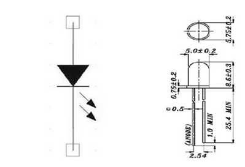
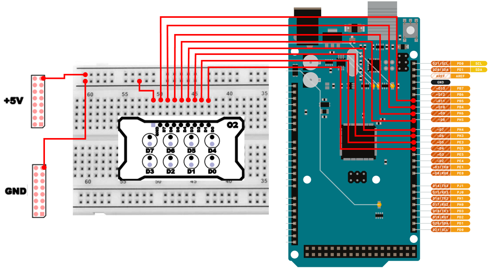

# LED 제어 
## LED 
LED는 Light-emitting diode의 약자로서, 발광다이오드라 부릅니다. 다이오드(Diode)는 `전류가 한방향으로만 흐르도록` 만드는 반도체 소자이며, LED는 그 다이오드 특성에 더해 전류가 흐를 때 빛을 내도록 설계된 소자입니다.

LED는 다음 두 가지 특징을 동시에 갖습니다.

- 극성이 있다.
    - +, −를 반대로 연결하면 전류가 거의 흐르지 않으므로 LED가 켜지지 않는다.
- 전류가 흐르면 빛을 낸다.
    - 전류가 흐르는 양(전류의 크기)에 따라 밝기(광량)가 달라질 수 있다.

일반 백열전구에 비하여 소비전력은 1/5밖에 안되고, 반응시간은 백만 배나 빠르며, 수명은 반영구적으로 향상되어 정밀 반도체 장비 검사기, 자동차 계기판 등의 전자 표시판, 전광판, 산업기기 표시기 및 각종 교통안전 신호기 등에 많이 사용됩니다.



EduphysX의 LED 모듈의 회로는 다음과 같습니다. 


### LED 제어 회로 구성시 주의 사항 
LED는 흔히 **“정전류 소자처럼 동작”** 한다고 설명합니다. 

조금 더 쉬운 말로 바꾸면, `"LED는 켜졌을 때 내부 저항이 매우 낮아질 수 있고, 그러면 회로에서 전류가 필요 이상으로 많이 흐르기 쉬워 LED가 과열되거나 손상될 수 있습니다."`

그래서 LED 앞에는 **직렬 저항(Series Resistor)** 을 넣어서, LED로 흐르는 전류를 **안전한 범위**로 제한합니다. 따라서 반드시 직렬로 저항(보통 220Ω~1kΩ)을 연결하여 전류를 제한해야 합니다.

#### LED 제어회로에 연결하는 저항값 계산 
저항값은 다음과 같은 생각으로 계산합니다. 

- 전원(Vcc)에서 LED에 걸리는 전압(Vf)을 빼면,  **저항이 감당해야 하는 전압**이 되고, 그 전압에서 원하는 전류(I)가 흐르도록 저항을 결정한다.

저항값은 옴의 법칙에 따라 다음과 같이 계산할 수 있습니다. 
- R = (Vcc- Vf) / I
    - Vcc : 입력 전압
    - Vf : 순방향 전압 
    - I : 전류 

예를 들어, 5V 전원에서 LED 의 순방향 전압(Vf) 가 2V이고, 전류(I)가 10mA 일때를 계산해보면 다음과 같습니다.
- R = (5-2)/0.01 = 300

이 경우에는 300Ω 의 저항을 사용하면 되는데, 실제 부품은 300Ω이 딱 떨어지지 않는 경우가 많으니, 수치가 가장 가까운 표준 저항값을 선택합니다. 이때 300Ω 보다 약간 큰 값인 330Ω 의 저항을 사용하면 전류가 조금 줄어들어 더 안전합니다. 

## LED 연결 
LED와 아두이노 핀 연결은 다음과 같습니다. 

| Pin | 연결 대상 | 설명 |
|:---:|:---:|:---|
| GND | GND | 접지 |
| 4 | D0 | LED 0 |
| 5 | D1 | LED 1 |
| 6 | D2 | LED 2 |
| 7 | D3 | LED 3 |
| 8 | D4 | LED 4 |
| 9 | D5 | LED 5 |
| 10 | D6 | LED 6 |
| 11 | D7 | LED 7 |



LED 와 연결된 디지털 핀을 HIGH로 만들면 LED 에 전압이 걸리고 전류가 흐르며 LED가 켜지게되고, 디지털 핀을 LOW로 만들면 전류가 흐르지 않아 꺼지게 됩니다. 

## LED 제어 프로그램 
### 단일 LED 제어 
LED 제어 프로그램은 다음과 같습니다. 가장 먼저 작성하는 프로그램은 1개의 LED를 1초마다 켜고/끄는 형태입니다. 

```cpp
int pin_led = 4;

void setup() {
    pinMode(pin_led, OUTPUT);
}

void loop() {
    digitalWrite(pin_led, HIGH);
    delay(1000);
    digitalWrite(pin_led, LOW);
    delay(1000);
}
```

#### 단일 LED 제어 주요 코드 설명 
>**pinMode(pin_led, OUTPUT);**
>- LED를 연결한 디지털 핀을 OUTPUT 모드로 설정합니다. 
>- 전원 인가시 기본적으로 디지털핀은 INPUT 모드입니다. 제어를 위해서는 반드시 OUTPUT 모드로 설정해야 합니다. 

>**digitalWrite(pin_led, HIGH);**
>- 디지털 핀을 HIGH로 만듭니다. HIGH의 전압은 보드의 종류마다 다르며, EduPhysX에서 사용중인 Mega2560 은 5V 입니다. 

>**digitalWrite(pin_led, LOW);**
>- 디지털 핀을 LOW로 만듭니다. LOW의 전압은 0V입니다. 

>**delay(1000);**
>- 1000ms = 1초 동안 현재 상태를 유지합니다.

### 다중 LED 제어 
LED가 여러 개일 때 하나씩 제어하려면 같은 코드를 여러 번 쓰는 방법도 있지만, 그 방식은 LED 개수가 늘어날수록 코드가 길어지고 실수가 많아집니다.

그래서 일반적으로 LED 핀들을 배열에 넣고 반복문으로 "초기화" 및 "제어" 를 처리합니다. 이 예제에서는 8개의 LED를 순서대로 켰다가, 순서대로 끄는 동작을 수행합니다. 
```cpp
int pin_leds[8] = {4,5,6,7,8,9,10,11};
int i;

void setup() {
    for(i=0;i<8;i++){
        pinMode(pin_leds[i], OUTPUT);
    }
}

void loop() {
    for(i=0;i<8;i++){
        digitalWrite(pin_leds[i], HIGH);
        delay(200);
    }
    for(i=0;i<8;i++){
        digitalWrite(pin_leds[i], LOW);
        delay(200);
    }
}
```

#### 다중 LED 제어 주요 코드 설명 
> ```cpp
> for(i=0;i<8;i++){  
>   pinMode(pin_leds[i], OUTPUT);  
> }
> ```
> - LED와 연결된 모든 핀을 OUTPUT으로 설정합니다.

> **loop() 에서의 점등 패턴**
> - 첫 번째 for문:
>   - LED0 → LED1 → … → LED7 순서로 `켜짐` (200ms 간격)
> - 두 번째 for문:
>   - LED0 → LED1 → … → LED7 순서로 `꺼짐` (200ms 간격)

### PWM을 통한 밝기 제어 
digitalWrite()를 통해 HIGH 혹은 LOW 로 제어하면 켜거나 끄는 제어는 가능하지만 세부적인 밝기제어는 할 수 없습니다. 

하지만 LED는 실제로 `전류가 많을수록 더 밝아지는 특성`이 있으므로, 전류를 조절하도록 제어한다면 LED의 밝기를 조절할 수 있습니다. 

**PWM(Pulse Width Modulation)** 은 매우 빠르게 HIGH/LOW 를 반복하고, HIGH가 되어 있는 시간비율(duty)을 바꿔서 평균적으로 더 밝게 혹은 어둡게 보이도록 만들 수 있습니다. 

아두이노 에서는 analogWrite() 를 통해 제어하게되면 PWM 방식으로 LED 밝기를 제어할 수 있습니다. 
```cpp
int pin_led = 4;

void setup() {
    pinMode(pin_led, OUTPUT);
}

void loop() {
  for(int i = 0; i<255; i++) {
    analogWrite(pin_led, i);
    delay(20);
  }
  for(int i = 255; i>=0; i--) {
    analogWrite(pin_led, i);
    delay(20);
  }
}
```

analogWrite()는 모든 핀에서 되는 것이 아니라, PWM 지원 핀에서만 정상 동작합니다. 만약, 핀을 변경했는데 밝기 조절이 안되고 "켜짐/꺼짐" 만 반복된다면 해당핀은 PWM 제어가 지원되지 않는 핀일 가능성이 높습니다. 

#### PWM을 통한 밝기 제어 주요 코드 설명 
> **analogWrite(pin_led, i);**
> - i 값(0~255)에 따라 PWM 듀티비를 조절합니다.

### 8비트 이진 패턴 출력 
이번 예제는 8개의 LED를 이용해 하나의 8비트 숫자를 시각적으로 표현합니다. 
`0`부터 `255`까지의 숫자를 1씩 증가시키며, 각 숫자의 이진 표현을 LED로 출력합니다.  

예를 들어, 숫자 `5`는 이진수로 `00000101` 이므로, 오른쪽에서 첫 번째와 세 번째 LED가 켜지게 됩니다.

각 비트는 `bitRead()` 함수를 이용하여 읽어옵니다. 이 함수는 주어진 정수의 특정 비트 위치에 있는 값을 반환하며, 해당 비트가 `1`이면 LED를 켜고, `0`이면 끄도록 제어합니다.
```cpp
int pin_leds[8] = {4,5,6,7,8,9,10,11};
int i = 0;
static uint8_t counter = 0;

void setup() {
    Serial.begin(115200);
    for(i=0; i<8; i++){
        pinMode(pin_leds[i], OUTPUT);
        digitalWrite(pin_leds[i], LOW);
    }
}

void showByte(uint8_t value) {
    for(i=8-1; i>=0; i--){
        int bitVal = bitRead(value, i);
        digitalWrite(pin_leds[i], bitVal ? HIGH : LOW);
    }
}

void loop() {   
    showByte(counter);
    Serial.println(counter);
    counter++;
    if(counter > 255)
      counter = 0;
    delay(150);
}
```

#### 8비트 이진 패턴 출력 주요 코드 설명 
> **static uint8_t counter = 0;**
> - uint8_t는 0~255 범위를 갖는 8비트 정수입니다. static을 붙이면 변수의 값이 loop가 반복되어도 유지됩니다.

> **Serial.begin(115200);**
> - 숫자(counter)를 PC로 출력해 현재 값을 확인하기위해 시리얼을 초기화합니다. 

> ```cpp
> void showByte(uint8_t value) {
>     for(i=8-1; i>=0; i--){
>         int bitVal = bitRead(value, i);
>         digitalWrite(pin_leds[i], bitVal ? HIGH : LOW);
>     }
> }
> ```
> - value 변수의 숫자를 2진수로 해석해서 LED에 표시합니다.  
> - **bitRead(value,i);** 의 결과에 따라 LED를 제어합니다. 
>   - bitRead(value,i) : value의 i번째 비트를 읽습니다. 반환값은 0 또는 1 

> **Serial.println(counter);**
> - 시리얼 장치를 통해 숫자를 출력합니다. 