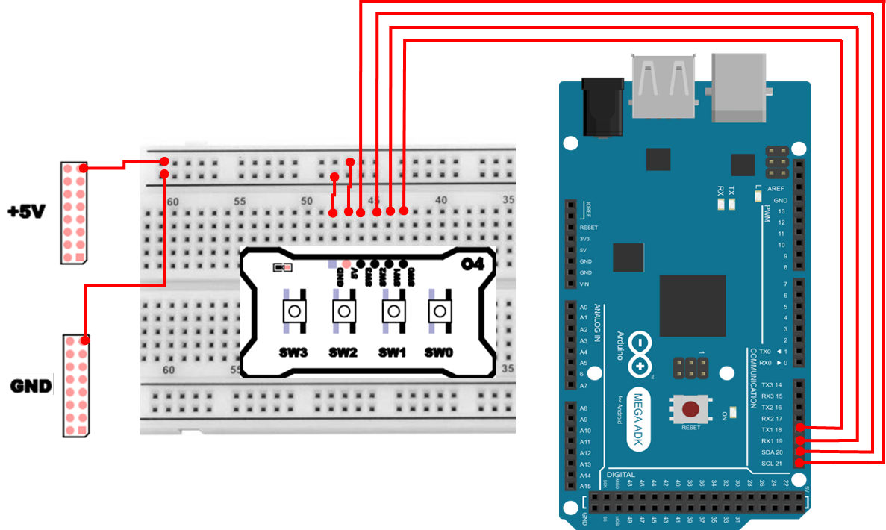

# PushSwitch
## PushSwitch 
PushSwitch 의 입력 방식은 직접 입력 방식(Direct Input) 과 행렬 입력 방식(Matrix Input)
두 가지로 나눌수 있습니다. 직접 입력 방식의 경우 키를 포트에 일대 일로 연결하여 입력을 검사하는 방식으로 하드웨어 구성이 간편하고, 소프트웨어 구현이 쉬운 장점이 있습니다. 반면에 많은 키 입력이 필요할 때는 스위치 수만큼의 포트를 사용하기 때문에 포트 사용이 비효율적입니다. 

PushSwitch(푸쉬 스위치)는 사용자가 손으로 눌렀을 때만 순간적으로 전기 신호가 바뀌는 입력 장치입니다. 마이크로컨트롤러(MCU) 입장에서는 `버튼이 눌렸는지 또는 안 눌렸는지`를 디지털 신호(0 또는 1) 로 판단하게 됩니다. 다만 버튼 입력은 겉보기에는 단순하지만, 실제 회로/신호 관점에서는 다음과 같은 이유로 안정적인 입력 설계가 필요합니다.

- 버튼을 누르지 않을 때 입력 핀이 **떠 있는(Floating)** 상태가 되면, 주변 잡음(노이즈) 때문에 0/1이 **랜덤하게 튀는 현상**이 생길 수 있음
- 버튼은 눌리는 순간 접점이 튀는 **바운스(Bounce)** 현상이 생길 수 있어, `“한 번 눌렀는데 여러 번 눌린 것처럼”` 보일 수 있음
- 여러 개의 버튼을 다룰 때는 배선/핀 수/소프트웨어 구조를 고려해야 함

PushSwitch 입력은 크게 2가지 구조로 나눌 수 있습니다. 

### 직접 입력 방식(Direct Input)
버튼 1개당 MCU 핀 1개를 할당하는 방식
- 장점: 회로가 단순하고, 코드가 직관적이며 디버깅이 쉬움
- 단점: 버튼이 많아질수록 핀을 많이 소모함

### 행렬 입력 방식(Matrix Input)
버튼을 “행(Row)과 열(Column)”로 묶어, 적은 핀으로 많은 버튼을 읽는 방식
- 장점: 핀을 절약 가능
- 단점: 스캔 로직이 필요하고, 회로/소프트웨어 구조가 복잡해질 수 있음

행렬 입력 방식은 "2.3 Keypad 제어" 파트에서 실습을 진행해 보겠습니다. 

### PushSwitch 하드웨어 회로 
PushSwitch 모듈의 회로는 다음과 같습니다. 


여기서 사용하는 PushSwitch는 직접 입력 방식으로 구성되어 있으며, 각 스위치는 독립적으로 구성되어 다른 스위치의 동작과는 무관하게 동작합니다. 

### 입력 핀이 `떠 있는 상태(Floating)`가 위험한 이유
MCU의 입력 핀을 INPUT으로 설정하면, 그 핀은 전압을 읽기만 하고 스스로 확정된 0/1을 만들지 않습니다. 그래서 버튼을 누르지 않은 상태에서 입력 핀이 아무데도 연결되지 않으면, 다음이 발생할 수 있습니다.
- 주변 전자기 노이즈, 손의 정전기, 배선 길이 등에 의해 입력 전압이 애매하게 흔들림
- 결과적으로 digitalRead()가 0/1을 왔다 갔다 하며 오동작할 수 있음

### 풀업/풀다운 
일반적으로 PushSwitch 회로에는 입력 핀의 상태를 안정적으로 유지하기 위해 풀업(Pull-up) 혹은 풀다운(Pull-down) 저항을 사용합니다. 스위치 입력이 없을때 입력이 불안정한 경우가 발생할 수 있으며, 이 상황에 신호가 잘못 인식되는 경우를 방지하기 위한 용도로 활용됩니다. 

- 풀업(Pull-up) : 입력 핀을 저항으로 VCC(5V) 쪽에 연결 
  - 기본 상태는 HIGH, 버튼을 누르면 GND로 연결되어 LOW 로 바뀌는 구조로 회로를 설계 
- 풀다운(Pull-down) : 입력 핀을 저항으로 GND 쪽에 연결 
  - 기본 상태는 LOW, 버튼을 누르면 VCC로 연결되어 HIGH 로 바뀌는 구조로 회로를 설계 

이러한 설계를 활용하는 목적은 버튼이 눌리지 않았을때 `항상 일정한 값`을 갖도록 만들어, 오동작을 막는 것입니다. 

## PushSwitch 연결 
PushSwitch 하드웨어 연결은 다음과 같습니다. 
| Pin | 연결 대상 | 설명 |
|:---:|:---:|:---|
| 5V | +5V | 전원 |
| GND | GND | 접지 |
| 18 | SW0 | Push Switch 0 |
| 19 | SW1 | Push Switch 1 |
| 20 | SW2 | Push Switch 2 |
| 21 | SW3 | Push Switch 3 |



## PushSwitch 제어 프로그램 
### 폴링 방식 제어 
폴링 방식이란, **주기적으로 계속 읽어보는 방식**을 뜻합니다. 폴링방식은 구현이 매우 쉽고 디버깅이 편하지만, 버튼을 누르는 순간을 정확하게 잡기 어려우며, 읽는 주기 설정에 따라 입력을 놓치는 경우가 발생할 수 있습니다. 또한 주기적인 확인으로 인해 CPU시간이 소모됩니다. 

PushSwitch 상태를 폴링 방식으로 읽는 프로그램을 작성하면 다음과 같이 작성할 수 있습니다. 4개의 PushSwitch 와 연결한 GPIO의 상태를 INPUT 으로 설정하고 일정 주기마다 상태를 읽어 출력합니다. 

```cpp
int pin_sw[4] = {18,19,20,21};
int i=0;

void setup() {
  for(i=0;i<4;i++){
    pinMode(pin_sw[i], INPUT);
  }
  Serial.begin(115200);
}

void loop() {
  Serial.print("SW Input : ");
  for(i=3;i>=0;i--){
    Serial.print(digitalRead(pin_sw[i]));
    Serial.print(" ");
  }
  Serial.println("");
  delay(100);
}
```

#### 폴링 방식 제어 주요 코드 설명 
>**pinMode(pin_sw[i], INPUT);**
>- PushSwitch를 연결한 디지털 핀을 INPUT 모드로 설정합니다. 

>**Serial.begin(115200);**
>- Serial Monitor로 값을 확인하기 위한 준비입니다. 

>**Serial.print(digitalRead(pin_sw[i]));**
>- 해당 핀의 논리값을 읽어 Serial Monitor로 출력합니다. 
>- digitalRead(pin) 의 반환은 LOW 면 0, HIGH 면 1 형태로 출력됩니다. 

>**delay(100);**
>- 100ms = 0.1초 동안 현재 상태를 유지합니다.

폴링 방식은 `입력이 들어오는 즉시 처리`가 아니라, 다음 읽는 타이밍에 발견하는 방식이라는 점을 기억하시기 바랍니다. 

## 인터럽트 
인터럽트(Interrupt)는 마이크로 컨트롤러가 프로그램을 실행하던 중에, 특정한 사건(스위치 입력, 타이머 이벤트 등)이 발생하면 즉시 그 사건을 처리하도록 프로그램의 흐름을 잠시 중단시키는 기능을 말합니다. 

폴링 방식과는 다르게 주기적으로 계속 읽어보는게 아니라, `변화가 발생했을때 MCU가 즉시 반응`하도록 만드는 방식입니다. 

### 인터럽트의 동작 원리 
1. 메인 루프가 일반적인 프로그램을 수행하고 있는 상황
2. 외부 신호(스위치 입력 등)가 인터럽트 라인을 통해 변화를 감지 
3. CPU는 즉시 인터럽트 서비스 루틴(ISR)으로 점프하여 지정된 함수를 실행 
4. ISR 작업이 끝나면 중단되었던 위치 부터 메인 루프를 다시 실행 

### 인터럽트의 종류 
| 구분 | 설명 | 예시 |
| :--- | :--- | :--- |
| **외부 인터럽트 (External Interrupt)** | 외부 핀에서 발생하는 신호로 인터럽트 요청 | 스위치 입력, 센서 신호 등 |
| **타이머 인터럽트 (Timer Interrupt)** | 내부 타이머가 일정 시간마다 발생시키는 인터럽트 | 주기적 작업, 샘플링 등 |
| **통신 인터럽트 (UART/I²C/SPI)** | 데이터 수신/송신 완료 시 발생 | UART 수신 완료 이벤트 등 |
| **소프트웨어 인터럽트 (SW Interrupt)** | 프로그램 내부에서 강제로 호출 | 디버그용, 커널 호출 등 |

### Arduino 에서의 인터럽트 활용 
Arduino 에서는 attachInterrupt() 함수를 통해 쉽게 외부 인터럽트를 설정할 수 있습니다. 
- attachInterrupt(digitalPinToInterrupt(pin), ISR_function, mode);
  - digitalPinToInterrupt(pin) : 지정된 핀을 인터럽트 가능 핀으로 변환, 단 해당 GPIO가 인터럽트 기능을 지원해야함. 
  - ISR_function : 인터럽트 발생시 호출할 ISR 함수 이름 
  - mode : 인터럽트 발생 조건 (RISING, FALLING, CHANGE)

| 모드 | 동작 조건 | 설명 |
| :---: | :--- | :--- |
| `RISING` | LOW → HIGH 전이 시 | 스위치를 눌렀을 때만 발생 |
| `FALLING` | HIGH → LOW 전이 시 | 스위치를 뗐을 때만 발생 |
| `CHANGE` | 상태 변화 시마다 | 눌림/해제 모두 감지 |

### 인터럽트 방식 제어 
다음은 인터럽트를 통해 스위치 눌림을 감지하는 예제입니다. 스위치를 누르고 있는 상태에서는 별다른 변화가 없고, 눌렀다 떨어지는 순간에 ISR 이 호출되는것을 확인할 수 있습니다. 

```cpp
int pin_sw0 = 18;
volatile int swCount = 0;

void pushswISR() {
  swCount++;
}

void setup() {
  pinMode(pin_sw0, INPUT);
  attachInterrupt(digitalPinToInterrupt(pin_sw0), pushswISR, RISING);
  Serial.begin(115200);
}

void loop() {
  Serial.print("Switch count : ");
  Serial.println(swCount);
  delay(500);
}
```

#### 인터럽트 방식 제어 주요 코드 설명 
>**volatile int swCount = 0;**
>- 인터럽트 발생시 카운트 저장할 변수
>- volatile로 `언제든 바뀌 수 있는 값`임을 명시

>**attachInterrupt(digitalPinToInterrupt(pin_sw0), pushswISR, RISING);**
>- 인터럽트를 등록하고 발생시 호출될 함수를 등록

> ```cpp
> void pushswISR() {
>   swCount++;  
> }
> ```
> - PushSwitch 누름에 따라 인터럽트 발생했을때 호출되는 함수와 동작 정의
> - ISR에서의 동작은 최대한 짧고 간결하게 구성하는게 안전 

ISR(Interrupt Service Routine)은 가능한 짧고 빠르게 종료되어야 하며, 긴 연산이나 입출력(예: Serial.print)은 피하는 것이 좋습니다. 대신 ISR에서는 단순히 flag를 설정하고, 실제 처리 로직은 loop()에서 수행하는 방식을 권장합니다.

### 감지 모드별 차이 
다음은 4개의 푸쉬스위치가 등록된 변화 감지 방식에 따라 언제 호출되는지 구분하여 확인해보는 예시입니다. 
```cpp
int pin_sw0 = 18;
int pin_sw1 = 19;
int pin_sw2 = 20;
int pin_sw3 = 21;

void sw0ISR() {
  Serial.println("SW 0 is pushed.");
}

void sw1ISR() {
  Serial.println("SW 1 is released.");
}

void sw2ISR() {
  Serial.println("SW 2 is interacted.");
}

void sw3ISR() {
  if(digitalRead(pin_sw3)) {
    Serial.println("SW 3 is pushed.");
  }
  else {
    Serial.println("SW 3 is released.");
  }
}

void setup() {
  pinMode(pin_sw0, INPUT);
  pinMode(pin_sw1, INPUT);
  pinMode(pin_sw2, INPUT);
  pinMode(pin_sw3, INPUT);      
  attachInterrupt(digitalPinToInterrupt(pin_sw0), sw0ISR, RISING);
  attachInterrupt(digitalPinToInterrupt(pin_sw1), sw1ISR, FALLING);
  attachInterrupt(digitalPinToInterrupt(pin_sw2), sw2ISR, CHANGE);
  attachInterrupt(digitalPinToInterrupt(pin_sw3), sw3ISR, CHANGE);
  Serial.begin(115200);
}

void loop() {
}
```

이 예제와 같이 ISR에서 Serial.print()와 같은 함수 호출은 지양하는것이 좋습니다. 이 예제는 인터럽트를 등록할때, RISING, FALLING, CHANGE 로 각각 등록하였을때 어떤 차이를 보이는지 확인하기위한 목적이 있는것으로, 효율적인 코드 작성을 위해서는 앞서 언급한것과 같이 ISR 에서는 짧은 작업만 처리하도록 구성하는것이 좋습니다. 

