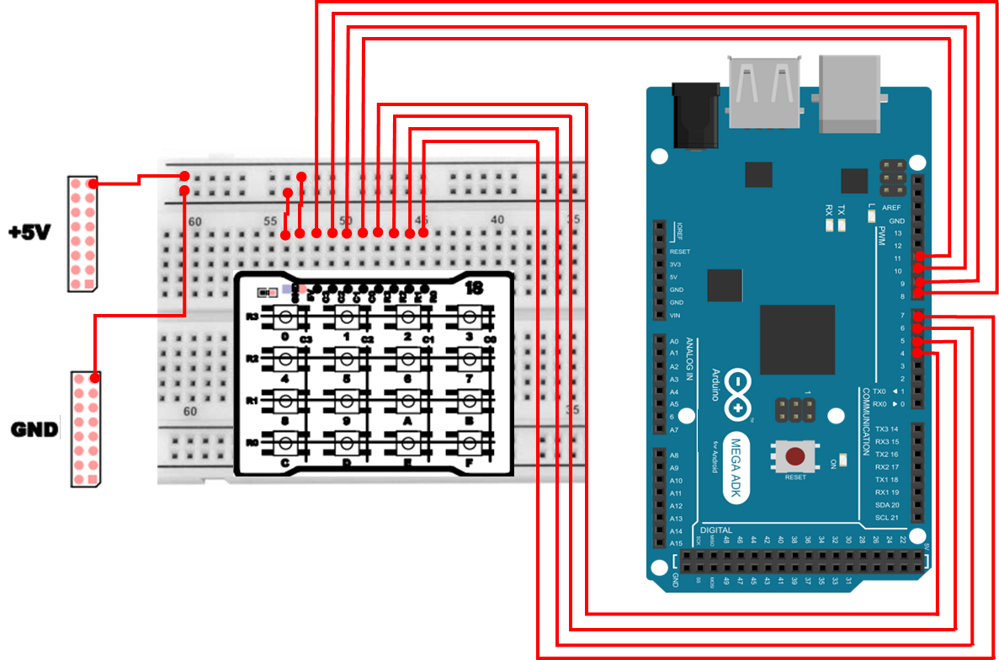

# Keypad 
## Keypad
Keypad(키패드)는 여러 개의 PushSwitch(버튼)를 `행(Row)과 열(Column)` 형태로 묶어서 구성한 행렬(Matrix) 입력 장치입니다.
PushSwitch처럼 버튼 1개당 핀 1개를 쓰는 “직접 입력(Direct Input)” 방식은 회로/코드가 단순하지만, 버튼이 많아지면 MCU 핀이 빠르게 부족해집니다. 반면 Keypad는 버튼들을 `행과 열로 묶어 스캔(Scan)` 하는 방식이기 때문에 적은 핀으로 많은 버튼 입력을 처리할 수 있습니다.

예를 들어 4×4 Keypad는 버튼이 총 16개(4×4=16)지만, 핀은 **8개(행 4개 + 열 4개)**만 사용합니다.
즉, **버튼 수가 늘수록** 행렬 방식의 장점(핀 절약)이 매우 커집니다.

다만 Keypad는 “겉보기에는 버튼 입력”이지만, MCU 관점에서는 다음 이유로 입력 설계/스캔 개념을 제대로 이해하는 것이 중요합니다.

- **스캔(Scan)** 이라는 “주기적으로 행을 바꾸며 검사하는” 절차가 필요함
- 행/열을 잘못 설정하면 특정 키가 안 눌리거나, 엉뚱한 키로 인식될 수 있음
- 여러 키를 동시에 누를 때는(다중 입력) 회로 구조에 따라 고스트(Ghosting) 같은 현상이 생길 수도 있음
- 버튼 특성상 PushSwitch와 동일하게 바운스(Bounce) 문제가 존재하며, 이를 소프트웨어적으로 완화(디바운스)해야 함

## Keypad 하드웨어 

Keypad 모듈의 하드웨어 회로는 다음과 같습니다. 


### Keypad 동작 원리 
Keypad는 “어떤 버튼이 눌렸는지”를 알아내기 위해, MCU가 **행(Row)을 하나씩 활성화하고**, 그 상태에서 **열(Column)의 변화를 읽는 방식**으로 동작합니다.

#### 핵심 아이디어(교차점 찾기)
- 버튼은 (Row i, Column j) 교차점에 존재
- 우리가 알고 싶은 것은 지금 눌린 버튼이 (i, j) 중 어디인가? 
- i(행)를 하나씩 정해가며, j(열) 중 어느 쪽이 반응하는지를 읽는 방식 

스캔(Scan) 절차를 단계로 보면
- 1단계 : Row(행) 중 하나만 선택하여 출력 상태로 만들고, 보통 LOW(0)로 둡니다.
- 2단계 : Column(열)은 입력 모드로 두고, 현재 상태를 읽습니다.
- 3단계 : 어떤 Column에서 LOW가 감지되면,
  - “현재 LOW로 만든 Row”와 “LOW가 감지된 Column”의 교차점에 있는 키가 눌렸다고 판단합니다.
- 4단계 : 다음 Row로 넘어가서 같은 일을 반복합니다.
- 5단계 : 이 과정을 매우 빠르게 반복하면, 사용자는 모든 키가 “실시간으로” 인식되는 것처럼 느끼게 됩니다.

### 행렬 입력 방식에서의 주의점 
- 행(Row)/열(Column)을 거꾸로 연결한 경우
  - 물리적으로는 작동은 하는데 코드에서 row_pin과 col_pin 순서가 바뀌면 눌린 키가 다른 키로 매핑되는 현상이 생길 수 있습니다.
- 바운스(Bounce) 문제
  - 버튼 접점 특성상 “한 번 눌렀는데 여러 번 눌린 것처럼” 튀는 현상이 발생할 수 있습니다.
  - Keypad 라이브러리에서 디바운싱 처리를 내부적으로 제공하지만, 필요에 따라 별도 구현이 필요할 수 있습니다. 
- 다중 입력(동시에 여러 키)과 고스트(Ghosting)
  - Keypad는 구조상 여러 키를 동시에 누를 경우 “전류가 의도치 않은 경로로 흐르며” 실제로 누르지 않은 키가 눌린 것으로 보이는 문제가 생길 수 있습니다.
  - 일반적인 실습/기초 제어에서는 “한 번에 한 키 입력”을 가정하는 경우가 많고, 라이브러리도 기본적으로 그 흐름에 맞춰 설계된 경우가 많습니다.

## Keypad 연결 
Keypad 하드웨어 연결은 다음과 같습니다. 

| Pin | 연결 대상 | 설명 |
|:---:|:---:|:---|
| 5V | +5V | 전원 |
| GND | GND | 접지 |
| 7 | R0 | Keypad ROW 0 |
| 6 | R1 | Keypad ROW 1 |
| 5 | R2 | Keypad ROW 2 |
| 4 | R3 | Keypad ROW 3 |
| 11 | C0 | Keypad COL 0 |
| 10 | C1 | Keypad COL 1 |
| 9 | C2 | Keypad COL 2 |
| 8 | C3 | Keypad COL 3 |



## Keypad 제어 프로그램 
Keypad의 스캔 기능을 직접 구현할 수도 있지만, Arduino에서는 Keypad 라이브러리를 통해 간단하게 행렬 키패드를 제어할 수 있습니다. 이 라이브러리는 내부적으로 행 스캔 → 열 판별 → 디바운싱 처리를 자동으로 수행해 줍니다.

```cpp
#include <Keypad.h>
 
char keys[4][4] = {
  {'0','1','2','3'},
  {'4','5','6','7'},
  {'8','9','A','B'},
  {'C','D','E','F'}
};

byte row_pin[4] = {7,6,5,4};
byte col_pin[4] = {11,10,9,8};

Keypad keypad = Keypad(makeKeymap(keys), col_pin, row_pin, 4, 4);
 
void setup(){
  Serial.begin(115200);
}
   
void loop(){
  char key = keypad.getKey();
  
  if(key){
    Serial.println(key);
  }
}
```

### Keypad 제어 주요 코드 설명 
> **#include <Keypad.h>**
> - Keypad 라이브러리를 사용하기 위한 헤더 포함합니다.
> - 내부적으로 `행 스캔 + 열 판독 + 디바운싱`을 처리합니다.

> **char keys[4][4] = {...};**
> - (행, 열) 교차점에 해당하는 키의 `의미(문자)`를 정의합니다.
>   - 예를 들어 keys[0][0]은 (Row0, Col0) 위치의 키가 눌렸을 때 '0'을 의미합니다.

> **byte row_pin[4] = {7,6,5,4}; / byte col_pin[4] = {11,10,9,8};**
> - MCU와 Keypad의 Row/Column을 어떤 핀에 연결했는지 알려주는 설정입니다.

> **Keypad keypad = Keypad(makeKeymap(keys), col_pin, row_pin, 4, 4);**
> - 라이브러리 객체를 생성하면서 “키맵 + 핀맵 + 크기(행/열 수)”를 등록합니다.
> - 라이브러리가 이 정보를 바탕으로 스캔을 수행하고, 눌린 키를 char로 돌려줍니다.

> **char key = keypad.getKey();**
> - 현재 스캔 결과 `새로 눌린 키가 있다면` 해당 문자를 반환합니다.

> **if(key) { Serial.println(key); }**
> - key가 존재할 때만 출력합니다.

## Keypad를 활용한 반응속도 측정 게임 
다음 예제는 4×4 Keypad를 이용해 사용자의 반응속도(Reaction Time) 를 측정하는 게임입니다.
게임의 흐름은 다음과 같습니다.

1. Keypad 의 ‘F’ 키를 눌러 게임을 시작합니다.
2. 3초 카운트다운 후, 랜덤 목표키(Target Key) 가 표시됩니다.
3. 사용자가 올바른 키를 누르면 반응 시간이 기록됩니다.
4. 총 5회 반복 후 평균, 최대, 최소, 표준편차를 계산하여 결과를 출력합니다.

```cpp
#include <Keypad.h>

const byte ROWS = 4;
const byte COLS = 4;

char keys[ROWS][COLS] = {
  {'0','1','2','3'},
  {'4','5','6','7'},
  {'8','9','A','B'},
  {'C','D','E','F'}
};

byte row_pin[ROWS] = {7, 6, 5, 4};
byte col_pin[COLS] = {11, 10, 9, 8};
Keypad keypad = Keypad(makeKeymap(keys), col_pin, row_pin, ROWS, COLS);

const char START_KEY = 'F';
const uint8_t NUM_TRIALS = 5;
const uint8_t COUNTDOWN_START = 3;
const uint16_t TRIAL_TIMEOUT_MS = 2000;

const char ALL_KEYS[16] = {'0','1','2','3','4','5','6','7','8','9','A','B','C','D','E','F'};
char targetPool[15];
uint8_t poolSize = 0;

enum GameState { GIDLE, COUNTDOWN, WAIT_TARGET, SHOW_RESULTS };
GameState state = GIDLE;

uint8_t  trialIndex = 0;
uint32_t reactionMs[NUM_TRIALS] = {0};

int countdownLeft = COUNTDOWN_START;
uint32_t tCountdownStart = 0;
uint8_t lastPrintedSecond = 255;
uint32_t tZeroMoment = 0;
char currentTarget = '?';

void buildTargetPool() {
  poolSize = 0;
  for (uint8_t i = 0; i < 16; i++)
    if (ALL_KEYS[i] != START_KEY) 
      targetPool[poolSize++] = ALL_KEYS[i];
}

char randomTargetKey() {
  return targetPool[random(poolSize)];
}

void printBanner() {
  Serial.println(F("====================================="));
  Serial.println(F("  4x4 Keypad Reaction Test Game"));
  Serial.print (F("  Start Key: '")); Serial.print(START_KEY); 
  Serial.println(F("' (16번)"));
  Serial.println(F("  Press F to start."));
  Serial.println(F("====================================="));
}

void startNewGame() {
  trialIndex = 0;
  for (uint8_t i = 0; i < NUM_TRIALS; i++) 
    reactionMs[i] = 0;

  Serial.println();
  Serial.println(F("[게임 시작] 총 5회 반응 측정"));

  currentTarget = randomTargetKey();
  Serial.print(F("Round 1/5  목표키: ")); 
  Serial.print(currentTarget); 
  Serial.println();

  countdownLeft = COUNTDOWN_START;
  lastPrintedSecond = 255;
  tCountdownStart = millis();
  state = COUNTDOWN;
}

void startNextTrial() {
  trialIndex++;
  if (trialIndex >= NUM_TRIALS) { 
    state = SHOW_RESULTS; 
    return; 
  }

  currentTarget = randomTargetKey();
  Serial.println();
  Serial.print(F("Round ")); 
  Serial.print(trialIndex + 1);
  Serial.print(F("/")); 
  Serial.print(NUM_TRIALS);
  Serial.print(F("  목표키: ")); 
  Serial.print(currentTarget); 
  Serial.println();

  countdownLeft = COUNTDOWN_START;
  lastPrintedSecond = 255;
  tCountdownStart = millis();
  state = COUNTDOWN;
}

void showResults() {
  Serial.println();
  Serial.println(F("===== 결과 ====="));
  uint32_t sum = 0;
  for (uint8_t i = 0; i < NUM_TRIALS; i++) {
    Serial.print(F("Trial ")); 
    Serial.print(i + 1);
    Serial.print(F(": ")); 
    Serial.print(reactionMs[i]); 
    Serial.println(F(" ms"));
    sum += reactionMs[i];
  }

  uint32_t mn = reactionMs[0], mx = reactionMs[0];
  for (uint8_t i = 1; i < NUM_TRIALS; i++) {
    if (reactionMs[i] < mn) 
      mn = reactionMs[i];
    if (reactionMs[i] > mx) 
      mx = reactionMs[i];
  }

  float avg = sum / (float)NUM_TRIALS;
  float var = 0;
  for (uint8_t i = 0; i < NUM_TRIALS; i++) { 
    float d = reactionMs[i] - avg; 
    var += d * d; 
  }
  var /= NUM_TRIALS;
  float stddev = sqrt(var);

  Serial.print(F("최소: ")); 
  Serial.print(mn); 
  Serial.println(F(" ms"));
  Serial.print(F("최대: ")); 
  Serial.print(mx); 
  Serial.println(F(" ms"));
  Serial.print(F("평균: ")); 
  Serial.print(avg, 2); 
  Serial.println(F(" ms"));
  Serial.print(F("표준편차: ")); 
  Serial.print(stddev, 2); 
  Serial.println(F(" ms"));
  Serial.println(F("================"));
  Serial.println(F("게임 종료. 'F'(16번)을 누르면 다시 시작합니다."));
  state = GIDLE;
}

void setup() {
  Serial.begin(115200);
  keypad.setDebounceTime(20);
  keypad.setHoldTime(250);
  randomSeed((uint32_t)micros());
  buildTargetPool();
  printBanner();
}

void loop() {
  char key = keypad.getKey();

  if (key == START_KEY) {
    if (state == GIDLE) 
      startNewGame();
  }

  switch (state) {
    case GIDLE: {
      // 대기 상태: 필요 시 디버깅만
      /* if (key && key != START_KEY) {
        Serial.print(F("(대기 입력: ")); Serial.print(key); Serial.println(')');
      } */
    } break;
    case COUNTDOWN: {
      if (key && key != START_KEY) {
        Serial.println(F("[경고] 아직 0이 아닙니다! 성급한 입력."));
      }

      uint32_t now = millis();
      int secElapsed = (now - tCountdownStart) / 1000;
      int left = COUNTDOWN_START - secElapsed;

      if (left >= 0 && lastPrintedSecond != left) {
        lastPrintedSecond = left;
        Serial.print(F("... ")); 
        Serial.println(left);
      }

      if (left <= 0) {
        Serial.println(F("0! GO! 목표키를 누르세요."));
        Serial.print (F("목표키: ")); 
        Serial.print(currentTarget); 
        Serial.println();
        tZeroMoment = millis();
        state = WAIT_TARGET;
      }
    } break;
    case WAIT_TARGET: {
      if (millis() - tZeroMoment > TRIAL_TIMEOUT_MS) {
        reactionMs[trialIndex] = TRIAL_TIMEOUT_MS;
        Serial.println(F("시간초과(미스)!"));
        startNextTrial();
        break;
      }

      if (key) {
        if (key == currentTarget) {
          uint32_t t = millis() - tZeroMoment;
          reactionMs[trialIndex] = t;
          Serial.print(F("정답, 반응시간: "));
          Serial.print(t); 
          Serial.println(F(" ms"));
          startNextTrial();
        } 
      }
    } break;
    case SHOW_RESULTS: {
      showResults();
    } break;
  }
}
```

### Keypad를 활용한 반응속도 측정 게임 주요 코드 설명 
> **buildTargetPool()**
> - 목표키 후보군 만들기
> - 시작키 'F'를 제외한 15개의 키를 선택하여 targetPool에 모읍니다. 

> **startNewGame()**
> - 게임을 처음 시작할 때 한 번만 호출, 라운드 번호, 반응 시간 기록 배열 초기화, 첫 번째 목표 키 설정, 카운트다운 상태로 전환

> **startNextTrial()**
> - 한 라운드가 끝날 때마다 다음 라운드로 이동, 5회가 모두 끝났다면 결과 출력 상태로 전환

> **showResults()**
> - 각 라운드의 반응 시간 출력, 최소 / 최대 / 평균 / 표준편차 계산 및 출력, 게임 종료 후 대기 상태로 복귀

> **randomTargetKey()**
> - 0부터 (poolSize - 1) 사이의 정수를 무작위로 생성, 해당 인덱스의 키를 targetPool에서 선택하여 문자를 목표 키로 반환

> **randomSeed((uint32_t)micros());**
> - Arduino의 random() 함수는 **의사 난수(pseudo-random)**를 사용
> - 시드를 설정하지 않으면, 전원을 켤 때마다 항상 같은 순서의 랜덤 값이 생성

