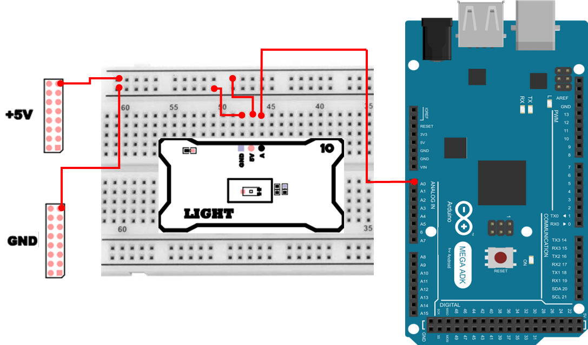
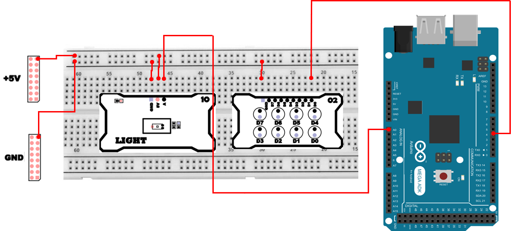

# 조도 센서
## 아날로그 입력과 ADC 
센서에서 출력되는 값은 대부분 전압(아날로그 신호) 입니다. 하지만 마이크로컨트롤러(Arduino 등)는 전압처럼 `연속적으로 변화하는 값(아날로그)을 그대로 숫자 계산에 사용할 수 없습니다.`

그래서 MCU 내부에는 ADC(Analog-to-Digital Converter, 아날로그-디지털 변환기) 가 들어 있으며, 이 ADC가 센서 전압을 읽어서 정수 값(디지털 값) 으로 바꿔줍니다. 우리가 analogRead()로 읽는 값은 “전압 그 자체”가 아니라, ADC가 전압을 변환해 만든 숫자(코드 값) 입니다.

즉, 아날로그 센서를 읽는다는 것은 다음 흐름으로 이해하면 됩니다.

- 아날로그 센서가 센싱한 결과에 따라 출력 전압을 변화시킴
- ADC가 그 전압을 0~1023(정수) 로 변환함
- 사용자는 analogRead()로 그 정수 값을 읽음

### ADC (Analog-to-Digital Converter)
ADC는 아날로그 전압을 일정한 규칙에 따라 0~1023 사이의 디지털 값으로 변환하는 장치입니다.
Mega2560의 ADC 는 10bit ADC 이며, 이는 총 2¹⁰ = 1024 단계로 전압을 나누어 읽는다는 뜻입니다.

예를 들어 기준 전압이 5V라고 할 때,
- analogRead() == 0 → 약 0V 근처
- analogRead() == 1023 → 약 5V 근처
- analogRead() == 512 → 약 2.5V 근처(대략 절반)

<details>
<summary>참고 - 전압으로 환산하는 식</summary>
- Vout ≈ (ADC 값 / ADC 해상도) × Vref
  - Vref가 5V라면 ADC=512일 때 Vout ≈ 2.5V 정도
  - ADC 해상도는 MCU 마다 다르며 Mega2560 은 10bit 이므로 1023 
</details><br>
  
ADC 의 동작 방식은 다음과 같습니다. 
1. 샘플링(Sampling)
    - 아날로그 신호를 특정 시간 간격으로 찍어서 값을 가져오는 과정입니다. 샘플링 속도가 빠를수록 신호를 더 정확하게 표현할 수 있습니다.
2. 양자화(Quantization)
    - 연속적인 전압을 1024개의 “칸” 중 가장 가까운 정수로 변환하는 과정입니다.
3. 디지털 코드 출력
    - 최종적으로 MCU는 0~1023의 정수 값만 읽습니다. 이 값은 곧 센서의 출력 전압을 의미합니다.

## 조도 센서 
조도 센서(Light Sensor)는 주변의 빛의 세기(밝기) 를 전기적인 신호로 변환하는 센서입니다.
일반적으로 빛의 세기가 강할수록 출력 전압이 높아지고, 빛이 약할수록 출력 전압이 낮아지는 특성을 가집니다.

여기서 사용하는 조도 센서는 아날로그 출력 타입으로, 빛의 세기에 따라 전압이 선형적으로 변합니다.

이 센서는 내부에 광다이오드(Photo Diode) 와 증폭 회로를 포함하고 있어, 미세한 빛 변화도 안정적으로 감지할 수 있습니다.

모듈의 회로도는 다음과 같습니다. 


## 조도 센서 연결 
조도 센서 하드웨어 연결은 다음과 같습니다. 
| Pin | 연결 대상 | 설명 |
|:---:|:---:|:---|
| 5V | +5V | 전원 |
| GND | GND | 접지 |
| A0 | A | Light Sensor |



### 조도 센서 연결시 주의 사항 
조도 센서는 `전압`을 출력하는 아날로그 센서이므로, 다음을 특히 주의합니다.
- GND(접지)를 반드시 공통으로 연결
  - 센서의 전압은 `GND 기준`으로 측정되므로, GND가 다르면 값이 이상해질 수 있습니다.
- 센서 출력은 아날로그 입력핀(A0~A15 등)에 연결
  - 디지털 핀에 연결하면 analogRead()로 읽을 수 없습니다.

## 조도 센서 제어 프로그램 
가장 기본이 되는 프로그램은 ADC 값을 읽어서 Serial Monitor에 출력하는 것입니다.

```cpp
int pin_light = A0;

void setup() {
  Serial.begin(115200);
  pinMode(pin_light, INPUT);
}

void loop() {
  Serial.print("ADC Data :");
  Serial.println(analogRead(pin_light));
  delay(500);
}
```

### 조도 센서 제어 주요 코드 설명
> **Serial.begin(115200);**
> - PC(Serial Monitor)와 통신을 시작합니다.
> - 115200은 통신 속도(baudrate)이며, Serial Monitor도 동일하게 맞춰야 글자가 깨지지 않습니다.

> **pinMode(pin_light, INPUT);**
> - 아날로그 입력핀도 **입력**으로 사용한다는 의미로 설정해둡니다.
> - 참고로 아두이노에서 아날로그 입력은 기본적으로 입력이지만, 명시해두는 것이 좋습니다.

> **analogRead(pin_light)**
> - A0에 들어오는 센서 전압을 ADC로 변환해 0~1023 정수 값으로 반환합니다.
> - “밝기”를 직접 반환하는 것이 아니라, 전압을 숫자로 바꾼 결과입니다.

> **delay(500);**
> - 0.5초마다 한 번씩 출력합니다.
> - 너무 빠르게 출력하면 Serial Monitor가 금방 가득 차서 확인이 불편할 수 있습니다.

## Serial Plotter 활용 
센서값의 변화는 빠르게 변동하므로, Arduino IDE의 Serial Plotter를 이용하면 시각적으로 변화를 볼 수 있습니다. 또한, EMA(Exponential Moving Average) 필터를 적용하여 노이즈를 줄인 데이터를 함께 표시할 수 있습니다.

Arduino IDE 의 Serial Plotter 에 대한 자세한 설명은 아래 링크를 참조하시기 바랍니다. 
- https://docs.arduino.cc/software/ide-v2/tutorials/ide-v2-serial-plotter/

## EMA(Exponential Moving Average) 필터 
조도 센서처럼 아날로그 신호를 측정하는 경우, 전원 노이즈나 조도 변화의 순간적인 흔들림 때문에 측정값이 계속 출렁이는 현상이 발생합니다.

- 아날로그 신호 측정시 출력 값이 변화하는 주요 원인 
  - 전원 노이즈(USB 전원, 주변 장치 영향)
  - 센서 증폭 회로의 미세 흔들림 
  - 조도 변화의 순간적인 변동 
  - ADC의 양자화 오차 

이때 EMA(지수 이동 평균, Exponential Moving Average) 필터를 적용하면 갑작스러운 변화는 완화시키고, 전체적인 변화 추세는 유지할 수 있습니다.

EMA의 핵심 수식은 다음과 같습니다. 
- ema_new = ema_prev + α × (raw - ema_prev)
  - raw : 새로 측정된 센서 값 
  - ema_prev : 이전 단계의 ema 결과 
  - α : 필터 강도를 조절하는 가중치, 0~1사이의 값 

즉, 새로 들어온 측정값과 이전 평균값의 차이를 α만큼만 반영하여, 갑작스러운 변화는 완화하고 전체 추세를 부드럽게 따라가도록 하는 방식입니다.

여기서 α 의 값은 작을수록 반응은 느리지만 노이즈가 줄어드는 효과가 있습니다. 반대로 커지면 반응은 빠르지만 노이즈 제거효과는 값이 작을때 보다는 미비합니다. 

```cpp
int pin_light = A0;
float ema = 0.0;
float alpha = 0.2;

void setup() {
  Serial.begin(115200);
  pinMode(pin_light, INPUT);
}

void loop() {
  int raw = analogRead(pin_light);
  ema = ema + alpha * (raw - ema);
  Serial.print(raw); Serial.print(' ');
  Serial.println((int)ema);
  delay(20);
}
```

### EMA 필터 주요 코드 설명 
> **float ema = 0.0;**
> - EMA 결과를 누적해서 저장할 변수입니다.
> - EMA는 `이전 EMA값`을 계속 사용하므로, loop가 반복되어도 값이 유지됩니다.

> **ema = ema + alpha * (raw - ema);**
> - 새 측정값(raw)과 기존 ema의 차이를 구한 뒤, 그 차이를 alpha만큼만 반영합니다.
> - 결과적으로 급격한 변화가 완화되어 그래프가 부드럽게 됩니다.

> **Serial.print(raw); Serial.print(' '); Serial.println((int)ema);**
> - Serial Plotter에서 두 개 값을 동시에 그리기 위해 “공백으로 구분”하여 출력합니다.
>   - 첫 번째 값: raw, 두 번째 값: ema

## 주변 밝기에 따른 LED 제어 
이번에는 주변 밝기에 따라 LED를 제어하는 프로그램을 작성해보겠습니다. 조도 센서 주변이 어두어진 상태에서는 LED를 더 밝게 켜고, 밝은 상태에서는 LED는 약하게 켜도록 구성하여 자동 조명 밝기 조절 시스템을 축소하여 구현합니다. 

| Pin | 연결 대상 | 설명 |
|:---:|:---:|:---|
| 5V | +5V | 전원 |
| GND | GND | 접지 |
| A0 | A | Light Sensor |
| 4 | D0 | LED 0 |



```cpp
int pin_light = A0;
int pin_led = 4;
float ema = 0.0;
float alpha = 0.2;

void setup() {
  pinMode(pin_led, OUTPUT);
  pinMode(pin_light, INPUT);
  Serial.begin(115200);
}

void loop() {
  int raw = analogRead(pin_light);
  ema = ema + alpha * (raw - ema);
  int value = 1023 - (int)ema;
  Serial.println(value);
  int pwm = map(value, 0, 1023, 0, 255);
  pwm = constrain(pwm, 0, 255);
  analogWrite(pin_led, pwm);

  delay(10);
}
```

### 주변 밝기에 따른 LED 제어 주요 코드 설명
> **int raw = analogRead(pin_light);**
> - 조도 센서의 `현재 ADC 값(0~1023)`을 읽습니다.

> **ema = ema + alpha * (raw - ema);**
> - 센서 값의 흔들림(노이즈)을 줄이기 위해 EMA 필터를 적용합니다.

> **int value = 1023 - (int)ema;**
> - 밝기 방향을 뒤집는 핵심 부분입니다.
> - 보통 “밝을수록 ADC 값이 커지는” 형태라면, 그대로 쓰면 밝을수록 LED가 더 밝아지는 방향이 됩니다.

> **int pwm = map(value, 0, 1023, 0, 255);**
> - analogWrite()는 0~255 범위(PWM 듀티비) 값을 사용합니다.
> - 조도 센서의 범위(0~1023)를 PWM 범위(0~255)로 비율 변환합니다.

> **pwm = constrain(pwm, 0, 255);**
> - 계산 결과가 혹시 범위를 벗어나는 경우를 대비해 안전하게 제한합니다.
> - 센서 노이즈나 예외 상황에서 `이상한 값`이 들어가도 LED 제어가 안정적으로 됩니다.

> **analogWrite(pin_led, pwm);**
> - PWM으로 LED 밝기를 제어합니다. 반드시 PWM 지원 핀을 사용해야 “밝기 변화”가 실제로 나타납니다.

> **Serial.print(raw) … Serial.println(pwm);**
> - raw(원본 센서값)과 pwm(LED 출력값)을 함께 출력하면, `밝기 변화 → 센서값 변화 → LED 출력 변화` 관계를 그래프로 확인할 수 있습니다.