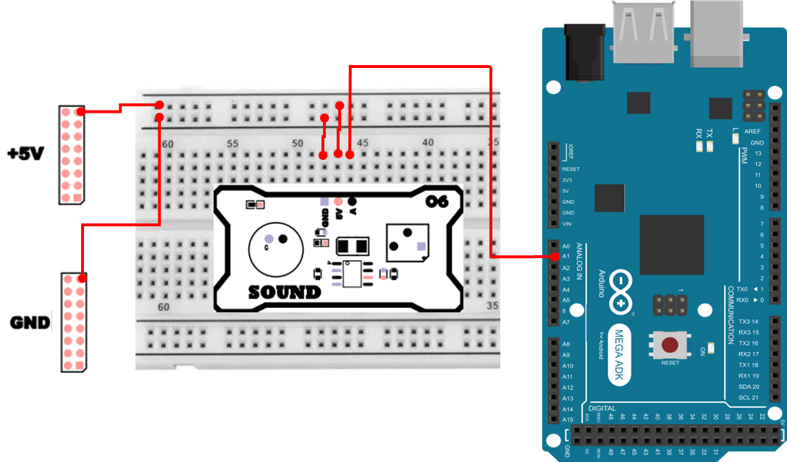

# 소리 센서
## 소리 
소리(Sound)는 물체의 진동이나 기체의 흐름에 의해 발생하는 파동의 일종입니다.
조금 더 쉽게 말하면, `공기 압력이 아주 빠르게 흔들리는 현상`이 소리입니다.

소리는 일반적으로 다음 세 가지 요소로 구분합니다.

- 세기(강약): 소리 파동의 진폭(흔들림 크기) 과 관련이 있습니다. 진폭이 크면 큰 소리, 작으면 작은 소리입니다.
- 높이(고저): 소리의 주파수(Hz) 와 관련이 있습니다. 주파수가 높으면 높은 소리, 낮으면 낮은 소리입니다.
- 음색(맵시): 같은 음 높이와 세기라도 “어떤 악기/목소리냐”에 따라 달라지는 성질입니다.

사람이 들을 수 있는 주파수 범위를 가청 주파수라고 하며, 대략 16Hz ~ 20kHz 정도입니다.

이번 실습에서 사용하는 `소리 센서(마이크 모듈)`은 소리의 높이(주파수)를 분석하는 장치가 아니라, 주로 소리의 세기(크기)를 전압 변화로 표현해 주는 센서라고 이해하면 됩니다.

사운드 센서는 주변 소리의 세기를 전기적 신호(전압)로 변환하여 측정할 수 있는 장치입니다.
센서를 활용하면 소리의 크기를 “숫자(ADC 값)”로 수치화할 수 있고, 이를 바탕으로 LED를 켜거나 경보음을 내는 등 다양한 제어 실습에 응용할 수 있습니다.


여기서 사용된 MIC-FQ-057은 일종의 일렉트릿 콘덴서 마이크로폰(Electret Condenser Microphone) 기반 사운드 센서 모듈입니다.

이 모듈은 소리를 전압 신호로 변환하고, **내장된 증폭회로(OP-AMP)** 를 통해 아두이노 등 MCU가 읽을 수 있는 아날로그 신호로 출력합니다.

## 소리 센서 동작 원리 
소리 센서가 `소리 → ADC 값`이 되는 과정을 단계별로 정리하면 다음과 같습니다.
1. 소리 입력 (압력 변화)
    - 주변의 음압이 변하면 마이크 내부의 진동막이 흔들립니다.
    - 이때 정전 용량이 변화하면서 전류가 발생합니다.
2. 전기 신호 변환
    - 발생한 미세한 전류는 OP-AMP(Operational Amplifier)를 통해 증폭됩니다.
    - 이 증폭된 신호는 소리의 세기에 따라 0 ~ 5 V 사이의 전압으로 변환됩니다.
3. ADC 변환
    - MCU(예: Arduino)는 analogRead() 함수를 이용해 입력 전압을 0 ~ 1023(10-bit) 범위의 디지털 값으로 읽습니다. 즉, 값이 클수록 소리가 크다는 의미입니다.

## 소리 센서 연결 
Sound 하드웨어 연결은 다음과 같습니다. 
| Pin | 연결 대상 | 설명 |
|:---:|:---:|:---|
| 5V | +5V | 전원 |
| GND | GND | 접지 |
| A1 | A | Sound Sensor |



## 소리 감지 프로그램 
가장 기본적인 형태로, ADC 값을 읽어 소리 세기를 확인하는 코드입니다.

```cpp
int pin_sound = A1;

void setup() {
  Serial.begin(115200);
  pinMode(pin_sound, INPUT);
}

void loop() {
  Serial.print("ADC Data :");
  Serial.println(analogRead(pin_sound));
  delay(100);
}
```

### 소리 감지 프로그램 주요 코드 설명
> **Serial.begin(115200);**
> - PC(Serial Monitor)와 통신을 시작합니다.
> - 115200은 통신 속도(baudrate)이며, Serial Monitor도 동일하게 맞춰야 글자가 깨지지 않습니다.

> **pinMode(pin_sound, INPUT);**
> - A1 핀을 입력으로 사용한다고 명시합니다. 아날로그 핀은 기본적으로 입력이지만, 명시하는것이 좋습니다. 

> **analogRead(pin_sound)**
> - 센서 전압을 ADC로 변환해 0~1023 정수 값으로 반환합니다.

> **delay(100);**
> - 0.1초마다 한 번씩 출력합니다. 너무 빠르게 출력하면 Serial Monitor가 금방 가득 차서 확인이 불편할 수 있습니다.

## dB 변환 
ADC 값(0~1023)은 `전압을 정수로 바꾼 값`이라서 직관적으로 소리 크기를 느끼기 어렵습니다.
그래서 실습을 조금 확장하면, 일정 시간 동안의 소리 신호 에너지를 측정해 상대적인 dB(데시벨) 로 표현할 수 있습니다.

여기서 중요한 점은 다음과 같습니다.
- 우리가 흔히 말하는 `정확한 소음계(dB SPL)`는 보정 장비와 표준 절차가 필요합니다.
- 이 실습은 정밀한 절대 dB 측정기가 아니라, `현재 환경 대비 소리가 더 커졌는지/작아졌는지`를 보기 위한 상대적인 dB 표시에 가깝습니다.
- 그럼에도 dB라는 단위를 사용하면, `로그 스케일(사람의 청감 특성)`이라는 중요한 개념을 경험할 수 있습니다.

### dB 
데시벨(dB)은 어떤 값의 크기를 로그(log) 로 표현하는 단위입니다.
소리의 경우, 사람의 귀는 소리를 선형적으로(2배면 2배로) 느끼지 않고, 로그에 가깝게 느끼는 경향이 있어 dB 표현이 널리 사용됩니다.

일반적으로 알려진 예시(대략적인 참고용):
- 매우 조용한 환경: 약 20dB 수준
- 대화 소리: 약 40~60dB 수준
- 시끄럽게 느끼는 수준: 80dB 이상 (상황에 따라 다름)

### RMS를 활용하는 이유 
마이크 센서 출력은 파형처럼 위아래로 빠르게 흔들립니다.
이때 **순간값(peak)** 만 보면, 우연히 큰 값이 찍힐 수도 있고, 우연히 작은 값이 찍힐 수도 있어 소리 크기 판단이 불안정합니다.

그래서 일정 시간 동안의 신호를 모아서, 평균적인 에너지를 반영하는 RMS(Root Mean Square) 를 사용합니다.

- RMS는 `신호의 제곱 → 평균 → 제곱근` 순서로 계산합니다.

결과적으로 시간 동안 평균적으로 전달되는 에너지를 반영하여, 소리 크기를 더 안정적으로 수치화할 수 있습니다.

### dB 계산 수식(상대 dB)

사운드 센서를 통해 측정된 RMS 값을 dB로 표현할 때, 실습에서는 보통 “기준 대비 변화량” 형태로 계산합니다.

- `dB = ref_db + 20 × log10(rms / ref_rms)`
    - rms : 현재 측정된 RMS 값
    - ref_rms : 기준이 되는 RMS 값(초기 환경에서의 평균값)
    - ref_db : 기준 RMS를 몇 dB로 둘 것인지 정한 값 (예: 45 dB)

즉, 초기 환경(조용한 상태 등)을 `기준`으로 잡고, 이후 소리가 커지면 dB가 올라가고, 소리가 작아지면 dB가 내려가도록 만드는 방식입니다.

## dB 변환 예제 
아래 예제는 일정 시간 동안의 RMS를 측정하고, 기준값 대비 상대적인 dB를 계산하는 방식입니다.

```cpp
const int pin_sound = A1;
const unsigned sample_us = 200;
const int n = 400;
const float alpha = 1.0f / 512.0f;
const float cal_time_ms = 2000.0;

float ref_rms = 1.0f;
float ref_db  = 45.0f;
float dc_mean = 512.0f;
bool calibrated = false;

int readSound() {
    return analogRead(pin_sound);
}

float measureRMS() {
    unsigned long nextT = micros();
    double sumSq = 0.0;
    for (int i = 0; i < n; i++) {
        int raw = readSound();
        dc_mean += alpha * ((float)raw - dc_mean);

        float centered = (float)raw - dc_mean;
        sumSq += centered * centered;

        nextT += sample_us;
        while ((long)(micros() - nextT) < 0) {
        }
    }
    float rms = sqrt(sumSq / (double)n);
    return rms;
}

void setup() {
    Serial.begin(115200);
    delay(200);

    for (int i=0; i<200; i++) { 
        dc_mean += alpha * ((float)readSound() - dc_mean); 
        delay(2); 
    }

    unsigned long t0 = millis();
    double acc = 0.0; int cnt = 0;
    while (millis() - t0 < cal_time_ms) {
        acc += measureRMS(); cnt++;
    }
    if (cnt > 0) 
        ref_rms = acc / (double)cnt;
    calibrated = true;

    Serial.println(F("Relative dB meter ready."));
    Serial.print(F("ref_rms=")); Serial.print(ref_rms, 4);
    Serial.print(F(", ref_db=")); Serial.println(ref_db, 1);
    Serial.println(F("Use Serial Plotter. (Tools > Serial Plotter)"));
}

void loop() {
  float rms = measureRMS();
  float eps = 1e-3;
  float db = ref_db + 20.0f * log10(max(rms, eps) / max(ref_rms, eps));

  Serial.print(db, 2);
  Serial.print('\t');
  Serial.print(rms, 2);
  Serial.print('\t');
  Serial.println(dc_mean, 1);
  delay(10);
}
```

### dB 변환 예제 주요 코드 설명
> **const unsigned sample_us = 200; / const int n = 400;**
> - sample_us는 샘플 간격(마이크로초)입니다. 200us는 0.0002초이며, 비교적 빠르게 샘플링합니다.
> - n은 한 번 RMS를 계산할 때 모으는 샘플 개수입니다. 여기서는 400개를 모읍니다.
> - 즉, RMS 1회를 계산하는 동안 대략 200us × 400 = 80,000us = 80ms 정도의 신호를 모아 에너지를 계산합니다.

> **float dc_mean = 512.0f;**
> - 마이크 신호는 `0V 기준으로 ±로 흔들리는` 형태가 아니라, 보통 ADC 중간값 근처를 중심으로 위아래로 흔들립니다. 그 중심값(DC 성분, 오프셋)을 dc_mean으로 추정합니다.
> - 초기값을 512로 둔 이유는 10bit ADC 범위(0~1023)의 중간값이기 때문입니다.

> **dc_mean += alpha * (raw - dc_mean);**
> - dc_mean을 한 번에 확 바꾸지 않고, 조금씩 따라가게 만드는 EMA 형태의 평균 추정입니다. 이렇게 하면 환경 변화(기본 잡음 수준 변화 등)가 있어도 중심값을 천천히 추적할 수 있습니다.

> **float centered = raw - dc_mean;**
> - DC 성분(중심값)을 제거하여, `진동 성분(AC 성분)`만 남깁니다.

> **sumSq += centered * centered;**
> - RMS 계산의 핵심입니다. 샘플을 제곱해서 더해두면, 마지막에 평균을 내고 루트를 씌워 RMS를 얻을 수 있습니다.

> **nextT += sample_us; while ((long)(micros() - nextT) < 0) {}**
> - delayMicroseconds()를 쓰지 않고도, 정확한 샘플 간격을 유지하려는 방식입니다.

> **float rms = sqrt(sumSq / n);**
> - RMS의 정의 그대로 계산합니다. (제곱의 평균) → (제곱근)

> **cal_time_ms = 2000.0**
> - 시작하자마자 바로 dB를 계산하면 기준이 없기 때문에, 초기 2초 동안 RMS를 여러 번 측정하여 평균을 내고 그 값을 ref_rms로 사용합니다.

> **ref_db = 45.0f;**
> - `기준 환경을 몇 dB로 표시할 것인가`를 정하는 값입니다.
> - 이 값 자체가 절대적인 정답이라기보다, 상대 변화량을 보기 위한 기준점입니다.

> **float eps = 1e-3; max(rms, eps) / max(ref_rms, eps)**
> - log10(0)은 계산이 불가능하므로(무한대/에러), 0에 가까운 값을 방지하는 안전장치입니다.
