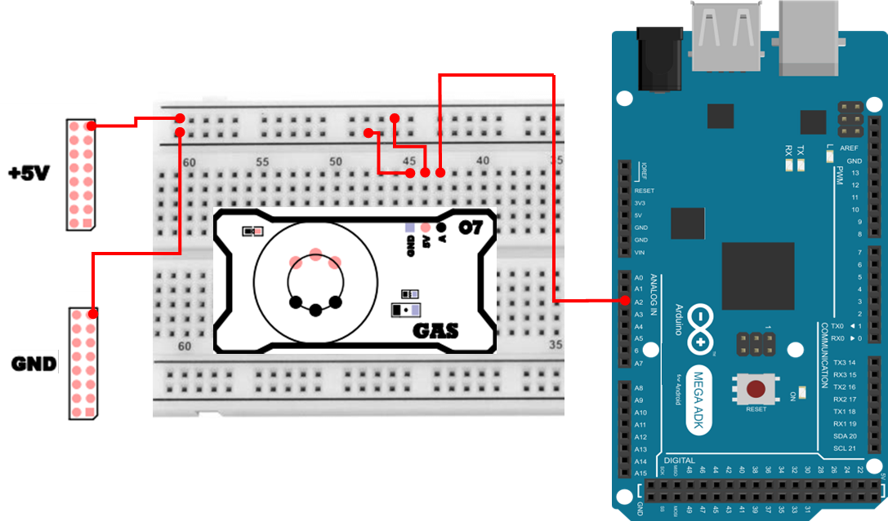

# 가스 센서
## 가스
가스(Gas)는 우리 생활과 산업 현장 곳곳에 존재합니다. 예를 들어 가정에서는 LPG(프로판/부탄), 도시가스(메탄 계열) 등을 사용하고, 산업 현장에서는 용제, 연료, 배기가스, 다양한 휘발성 물질이 공기 중에 섞일 수 있습니다.

문제는 인간의 감각(특히 후각)만으로는 `지금 공기 중에 어떤 가스가 얼마나 있는지`를 정확히 판단하기 어렵다는 점입니다.

어떤 가스는 냄새가 거의 없을 수 있습니다. 냄새가 있어도 사람마다 민감도가 다르고, 피로(후각 마비)로 인해 인지가 늦어질 수 있습니다. 무엇보다 농도(ppm, %)가 위험 수준인지를 냄새로 수치화할 수 없습니다.

그래서 사용하는 장치가 가스 센서(Gas Sensor) 입니다. 가스 센서는 공기 중 가스 존재 여부/농도 변화를 전기 신호(전압)로 바꾸어, 경보(알람), 환기 제어, 위험 감지 같은 자동화를 가능하게 해줍니다.

특히 실내 공기에는 담배 연기, 연료성 가스, 유기 용제(페인트/본드/세정제), 각종 오염원이 섞일 수 있고, 환기가 부족한 환경에서는 농도가 올라가 문제가 될 수 있습니다.
이번 실습에서는 이런 `공기 오염/가스 존재`를 아날로그 센서 값(ADC) 로 읽고, 더 나아가 상대적인 농도(ppm 추정) 개념까지 확장해 봅니다.


### MQ-5
이번 실습에 사용된 MQ-5는 대표적인 반도체식(금속산화물, MOS: Metal Oxide Semiconductor) 가스 센서입니다. 센서 내부에는 SnO₂(산화주석) 기반 반도체 소자가 들어 있고, 주변 공기 중 특정 가스(수소, LPG, 메탄, 부탄 등 환원성 가스)에 반응하여 저항값(Rs) 이 변합니다.

이 센서는 “가스의 종류를 정확히 식별”하는 장치라기보다, 특정 가스 계열(연료성/환원성 가스)에 대해 농도 변화에 따라 저항이 변하고 그 결과 출력 전압이 달라지는 `농도 변화 감지`에 강점이 있는 센서라고 이해하면 됩니다.

## 가스 센서 작동 원리 
가스 센서가 가스 → 전압 변화 → ADC 값이 되는 과정을 단계별로 정리하면 다음과 같습니다.

1. 히터 역할  
MQ 계열 센서에는 내부에 작은 히터가 있어 센서 표면을 약 200~300°C 정도의 온도로 유지합니다.
  - 이 온도에서 SnO₂ 표면에는 공기 중 산소(O₂)가 흡착됩니다.
  - 흡착된 산소는 표면에서 산소 이온(O⁻, O₂⁻ 등) 형태로 존재하며, 이 과정에서 반도체의 전자를 일부 `가져가` 전자의 이동이 줄어듭니다.
  - 결과적으로 센서 저항(Rs)이 커지는 방향의 상태가 됩니다(공기 중 ‘기본 상태’). 이는 산소 이온이 반도체 표면에서 전자를 빼앗기 때문에 전자의 이동이 억제되어 저항이 커집니다.

2. 가스 유입 시 변화  
주변에 LPG/수소/메탄 같은 환원성 가스가 들어오면, 이 가스들이 표면의 산소 이온과 반응하면서 전자를 다시 방출하는 경향이 생깁니다.
  - 전자가 늘어나면 반도체 내부 전도도가 증가합니다.
  - 전도도가 증가하면 저항이 감소합니다.
  - 즉 가스 농도가 높아질수록 Rs가 감소하는 방향으로 변합니다(일반적인 MQ 센서 특성).

3. 전압 변화 감지  
아두이노가 직접 저항을 재는 게 아니라, 센서 모듈은 보통 로드 저항(RL) 과 함께 분압 회로를 구성해 출력 전압을 만들어 줍니다.
  - Rs가 변하면 분압 비율이 바뀌고, 출력 전압이 변하며, 아두이노는 이를 analogRead()로 0~1023(10-bit) 값으로 읽습니다.

## 가스 센서 연결 
가스 센서 하드웨어 연결은 다음과 같습니다. 
| Pin | 연결 대상 | 설명 |
|:---:|:---:|:---|
| 5V | +5V | 전원 |
| GND | GND | 접지 |
| A2 | A | Gas Sensor |



## 가스 감지 프로그램 
가스 센서 출력 전압을 ADC 값으로 읽어오는 기본 예제입니다. 일반적으로 값이 높을수록 공기 중 가스 농도가 높음을 의미합니다. 

```cpp
int pin_gas = A2;

void setup() {
    Serial.begin(115200);
    pinMode(pin_gas, INPUT);
}

void loop() {
    Serial.print("ADC Data :");
    Serial.println(analogRead(pin_gas));
    delay(100);
}
```

### 가스 감지 프로그램 주요 코드 설명 
> **int pin_gas = A2;**
> - 가스 센서의 아날로그 출력이 연결된 핀 번호입니다.

> **Serial.begin(115200);**
> - PC의 Serial Monitor와 통신을 시작합니다.
> - Serial Monitor의 baudrate도 반드시 115200으로 맞춰야 글자가 깨지지 않습니다.

> **pinMode(pin_gas, INPUT);**
> - 해당 핀을 입력으로 사용한다고 명시합니다.

> **analogRead(pin_gas)**
> - 0~5V(기본 설정 기준)의 입력 전압을 10-bit 디지털 값인 0~1023 범위로 변환해 반환합니다.
> - 값이 커졌다는 것은 `출력 전압이 커졌다`는 뜻이며, 센서 특성상 `가스 농도 변화`와 연관되어 해석합니다.

> **delay(100);**
> - 0.1초마다 한 번 출력합니다. 너무 빠르게 출력하면 Serial Monitor가 금방 가득 차서 확인이 불편할 수 있습니다.


## PPM 변환 
ADC 값은 `전압을 정수로 바꾼 값`이기 때문에, 직관적으로 가스 농도(ppm) 로 바로 해석하기 어렵습니다. 그래서 실습을 조금 확장하면, 센서의 저항비(Rs/R0) 와 데이터시트의 경험적 곡선(근사식)을 이용해 **ppm을 ‘추정’** 할 수 있습니다.

다만, MQ 센서의 ppm 변환은 정밀 측정기 수준의 절대값 보장이 아니라, 보정(캘리브레이션) + 환경 조건에 크게 좌우되는 추정값입니다. 그리고 같은 센서라도 개체 편차가 존재합니다.

따라서 여기서는 **절대적인 수치보다 계산 흐름을 이해하고**, 기준 보정을 통해 **농도 변화의 추세**를 보는 것이 핵심입니다.

## PPM 변환 코드 
PPM 변환 과정은 다음과 같은 4단계 구조로 이루어집니다.

1. ADC 값 → 전압 변환
    - analogRead()로 읽은 0~1023 값을 실제 전압(0~5V)으로 환산합니다.
2. 전압 → 센서 저항(Rs) 계산
    - 센서 모듈의 분압 회로를 이용해, 출력 전압으로부터 센서 저항 값을 역으로 계산합니다.
3. 센서 저항 비율(Rs/R0) 계산
    - 기준 환경에서의 저항(R0)과 현재 저항(Rs)의 비율을 계산합니다.
    - 이 비율은 데이터시트의 특성 곡선과 직접적으로 대응됩니다.
4. 경험식(근사식)을 이용한 PPM 추정
    - 데이터시트의 그래프를 수식으로 근사한 식을 사용해 가스 농도(ppm)를 계산합니다.

아래 코드는 위 4단계를 순서대로 구현한 예제입니다.
```cpp
int pin_gas = A2;
float vcc = 5.0;
float RL = 10000.0;
float R0 = 9000.0;
float A_coef = 574.25;
float B_coef = -2.222;

float readPPM() {
  int adc = analogRead(pin_gas);
  float v = (adc / 1023.0) * vcc;
  float Rs = RL * (vcc / v - 1.0);
  float ratio = Rs / R0;
  float ppm = A_coef * pow(ratio, B_coef);
  return ppm;
}

void setup() {
  Serial.begin(115200);
}

void loop() {
  float ppm = readPPM();
  Serial.print(ppm);
  Serial.println(" ppm");
  delay(500);
}
```

### PPM 변환 주요 코드 설명
> **float v = (adc / 1023.0) * vcc;**
> - analogRead()로 읽은 ADC 값(0~1023)을 실제 전압 값(0~5V)으로 변환합니다.

> **float Rs = RL * (vcc / v - 1.0);**
> - 센서 출력 전압 v를 이용해, 센서 내부 저항 Rs를 계산합니다. 이는 센서 저항(Rs)과 로드 저항(RL)이 이루는 분압 회로의 역산입니다.
> - 가스 농도가 높아질수록 Rs는 감소하는 특성을 가집니다.

> **float ratio = Rs / R0;**
> - 현재 센서 상태(Rs)를 기준 상태(R0)와 비교한 비율입니다.
> - MQ 센서 데이터시트의 특성 곡선은 대부분 이 Rs/R0 비율을 기준으로 제공됩니다. 따라서 절대 저항값보다 이 비율이 훨씬 중요한 의미를 가집니다.

> **float ppm = A_coef * pow(ratio, B_coef);**
> - 데이터시트의 로그-로그 그래프를 수식으로 근사한 경험식입니다.
> - A_coef, B_coef 값은 센서 종류와 측정 가스에 따라 달라집니다.
> - 계산된 ppm 값은 정밀 계측값이 아니라 환경 기반 추정값입니다.

조금 더 정확한 데이터 측정을 위해서는 공기 중 기준 보정이 필요합니다. 기준 보정 방법은 다음과 같습니다. 
1. 전원 인가 후 2~5분간 예열 합니다.
2. 공기 중 측정된 Rs 값을 기준으로 "R0 = Rs / 9.8" 으로 설정합니다. 
3. 이후 측정 값에서 Rs/R0 비율을 계산하여 각 가스의 농도로 환산합니다. 
