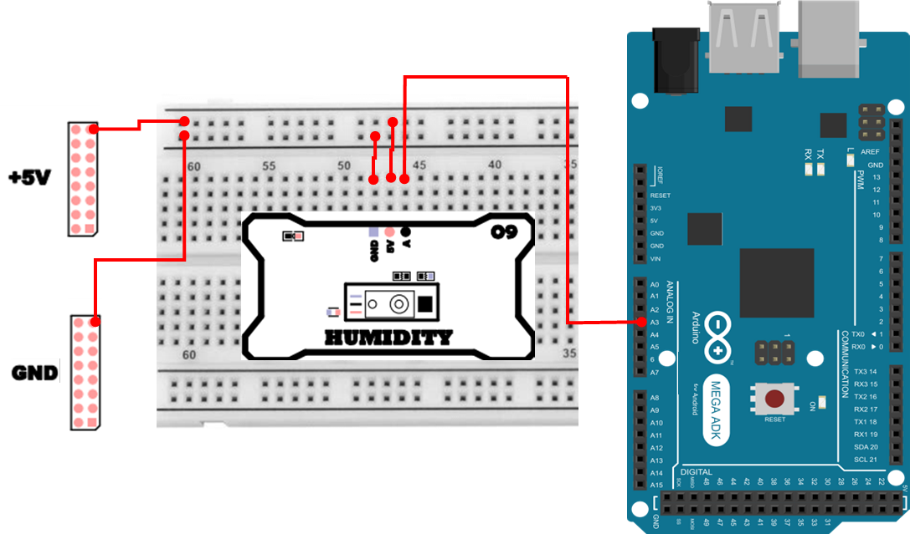

# 습도 센서
## 습도
습도(Humidity)는 **공기 중에 포함된 수증기(물의 기체)** 의 양을 의미합니다. 하지만 `공기 속 물의 양`을 한 가지 숫자로만 표현하기는 어렵습니다. 왜냐하면 공기가 머금을 수 있는 수증기량은 온도에 따라 크게 달라지기 때문입니다.

그래서 일상과 산업 현장에서는 보통 상대습도(RH: Relative Humidity) 를 사용합니다.

- 상대습도(RH, %): `현재 공기 중 수증기량`이 `그 온도에서 공기가 최대로 머금을 수 있는 수증기량(포화 수증기량)`에 비해 몇 %인지를 나타낸 값입니다.

예를 들어, 25℃에서 공기가 최대로 20g의 수증기를 머금을 수 있다고 가정해 봅시다.
현재 공기 중 수증기가 10g이라면, 상대습도는 10/20 = 0.5 → 50% 가 됩니다.

즉, RH는 `절대적인 수증기 질량`이 아니라 **현재 온도 조건에서의 ‘포화 대비 비율’** 이기 때문에, 온도가 바뀌면 같은 수증기량이라도 RH가 달라질 수 있습니다.

## 습도가 왜 중요한가? 
습도는 단순히 `불쾌감` 수준을 넘어서, 건강/제품 품질/설비 안정성에 직접 영향을 줍니다.

- 생활환경
    - 습도가 너무 낮으면(건조) 피부·호흡기 점막이 마르고, 감기·기관지 자극이 심해질 수 있습니다.
    - 습도가 너무 높으면(다습) 곰팡이·세균 번식이 쉬워져 위생 문제가 생길 수 있습니다.
- 산업환경
    - 반도체/전자/정밀 제조에서는 정전기(ESD)와도 관련되어 습도 관리가 중요합니다.
    - 제약/식품/보관 환경은 습도 변화가 품질 열화로 이어질 수 있습니다.
- 건축/설비
    - 결로(이슬 맺힘)와 곰팡이, 부식 문제는 습도 관리와 밀접합니다.

하지만 사람은 습도를 **정확한 수치**로 느끼기 어렵습니다. 그래서 습도를 전기적 신호(전압 등) 로 바꾸어 MCU가 읽을 수 있게 해주는 장치가 필요하고, 그것이 습도 센서입니다.

## HIH-4030 (아날로그 습도 센서)

이번 실습에 사용하는 HIH-4030은 대표적인 아날로그 출력(전압 출력) 습도 센서입니다. 이 센서는 습도 변화에 따라 내부 센싱 소자의 특성이 변하고, 그 결과 출력 전압(Vout) 이 변하도록 만들어져 있습니다.

또한 HIH-4030은 비율형(ratiometric) 센서로 자주 소개됩니다. 
- 센서 출력 전압 Vout은 공급 전압 Vs(=Vsup) 에 비례하는 형태로 설계되어 있습니다.
- 그래서 MCU의 ADC 기준 전압(Vref) 을 공급 전압(Vs) 과 같게 두면, 공급 전압이 약간 흔들리더라도(예: 5.0V → 4.9V) `Vout/Vs` 비율이 거의 유지되므로, 상대습도 계산이 전원 흔들림에 덜 민감해집니다.

HIH-4030은 데이터시트의 전형적인 근사식 형태로 아래 관계를 사용합니다(조건에 따라 보정/온도 보상식이 추가될 수 있으나, 본 실습에서는 기본식을 사용합니다).

- RH(%) = (Vout / Vs - 0.16) / 0.0062
    - 이 식을 보면, (Vout/Vs)가 커질수록 RH가 커집니다.
    - 0.16은 오프셋(영점 보정에 해당)
    - 0.0062는 기울기(민감도)에 해당합니다.


## 습도 센서 작동 원리
습도 센서가 `습도 → 전압 → ADC 값`으로 변환되는 흐름을 단계별로 정리하면 다음과 같습니다.

1. 공기 중 습도 변화
    - 공기 중 수증기량이 변하면, 센서 내부의 습도 감지 소자(대개 고분자/정전용량/저항성 기반)의 물리 특성이 변합니다.
2. 센서 내부 회로가 전압(Vout)으로 변환
    - 감지 소자의 변화는 내부 회로를 통해 출력 전압 변화로 바뀝니다.
3. 아두이노의 ADC가 전압을 숫자(0~1023)로 변환
    - 아두이노 Mega2560의 analogRead()는 입력 전압(기본 0~5V)을 10-bit 정수 값(0~1023)로 변환합니다.
4. ADC 값을 다시 RH(%)로 계산
    - ADC 값 → 전압(Vout) → RH(%) 순서로 계산하면 최종적으로 `상대습도(%)`를 얻을 수 있습니다.

## 습도 센서 연결 
습도 센서 하드웨어 연결은 다음과 같습니다. 

| Pin | 연결 대상 | 설명 |
|:---:|:---:|:---|
| 5V | +5V | 전원 |
| GND | GND | 접지 |
| A3 | A | Humidity Sensor |


 
## 습도 감지 프로그램 
아래 예제는 습도 센서의 출력 전압을 ADC 값(0~1023) 으로 읽어오는 가장 기본 예제입니다. 이 단계에서는 “상대습도 %”로 변환하지 않고, 센서 출력이 변하면 ADC 값이 어떻게 달라지는지를 먼저 관찰하는 것이 목적입니다.

```cpp
int pin_humi = A3;

void setup() {
    Serial.begin(115200);
    pinMode(pin_humi, INPUT);
}

void loop() {
    Serial.print("ADC Data :");
    Serial.println(analogRead(pin_humi));
    delay(500);
}
```

### 습도 감지 프로그램 주요 코드 설명
> **int pin_humi = A3;**
> - 습도 센서의 아날로그 출력이 연결된 핀 번호입니다.

> **Serial.begin(115200);**
> - PC의 Serial Monitor와 통신을 시작합니다. Serial Monitor의 baudrate도 반드시 115200으로 맞춰야 글자가 깨지지 않습니다.

> **pinMode(pin_humi, INPUT);**
> - 해당 핀을 입력으로 사용한다고 명시합니다.

> **analogRead(pin_humi)**
> - 입력 전압(기본 0~5V)을 10-bit 정수(0~1023)로 변환해 반환합니다.

> **delay(500);**
> - 0.5초마다 한 번 출력합니다. 너무 빠르게 출력하면 Serial Monitor가 금방 가득 차서 확인이 불편할 수 있습니다.

## 상대습도 변환 코드  
ADC 값은 `전압을 정수로 바꾼 값`이기 때문에, 사람이 직관적으로 이해하기 어렵습니다. 그래서 실습을 확장하여, HIH-4030의 특성식에 따라 상대습도(%)로 환산해 보겠습니다.

상대습도 계산 흐름은 다음과 같습니다.

1. ADC 값 평균(노이즈 감소)
    - 센서/배선/전원 상태에 따라 ADC 값이 미세하게 흔들릴 수 있습니다.
    - 여러 번 읽어서 평균을 내면 수치가 안정됩니다.
2. ADC → 전압(Vout) 변환
    - Vout = (adc / 1023) * Vref
3. Vout/Vs 비율 계산 후 RH 산출
    - RH = (Vout / Vs - 0.16) / 0.0062
4. 현실적인 범위(0~100%)로 제한
    - 계산 오차/노이즈로 인해 -값이나 100% 초과가 나올 수 있어 clamp 처리가 유용합니다.

아래 코드는 평균 샘플링 → 전압 변환 → RH 계산 → 범위 제한 → 출력을 순서대로 구현한 예제입니다.
```cpp
const int pin_humi = A3;
const float vsup = 5.0;
const float adc_max = 1023.0;
const float vref = 5.0;

int readADCavg(int n=16) {
    long s=0; 
    for (int i=0;i<n;i++){ 
        s += analogRead(pin_humi); 
        delay(2); 
    }
    return (int)(s/n);
}

void setup(){
    Serial.begin(115200);
}

void loop(){
    int adc = readADCavg();
    float vout = (adc / adc_max) * vref;
    float sensorRH = (vout / vsup - 0.16f) / 0.0062f;

    if (sensorRH < 0) 
        sensorRH = 0;
    if (sensorRH > 100) 
        sensorRH = 100;

    Serial.print("ADC="); Serial.print(adc);
    Serial.print("\tVout="); Serial.print(vout,3);
    Serial.print(" V\tRH~"); Serial.print(sensorRH,1);
    Serial.println(" %");
    delay(250);
}
```

### 상대습도 변환 주요 코드 설명
> **int readADCavg(int n=16)**
> - 습도 센서 값을 n번 읽어 평균을 반환하는 함수입니다.
> - 센서 값이 약간 흔들리더라도 평균을 내면 출력이 안정되어, RH 계산 결과가 더 “보기 좋은” 형태로 나옵니다.

> **delay(2); (평균 샘플링 내부)**
> - 연속으로 너무 빠르게 읽으면 ADC 값이 불안정해질 수 있어, 아주 짧은 지연을 둡니다.
> - 16회 샘플링이라면 대략 2ms×16=32ms 정도의 시간(추가로 analogRead 시간)이 소요됩니다.

> **float vout = (adc / adc_max) * vref;**
> - ADC 정수값을 실제 전압으로 바꿉니다.

> **float sensorRH = (vout / vsup - 0.16f) / 0.0062f;**
> - HIH-4030의 기본 근사식을 코드로 옮긴 것입니다.
> - vout/vsup는 `출력 전압이 공급 전압에 대해 어느 정도 비율인가`를 나타냅니다.
> - 이 비율에서 오프셋(0.16)을 빼고 민감도(0.0062)로 나누면 RH(%)가 됩니다.

> **if (sensorRH < 0) sensorRH = 0; / if (sensorRH > 100) sensorRH = 100;**
> - 센서 노이즈/근사식 오차/전원 변동 등으로 계산 결과가 음수거나 100%를 넘을 수 있어, 범위 제한을 걸어 출력이 자연스럽게 보이도록 합니다.

> **Serial.print(vout,3), Serial.print(sensorRH,1)**
> - vout은 소수점 3자리까지(전압은 미세 변화가 의미 있을 수 있음)
> - RH는 소수점 1자리까지(사람이 보기 편한 단위) 출력하도록 자리수를 조정했습니다.

> **delay(250);**
> - 0.25초마다 1회 출력합니다. 너무 빠르면 모니터가 복잡해지고, 너무 느리면 변화 관찰이 답답할 수 있어서 실습용으로 무난한 값입니다.