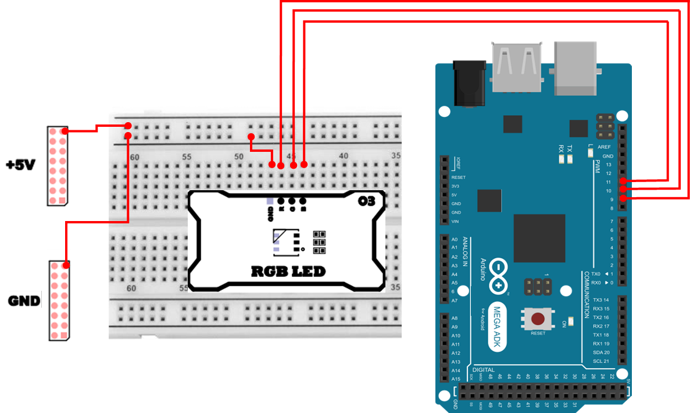
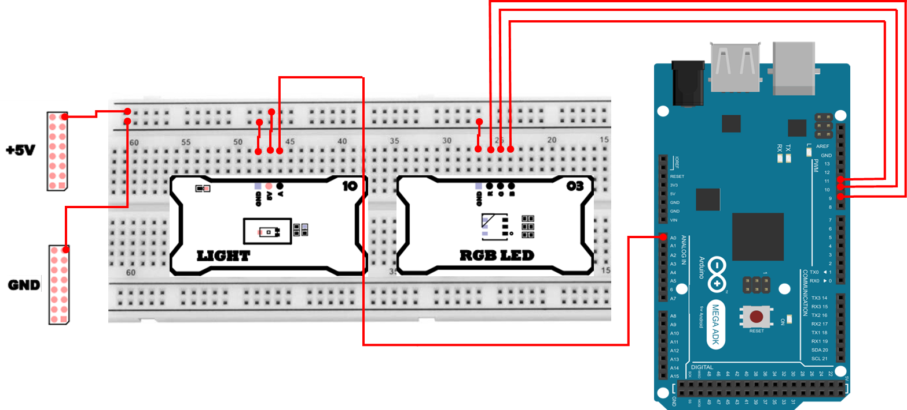

# RGB LED 
## RGB LED
RGB LED는 빨강(Red), 초록(Green), 파랑(Blue) 세 가지 LED를 한 패키지(소자) 안에 묶어 둔 장치입니다. 즉, `3개의 LED를 한 몸체에 넣어둔 것`이라고 이해하시면 됩니다.

- R/G/B 각각은 독립적으로 밝기 조절이 가능합니다.
- 세 LED의 밝기를 적절히 섞으면 다양한 색을 만들 수 있습니다.
  - 예) (R=최대, G=최대, B=최대) → 흰색에 가까운 색
  - 예) (R=최대, G=0, B=0) → 빨강
  - 예) (R=최대, G=최대, B=0) → 노랑(빛의 혼합)

## 빛의 3원색과 가산 혼합
RGB는 `빛의 3원색`이라고 부릅니다. 여기서 중요한 개념은 가산 혼합(Additive Mixing) 입니다.
- 빛(LED)의 혼합 = 가산 혼합
  - 여러 빛을 더할수록 더 밝아지고, 충분히 합쳐지면 흰색에 가까워집니다.
- 물감의 혼합 = 감산 혼합
  - 여러 색을 섞을수록 어두워지고, 결국 검정색에 가까워집니다.

즉, 물감과 LED는 색이 섞이는 원리가 반대이므로 `물감처럼 생각하면 색이 이상하게 느껴질 수 있다`는 점을 꼭 기억해 주세요.

## RGB LED가 왜 중요한가?
RGB LED는 단순히 `예쁘게 색을 보여주는 장치`가 아니라, 실제 제품과 시스템에서 매우 자주 쓰입니다.

- 상태 표시(STATUS)
  - 정상(초록), 경고(노랑), 오류(빨강), 통신 중(파랑 깜빡임) 등
- 사용자 인터페이스(UI)
  - 버튼/노브/장치 동작 모드 표시
- 시각적 피드백(Feedback)
  - 센서 값(온도/조도/습도 등)을 색으로 표현하여 직관적으로 전달

또한 RGB LED 실습을 통해 PWM(펄스폭 변조) 제어, 입력값→출력값 매핑(map), 색 공간(HSV/RGB) 변환 같은 임베디드에서 중요한 기본기를 함께 연습할 수 있습니다.

## PWM이란?
아두이노에서 LED 밝기를 조절할 때 가장 많이 사용하는 방식은 PWM(펄스폭 변조) 입니다.

LED는 사실 `전압을 조금만 줘서 약하게 켠다`가 아니라, 아주 빠르게 켜졌다/꺼졌다를 반복하면서, 켜져 있는 시간의 비율(듀티비, duty)을 바꿔서 사람이 보기에는 `밝기가 달라졌다`처럼 느끼게 만듭니다.

아두이노의 analogWrite()는 (진짜 아날로그 전압을 출력하는 것이 아니라) PWM 듀티비를 설정하는 함수입니다.
  - analogWrite(pin, 0) → 거의 꺼짐
  - analogWrite(pin, 255) → 거의 최대 밝기
  - 중간 값(예: 128) → 절반 정도 밝기(체감은 완전히 선형이 아닐 수 있음)


## RGB LED 연결 
RGB LED는 기본적으로 R/G/B 각각을 PWM 핀에 연결하여 밝기 제어가 가능하도록 구성합니다.

| Pin | 연결 대상 | 설명 |
|:---:|:---:|:---|
| GND | GND | 접지 |
| 9 | R | Red |
| 10 | G | Green |
| 11 | B | Blue |



## RGB LED 제어 
세 색상(R/G/B)을 차례로 0~255까지 PWM으로 증가시켜 밝아지는 정도를 확인하는 예제입니다.
analogWrite() 함수로 각 색의 밝기를 개별 제어하며, PWM의 듀티비가 빛의 세기를 결정합니다.

```cpp
int pin_r = 9, pin_g = 10, pin_b = 11;
int i = 0;

void setup(){ 
    pinMode(pin_r,OUTPUT); 
    pinMode(pin_g,OUTPUT); 
    pinMode(pin_b,OUTPUT); 
    analogWrite(pin_r,0);
    analogWrite(pin_g,0);
    analogWrite(pin_b,0);
}

void loop(){
  for(i=0;i<255;i++){
    analogWrite(pin_r,i);
    delay(20);
  }
  analogWrite(pin_r,0);
  for(i=0;i<255;i++){
    analogWrite(pin_g,i);
    delay(20);
  }
  analogWrite(pin_g,0);
  for(i=0;i<255;i++) {
    analogWrite(pin_b,i);
    delay(20);
  }
  analogWrite(pin_b,0);
}
```

### RGB LED 제어 주요 코드 설명
> **int pin_r = 9, pin_g = 10, pin_b = 11;**
> - R/G/B 채널이 연결된 핀 번호를 변수로 지정합니다.
> - 나중에 핀을 바꾸더라도 `변수만 수정하면 전체 코드가 따라오도록` 만드는 습관이 좋습니다.

> **pinMode(pin_r, OUTPUT); (g, b도 동일)**
> - 각 채널 핀을 출력 모드로 설정합니다.
> - RGB LED는 MCU가 전류를 흘려 밝기를 제어해야 하므로 OUTPUT이 기본입니다.

> **analogWrite(pin_r, i);**
> - i(0~255) 값을 PWM 듀티비로 설정합니다.
> - 값이 커질수록 켜져 있는 시간이 길어져 더 밝아집니다.

> **delay(20);**
> - 너무 빠르게 변하면 사람이 밝기 변화를 느끼기 어렵습니다. 20ms 정도면 `서서히 밝아지는 느낌`을 관찰하기 좋습니다.

> **analogWrite(pin_r, 0);**
> - 빨강 테스트가 끝나면 반드시 꺼서 다음 색 테스트가 혼합되지 않게 합니다.
> - 그렇지 않으면 `초록 증가` 시점에서 빨강이 남아 노란색처럼 보이는 혼동이 생깁니다.

## 부드러운 색상 순환 
RGB 값(R/G/B)을 직접 조합해서 색을 만드는 것도 가능하지만, 사람 입장에서는 다음이 어렵습니다.
- “보라색을 만들려면 R/G/B를 어떻게 주지?”
- “색이 자연스럽게 이어지게 바꾸려면 값을 어떻게 변화시키지?”

이때 HSV(Hue, Saturation, Value) 모델을 쓰면 훨씬 직관적입니다.
- Hue(색상각): 0~360° (빨강→노랑→초록→하늘→파랑→보라→빨강…)
- Saturation(채도): 색의 선명함 (0이면 회색 계열)
- Value(명도): 밝기(빛의 세기)

이 예제는 Hue만 계속 증가시키면서 `무지개처럼 부드럽게 색이 흐르는 효과`를 만듭니다.

```cpp
uint8_t pin_r = 9, pin_g = 10, pin_b = 11;
bool COMMON_ANODE = false;
float hue=0;

inline uint8_t c255(int v){ return v<0?0:(v>255?255:v); }

void hsv2rgb(float h,float s,float v,uint8_t& r,uint8_t& g,uint8_t& b){
  float c=v*s, x=c*(1-fabs(fmod(h/60.0,2)-1)), m=v-c, rr,gg,bb;
  if(h<60){
    rr=c;
    gg=x;
    bb=0;
  } else if(h<120){
    rr=x;
    gg=c;
    bb=0;
  } else if(h<180){
    rr=0;
    gg=c;
    bb=x;
  } else if(h<240){
    rr=0;
    gg=x;
    bb=c;
  } else if(h<300){
    rr=x;
    gg=0;
    bb=c;
  } else {
    rr=c;
    gg=0;
    bb=x;
  }
  r=c255((rr+m)*255); 
  g=c255((gg+m)*255); 
  b=c255((bb+m)*255);
}

void writeRGB(uint8_t r,uint8_t g,uint8_t b){
  if(COMMON_ANODE){ 
    r=255-r; 
    g=255-g; 
    b=255-b; 
  }
  analogWrite(pin_r,r); 
  analogWrite(pin_g,g); 
  analogWrite(pin_b,b);
}

void setup(){ 
  pinMode(pin_r,OUTPUT); 
  pinMode(pin_g,OUTPUT); 
  pinMode(pin_b,OUTPUT); 
}

void loop(){
  uint8_t r,g,b; 
  hsv2rgb(hue,1.0,1.0,r,g,b); 
  writeRGB(r,g,b);
  hue+=0.8; 
  if(hue>=360) 
    hue-=360; 
  delay(10);
}
```

### 부드러운 색상 순환 주요 코드 설명
> **float hue = 0; / hue += 0.8;**
> - Hue(색상각)를 조금씩 증가시키며 색을 순환시킵니다.
> - 증가량이 작을수록 더 부드럽게 변하고, 커질수록 `색이 툭툭 바뀌는` 느낌이 납니다.

> **hsv2rgb(hue, 1.0, 1.0, r, g, b);**
> - HSV 공간에서 계산한 결과를 RGB 값(0~255)로 변환합니다.
> - s=1.0은 채도 최대(선명), v=1.0은 밝기 최대를 의미합니다.

> **delay(10);**
> - 10ms면 충분히 부드러운 흐름을 만들 수 있습니다. 너무 느리면 변화가 답답하고, 너무 빠르면 색 변화가 정신없게 보일 수 있습니다.

### 공통 캐소드 / 공통 애노드 RGB LED의 차이
RGB LED는 내부 구조에 따라 공통 단자가 어디에 연결되어 있는지에 따라
**공통 캐소드(Common Cathode)** 타입과 **공통 애노드(Common Anode)** 타입으로 나뉩니다.

- 공통 캐소드(Common Cathode)
  - 공통 핀이 GND에 연결됨
  - 각 색상 핀에 HIGH(또는 PWM 값이 클수록) → 밝아짐
  - 아두이노에서 가장 직관적으로 제어 가능

- 공통 애노드(Common Anode)
  - 공통 핀이 VCC에 연결됨
  - 각 색상 핀에 LOW(또는 PWM 값이 작을수록) → 밝아짐
  - PWM 제어 시 값의 반전 처리가 필요함

이 예제에서는 `COMMON_ANODE` 변수를 사용하여, 공통 애노드 타입 RGB LED일 경우 PWM 값을 다음과 같이 반전 처리합니다.

```cpp
if(COMMON_ANODE){ 
  r = 255 - r;
  g = 255 - g;
  b = 255 - b;
}
```

## 밝기에 따른 색상 변화 
조도센서로 읽은 밝기 값(0 ~ 1023)을 Hue(0 ~ 359) 범위에 매핑하여 색상이 자연스럽게 바뀝니다.
밝을수록 색이 차갑게, 어두울수록 따뜻하게 변화하는 효과를 실험할 수 있습니다.

| Pin | 연결 대상 | 설명 |
|:---:|:---:|:---|
| GND | GND | 접지 |
| 9 | R | Red |
| 10 | G | Green |
| 11 | B | Blue |

| Pin | 연결 대상 | 설명 |
|:---:|:---:|:---|
| 5V | +5V | 전원 |
| GND | GND | 접지 |
| A0 | A | Light Sensor |



```cpp
int pin_light = A0, pin_r = 9, pin_g = 10, pin_b = 11;

void hsv2rgb(uint16_t h, uint8_t s, uint8_t v, uint8_t &r, uint8_t &g, uint8_t &b) {
  if (s == 0) { r = g = b = v; return; }
  float hf = (h % 360) / 60.0;
  int i = (int)hf;
  float f = hf - i;
  float sv = s / 255.0;
  float pv = v * (1.0 - sv);
  float qv = v * (1.0 - sv * f);
  float tv = v * (1.0 - sv * (1.0 - f));
  float rf, gf, bf;
  switch (i) {
    case 0: rf = v;  gf = tv; bf = pv; break;
    case 1: rf = qv; gf = v;  bf = pv; break;
    case 2: rf = pv; gf = v;  bf = tv; break;
    case 3: rf = pv; gf = qv; bf = v;  break;
    case 4: rf = tv; gf = pv; bf = v;  break;
    default: rf = v; gf = pv; bf = qv; break;
  }
  r = (uint8_t)rf; g = (uint8_t)gf; b = (uint8_t)bf;
}

void setup() {
  pinMode(pin_r, OUTPUT);
  pinMode(pin_g, OUTPUT);
  pinMode(pin_b, OUTPUT);
  pinMode(pin_light,INPUT);
}

void loop() {
  int adc = analogRead(pin_light);
  uint16_t h = map(adc, 0, 1023, 0, 359);
  uint8_t s = 255;
  uint8_t v = 255;
  uint8_t r, g, b;
  hsv2rgb(h, s, v, r, g, b);
  analogWrite(pin_r, r);
  analogWrite(pin_g, g);
  analogWrite(pin_b, b);
  delay(20);
}
```

### 밝기에 따른 색상 변화 주요 코드 설명
> **int adc = analogRead(pin_light);**
> - 조도 센서의 아날로그 값을 읽습니다(0~1023).
> - 값이 커지는/작아지는 방향(밝을수록 큰 값인지, 어두울수록 큰 값인지)은 센서 모듈 구성에 따라 달라질 수 있습니다.

> **uint16_t h = map(adc, 0, 1023, 0, 359);**
> - 센서 입력 범위(0~1023)를 Hue 범위(0~359)로 변환합니다.

> **uint8_t s = 255; / uint8_t v = 255;**
> - 채도와 밝기를 최대값으로 고정했습니다. 실험을 확장하고 싶다면 v를 조도와 연동해 `밝기까지 변하는 RGB`도 만들 수 있습니다.

> **hsv2rgb(h, s, v, r, g, b);**
> - Hue가 결정되면 그에 대응하는 RGB PWM 값이 계산됩니다. 결과적으로 RGB LED는 PWM으로 (r,g,b) 밝기를 출력하게 됩니다.

> **delay(20);**
> - 너무 자주 바꾸면 깜빡임처럼 느껴질 수 있고, 너무 느리면 반응이 굼떠 보일 수 있습니다.
