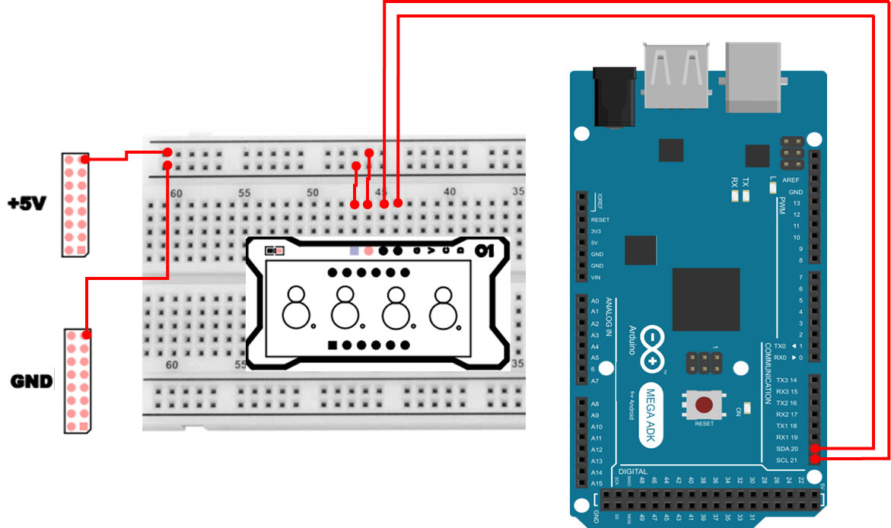
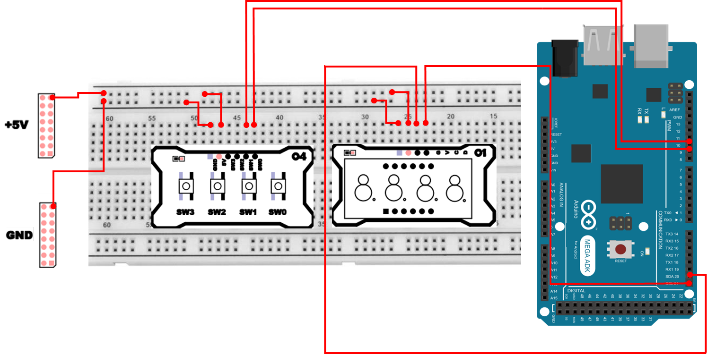

# 4Digit FND
## 4Digit FND
4Digit FND는 7세그먼트(Seven Segment Display) 가 4자리(4Digit)로 묶여 있는 표시 장치입니다.
각 자리에는 다음이 들어 있습니다.

- 7개의 LED 막대(a~g) : 숫자 모양을 만드는 본체
- 소수점(dp) : . 점 표시(필요한 경우만 사용)

즉, `LED를 여러 개 묶어서 숫자를 그리는 장치`라고 생각하시면 됩니다. 숫자 0~9는 물론, 일부 알파벳(예: A, b, C 등)도 제한적으로 표현할 수 있습니다.

## 4Digit FND가 왜 중요한가?
4Digit FND는 단순히 `숫자를 보여주는 부품`이 아니라, 임베디드 시스템에서 다음 학습 포인트를 한 번에 연습할 수 있게 해줍니다.

- 출력 장치 제어의 기본
  - 원하는 정보를 사람이 읽을 수 있는 형태(숫자/기호)로 보여준다
- 다중화(Multiplexing) / 스캔(Scan) 개념
  - 4자리를 동시에 켜는 것처럼 보이게 만들기 위한 핵심 원리
- 통신(I2C) 기반 주변장치 제어
  - 전용 드라이버 IC(HT16K33)를 쓰면, 핀을 아끼면서 더 안정적으로 구동 가능
- 시간/카운터/상태표시 UI 구현
  - 스톱워치, 카운터, 센서 값 표시 등 `기능 + UI`가 결합된 예제로 확장하기 좋음

## 공통 애노드 / 공통 캐소드란?
FND(세그먼트 LED)는 내부 결선 방식에 따라 크게 2가지로 나뉩니다.

- 공통 애노드(Common Anode)
  - 공통 단자가 VCC(+) 쪽으로 묶여 있음
  - 세그먼트를 켜려면 해당 세그먼트 쪽을 LOW 방향으로 당겨 전류가 흐르도록 구성하는 경우가 많음
- 공통 캐소드(Common Cathode)
  - 공통 단자가 GND(-) 쪽으로 묶여 있음
  - 세그먼트를 켜려면 해당 세그먼트에 HIGH 방향으로 전압을 걸어 전류가 흐르게 하는 경우가 많음

중요한 점은, `둘 중 무엇이든 원리는 동일하지만, 켜짐/꺼짐 논리(High가 켜짐인지 Low가 켜짐인지)가 달라질 수 있다`는 것입니다.
그래서 FND를 직접 GPIO로 제어할 때는 타입에 따라 코드가 달라지기도 합니다.

이번 실습에서는 HT16K33 드라이버 IC를 사용하므로, 공통 애노드/캐소드 차이를 직접 핀으로 다루는 부담이 줄어들고, 우리는 I2C로 `어떤 세그먼트를 켤지`만 전송하면 됩니다.

## 왜 드라이버 IC(HT16K33)를 쓰나요?
4자리 FND를 GPIO만으로 직접 제어하려면 핀이 매우 많이 필요합니다.

- 자리 선택(Digit Select) 4개 + 세그먼트(a~g, dp) 8개
  - 총 12개(4+8) GPIO 필요

GPIO 만으로 FND를 제어하게 되면 핀도 많이 쓰고, 다중화 스캔까지 직접 구현해야 하므로 코드/회로가 복잡해질 수 있습니다.

반면 HT16K33 같은 전용 IC를 사용하여 제어했을 때 장점은 

- 통신은 I2C로 처리 → SCL/SDA 2개 핀만 사용
- 내부적으로 LED 구동 및 점등 유지가 쉬워짐
- 밝기/깜빡임 같은 기능도 명령으로 설정 가능

즉, 회로는 단순해지고, 코드는 `표시할 데이터에 집중`할 수 있습니다.


## 다중화(Multiplexing)란?
4자리 FND는 내부적으로 `4자리가 완전히 독립된 7세그먼트 4개`처럼 보이지만, 실제로는 세그먼트 선(a~g, dp)을 4자리가 공유하는 구조를 많이 씁니다.

그래서 동작 방식은 대체로 다음과 같습니다.

1. 1번 자리 선택(활성화)
2. 그 자리에 표시할 세그먼트 데이터 전송
3. 아주 짧은 시간 뒤
4. 2번 자리 선택 → 데이터 전송
5. … 반복

이 작업을 매우 빠르게 하면 사람의 눈에는 잔상 효과 때문에 4자리가 `동시에 켜져 있는 것처럼` 보입니다. 갱신 주기 설정에 따라서는 다음과 같은 문제가 있을 수 있습니다. 

- 갱신 주기가 너무 느리면 → 깜빡임(flicker) 이 보임
- 갱신 주기가 너무 빠르면 → MCU/I2C 처리 부담이 증가할 수 있음

HT16K33는 이 부분을 훨씬 편하게 해주는 장치입니다. 그래도 `갱신 주기`는 신경 써야 합니다.

## HT16K33 초기화 명령 
HT16K33는 사용 전에 `디스플레이를 켜고, 밝기를 설정하고, 블링크를 설정(옵션)`해야 합니다.

| 명령(예시) | 설명 |
| :--- | :--- |
| 0x21 | Oscillator ON (내부 오실레이터 켜기) |
| 0x81 | Display ON + Blink OFF  0x80 \| 0x01 \| (0<<1) |
| 0x83 | Display ON + Blink 2 Hz |
| 0x85 | Display ON + Blink 1 Hz |
| 0x87 | Display ON + Blink 0.5 Hz |
| 0xE0 + n | 밝기(0~15), n=0x00~0x0F (15가 최대로 밝음) |

### HT16K33 세그먼트 비트 
HT16K33 의 레지스터에 8비트 데이터를 통해서 각 FND의 켜고 끄는 제어가 가능합니다. 
레지스터 주소는 다음과 같습니다. 
| 주소 | 설명 |
| :--- | :--- |
| 0x00 | Digit0 |
| 0x02 | Digit1 |
| 0x04 | Digit2 |
| 0x06 | Digit3 |


주소와 함께 8비트 데이터를 전달하면 값에 따라 켜고 끄는 것이 가능합니다. 
| bit7 | bit6 | bit5 | bit4 | bit3 | bit2 | bit1 | bit0 |
|:---|:---|:---|:---|:---|:---|:---|:---|
| dp | g | f | e | d | c | b | a | 


## 4Digit FND 연결 
이번 실습은 I2C로 연결합니다. Mega2560에서 I2C 핀은 다음과 같습니다.

| Pin | 연결 대상 | 설명 |
|:---:|:---:|:---|
| 5V | +5V | 전원 |
| GND | GND | 접지 |
| 20 | C | I2C Clock |
| 21 | D | I2C Data |



## 4Digit FND 제어 
처음 FND 제어 코드는 0~9까지 숫자를 4자리에 모두 같은 숫자를 출력하는 코드입니다. 

```cpp
#include <Wire.h>

#define HT16K33 0x70

uint8_t digitMap[10] = {
  0b00111111, 
  0b00000110, 
  0b01011011, 
  0b01001111, 
  0b01100110, 
  0b01101101, 
  0b01111101, 
  0b00000111, 
  0b01111111, 
  0b01101111
};

void ht16k33_write(uint8_t addr, uint8_t data) {
  Wire.beginTransmission(HT16K33);
  Wire.write(addr);
  Wire.write(data);
  Wire.endTransmission();
}

void displayDigit(int pos, int num) {
  uint8_t addr = pos * 2;
  ht16k33_write(addr, digitMap[num]);
}

void setup() {
  Wire.begin();
  Wire.beginTransmission(HT16K33);
  Wire.write(0x21);
  Wire.endTransmission();
  Wire.beginTransmission(HT16K33);
  Wire.write(0x81);
  Wire.endTransmission();
  Wire.beginTransmission(HT16K33);
  Wire.write(0xE0 | 0x0F);
  Wire.endTransmission();
}

void loop() {
  for(int i=0;i<10;i++){
    displayDigit(3, i);
    displayDigit(2, i);
    displayDigit(1, i);
    displayDigit(0, i);
    delay(300);
  }
}
```

### 4Digit FND 제어 주요 코드 설명
> **#define HT16K33 0x70**
> - HT16K33의 I2C 주소(Address)입니다.
> - 보드/모듈에 따라 주소가 바뀌는 경우도 있으니, 동작이 안 되면 가장 먼저 `주소가 맞는지`를 의심해 볼 수 있습니다.

> **uint8_t digitMap[10] = { ... }**
> - 숫자 0~9를 표시하기 위한 `세그먼트 점등 패턴 표`입니다.
> - digitMap[0]은 숫자 0을 표시하는 비트 조합, digitMap[1]은 숫자 1 … 이런 식입니다.
> - 이렇게 표(맵)로 만들어두면, 숫자를 표시할 때 매번 비트를 계산하지 않아도 되어 코드가 깔끔해집니다.

> **Wire.begin();**
> - I2C 통신을 시작하는 초기화입니다.
> - 이 코드가 없으면 이후 Wire.beginTransmission() 등이 정상 동작하지 않습니다.

> **Wire.write(0x21) → Wire.write(0x81) → Wire.write(0xE0|0x0F)**
> - 오실레이터 ON → 디스플레이 ON → 밝기 설정

> **ht16k33_write(addr, data)**
> - HT16K33의 특정 레지스터 주소(addr)에 1바이트 데이터를 쓰는 “기본 쓰기 함수”입니다.

> **uint8_t addr = pos * 2;**
> - 자리 번호(pos)가 0~3일 때, 레지스터 주소가 0x00,0x02,0x04,0x06으로 매핑되도록 만든 계산입니다.

> **displayDigit(3, i) ... displayDigit(0, i)**
> - 4자리를 모두 같은 숫자 i로 채웁니다.

> **delay(300);**
> - 사람이 숫자 변화(0→1→2→…)를 확실히 보도록 0.3초 간격을 둔 것입니다. 너무 짧으면 변화가 빠르게 지나가서 관찰이 어렵습니다.

## FND Counter
이번에는 10ms마다 증가하는 카운터를 구현하여, 숫자가 자동으로 증가하도록 코드를 작성합니다.

```cpp
#include <Wire.h>

#define HT16K33 0x70

uint8_t digitMap[10] = {
  0b00111111, 
  0b00000110, 
  0b01011011, 
  0b01001111, 
  0b01100110, 
  0b01101101, 
  0b01111101, 
  0b00000111, 
  0b01111111, 
  0b01101111
};

void ht16k33_write(uint8_t addr, uint8_t data) {
  Wire.beginTransmission(HT16K33);
  Wire.write(addr);
  Wire.write(data);
  Wire.endTransmission();
}

void displayDigit(int pos, int num) {
  uint8_t addr = pos * 2;
  ht16k33_write(addr, digitMap[num]);
}

void setup() {
  Wire.begin();
  Wire.beginTransmission(HT16K33);
  Wire.write(0x21);
  Wire.endTransmission();
  Wire.beginTransmission(HT16K33);
  Wire.write(0x81);
  Wire.endTransmission();
  Wire.beginTransmission(HT16K33);
  Wire.write(0xE0 | 0x0F);
  Wire.endTransmission();
}

void loop() {
  static int n = 0;
  int d1 = (n / 1) % 10;
  int d2 = (n / 10) % 10;
  int d3 = (n / 100) % 10;
  int d4 = (n / 1000) % 10;

  displayDigit(3, d1);
  displayDigit(2, d2);
  displayDigit(1, d3);
  displayDigit(0, d4);

  n++;
  if(n > 9999) 
    n = 0;
  delay(10);
}
```

### FND Counter 주요 코드 설명
> **static int n = 0;**
> - loop()가 반복되어도 값이 유지되는 카운터 변수입니다.
> - static이 없으면 loop가 다시 시작될 때마다 n이 0으로 초기화되어 카운트가 진행되지 않습니다.

> **(n / 10) % 10 같은 `자리 분해` 공식**
> - 1의 자리: (n / 1) % 10
> - 10의 자리: (n / 10) % 10
> - 100의 자리: (n / 100) % 10
> - 1000의 자리: (n / 1000) % 10

> **displayDigit(3, d1) ... displayDigit(0, d4)**
> - pos=3을 1의 자리로 두었기 때문에, 오른쪽 끝이 1의 자리가 됩니다(일반적인 표기 방식).
> - 만약 표시 위치가 반대로 나온다면, 자리 pos 매핑 순서만 바꿔주면 됩니다.

> **delay(10);**
> - 10ms마다 숫자가 증가하므로 매우 빠르게 증가합니다(초당 100카운트).
> - 너무 빠르다면 100ms(0.1초)나 500ms(0.5초)로 바꾸면서 관찰해 보세요.
> - 다만 너무 느리게 바꾸면 “카운터처럼 보이는 느낌”이 줄어들 수 있습니다.

## STOPWATCH 
앞서 작성한 코드를 기반으로 스톱워치 기능을 구현해 보겠습니다. 스위치 눌림에 따라 카운트를 시작하고 같은 버튼을 눌렀을 때 정지합니다. 시간이 정지된 상태에서 같은 버튼을 누르면 시간 카운트가 계속되며, 정지된 상태에서 다른 스위치를 누르게 되면 0 으로 초기화 됩니다. 

구현 목표를 정리하면 다음과 같습니다.

- 버튼(SW0)을 누르면:
  - 정지(IDLE) → 시작(RUNNING)
  - 진행(RUNNING) → 일시정지(PAUSED)
  - 일시정지(PAUSED) → 다시 진행(RUNNING)
- 일시정지(PAUSED) 상태에서 다른 버튼(SW1)을 누르면:
  - 0으로 초기화(RESET) 후 IDLE로 복귀

4Digit FND 와 푸쉬 스위치 모듈을 활용하며 핀 연결은 다음과 같습니다. 

| Pin | 연결 대상 | 설명 |
|:---:|:---:|:---|
| 5V | +5V | 전원 |
| GND | GND | 접지 |
| 20 | C | I2C Clock |
| 21 | D | I2C Data |

| Pin | 연결 대상 | 설명 |
|:---:|:---:|:---|
| 5V | +5V | 전원 |
| GND | GND | 접지 |
| 8 | SW0 | Switch 0 |
| 9 | SW1 | Switch 1 |



```cpp
#include <Wire.h>

#define HT16K33_ADDR 0x70

#define BTN_ACTIVE_HIGH 1
#define BOOT_GRACE_MS 200

#define LIMIT_BEHAVIOR_STOP 0
#define LIMIT_BEHAVIOR_WRAP 1
#define LIMIT_BEHAVIOR LIMIT_BEHAVIOR_STOP

const uint8_t DIGIT_MAP[10] = {
  0b00111111,0b00000110,0b01011011,0b01001111,0b01100110,
  0b01101101,0b01111101,0b00000111,0b01111111,0b01101111
};

inline void ht16k33Write(uint8_t addr, uint8_t data){
  Wire.beginTransmission(HT16K33_ADDR);
  Wire.write(addr); Wire.write(data);
  Wire.endTransmission();
}

void displayDigit(uint8_t pos, uint8_t num, bool dpOn=false){
  if(pos>3) 
    return;
  uint8_t v = DIGIT_MAP[num & 0x0F];
  if(dpOn) 
    v |= 0x80;
  ht16k33Write(pos*2, v);
}

void clearDisplay(){
  for(uint8_t i=0;i<4;++i) 
    ht16k33Write(i*2, 0x00);
}

void displaySSss(uint32_t elapsedMs){
  if(elapsedMs>99990) elapsedMs=99990;
  uint16_t centi = elapsedMs/10;
  uint8_t s10 = (centi/1000)%10;   
  uint8_t s1 = (centi/100)%10;
  uint8_t cs10 = (centi/10)%10;
  uint8_t cs1 = (centi/1)%10;

  displayDigit(0, s10, false);
  displayDigit(1, s1, true);
  displayDigit(2, cs10, false);
  displayDigit(3, cs1, false);
}

struct Btn{
  uint8_t pin;
  bool lastStable;
  bool lastRead;
  unsigned long lastChangeMs;
};

Btn bStartStop{8, true, true, 0};
Btn bReset{9, true, true, 0};

bool readPressEdge(Btn& b, unsigned long now, unsigned long debounceMs=20){
  bool r = digitalRead(b.pin);
  if(r != b.lastRead){ 
    b.lastRead = r; 
    b.lastChangeMs = now; 
  }
  if((now - b.lastChangeMs) > debounceMs && r != b.lastStable){
    b.lastStable = r;
#if BTN_ACTIVE_HIGH
    if(r == HIGH) return true;
#else
    if(r == LOW)  return true;
#endif
  }
  return false;
}

enum State { IDLE, RUNNING, PAUSED };
State state = IDLE;
unsigned long startMs = 0, accumMs = 0;
unsigned long bootMs = 0;

void setup(){
  Wire.begin();
  Wire.beginTransmission(HT16K33_ADDR); Wire.write(0x21); Wire.endTransmission();
  Wire.beginTransmission(HT16K33_ADDR); Wire.write(0x81); Wire.endTransmission();
  Wire.beginTransmission(HT16K33_ADDR); Wire.write(0xE0|0x0F); Wire.endTransmission();

#if BTN_ACTIVE_HIGH
  pinMode(bStartStop.pin, INPUT);
  pinMode(bReset.pin, INPUT);
#else
  pinMode(bStartStop.pin, INPUT_PULLUP);
  pinMode(bReset.pin, INPUT_PULLUP);
#endif

  bootMs = millis();

  clearDisplay();
  displaySSss(0);
}

void loop(){
  unsigned long now = millis();
  bool allowButtons = (now - bootMs) > BOOT_GRACE_MS;

  bool startStopEdge = allowButtons ? readPressEdge(bStartStop, now) : false;
  bool resetEdge     = allowButtons ? readPressEdge(bReset,     now) : false;

  if(startStopEdge){
    if(state == IDLE){
      accumMs = 0;
      startMs = now;
      state = RUNNING;
    } else if(state == RUNNING){
      accumMs += (now - startMs);
      state = PAUSED;
    } else if(state == PAUSED){
      startMs = now;
      state = RUNNING;
    }
  }

  if(resetEdge && state == PAUSED){
    accumMs = 0;
    state = IDLE;
  }

  unsigned long elapsedMs = (state == RUNNING) ? (accumMs + (now - startMs)) : accumMs;

  if(elapsedMs >= 100000){
#if (LIMIT_BEHAVIOR == LIMIT_BEHAVIOR_STOP)
    elapsedMs = 99990; 
    accumMs   = 99990; 
    state     = PAUSED;
#elif (LIMIT_BEHAVIOR == LIMIT_BEHAVIOR_WRAP)
    elapsedMs = 0;
    accumMs   = 0;
    startMs   = now;
#endif
  }

  displaySSss(elapsedMs);
  delay(10);
}
```

### STOPWATCH 주요 코드 설명
> **BOOT_GRACE_MS (부팅 직후 입력 무시 구간)**
> - 전원이 켜진 직후 버튼 입력이 튀거나(불안정) 회로가 안정화되지 않은 순간이 있을 수 있습니다. 그래서 bootMs 이후 일정 시간(기본 200ms) 동안은 버튼 입력을 무시합니다.

> **BTN_ACTIVE_HIGH / INPUT vs INPUT_PULLUP**
> - 버튼 모듈이 눌렀을 때 HIGH가 들어오는 타입인지, 눌렀을 때 LOW가 되는 타입인지에 따라 입력 설정이 달라집니다.
> - BTN_ACTIVE_HIGH=1이면 INPUT을 사용하고, 반대 타입이면 INPUT_PULLUP으로 내부 풀업을 거는 방식이 흔합니다.

> **readPressEdge()**
> - `눌림 순간(엣지)`만 잡아내기
> - 버튼은 눌러 있는 동안 계속 HIGH/LOW가 유지되기 때문에, 단순히 digitalRead()만 쓰면 `누르는 동안 계속 이벤트가 발생`해버립니다.
> - 그래서 이 함수는 `변화가 안정적으로 유지된 순간` 을 찾아서 `딱 1번만 true`를 반환합니다.

> **State(IDLE/RUNNING/PAUSED) : 상태 머신**
> - 스톱워치 같은 기능은 `현재 상태에 따라 버튼 의미가 달라지는` 대표 예제입니다.
> - 상태 머신을 쓰면, 코드가 복잡해져도 로직이 깔끔해집니다.
>   - IDLE에서 누르면 시작
>   - RUNNING에서 누르면 일시정지
>   - PAUSED에서 누르면 재개

> **accumMs / startMs 로 `일시정지 포함 시간` 계산**
> - startMs는 **이번 구간에서 RUNNING이 시작된 시점**
> - accumMs는 **이전까지 누적된 시간(정지 구간 제외)**
> - RUNNING일 때만 (now - startMs)가 더해지므로, 일시정지 동안 시간이 증가하지 않습니다.

> **displaySSss(elapsedMs)**
> - ‘초:소수초’ 표시 방식
> - elapsedMs/10을 사용해 10ms 단위(centisecond)를 만들고, 이를 자리로 분해합니다.
> - 자리 구성은 SS.ss 형태(예: 12.34초)로 표현하기 위해, 2번째 자리에서 dpOn=true로 소수점을 켭니다.

> **delay(10)**
> - 10ms마다 화면을 갱신하면, 사람이 보기에는 충분히 부드럽고 안정적인 표시가 됩니다.
> - 너무 느리면(예: 100ms 이상) 표시가 뚝뚝 끊기는 느낌이 날 수 있습니다.