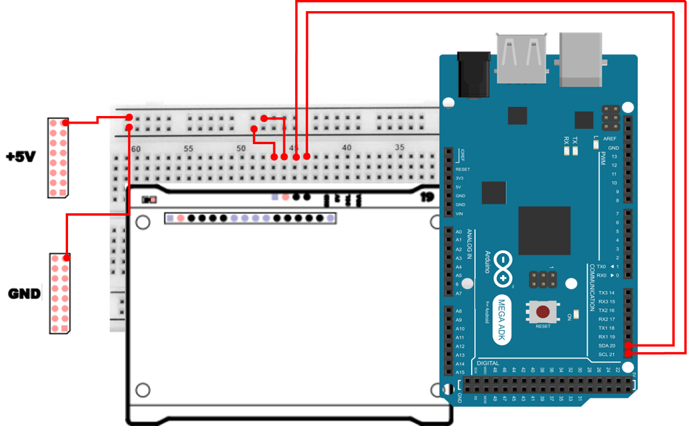
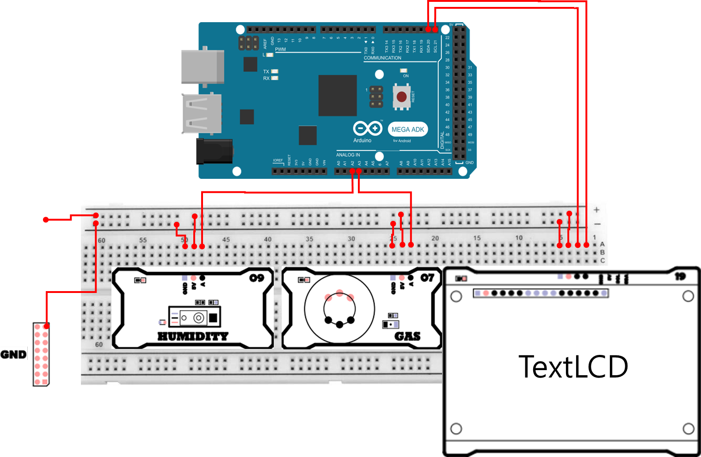

# TextLCD
## TextLCD
Text LCD는 **문자(텍스트)를 표시하기 위한 전용 LCD 모듈**입니다. 보통 다음과 같은 규격이 가장 많이 쓰입니다.

- 16×2 : 한 줄에 16글자 × 2줄
- 20×4 : 한 줄에 20글자 × 4줄

Text LCD는 내부에 **HD44780 호환 컨트롤러**(또는 그와 호환되는 컨트롤러)를 가지고 있어서, 우리가 문자/명령을 보내면 LCD가 알아서 **문자를 화면에 배치**해 줍니다.

또한 Text LCD는 숫자나 영문자 뿐 아니라, **기호 출력**도 가능하고, 더 나아가 **커스텀 문자(Custom Character)** 도 만들 수 있습니다.  
- 예: 온도 아이콘, 화살표, 진행바 블록, 배터리 표시 등

## TextLCD는 어디에 사용하는가?
Text LCD는 단순히 `글자를 보여주는 부품`이 아니라, 임베디드 시스템에서 **사람이 바로 읽을 수 있는 상태 표시(HMI)** 를 만드는 대표적인 출력 장치입니다. 

- 출력 장치 제어의 기본
  - 센서 값(가스/습도/온도), 상태 메시지(READY/RUN/ERROR), 경고(OVER LIMIT) 등을 글자로 표시
- 시간 기반 갱신(millis 기반 주기 제어)
  - “매 루프마다 출력”이 아니라, 주기적으로 업데이트하는 방식이 왜 필요한지 학습
- 커서/좌표 개념
  - (col, row) 위치에 정확히 원하는 문장을 배치
- UI 구성 연습
  - 헤더(제목) + 데이터 영역 + 상태 영역(업타임/경고 등)처럼 화면을 나누어 구성

즉, Text LCD는 센서 값 출력 수준을 넘어, `장비를 사용하는 사람이 보기 쉬운 형태로 정보를 배치하는 연습`에 아주 좋습니다.

## Text LCD의 구동 방식 (8비트 / 4비트)
HD44780 계열 Text LCD는 원래 `병렬(Parallel) 방식`으로 제어합니다. 이때 데이터 라인을 어떻게 쓰느냐에 따라 두 가지 모드가 있습니다.

- 8비트 모드
  - 데이터 라인 8개(D0~D7)를 모두 사용
  - 한 번에 8비트를 전송하므로 구조가 직관적이고 빠르지만 **핀을 많이 사용**
- 4비트 모드
  - 상위 4개 라인(D4~D7)만 사용
  - 8비트를 “상위 4비트 + 하위 4비트”로 **두 번 나누어 전송**
  - 핀 수를 줄일 수 있어 아두이노 같은 MCU에서 매우 흔함

여기서 사용하는 Text LCD 모듈은 I2C 변환 칩이 장착되어 있어, 병렬 신호를 직접 다루지 않고 I2C로 문자/명령을 보내는 방식으로 훨씬 쉽게 사용할 수 있습니다. 

## RS / RW / E 핀의 의미
Text LCD에는 다음 3개의 대표 제어 핀이 있습니다.

- RS(Register Select)
  - `0`이면 명령(Command), `1`이면 데이터(Data, 문자)
  - 예: 화면 지우기(명령) vs ‘A’ 출력(데이터)
- RW(Read/Write)
  - `0` 쓰기(Write), `1` 읽기(Read)
  - 실습에서는 보통 **GND에 고정**해서 쓰기 전용으로 사용
- E(Enable)
  - LCD가 “지금 들어온 신호를 유효한 것으로 읽어라”라는 트리거(클럭 비슷한 역할)

I2C 변환 칩을 쓰면 이 핀들을 우리가 직접 흔들지 않아도, 백팩/라이브러리가 내부적으로 처리해 줍니다. 하지만 **RS/RW/E의 역할을 알고 있으면** "왜 init이 필요하고, 왜 명령/데이터가 구분되는지"가 훨씬 잘 이해됩니다.

## TextLCD 제어 명령
Text LCD는 내부적으로 명령 코드(HEX)를 해석합니다. 아래 표는 대표적인 명령들입니다.

| 명령 | 코드(HEX) | 비트 구조 | 기능 |
| :--- | :--- | :--- | :--- |
| Clear Display | 0x01 | — | 화면 전체 클리어, 커서 홈(0,0) |
| Return Home | 0x02 | — | 커서 홈, 표시 쉬프트 해제 |
| Entry Mode Set | 0x04~0x07 | 0b000001IS | I: Inc/Dec(1=증가), S: Shift(1=Shift) |
| Display On/Off Control | 0x08~0x0F | 0b00001DCB | D: Display, C: Cursor, B: Blink |
| Cursor/Display Shift | 0x10~0x1F | 0b0001SRxx | S/C(1=Display,0=Cursor), R/L(1=Right) |
| Function Set | 0x20~0x3F | 0b001DLNFx | DL: 8/4비트, N: 2/1라인, F: 5×10/5×8 |
| Set CGRAM Address | 0x40~0x7F | 0b01xxxxxx | 커스텀 문자(CGRAM) 주소 설정 |
| Set DDRAM Address | 0x80~0xFF | 0b1xxxxxxx | 화면 위치(DDRAM) 주소 설정 |


## TextLCD 연결 
여기서 사용하는 TextLCD 모듈은 **I2C 방식**으로 연결합니다. Mega2560에서 I2C 핀은 다음과 같습니다.

| Pin | 연결 대상 | 설명 |
|:---:|:---:|:---|
| 5V | +5V | 전원 |
| GND | GND | 접지 |
| 20 | C | I2C Clock |
| 21 | D | I2C Data |



## TextLCD 제어 
TextLCD 에 간단한 문자를 출력하는 예제 입니다. setCursor()를 통해 커서의 위치를 조정하고 print() 를 통해 TextLCD에 문자를 출력합니다. clear()는 화면에 출력된 문자를 지우는 역할을 담당합니다. 

```cpp
#include <Wire.h>
#include <LiquidCrystal_I2C.h>

#define LCD_ADDR   0x3F   
#define LCD_COLS   20
#define LCD_ROWS   4
#define PERIOD_MS  500UL 

LiquidCrystal_I2C lcd(LCD_ADDR, LCD_COLS, LCD_ROWS);

unsigned long lastTick = 0;
uint32_t counter = 0; 

void setup() {
  Wire.begin();         
  lcd.init();
  lcd.backlight();
  lcd.clear();
}

void loop() {
  lcd.setCursor(0, 0);
  lcd.print("Hello");
  lcd.setCursor(2, 1);
  lcd.print("World!");  
  lcd.setCursor(4, 2);
  lcd.print("TextLCD");
  lcd.setCursor(6, 3);
  lcd.print("Initialized!");  
  delay(3000);
  lcd.clear();
  delay(1500);
}
```

### TextLCD 제어 주요 코드 설명
> **LiquidCrystal_I2C lcd(LCD_ADDR, LCD_COLS, LCD_ROWS);**
> - I2C 주소와 LCD 크기(열/행)를 지정해 LCD 객체를 만듭니다.
> - LCD 크기를 잘못 넣으면 커서 위치/줄 바꿈이 예상과 다르게 동작할 수 있습니다.

> **Wire.begin();**
> - I2C 통신을 시작합니다. 초기화가 없으면 I2C 장치와 정상 통신이 안 될 수 있습니다.

> **lcd.init();**
> - LCD 컨트롤러를 초기화합니다.
> - 전원 인가 직후 LCD는 바로 `출력 가능한 상태`가 아닐 수 있으므로, init 과정이 매우 중요합니다.

> **lcd.backlight();**
> - 백라이트를 켭니다. 글자가 출력되더라도 백라이트가 꺼져 있으면 화면이 매우 어둡게 보여 `안 되는 것처럼` 느낄 수 있습니다.

> **lcd.setCursor(col, row)**
> - (열, 행) 좌표로 커서를 이동합니다.
>   - 예: (0,0)은 1번째 줄 맨 왼쪽, (2,1)은 2번째 줄에서 왼쪽으로부터 3번째 칸입니다.

> **lcd.print("...")**
> - 현재 커서 위치부터 문자열을 출력합니다.

> **lcd.clear()**
> - 화면 전체를 지우고 커서를 (0,0)으로 돌립니다.

## Progress Bar 
앞서와 같이 TextLCD에 문자를 출력합니다. 앞의 예제와 다르게 시간에 따라서 진행상황을 표기하는 바를 만들어 출력합니다. 출력 방향은 행에 따라서 다릅니다. 

- 1행: 왼쪽 → 오른쪽으로 채움
- 2행: 오른쪽 → 왼쪽으로 채움
- 3행: 가운데 → 양쪽으로 퍼지며 채움
- 모두 완료되면 잠시 멈춘 뒤 초기화하고 반복

```cpp
#include <Wire.h>
#include <LiquidCrystal_I2C.h>

#define LCD_ADDR    0x3F
#define LCD_COLS    20
#define LCD_ROWS    4
#define STEP_MS     100UL 
#define PAUSE_MS    2000UL

LiquidCrystal_I2C lcd(LCD_ADDR, LCD_COLS, LCD_ROWS);

unsigned long lastStep   = 0;
unsigned long pauseStart = 0;

uint8_t curRow  = 1;
uint8_t stepIdx = 0;
bool isPause    = false;

void drawHeader() {
  lcd.setCursor(0, 0);
  lcd.print("Progress Bar        ");
}

void clearProgressArea() {
  for (uint8_t r = 1; r < LCD_ROWS; ++r) {
    lcd.setCursor(0, r);
    lcd.print("                    ");
  }
}

void resetProgress() {
  clearProgressArea();
  curRow  = 1;
  stepIdx = 0;
}

void setup() {
  Wire.begin();
  lcd.init();
  lcd.backlight();
  drawHeader();
  resetProgress();
}

void loop() {
  unsigned long now = millis();

  if (isPause) {
    if (now - pauseStart >= PAUSE_MS) {
      isPause = false;
      resetProgress();
      lastStep = now; 
    }
    return;
  }

  if (now - lastStep >= STEP_MS) {
    lastStep += STEP_MS;

    if (curRow == 1) {
      if (stepIdx < LCD_COLS) {
        lcd.setCursor(stepIdx, 1);
        lcd.print('#');
        stepIdx++;
      }
      if (stepIdx >= LCD_COLS) { curRow = 2; stepIdx = 0; }

    } else if (curRow == 2) {
      if (stepIdx < LCD_COLS) {
        uint8_t col = (LCD_COLS - 1) - stepIdx;
        lcd.setCursor(col, 2);
        lcd.print('#');
        stepIdx++;
      }
      if (stepIdx >= LCD_COLS) { curRow = 3; stepIdx = 0; }

    } else {
      uint8_t half = LCD_COLS / 2;
      int8_t left = (half - 1) - stepIdx;
      int8_t right = (half) + stepIdx;

      if (left >= 0) {
        lcd.setCursor(left, 3);
        lcd.print('#');
      }
      if (right < LCD_COLS) {
        lcd.setCursor(right, 3);
        lcd.print('#');
      }

      stepIdx++;
      if (stepIdx >= half) {
        isPause = true;
        pauseStart = now;
      }
    }
  }
}
```

### Progress Bar 주요 코드 설명
> **STEP_MS / PAUSE_MS**
> - STEP_MS는 진행바가 한 칸 이동하는 주기입니다. 
> - PAUSE_MS는 완료 후 멈춰 있는 시간입니다. 

> **millis() 기반 주기 제어**
> - delay()만으로 제어하면 다른 작업(센서 읽기 등)을 넣을 때 확장이 어렵습니다.
> - now - lastStep >= STEP_MS 형태는 임베디드에서 매우 자주 쓰는 `비블로킹 주기 제어` 패턴입니다.

> **drawHeader()**
> - 0행(첫 줄)은 제목으로 고정하고, 나머지 행(1~3행)을 진행바 영역으로 사용합니다.

> **curRow / stepIdx**
> - curRow: 지금 진행바를 그릴 행 번호 (1 → 2 → 3)
> - stepIdx: 해당 행에서 현재 진행된 칸 수

> **2행(인덱스 2)에서 오른쪽→왼쪽**
> - col = (LCD_COLS - 1) - stepIdx로 열 위치를 뒤집어 계산합니다. 같은 stepIdx라도 열 계산만 바꾸면 방향이 반대로 움직이는 효과를 만들 수 있습니다.

> **3행에서 가운데→양쪽**
> - half = LCD_COLS/2를 기준으로 left/right 위치를 계산해 동시에 찍습니다. 이렇게 하면 “가운데에서 퍼져나가는” 애니메이션처럼 보입니다.

## 센서 모니터링 
가스 센서와 습도 센서의 값을 TextLCD를 통해 출력해보겠습니다. 10ms 마다 센서의 값을 읽어 출력하며, 추가로 구동된 시간도 함께 출력합니다. 

각센서 핀연결은 다음과 같습니다. 

#### TextLCD 
| Pin | 연결 대상 | 설명 |
|:---:|:---:|:---|
| 5V | +5V | 전원 |
| GND | GND | 접지 |
| 20 | C | I2C Clock |
| 21 | D | I2C Data |

#### Gas Sensor 
| Pin | 연결 대상 | 설명 |
|:---:|:---:|:---|
| 5V | +5V | 전원 |
| GND | GND | 접지 |
| A2 | A | Gas Sensor |

#### Humidity Sensor 
| Pin | 연결 대상 | 설명 |
|:---:|:---:|:---|
| 5V | +5V | 전원 |
| GND | GND | 접지 |
| A3 | A | Humidity Sensor |



```cpp
#include <LiquidCrystal_I2C.h>

#define LCD_ADDR 0x3F
#define LCD_COLS 20
#define LCD_ROWS 4

#define GAS_PIN A2
#define HUM_PIN A3

LiquidCrystal_I2C lcd(LCD_ADDR, LCD_COLS, LCD_ROWS);

unsigned long now = 0;

String hhmmss(unsigned long ms) {
  unsigned long s = ms / 1000;
  unsigned int h = s / 3600;
  unsigned int m = (s % 3600) / 60;
  unsigned int sec = s % 60;
  char buf[16];
  snprintf(buf, sizeof(buf), "%02u:%02u:%02u", h, m, sec);
  return String(buf);
}

void setup() {
  lcd.init();
  lcd.backlight();
  lcd.clear();
  now = millis();
}

void loop() {
  if(millis() - now > 500) {
    int gasValue = analogRead(GAS_PIN);
    int humValue = analogRead(HUM_PIN);
    lcd.setCursor(0, 0);
    lcd.print("Gas: ");
    lcd.print(gasValue);

    lcd.setCursor(0, 1);
    lcd.print("Hum: ");
    lcd.print(humValue);

    lcd.setCursor(0, 2);
    lcd.print("                    ");
    now = millis();
  }

  lcd.setCursor(0, 3);
  lcd.print("Uptime ");
  lcd.print(hhmmss(millis()));

  delay(10);
}
```

### 센서 모니터링 예제 주요 코드 설명
> **analogRead(GAS_PIN), analogRead(HUM_PIN)**
> - 아날로그 센서는 0~1023 범위(10비트 ADC) 값으로 읽힙니다.

> **0.5초마다 센서값 갱신**
> - if (millis() - now > 500) 조건으로, 너무 자주 화면을 갱신하지 않게 합니다.

> **줄 정리(공백 덮어쓰기)**
> - LCD는 이전에 출력된 문자가 “그대로 남아” 있을 수 있습니다.
>   - 예를 들어 Hum: 1000 다음에 Hum: 999를 출력하면, 끝의 0이 남아 9990처럼 보일 수 있습니다.

> **hhmmss()**
> - millis()는 ms 단위이므로, 사람이 보기 쉬운 hh:mm:ss로 바꿔서 보여줍니다.
> - snprintf()를 써서 항상 2자리로 출력합니다. (예: 01:02:09)

> **delay(10)**
> - loop가 너무 빠르게 도는 것을 약간 완화하고, LCD 출력이 과도하게 호출되는 것을 줄이는 용도입니다.
