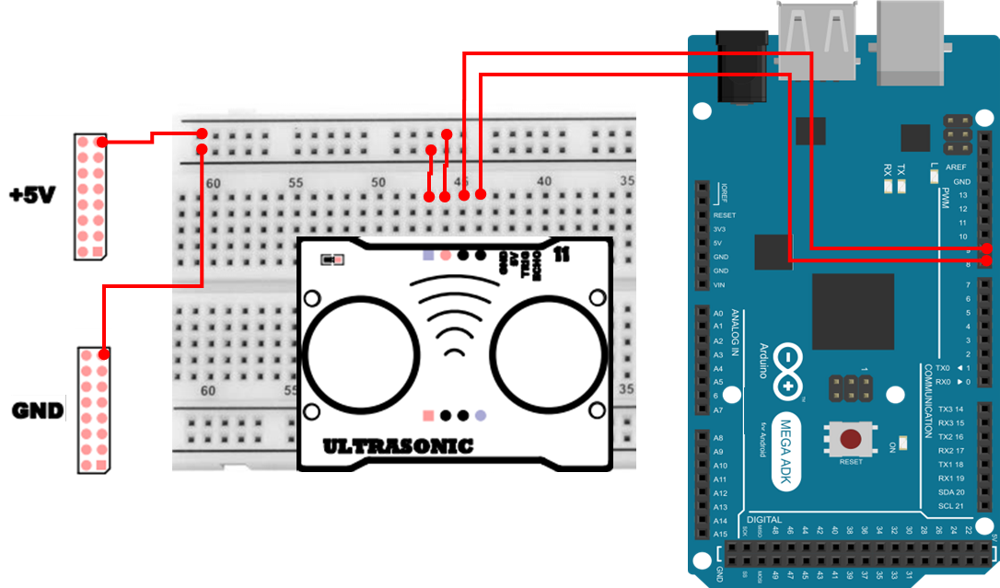

# 초음파 센서
## 초음파 센서
초음파 센서는 40 kHz 대역의 초음파를 공기 중으로 발사(Trigger)한 뒤, 물체에 반사되어 돌아오는 시간을 측정하여 물체까지의 거리를 계산하는 센서입니다.

가장 흔히 사용하는 모듈은 HC-SR04 계열이며, 다음 특징을 가집니다.

- 측정 대상: 벽, 사람, 박스, 장애물 등 반사면이 있는 물체
- 결과: **센서와 물체 사이의 거리(cm 단위)** 로 환산 가능
- 활용: 장애물 감지, 주차 보조, 거리 기반 자동 제어(문 열림/경고음/LED), 로봇 회피 주행 등

핵심은 초음파가 왕복한 시간(us)을 재고, 음속을 이용해 거리로 바꾸는 것입니다. 초음파 센서는 `시간을 재서 거리로 바꾸는 센서` 라고 기억하면 좋습니다.

## 초음파 센서는 어디에 사용하는가?
초음파 센서는 단순히 거리 값을 읽는 센서를 넘어, 임베디드 시스템에서 거리 기반 판단 로직을 만들기에 아주 좋습니다.

- 거리 기반 이벤트/트리거
  - 일정 거리보다 가까우면 LED ON, 부저 경고, 모터 정지 등
- 로봇/자동화의 기본 센서
  - 장애물 회피, 사람 접근 감지, 자동문/자동조명
- 센서 노이즈와 필터링 학습
  - 순간 튐(Outlier)이 발생할 수 있어 평균/중앙값(Median) 등 안정화 기법을 연습
- 시간 측정(pulseIn, 타이밍) 개념 학습
  - 디지털 신호의 HIGH 지속시간을 재는 방식
- 주기적 갱신(millis 기반) 연습
  - 너무 자주 재면 안정성이 떨어지고, 너무 느리면 반응이 늦어집니다. 적당한 갱신 주기를 설계하는 연습에 좋습니다.

## 초음파 센서의 동작 원리
초음파 센서(HC-SR04 기준)는 보통 TRIG와 ECHO 두 신호로 동작합니다.

1. TRIG(Trigger)로 초음파 발사 시작
    - MCU가 TRIG 핀에 아주 짧은 HIGH 펄스(보통 10us) 를 주면 센서가 초음파를 발사합니다.
2. ECHO(Echo) 펄스로 왕복 시간 전달
    - 초음파가 물체에 부딪혀 반사되어 돌아오면 센서는 ECHO 핀을 HIGH로 유지합니다.
    - ECHO가 HIGH로 유지된 시간 = 초음파 왕복 시간(TOF: Time Of Flight)
3. 거리 계산
    - 왕복 시간이 duration_us(마이크로초)일 때, 거리 계산은 아래와 같습니다.
    - 음속(대략) : 343 m/s ≈ 0.0343 cm/us
    - distance_cm = (duration_us x 0.0343)/2

온도에 따라 음속이 조금 달라집니다. 정밀 측정에서는 필요에 따라 보정하여 사용하지만 여기서는 상수(0.0343)을 사용합니다. 


## 초음파 센서 연결 
초음파 센서 하드웨어 연결은 다음과 같습니다. 

| Pin | 연결 대상 | 설명 |
|:---:|:---:|:---|
| 5V | +5V | 전원 |
| GND | GND | 접지 |
| 9 | TRIG | Ultrasonic Trig |
| 8 | ECHO | Ultrasonic Echo |



## 초음파 센서 제어 
초음파 센서를 활용한 거리 측정 예제 입니다. Trigger 와 연결된 GPIO 를 제어하여 초음파를 발생시키고, 초음파가 반사되서 들어오는 시간을 Echo 와 연결된 GPIO 의 신호 변화를 감지하는 코드입니다. pulseIn() 은 지정한 핀이 특정상태(HIGH 또는 LOW)를 유지한 시간을 마이크로초 단위로 측정하여 반환합니다. 

만약 pulseIn(9,HIGH) 로 코드를 작성했다면, 9번 GPIO의 신호가 LOW → HIGH로 바뀌는 순간을 기준으로 측정 시작, HIGH 유지 시간 측정하여 변화한 순간까지의 마이크로초를 반환합니다. 

```cpp
const int PIN_TRIG = 9;
const int PIN_ECHO = 8;

long duration;
float distance;

void setup() {
  Serial.begin(115200);
  pinMode(PIN_TRIG, OUTPUT);
  pinMode(PIN_ECHO, INPUT);
}

void loop() {
  digitalWrite(PIN_TRIG, LOW);
  delayMicroseconds(2);
  digitalWrite(PIN_TRIG, HIGH);
  delayMicroseconds(10);
  digitalWrite(PIN_TRIG, LOW);

  duration = pulseIn(PIN_ECHO, HIGH);
  distance = (duration * 0.034) / 2.0;

  Serial.print("Distance: ");
  Serial.print(distance);
  Serial.println(" cm");

  delay(200);
}
```

### 초음파 센서 제어 주요 코드 설명
> **pinMode(PIN_TRIG, OUTPUT), pinMode(PIN_ECHO, INPUT)**
> - TRIG는 “내가 펄스를 보내는 출력 핀”이라 OUTPUT, ECHO는 “센서가 펄스를 주는 입력 핀”이라 INPUT입니다.
> - 이 설정이 잘못되면 펄스 측정 자체가 실패합니다.

> **TRIG 펄스(LOW → HIGH 10us → LOW)**
> - 초음파 센서는 “TRIG가 잠깐 HIGH가 되면 측정 시작”이라는 규칙을 가집니다. 10us는 HC-SR04에서 흔히 쓰는 트리거 길이입니다.

> **duration = pulseIn(PIN_ECHO, HIGH)**
> - ECHO 핀이 HIGH로 유지되는 시간을 마이크로초(us) 단위로 측정합니다.

**distance = duration * 0.0343 / 2**
> - 0.0343은 `1us 동안 소리가 진행하는 거리(cm)`입니다.
> - 왕복 시간이라서 2로 나눠 실제 거리(편도)를 얻습니다.

## Serial Plotter 활용
초음파 센서는 물체와의 거리를 수치(cm)로 반환합니다. 하지만 센서 값은 시간에 따라 연속적으로 변화하기 때문에, 단순히 숫자만 확인하는 것보다 그래프 형태로 관찰하면 센서의 특성을 훨씬 직관적으로 이해할 수 있습니다.

```cpp
const int PIN_TRIG = 9;
const int PIN_ECHO = 8;

long duration;
float distance;
int zero = 0;

void setup() {
  Serial.begin(115200);
  pinMode(PIN_TRIG, OUTPUT);
  pinMode(PIN_ECHO, INPUT);
}

void loop() {
  digitalWrite(PIN_TRIG, LOW);
  delayMicroseconds(2);
  digitalWrite(PIN_TRIG, HIGH);
  delayMicroseconds(10);
  digitalWrite(PIN_TRIG, LOW);

  duration = pulseIn(PIN_ECHO, HIGH);
  distance = (duration * 0.034) / 2.0;

  Serial.print("Variable_1:");
  Serial.print(distance);
  Serial.print(",");
  Serial.print("Variable_2:");
  Serial.println(zero);
  
  delay(10);
}
```

### Serial Plotter 활용 주요 코드 설명 

> ```cpp
> digitalWrite(PIN_TRIG, LOW);
> delayMicroseconds(2);
> digitalWrite(PIN_TRIG, HIGH);
> delayMicroseconds(10);
> digitalWrite(PIN_TRIG, LOW);
> ```
> - 초음파 센서에 측정을 시작하라는 신호(TRIG) 를 보내는 부분입니다.
> - TRIG 핀을 짧은 시간 동안 HIGH로 만들어 주면 센서는 초음파를 발사합니다.
> - delayMicroseconds(10)은 HC-SR04 센서에서 권장하는 트리거 신호 길이입니다.

> **unsigned long duration = pulseIn(PIN_ECHO, HIGH);**
> - 초음파가 물체에 반사되어 돌아오는 데 걸린 왕복 시간을 측정합니다.
> - pulseIn() 함수는 ECHO 핀이 HIGH로 유지된 시간을 측정합니다. 반환되는 값의 단위는 마이크로초(us) 입니다.

> **float distance_cm = (duration * 0.034) / 2.0;**
> - 0.0343은 초음파가 1마이크로초 동안 이동하는 거리(cm)입니다. 초음파는 왕복했기 때문에 2로 나누어 실제 거리를 계산합니다.

> **Serial.println(distance_cm);**
> - 계산된 거리 값을 Serial Plotter에 출력하는 부분입니다. 한 줄에 하나의 숫자 값만 출력되므로 Serial Plotter에서 시간에 따른 거리 변화를 그래프로 확인할 수 있습니다.
