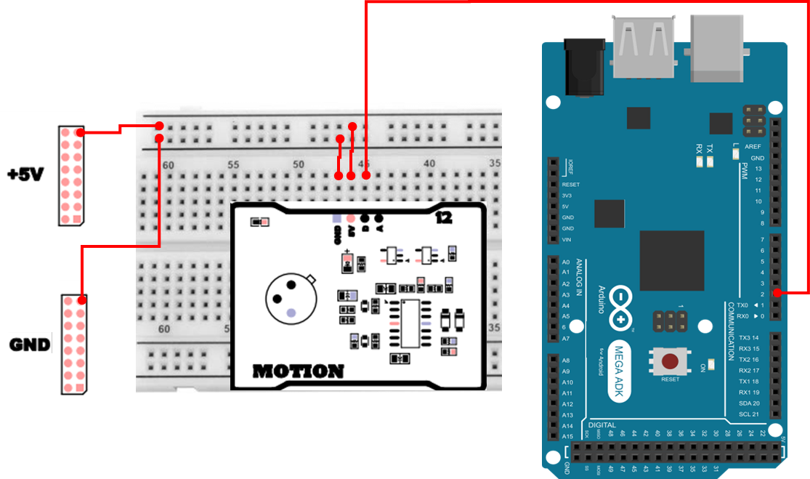

# 인체 감지 센서
## PIR
인체 감지 센서(PIR Sensor: Passive Infrared Sensor)는 사람이나 동물과 같이 체온을 가진 물체에서 방출되는 적외선(Infrared)을 감지하여, 움직임이 있는지를 판단하는 센서입니다. 이 센서는 거리나 온도의 절대값을 측정하는 센서가 아니라, `주변 환경 대비 적외선의 변화` 를 감지하는 센서라는 점이 핵심입니다.

PIR 센서는 평상시 주변 환경의 적외선을 지속적으로 감시하고 있으며, 사람이 이동하거나 위치가 바뀌면 적외선 분포가 변하게 됩니다. 이 변화가 감지되면 센서는 출력 핀(OUT)을 HIGH 상태로 변경하여 외부 장치(MCU, 임베디드 보드 등)에 `움직임이 감지되었다`는 신호를 전달합니다.

즉, PIR 센서는 `사람이 있는지`가 아니라 `사람이 움직였는지`를 감지하는 센서라고 이해하면 가장 정확합니다.

## 인체 감지 센서는 어디에 사용하는가?
인체 감지 센서는 구조가 단순하고 사용이 쉬워, 다양한 자동화 시스템에서 매우 자주 사용됩니다.

- 자동 조명 시스템
  - 사람이 들어오면 불이 켜지고, 일정 시간 움직임이 없으면 꺼짐
- 보안 및 경보 시스템
  - 침입 감지, 무인 공간 감시
- 스마트 홈 / IoT 기기
  - 출입 감지, 사용자 접근 인식
- 저전력 감시 시스템
  - 항상 동작하지만 전력 소모가 매우 적음

초음파 센서가 연속적인 거리 값을 제공한다면, PIR 센서는 명확한 상태 변화(HIGH / LOW) 를 제공하는 이벤트형 센서라고 볼 수 있습니다.

## PIR 센서의 동작 원리
PIR 센서는 다음과 같은 구성 요소로 이루어져 있으며, 이들이 함께 동작하여 인체 움직임을 감지합니다.

- 프레넬 렌즈(Fresnel Lens)
  - 넓은 범위에서 들어오는 적외선을 여러 구역으로 나누어 센서 소자에 집중시킴
  - 감지 범위와 민감도에 큰 영향을 줌
- 적외선 센서 소자(Pyroelectric Sensor)
  - 적외선 에너지의 변화량을 감지
  - 절대적인 온도가 아니라 변화에 반응
- 신호 처리 회로
  - 센서 소자의 미세한 전기 신호를 증폭
  - 디지털 신호(HIGH / LOW)로 변환
- 출력 핀(OUT)
  - 움직임이 감지되면 HIGH, 감지되지 않으면 LOW

정리하면, `사람이 움직이면 → 적외선 분포가 변하고 → 센서가 이를 감지하여 HIGH 출력` 이라는 흐름으로 이해하면 됩니다.

### PIR 센서의 특징
- 저전력 : 대기 전력 소모가 매우 적습니다.
- 저비용 : 구조가 단순하여 가격이 저렴합니다.
- 광범위 감지 : 렌즈 구조에 따라 넓은 감지 범위를 확보할 수 있습니다.
- 다양한 응용 : 보안 시스템, 자동 조명, 가전제품, 무인 감시 장치 등 여러 분야에서 활용됩니다.


## 인체 감지 센서 연결 
인체 감지 센서의 하드웨어 연결은 다음과 같습니다. 

| Pin | 연결 대상 | 설명 |
|:---:|:---:|:---|
| 5V | +5V | 전원 |
| GND | GND | 접지 |
| 2 | D | PIR |



## 인체 감지 센서 제어 
아래 예제는 PIR 센서를 이용하여 움직임이 감지되었는지를 Serial Monitor로 출력하는 코드입니다.

```cpp
int pirPin = 2;

void setup() {
  pinMode(pirPin, INPUT); 
  Serial.begin(115200);
}

void loop() {
  int pirValue = digitalRead(pirPin);
  if (pirValue == HIGH) {
    Serial.println("Motion Detected!");
  } else {
    Serial.println("No Motion");
  }
  delay(200);
}
```

### 인체 감지 센서 제어 주요 코드 설명
> **pinMode(pirPin, INPUT);**
> - PIR 센서의 출력은 센서가 신호를 “주는 쪽”이므로 INPUT으로 설정

> **digitalRead(pirPin);**
> - PIR 센서의 현재 상태를 읽음
>   - HIGH: 움직임 감지
>   - LOW: 변화 없음

> **if (pirValue == HIGH)**
> - 센서가 움직임을 감지했을 때 실행되는 조건문

> **delay(200);**
> - 센서를 너무 자주 읽지 않도록 간단한 주기 제어

## 인터럽트 기반 인체 감지 센서 제어 
앞의 예제는 loop()에서 digitalRead()로 센서 상태를 계속 읽는 폴링(polling) 방식이었습니다. 폴링 방식은 구현이 쉽지만, 다음과 같은 한계가 있습니다.

- CPU가 주기적으로 상태를 확인해야 하므로, 다른 작업이 많으면 감지 반응이 늦어질 수 있음
- delay()가 길면 감지 순간을 놓칠 수 있음
- `움직임이 발생한 순간`을 정확히 잡기보다는, `읽는 시점의 상태`만 확인하게 됨

그래서 이벤트(신호 변화)가 발생했을 때 즉시 처리하는 인터럽트(Interrupt) 를 사용하면, 감지 반응이 더 자연스럽고 안정적인 구조를 만들 수 있습니다.

### 인체 감지 센서 초기 안정화가 필요한 이유 
인체 감지 센서는 전원이 켜진 직후 내부 증폭 회로와 기준값(주변 적외선 기준)을 잡는 과정이 필요합니다. 이 구간에서는 주변 환경과 상관없이 출력이 흔들리거나 HIGH가 튀는 현상이 발생할 수 있습니다.

따라서 실습에서는 전원 인가 후 일정 시간(예: 30초) 동안은 `안정화 시간`으로 두고, 그 시간 동안 발생하는 신호는 무시하는 처리가 안정적인 탐지에 도움이 됩니다. 

```cpp
int pirPin = 2;

const unsigned long WARMUP_MS = 30000;
unsigned long bootTimeMs = 0;
volatile bool motionFlag = false;

void pirISR() {
  motionFlag = true;
}

void setup() {
  Serial.begin(115200);
  pinMode(pirPin, INPUT);
  bootTimeMs = millis();
  Serial.println("[PIR] Sensor warm-up... please wait.");
  attachInterrupt(digitalPinToInterrupt(pirPin), pirISR, RISING);
}

void loop() {
  unsigned long now = millis();
  bool isWarmup = (now - bootTimeMs) < WARMUP_MS;

  if (isWarmup) {
    delay(200);
    return;
  }

  static bool warmupDoneMsg = false;
  if (!warmupDoneMsg) {
    Serial.println("[PIR] Warm-up done. Interrupt detection enabled.");
    warmupDoneMsg = true;
  }

  if (motionFlag) {
    motionFlag = false;
    Serial.println("Motion Detected! (Interrupt)");
  }

  delay(50);
}
```

### 인터럽트 기반 인체 감지 센서 제어 주요 코드 설명
> **const unsigned long WARMUP_MS = 30000;**
> - PIR 센서가 전원 인가 후 안정화하는 데 필요한 시간을 설정합니다.

> **bootTimeMs = millis(); / isWarmup 계산**
> - millis()는 보드가 켜진 후 경과 시간을 ms 단위로 반환합니다.
> - now - bootTimeMs < WARMUP_MS이면 아직 워밍업 구간이므로 감지 이벤트를 무시합니다.

> **attachInterrupt(digitalPinToInterrupt(pirPin), pirISR, RISING);**
> - PIR 출력이 LOW → HIGH로 올라가는 순간을 이벤트로 잡습니다.
> - digitalPinToInterrupt(pirPin)을 쓰면 핀 번호를 인터럽트 번호로 안전하게 변환합니다.
> - ISR(pirISR)에서는 motionFlag만 true로 만든다
> - ISR은 시스템 동작 중 “즉시 실행되는 긴급 루틴”입니다. ISR 안에서 Serial.println()처럼 시간이 오래 걸리는 작업을 하면, 다른 인터럽트/타이머 작업이 밀려서 오동작할 수 있습니다.

> **if (motionFlag) { ... }**
> - 실제 감지 처리는 loop()에서 합니다.