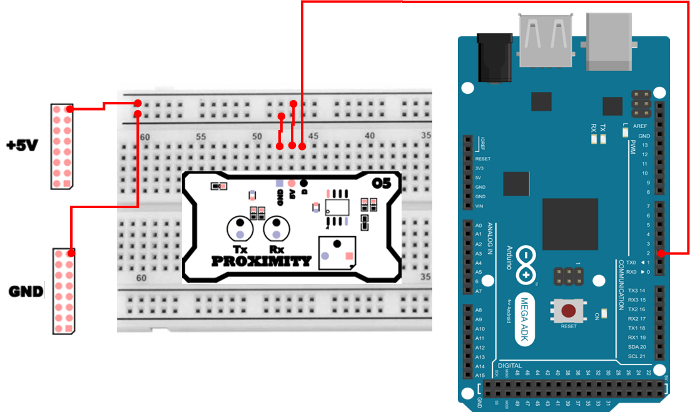

# 근접 센서
## 근접 센서
근접센서(Proximity Sensor)는 물체가 센서에 가까이 다가오는 것을 `접촉 없이` 감지하는 센서입니다. 스위치처럼 직접 닿아서 눌리는 방식이 아니라, 센서가 주변 환경의 변화를 감지해 디지털 신호(HIGH/LOW) 로 `감지됨/감지 안됨`을 알려주는 형태가 일반적입니다.

그중에서도 이번 실습에서 사용하는 LJ12A3 계열 센서는 금속 물체에 반응하는 유도형(Inductive) 근접 센서로, 센서 앞에 금속(철/알루미늄/구리 등) 이 가까이 오면 감지 신호를 출력합니다. 즉, 이 센서는 모든 물체를 감지하는 센서가 아니라 `금속에 특화된 센서` 라는 점이 핵심입니다.

근접 센서는 평상시에 센서 내부 코일을 통해 일정한 자기장(전자기장)을 형성하고 있습니다. 금속 물체가 가까이 오면, 금속 내부에 와전류(eddy current) 가 발생하면서 원래의 자기장이 변화합니다. 센서는 이 변화를 감지하여 출력 핀(OUT) 에서 HIGH/LOW 형태의 디지털 신호를 내보냅니다.
따라서 MCU(아두이노 Mega 2560 등) 입장에서는 근접 센서의 OUT 핀을 디지털 입력 핀으로 읽기만 하면, 금속 감지 여부를 쉽게 판단할 수 있습니다.

## 근접센서의 동작 원리
- 코일(Induction Coil) : 센서 내부에서 자기장을 형성합니다.
- 금속 감지 : 금속이 접근하면 와전류가 발생하여 자기장이 약해집니다.
- 신호 처리 회로 : 자기장의 변화를 전기 신호로 변환합니다.
- 출력 핀(OUT 핀) : 감지 결과를 High/Low 신호로 외부 장치에 전달합니다.

## 근접센서의 특징
- 비접촉 감지 : 기계적 마모가 없어 긴 수명을 가집니다.
- 금속 전용 : 철, 알루미늄, 구리 등 금속 물체만 감지할 수 있습니다.
- 빠른 반응 속도 : 물체 접근 시 즉각적으로 출력 신호를 제공합니다.

## 근접 센서는 어디에 사용하는가? 
근접 센서는 산업/자동화 현장에서 특히 많이 쓰입니다. 이유는 “비접촉 + 빠른 반응 + 내구성” 조합이 강력하기 때문입니다.

- 컨베이어 벨트 금속 물체 감지
    - 금속 부품이 지나가는지 확인, 불량/누락 검사
- 회전/이송 카운팅
    - 금속 톱니/캠/기어가 지나갈 때마다 1번 감지 → 회전수/속도 측정
- 위치 도달 확인
    - 어떤 금속 부품이 특정 위치까지 왔는지 확인(접촉식 스위치보다 마모가 적음)
- 장비 안전/인터락
    - 문/가드가 닫혔는지(금속 플레이트가 위치에 있는지) 확인하는 용도


## 근접 센서 연결 
| Pin | 연결 대상 | 설명 |
|:---:|:---:|:---|
| 5V | +5V | 전원 |
| GND | GND | 접지 |
| 2 | A | Proximity Sensor |



## 근접 센서 제어 
아래 예제는 근접 센서의 OUT 핀을 디지털 입력으로 읽어서, 감지 상태를 주기적으로 Serial Monitor에 출력하는 코드입니다. 근접 센서는 보통 `감지됨/안됨`이 명확한 이벤트형 센서이므로, 상태를 읽어 문자열로 보여주면 동작 확인이 매우 쉽습니다.

```cpp
const int prox_pin = 2;

void setup() {
    pinMode(prox_pin, INPUT_PULLUP); 
    Serial.begin(115200);
}

void loop() {
    bool detected = (digitalRead(prox_pin) == LOW); 

    static unsigned long t = 0;
    if (millis() - t > 500) {
        Serial.println(detected ? "Detect" : "Not Detect");
        t = millis();
    }
}
```

### 근접 센서 제어 주요 코드 설명
> **pinMode(prox_pin, INPUT_PULLUP);**
> - INPUT_PULLUP은 입력 핀에 내부 풀업 저항(약 20k~50kΩ 수준)을 연결해, 핀이 “떠 있는(floating)” 상태가 되지 않도록 합니다.

> **bool detected = (digitalRead(prox_pin) == LOW);**
> - `감지 여부`를 참/거짓으로 정리하는 핵심입니다.
> - 여기서는 LOW면 감지(Detect) 로 가정하고 있습니다. 센서가 감지되면 OUT이 GND 쪽으로 끌려 내려가는(Active-Low) 타입이라는 뜻입니다.

> **static unsigned long t = 0; / millis() - t > 500**
> - millis()는 보드가 켜진 뒤 흐른 시간을 ms 단위로 반환합니다.
> - 500ms마다 한 번만 출력하도록 만들어, Serial 출력이 너무 빠르게 쏟아지지 않게 합니다.

## 인터럽트 기반 근접 센서 제어 
앞의 예제는 loop()에서 계속 읽는 폴링(polling) 방식이었습니다. 폴링은 이해하기 쉽고 구현도 간단하지만, 다음과 같은 한계가 있습니다.

- loop()가 다른 작업으로 바쁘거나 출력이 많아지면, 감지 순간을 놓칠 수 있음
- 매우 짧게 지나가는 금속(빠른 회전, 빠른 이송)을 세려면 폴링만으로는 정확도가 떨어질 수 있음
- “감지 이벤트가 발생했을 때 즉시 반응”하기보다는 “읽는 타이밍에 보이는 값”만 확인하게 됨

그래서 “감지 순간(신호 변화)”을 정확히 잡고 싶을 때는 인터럽트(Interrupt) 방식이 유리합니다. 아래 예제는 근접 센서 출력이 HIGH → LOW로 떨어지는 순간(FALLING) 을 이벤트로 잡아, 감지 횟수를 카운팅하는 코드입니다.

```cpp
const int prox_pin = 2;
volatile unsigned long count = 0; 

void onFalling() { 
    count++;
}

void setup(){
    pinMode(prox_pin, INPUT_PULLUP);
    attachInterrupt(digitalPinToInterrupt(prox_pin), onFalling, FALLING);
    Serial.begin(115200);
}

void loop(){
    static unsigned long last = 0;
    if (millis() - last > 1000) {
        noInterrupts();
        unsigned long c = count;
        count = 0;
        interrupts();
        Serial.print("Detecting Count: ");
        Serial.println(c);
        last = millis();
    }
}
```

### 인터럽트 기반 근접 센서 제어 주요 코드 설명
> **volatile unsigned long count = 0;**
> - 인터럽트 서비스 루틴(ISR)에서 값이 변경되는 변수이므로 volatile 키워드를 사용합니다.
> - 이를 통해 컴파일러 최적화로 인한 값 불일치 문제를 방지할 수 있습니다.

> **attachInterrupt(digitalPinToInterrupt(prox_pin), onFalling, FALLING);**
> - 지정한 핀에서 HIGH에서 LOW로 신호가 변화하는 순간(FALLING)에 인터럽트가 발생합니다.
> - 근접 센서가 감지 시 LOW를 출력하는 구조이므로 FALLING 조건을 사용합니다.
> - digitalPinToInterrupt()를 사용하면 보드 종류에 따른 인터럽트 핀 차이를 고려할 수 있습니다.

> ```cpp
> noInterrupts();
> unsigned long c = count;
> count = 0;
> interrupts();
> ```
> - 인터럽트 처리 중 변수 접근으로 인한 데이터 충돌을 방지하기 위해 인터럽트를 일시적으로 비활성화합니다.