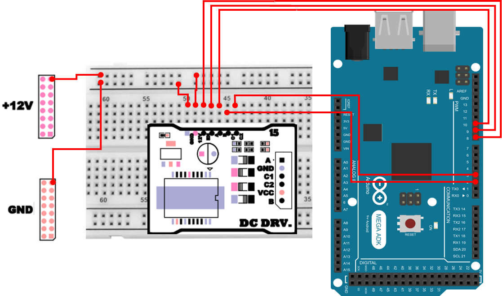

# DC 모터
## DC 모터
DC 모터(Direct Current Motor)는 직류(DC) 전원을 인가하면 회전하는 가장 대표적인 모터입니다. 구조적으로는 고정자(자석) 와 회전자(코일) 로 구성되며, 코일에 전류가 흐를 때 발생하는 자기장과 자석의 자기장이 서로 흡인/반발하면서 회전력이 만들어집니다.

DC 모터의 핵심 특징은 `전압을 주면 돈다`로 요약할 수 있지만, 실제 제어에서는 다음과 같은 점을 꼭 이해해야 합니다.

- 모터는 순간적으로 큰 전류(기동 전류, stall current)를 요구합니다.
  - 그래서 아두이노 핀에 직접 연결하면 보드가 리셋되거나, 핀/레귤레이터가 손상될 수 있습니다.
- 모터는 코일(인덕터)이기 때문에, 꺼지는 순간 역기전력(Back-EMF) 이 발생합니다.
  - 보호 회로(다이오드/드라이버)가 없으면 스파이크 전압으로 회로가 손상될 수 있습니다.
- 속도 제어는 보통 PWM(펄스 폭 변조) 로 합니다.
  - “짧은 시간 동안 빠르게 On/Off”를 반복해 평균 전압(평균 출력) 을 조절하는 방식입니다.

따라서 실습에서는 DC 모터를 바로 연결하는 대신, 보통 모터 드라이버(트랜지스터 회로 또는 H-브리지 드라이버) 를 사용하여 아두이노가 안전하게 모터를 제어하도록 구성합니다.

### DC 모터 특징
- 기동 토크가 크며 정지 상태에서 쉽게 회전할 수 있습니다.
  - 기동 토크가 크게 나올 수 있지만, 동시에 드라이버/전원 설계가 약하면 그 순간 전압이 떨어져(전압 강하) 시스템이 불안정해질 수 있습니다. 
- 인가 전압과 회전 속도가 직선적으로 비례합니다.
- 입력 전류와 출력 토크가 직선적으로 비례하여 출력 효율이 우수합니다.
- 가격이 저렴하여 범용적으로 사용할 수 있습니다.
- 제어 회로가 단순하여 구현이 용이합니다.
- 단점으로는 브러시(brush)와 정류자(commutator)를 통한 기계식 접점 때문에 스파크 발생, 회전 소음, 수명 단축 문제가 존재합니다.

### DC 모터 구조 
DC 모터는 크게 전기자(Armature), 영구자석(Permanent Magnet), 브러시(Brush), 정류자(Commutator), 베어링, 모터 케이스 등으로 구성됩니다.

- 브러시(Brush) : 전기자에 전류를 공급하는 접점 장치
- 정류자(Commutator) : 권선에 전류를 순차적으로 공급하는 전환 장치
- 전기자(Armature) : 회전력을 발생시키는 전자석이며, 회전체를 구성
- 베어링(Bearing) : 회전축을 지지하며, 볼 베어링이나 오일리스 메탈 사용
- 영구자석(Permanent Magnet) : 전기자 권선에 자력을 제공하여 회전력을 발생
- 기타 부품 : 케이스, 앞·뒤 커버 등 모터의 구조를 보호 및 지지

### 제어 방법
#### 트랜지스터 구동 (에미터 부하)
- 트랜지스터를 On/Off 하여 모터를 구동하는 방식입니다. 자동 부귀환으로 안정적인 동작이 가능하지만, 트랜지스터가 완전히 포화되지 못해 전압 손실이 크다는 단점이 있습니다.

#### 트랜지스터 구동 (컬렉터 부하)
- 트랜지스터 컬렉터에 모터를 연결하는 방식으로, 포화 영역에서 동작 가능하여 전압 손실이 작고 드라이브 능력이 큽니다. 일반적으로 가장 널리 사용됩니다.

#### 역기전력 처리
- 트랜지스터가 Off 되었을 때, 모터 코일에 저장된 에너지가 역기전력으로 발생하여 트랜지스터를 손상시킬 수 있습니다. 이를 방지하기 위해 다이오드(플라이휠 다이오드)를 병렬 연결하여 잔류 에너지를 소모합니다.

#### H-브리지 제어
- 모터의 정·역회전 제어를 위해 4개의 트랜지스터(Q1~Q4)를 H 형태로 배치한 회로입니다.
    - Q1, Q4 On → 정회전
    - Q2, Q3 On → 역회전
    - Q3, Q4 On → 브레이크

#### 속도 제어 방법
- 아날로그 방식
    - 트랜지스터를 전압 Dropper로 사용하여 모터에 가해지는 전압을 조절합니다. 회로가 단순하나, 전력 손실이 크고 발열이 심합니다.
- PWM 제어 (Pulse Width Modulation)
    - 펄스폭 변조 방식을 이용하여 On/Off 듀티비를 조절함으로써 평균 전압을 제어합니다. 전력 효율이 높고 발열이 적어 소형 및 중형 모터 제어에 널리 활용됩니다.

아날로그 방식은 트랜지스터가 중간 상태로 오래 머물면서 열을 많이 내지만, PWM은 대부분 ON/OFF 상태로 스위칭하기 때문에 (드라이버가 적절하다는 전제에서) 손실이 상대적으로 적습니다.


## DC 모터 연결 
| Pin | 연결 대상 | 설명 |
|:---:|:---:|:---|
| 12V | +12V | 전원 |
| GND | GND | 접지 |
| 8 | EN | DC Motor Enable |
| 9 | A | DC Motor A |
| 10 | B | DC Motor B |
| 2 | C1 | Encoder A |
| 3 | C2 | Encoder B |



### DC 모터 연결 주의 사항 
USB 만 연결되어도 전원이 정상적으로 인가된것처럼 동작할 수 있습니다. 다만, 정상적인 범주에서 동작이 아니며, 전류 부족으로 인해 "멈춤", "리셋" 등의 현상이 발생할 수 있음으로 전원을 제대로 연결하시고 테스트를 진행하시기 바랍니다. 

## DC 모터 제어 
아래 예제는 모터 드라이버의 EN을 활성화한 뒤, 한 방향으로 속도를 점차 증가시키고, 잠시 멈춘 다음 반대 방향으로 동작시키는 코드입니다.

```cpp
int EN = 8;
int A = 9;   
int B = 10;

void setup() {
  pinMode(A, OUTPUT);
  pinMode(B, OUTPUT);
  pinMode(EN, OUTPUT);
  digitalWrite(EN, HIGH);
}

void loop() {
  analogWrite(B, 0);
  for (int speed = 0; speed <= 255; speed += 5) {
    analogWrite(A, speed); 
    delay(50);
  }
  delay(1000);

  analogWrite(A, 0);
  analogWrite(B, 180);
  delay(2000);

  analogWrite(A, 0);
  analogWrite(B, 0); 
  delay(1000);
}
```

### DC 모터 제어 주요 코드 설명
> **pinMode(A, OUTPUT); / pinMode(B, OUTPUT); / pinMode(EN, OUTPUT);**
> - 드라이버에 입력되는 A/B/EN 핀은 아두이노가 신호를 “내보내는” 역할이므로 OUTPUT으로 설정합니다.

> **digitalWrite(EN, HIGH);**
> - EN은 Enable(활성화) 핀입니다. HIGH로 올려야 드라이버가 모터 구동을 허용합니다.
> - 드라이버에 따라 EN이 PWM 입력 역할을 겸하기도 하지만, 이 예제에서는 항상 활성화(HIGH) 로 두고 A/B에서 PWM을 주는 방식입니다.

> **analogWrite(B, 0);**
> - 먼저 B쪽은 0으로 고정하여 “한쪽 방향 입력은 꺼 둔 상태”를 만들어 둡니다. 이렇게 하면 아래에서 A만 PWM을 변화시킬 때 모터가 한 방향으로 회전합니다.

> **for (int speed = 0; speed <= 255; speed += 5)**
> - PWM 듀티를 0→255까지 조금씩 올리며 속도를 천천히 증가시킵니다.

> **analogWrite(A, 0); analogWrite(B, 180);**
> - A를 0으로 내려 A 방향을 끄고, B에 PWM을 주어 반대 방향 회전을 만듭니다.
> - 180은 최대치(255)보다 낮은 값이므로, 최대 속도보다 약간 낮은 속도로 돌게 됩니다.

> **analogWrite(A, 0); analogWrite(B, 0);**
> - A/B를 모두 0으로 만들면 드라이버 입력이 모두 OFF가 되어 모터가 정지합니다. 실제로는 관성 때문에 바로 멈추지 않고 약간 더 돌아갈 수 있습니다.

## Encoder 
Encoder(엔코더)는 모터의 회전량, 속도, 방향을 검출하기 위한 센서로, DC 모터의 축에 부착되어 모터의 동작을 정밀하게 제어할 수 있도록 도와줍니다.
특히 로봇이나 자동화 시스템에서는 위치 피드백(Position Feedback)을 제공하여 PID 제어, 거리 계산, 속도 제어 등에 활용됩니다.

### Encoder 의 종류 
엔코더는 동작 원리에 따라 다음과 같이 구분됩니다.

| 구분 | 방식 | 특징 | 용도 |
| :--- | :--- | :--- | :--- |
| Incremental Encoder | 증분형 | 일정 간격마다 펄스를 출력하며, 펄스 수로 회전 각도나 속도를 계산 | 일반적인 DC 모터용 |
| Absolute Encoder | 절대형 | 회전 위치마다 고유한 코드값을 출력하여 절대 위치 확인 가능 | 산업용 로봇, 고정밀 장비 |
| Magnetic Encoder | 자기식 | 자석과 홀 센서(Hall Sensor)를 이용해 회전 검출 | 환경 변화에 강하고 내구성 높음 |
| Optical Encoder | 광학식 | LED와 포토센서로 디스크의 투명/불투명 패턴을 감지 | 정확도가 높지만 먼지에 취약   |


## Ecoder 측정 
다음 예제는 DC 모터의 회전에 따른 Encoder 측정값을 시리얼 모니터에 출력하는 코드입니다.
A, B 채널을 인터럽트 방식으로 감지하여 정확한 펄스 카운트를 출력합니다.

```cpp
int EN = 8;
int A = 9;   
int B = 10;
int ENCA = 2;
int ENCB = 3;

volatile long encoderCount = 0;
unsigned long lastEncoderTime = 0;
unsigned long lastChangeTime = 0;
long lastCount = 0;
bool dirFlag = false;
short int speed = 0;

void encoderISRA() {
  if(digitalRead(ENCA)!=digitalRead(ENCB)) {
    encoderCount++;
  }
  else {
    encoderCount--;
  }
}

void setup() {
  pinMode(ENCA, INPUT_PULLUP); 
  pinMode(ENCB, INPUT_PULLUP); 
  attachInterrupt(digitalPinToInterrupt(ENCA), encoderISRA, CHANGE);
  Serial.begin(115200);
  lastEncoderTime = millis();

  pinMode(A, OUTPUT);
  pinMode(B, OUTPUT);
  pinMode(EN, OUTPUT);

  digitalWrite(EN, HIGH);
}

void loop() {
  unsigned long now = millis();
  if(now - lastEncoderTime >= 100) {
    long count = encoderCount;
    long diff = count - lastCount;
    Serial.print("Count:");
    Serial.print(count);
    Serial.print("  dCount:");
    Serial.println(diff);
    lastCount = count;
    lastEncoderTime = now;
  }

  if(now - lastChangeTime >= 1000) {
    if(dirFlag) {
      analogWrite(A, 0);
      analogWrite(B, speed);
    }
    else {
      analogWrite(A, speed);
      analogWrite(B, 0);
    }
    speed+=10;
    Serial.print("Current speed : ");
    Serial.println(speed);
    if (speed >255) {
      speed = 0;
      dirFlag = !dirFlag;
    }
    lastChangeTime = now;
  }
}
```

### 인터럽트 기반 Encoder 측정 주요 코드 설명
> **volatile long encoderCount = 0;**
> - 인터럽트 서비스 루틴(ISR)에서 값이 바뀌는 변수는 volatile로 선언합니다.

> **pinMode(ENCA, INPUT_PULLUP); / pinMode(ENCB, INPUT_PULLUP);**
> - 엔코더 출력 신호는 오픈 컬렉터/노이즈 영향 등으로 입력이 불안정해질 수 있으므로, 내부 풀업으로 기본 상태를 안정화합니다.

> **attachInterrupt(digitalPinToInterrupt(ENCA), encoderISRA, CHANGE);**
> - ENCA 핀의 신호가 변할 때마다(상승/하강 모두) 인터럽트가 발생합니다.
> - 펄스가 빠르게 들어와도 loop()가 바쁘다고 놓치지 않고 카운팅할 수 있습니다.

> **if(digitalRead(ENCA)!=digitalRead(ENCB)) encoderCount++; else encoderCount--;**
> - 엔코더 A/B 채널은 서로 위상이 어긋난 신호(쿼드러처)입니다.
> - A가 변하는 순간 B의 상태를 비교하면 회전 방향을 추정할 수 있습니다.
>   - 같지 않다 → 한 방향(+1)
>   - 같다 → 반대 방향(-1)

> **if(now - lastEncoderTime >= 100)**
> - 100ms마다 현재 카운트와 직전 카운트의 차이(diff)를 출력합니다.
> - diff는 “100ms 동안 들어온 펄스 수”이므로 속도의 변화 추이를 관찰하는 데 유용합니다.

> **speed += 10; / if (speed > 255) speed = 0; dirFlag = !dirFlag;**
> - 1초마다 속도를 점차 올리다가 최대치를 넘으면 0으로 초기화하고 방향을 반전합니다. 즉, 속도 변화와 방향 변화 상황에서 엔코더 카운트가 어떻게 변하는지 한 번에 확인할 수 있습니다. 