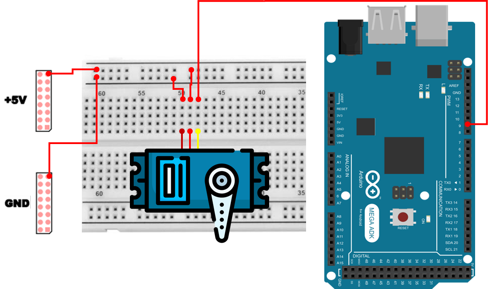

# 서보 모터
## 서보 모터
서보 모터(Servo Motor)는 회전 `속도`보다 `각도(위치)`를 정확하게 맞추는 목적으로 설계된 모터입니다. 일반적인 DC 모터가 전압/PWM을 주면 계속 회전하는 것과 달리, 서보 모터는 내부에 제어 회로(컨트롤러) 와 위치 검출용 가변저항(potentiometer) 이 들어 있어, 외부에서 `목표 각도`를 지시하면 현재 위치를 스스로 측정하여 그 각도로 이동하고 그 위치를 유지하려는 동작을 합니다.

서보 모터는 로봇 관절, RC카 조향, 비행기/드론 조종면, 카메라 짐벌, 자동화 장치 등 정밀한 위치 제어가 필요한 곳에서 매우 널리 쓰입니다.

서보 모터를 실습/제어할 때는 “PWM이면 다 같다”라고 생각하면 오해가 생길 수 있습니다. DC 모터의 PWM은 보통 `속도(평균 전압)`를 바꾸는 목적이지만, 서보 모터의 PWM은 `펄스 폭(시간)` 자체가 각도 명령입니다. 즉, 듀티 비율을 높인다고 속도가 빨라지는 개념이 아니라, `펄스가 1ms냐 1.5ms냐 2ms냐`가 핵심입니다.

### 서보 모터 특징 
- 입력된 제어 신호에 따라 특정 각도만큼 회전할 수 있습니다.
- 일반적으로 0°에서 180° 사이의 각도를 제어할 수 있으며, 일부 모델은 270° 이상 혹은 연속 - 회전(Continuous Servo)도 가능합니다.
- 제어 신호(PWM)에 따라 목표 각도로 자동 정렬되며, 부하가 걸려도 해당 위치를 유지하려는 특성이 있습니다.
- 위치 제어가 정밀하여 로봇 팔, 카메라 짐벌 등에 활용됩니다.
- 다만, 제어 각도가 제한되어 있으며, 고출력 동작 시 발열과 소음이 발생할 수 있습니다.

### 서보 모터 구조 및 제어
서보 모터는 크게 DC 모터, 감속 기어(gear train), 가변저항(potentiometer), 제어 회로로 구성됩니다.

- DC 모터 : 기본 회전력을 발생시키는 구동부
- 감속 기어(gear) : 모터의 빠른 회전을 감속시켜 높은 토크와 제어 가능한 각도로 변환
- 가변저항(potentiometer) : 출력축의 위치를 검출하여 현재 각도를 제어 회로에 전달
- 제어 회로(control circuit) : 입력 PWM 신호와 가변저항의 값을 비교하여 모터를 제어하고 목표 각도로 이동

서보 모터는 PWM(Pulse Width Modulation) 신호를 이용하여 제어됩니다.
- PWM 신호의 주기는 보통 **20ms (50Hz)** 입니다.
- 펄스 폭이 약 1ms일 때 0°, 1.5ms일 때 90° (중앙), **2ms일 때 180°** 에 해당합니다.
- 따라서 PWM의 **펄스 폭(Pulse Width)** 을 조정하면 모터의 각도를 원하는 위치로 제어할 수 있습니다

어떤 서보는 0~180°가 정확히 맞지 않거나, 1ms/2ms가 아닌 0.5ms/2.5ms 범위를 허용하기도 합니다. 실습에서는 안전을 위해 0~180 범위를 기본으로 사용하되, 특정 모델의 데이터시트 기준으로 조정하는 것이 가장 정확합니다.

## 서보 모터 연결 
| Pin | 연결 대상 | 설명 |
|:---:|:---:|:---|
| 5V | Red Cable | 전원 |
| GND | Brown Cable | 접지 |
| 9 | Yellow Cable | Servo Motor PWM |



## 서보 모터 제어 
다음 예제는 Servo 라이브러리를 사용하여 서보 모터를 0°에서 180°까지 천천히 회전시키고, 다시 180°에서 0°으로 되돌리는 코드입니다.

```cpp
#include <Servo.h>

Servo myServo;
int servoPin = 9;

void setup() {
  myServo.attach(servoPin);
}

void loop() {
  for (int angle = 0; angle <= 180; angle += 5) {
    myServo.write(angle);
    delay(50);
  }
  delay(1000);

  for (int angle = 180; angle >= 0; angle -= 5) {
    myServo.write(angle);
    delay(50);
  }
  delay(1000);
}
```

### 서보 모터 제어 주요 코드 설명
> **#include <Servo.h>**
> - 아두이노에서 서보 모터를 쉽게 제어할 수 있도록 제공되는 표준 라이브러리를 포함합니다.
> - 내부적으로는 20ms 주기의 서보 제어 신호를 만들고, 사용자가 write()로 지정한 각도를 적절한 펄스 폭으로 변환해 출력합니다.

> **Servo myServo;**
> - 서보 모터를 제어하기 위한 객체를 생성합니다. 이후 attach(), write() 같은 함수를 이 객체를 통해 호출합니다.

> **int servoPin = 9;**
> - 서보 신호선(노란색/노랑·주황 등)을 연결한 디지털 핀 번호입니다.

> **myServo.attach(servoPin);**
> - 지정한 핀을 서보 제어 신호 출력용으로 설정합니다. 이 순간부터 아두이노가 해당 핀에 서보 신호(20ms 주기)를 출력할 준비를 합니다.

> **for (int angle = 0; angle <= 180; angle += 5)**
> - 각도를 0°에서 180°까지 5°씩 증가시키며 반복합니다. 한 번에 크게 이동시키지 않고 조금씩 이동시키면, 서보가 더 부드럽게 움직이며 동작 확인도 쉬워집니다.

> **myServo.write(angle);**
> - 서보의 목표 각도를 지정합니다. 서보는 내부적으로 현재 위치와 목표 위치를 비교하여, 목표 위치에 도달할 때까지 모터를 구동합니다.

> **delay(50);**
> - 각도 명령을 준 뒤 서보가 실제로 움직일 시간을 확보하기 위한 지연입니다. 지연이 너무 짧으면 서보가 충분히 이동하기 전에 다음 명령이 들어와 움직임이 거칠어지거나, 기대한 위치 변화가 눈에 잘 보이지 않을 수 있습니다.

> **delay(1000);**
> - 끝 위치(0° 또는 180°)에 도달한 뒤 1초간 정지하여, 왕복 동작이 더 명확히 관찰되도록 합니다.