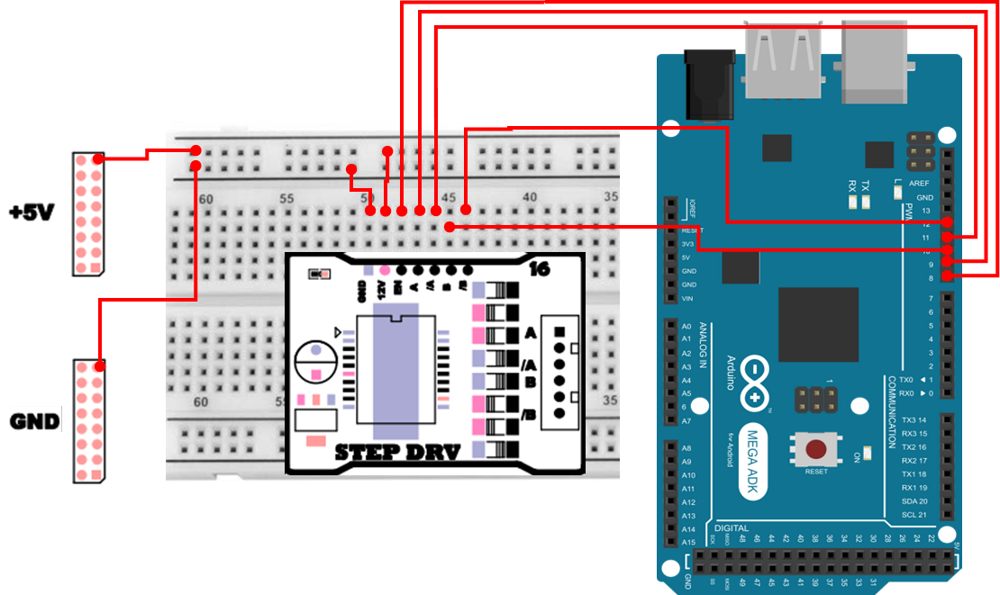

# 스텝 모터
## 스텝 모터
스텝 모터(Step Motor)는 **입력되는 펄스(또는 코일 여자 순서)** 에 따라 **정해진 각도(스텝 각도)** 만큼 회전하는 모터입니다.
일반 DC 모터처럼 “전압을 주면 계속 회전한다”에 가깝기보다는, **몇 번의 스텝을 주었는지(=몇 번 움직였는지)** 로 회전량을 정밀하게 제어할 수 있어서 **위치 제어(Position Control)** 에 특히 적합합니다.

스텝 모터는 개폐기, 프린터, CNC, 로봇 암, 3D 프린터 등에서 널리 사용되며, 제어 신호의 개수와 순서에 따라 회전 각도와 방향이 결정됩니다.
즉, **어떤 핀을 어떤 순서로 HIGH로 만들고, 각 상태를 얼마나 유지할지(딜레이)** 가 곧 속도, 방향, 토크(힘), 진동을 좌우한다고 이해하면 됩니다.

### 스텝 모터가 정밀 위치 제어에 강한 이유 
- 스텝 모터는 보통 1스텝이 1.8°(200스텝=360°) 같은 형태로 고정되어 있습니다.
- 따라서 이론적으로는 200번 스텝을 주면 정확히 1바퀴가 됩니다. 단, 부하, 속도, 전원 조건에 따라 오차가 있을 수 있습니다. 
- 그래서 별도 센서(엔코더)가 없어도, 무리가 없는 범위에서는 “몇 스텝 움직였는지”를 기반으로 위치를 예측할 수 있습니다(이를 오픈 루프(Open-loop) 제어라고 합니다).

다만, “이론적으로 정확하다”와 “항상 절대적으로 정확하다”는 조금 다릅니다.
스텝 모터도 부하가 너무 크거나, 속도를 너무 빠르게 올리면 스텝을 놓치는(미스스텝) 상황이 생길 수 있고, 이 경우 오픈 루프에서는 그 사실을 바로 알기 어렵습니다. 그래서 실습에서는 토크 여유 / 속도(딜레이) / 전원 안정성을 함께 점검하는 습관이 중요합니다.

## 스텝 모터 특징 
- 펄스 신호 입력 수에 비례하여 정확한 회전 각도를 얻을 수 있습니다.
- 개방 루프(open-loop) 방식에서도 정밀한 위치 제어가 가능합니다.
- 구조가 단순하고 내구성이 높습니다.
- 저속에서 높은 토크를 얻을 수 있습니다.
- 단점으로는 고속 회전 시 토크가 급격히 감소하며, 공진 현상(진동)이 발생할 수 있습니다.

## 스텝 모터 구조 및 제어 
스텝 모터는 크게 **스테이터(Stator)** 와 **로터(Rotor)** 로 구성됩니다.
- 스테이터(Stator) : 고정자 코일로, 입력 펄스 신호에 따라 자계가 형성됩니다.
- 로터(Rotor) : 자성체 또는 영구자석으로 이루어진 회전자이며, 스테이터의 자계 방향에 따라 회전합니다.
- 구동 회로 : 코일에 펄스를 인가하는 순서를 제어하여 모터의 회전 각도 및 방향을 제어합니다.

스텝 모터는 펄스 신호의 개수와 순서에 따라 회전이 이루어집니다.
- 스텝 각도(Step Angle) : 모터가 펄스 한 개 입력 시 회전하는 각도
    - 예: 스텝 각도가 1.8°인 경우, 200펄스 입력 시 360° 회전
- 구동 방식
    - 풀 스텝(Full Step) : 한 번에 한 상을 여자하여 큰 각도로 회전
    - 하프 스텝(Half Step) : 상을 교대로 여자하여 풀 스텝의 절반 각도로 회전
    - 마이크로 스텝(Micro Step) : 전류를 세밀하게 제어하여 매우 작은 각도로 회전 → 진동이 줄고 정밀 제어 가능

### 여자(Excitation) 란 ? 
여자한다는 말은 `해당 코일에 전류를 흘려서 전자석(자계)을 만든다`는 의미입니다. 스텝 모터는 이 여자를 A → B → /A → /B 같은 순서로 바꿔가며 로터를 따라오게 만듭니다.

결국 스텝 모터 제어는 **"코일에 전류를 주는 순서표(시퀀스) 를 정확히 반복하는 일이라고"** 볼 수 있습니다.

### 스텝모터 구동 방식 
스텝 모터는 코일(상, Phase)에 전류를 인가하는 방법에 따라 다음과 같은 구동 방식을 갖습니다.

| 구동 방식 | 여자(전류 인가) 형태 | 스텝 각도 | 토크 | 전류 소모 | 특징 |
| :---: | :---: | :---: | :---: | :---: | :--- |
| 1상 구동 (Single Phase Excitation) | 한 번에 한 상만 여자 | 크다 (기본 스텝) | 작음 | 적음 | 전력 효율이 높지만 토크가 낮음 |
| 2상 구동 (Dual Phase Excitation) | 두 상을 동시에 여자 | 같음 (기본 스텝) | 큼 | 많음 | 토크가 크고 안정적이지만 소비 전류가 많음 |
| 1-2상 구동 (Half Step Excitation) | 1상 ↔ 2상 교대로 여자 | 절반(½ 스텝) | 중간 | 중간 | 정밀 제어 가능, 진동이 적고 부드럽게 회전 |

#### 1상 구동 (Single Phase Excitation)
한 번에 하나의 상만 여자되는 방식으로, 전력 소모가 적고 효율이 높지만 토크가 약합니다.
부하가 작은 위치 제어나 저속 구동에 적합합니다.

- A → B → /A → /B → (반복)

#### 2상 구동 (Dual Phase Excitation)
두 개의 상에 전류를 동시에 인가하는 방식으로, 1상 구동보다 토크가 약 1.4배 크며, 회전이 보다 안정적입니다. 단점은 전류 소모가 많고, 발열이 증가한다는 점입니다.

- AB → B /A → /A /B → /B A → (반복)

#### 1-2상 구동 (Half Step Excitation)
1상 구동과 2상 구동을 교대로 수행하는 하이브리드 방식으로, 1회 회전당 스텝 각도가 절반이 되어 정밀 제어가 가능하며, 회전이 부드럽고 진동이 감소합니다.

- A → AB → B → B /A → /A → /A /B → /B → /B A → (반복)

#### 구동 방식 선택 팁
- “일단 잘 돌아가게”는 1상이 단순합니다. 다만 토크는 약합니다.
- “힘이 필요하고 안정적으로”는 2상이 유리합니다.
- “부드럽게 + 정밀하게”는 1-2상(하프 스텝)이 체감이 좋습니다.


## 스텝 모터 연결 
| Pin | 연결 대상 | 설명 |
|:---:|:---:|:---|
| 5V | +5V | 전원 |
| GND | GND | 접지 |
| 8 | EN | Step Motor Enable |
| 9 | A | Step Motor A |
| 10 | B | Step Motor B |
| 11 | /A | Step Motor /A |
| 12 | /B | Step Motor /B |



## 1상 제어 
다음 예제는 1상제어 코드입니다. 각 핀의 출력을 LOW 로 설정하고 한개씩 HIGH 로 변경하며 제어합니다. 이전 상태가 HIGH 였던 핀은 LOW로 변경이 되어야 합니다. 즉, 한 번에 한 코일만 켜고, 다음 코일로 넘어가며 회전을 만들기 때문에 구조가 직관적입니다.

```cpp
const int PIN_EN=8;
const int PIN_A=9;
const int PIN_B=10;
const int PIN_2A=11;
const int PIN_2B=12;

void setup(){
  pinMode(PIN_EN,OUTPUT);
  digitalWrite(PIN_EN, HIGH);
  pinMode(PIN_A,OUTPUT);
  digitalWrite(PIN_A, LOW);
  pinMode(PIN_B, OUTPUT);
  digitalWrite(PIN_B, LOW);
  pinMode(PIN_2A,OUTPUT);
  digitalWrite(PIN_2A, LOW);
  pinMode(PIN_2B,OUTPUT);
  digitalWrite(PIN_2B, LOW);  
}

void loop(){
  digitalWrite(PIN_A,HIGH);
  digitalWrite(PIN_B,LOW);
  digitalWrite(PIN_2A,LOW);
  digitalWrite(PIN_2B,LOW);
  delay(50);
  digitalWrite(PIN_A,LOW);
  digitalWrite(PIN_B,HIGH);
  digitalWrite(PIN_2A,LOW);
  digitalWrite(PIN_2B,LOW);
  delay(50);
  digitalWrite(PIN_A,LOW);
  digitalWrite(PIN_B,LOW);
  digitalWrite(PIN_2A,HIGH);
  digitalWrite(PIN_2B,LOW);
  delay(50);
  digitalWrite(PIN_A,LOW);
  digitalWrite(PIN_B,LOW);
  digitalWrite(PIN_2A,LOW);
  digitalWrite(PIN_2B,HIGH);
  delay(50);
}
```

### 1상 제어 주요 코드 설명
> **const int PIN_A=9; ... PIN_2B=12;**
> - 스텝 모터 구동은 “핀을 어떤 순서로 켜느냐”가 핵심이므로, 핀 번호를 상수로 고정해 두면 코드 가독성과 실수 방지에 도움이 됩니다.

> **pinMode(PIN_EN,OUTPUT); / digitalWrite(PIN_EN, HIGH);**
> - EN(Enable)은 드라이버를 활성화하는 핀입니다. HIGH가 되어야 출력이 동작합니다. 실습 중 모터가 전혀 반응이 없다면, 가장 먼저 EN이 HIGH인지 확인합니다.

> **setup()에서 모든 상을 LOW로 초기화**
> - 시작하자마자 여러 상이 예기치 않게 켜지면 순간적으로 전류가 몰릴 수 있습니다. 따라서 초기 상태에서 A/B/2A/2B를 모두 LOW로 만든 뒤 원하는 시퀀스를 시작하는 것이 안전합니다.

> **loop()에서 한 번에 하나만 HIGH**
> - 1상 구동은 한 순간에 한 코일만 여자합니다. 
> - 예를 들어 첫 단계에서 PIN_A만 HIGH이고 나머지는 LOW이므로, 로터는 A 위치로 끌려가며 한 스텝 진행합니다.

> **delay(50);**
> - 각 스텝 상태를 유지하는 시간입니다. 이 값이 **작아질수록 더 빠르게 스텝을 진행(=회전 속도 증가)** 하지만, 너무 작으면 토크 부족/미스스텝/진동이 증가할 수 있습니다.
> - 처음 실습에서는 delay를 크게(예: 50~100ms) 두고 `순서대로 잘 도는지`를 확인한 뒤 줄이는 방식이 안정적입니다.

## 2상 제어 
이번에는 2상제어 코드입니다. 1상과 다르게 2상은 2개가 HIGH인상태를 유지하도록 구성해야합니다. 이때 역방향으로 돌리고 싶다면 제어 핀 순서를 아래 작성된 역순으로 실행하도록 변경하면됩니다.

```cpp
const int PIN_EN=8;
const int PIN_A=9;
const int PIN_B=10;
const int PIN_2A=11;
const int PIN_2B=12;

void setup(){
  pinMode(PIN_EN,OUTPUT);
  digitalWrite(PIN_EN, HIGH);
  pinMode(PIN_A,OUTPUT);
  digitalWrite(PIN_A, LOW);
  pinMode(PIN_B, OUTPUT);
  digitalWrite(PIN_B, LOW);
  pinMode(PIN_2A,OUTPUT);
  digitalWrite(PIN_2A, LOW);
  pinMode(PIN_2B,OUTPUT);
  digitalWrite(PIN_2B, LOW);  
}

void loop(){
  digitalWrite(PIN_A,HIGH);
  digitalWrite(PIN_B,HIGH);
  digitalWrite(PIN_2A,LOW);
  digitalWrite(PIN_2B,LOW);
  delay(10);
  digitalWrite(PIN_A,LOW);
  digitalWrite(PIN_B,HIGH);
  digitalWrite(PIN_2A,HIGH);
  digitalWrite(PIN_2B,LOW);
  delay(10);
  digitalWrite(PIN_A,LOW);
  digitalWrite(PIN_B,LOW);
  digitalWrite(PIN_2A,HIGH);
  digitalWrite(PIN_2B,HIGH);
  delay(10);
  digitalWrite(PIN_A,HIGH);
  digitalWrite(PIN_B,LOW);
  digitalWrite(PIN_2A,LOW);
  digitalWrite(PIN_2B,HIGH);
  delay(10);
}
```

### 2상 제어 주요 코드 설명
> **1상 제어와 동일한 setup() 초기화 구조**
> - 2상 제어도 본질은 `시퀀스대로 출력`이므로, EN 활성화와 모든 핀 LOW 초기화는 동일하게 중요합니다.

> **한 번에 2개가 HIGH가 핵심**
> - 첫 단계에서 A=HIGH, B=HIGH처럼 두 상을 동시에 여자하여 자계가 더 강해지고, 그 결과 1상보다 토크가 커지는 경향이 있습니다.
> - 대신 전류 소모와 발열이 늘 수 있으므로, 장시간 구동에서는 드라이버/전원 상태를 함께 확인하는 것이 좋습니다.

> **delay(10);**
> - 1상 예제(50ms)보다 delay가 짧아서 더 빠르게 회전합니다.
> - 하지만 2상은 전류 소모가 커질 수 있고, 속도가 빨라질수록 토크가 감소할 수도 있으므로, `빠르게 잘 돈다`만 보지 말고 **미스스텝(힘 부족으로 끊기는 느낌)** 이나 진동/소음도 함께 관찰해야 합니다.