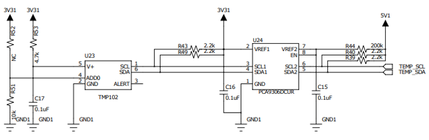

# 온도 센서
## 온도 센서
온도 센서는 주변 환경의 온도(Temperature) 를 전기적인 신호로 변환하여 측정할 수 있는 장치입니다. 온도는 대부분의 물리적·화학적 과정에 직접적인 영향을 주는 중요한 변수이기 때문에, 온도 센서는 산업, 의료, 생활가전, IoT 등 다양한 분야에서 폭넓게 활용됩니다.

대표적인 온도 센서에는 다음과 같은 종류가 있습니다.
- Thermistor (서미스터) : 온도 변화에 따라 저항값이 변하는 센서 (NTC, PTC)
- Thermocouple (열전대) : 금속 간의 열기전력을 이용한 센서 (고온 측정에 적합)
- RTD (저항 온도 센서) : 백금 등의 금속 저항을 이용한 고정밀 온도 센서
- Digital Sensor (디지털 온도 센서) : 온도를 디지털 신호로 직접 제공하는 센서
  -  예: TMP102, LM75, DS18B20 등

이 중 TMP102는 Texas Instruments사에서 개발한 고정밀 I²C 디지털 온도 센서로, 다음과 같은 특징을 가집니다.

| 항목 | 내용 |
| :--- | :--- |
| 측정 범위 | -40°C ~ +125°C |
| 해상도 | 12-bit (0.0625°C 단위) |
| 인터페이스 | I²C (최대 400kHz) |
| 전원 전압 | 1.4V ~ 3.6V |
| 주소 | 0x48 ~ 0x4B (A0 핀 설정에 따라 변경 가능) |
| 특이점 | 저전력 동작, 연속 측정 및 단발 측정 지원 |

## 레지스터 맵
TMP102에는 총 4개의 주요 레지스터가 존재합니다. 각 레지스터는 16비트(2바이트) 크기로, I²C를 통해 읽기/쓰기 가능합니다.

| 주소 | 레지스터명 | R/W | 설명 |
| :--: | :---: | :---: | :--- |
| 0x00 | Temperature Register | R | 온도 데이터 (12-bit) 읽기 전용 |
| 0x01 | Configuration Register | R/W | 측정 모드, 알람 기능, 해상도 설정 등 |
| 0x02 | T_LOW Register | R/W | 알람 발생 하한 온도 설정 |
| 0x03 | T_HIGH Register | R/W | 알람 발생 상한 온도 설정 |



## 온도 센서 연결 
| Pin | 연결 대상 | 설명 |
|:---:|:---:|:---|
| 5V | +5V | 전원 |
| GND | GND | 접지 |
| 20 | SDA | I2C Data |
| 21 | SCL | I2C Clock |

## 온도 센서 제어 
아래 예제는 TMP102 센서로부터 실시간 온도를 읽어 Serial Monitor에 출력하는 프로그램입니다.

```cpp
#include <Wire.h>

#define TMP102_ADDR 0x48

void setup() {
  Wire.begin();
  Serial.begin(115200);
}

float readTemp() {
  Wire.beginTransmission(TMP102_ADDR);
  Wire.write(0x00);
  Wire.endTransmission(false);
  Wire.requestFrom(TMP102_ADDR, 2);

  int msb = Wire.read();
  int lsb = Wire.read();

  int16_t raw = ((msb << 8) | lsb) >> 4;
  if (raw & 0x800) raw |= 0xF000;

  return raw * 0.0625;
}

void loop() {
  float t = readTemp();
  Serial.println(t);
  delay(500);
}

```

