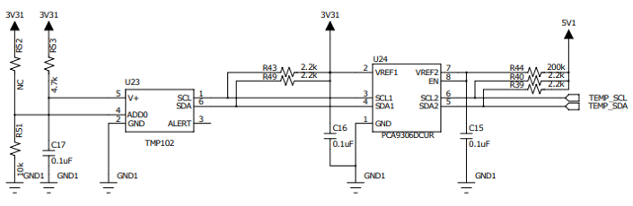
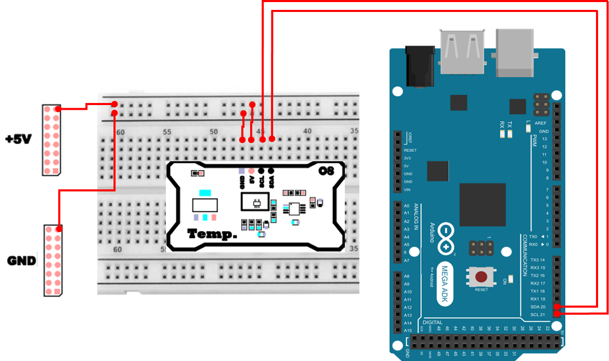

# 온도 센서
## 온도 센서
온도 센서는 주변 환경의 온도(Temperature) 를 전기적인 신호로 변환하여 측정할 수 있는 장치입니다. 온도는 대부분의 물리적·화학적 과정에 직접적인 영향을 주는 중요한 변수이기 때문에, 온도 센서는 산업, 의료, 생활가전, IoT 등 다양한 분야에서 폭넓게 활용됩니다.

우리가 `온도를 측정한다`라고 말할 때는 단순히 숫자 하나를 얻는 것처럼 보이지만, 실제로는 다음과 같은 과정이 숨어 있습니다.

- 센서 내부에서 온도 변화 → 물리량(저항/전압/디지털 데이터 등) 변화가 일어납니다.
- 그 변화가 회로나 통신(I²C 등) 을 통해 마이크로컨트롤러(아두이노)로 전달됩니다.
- 아두이노는 받은 값을 단위(°C)로 환산하여 출력하거나, 특정 조건에서 제어(알람/팬 구동 등)에 사용합니다.

즉, 온도 센서를 다룬다는 것은 `센서 자체`뿐 아니라 연결(배선), 통신 방식, 데이터 해석(환산) 까지를 함께 이해하는 것이라고 보시면 됩니다.

대표적인 온도 센서에는 다음과 같은 종류가 있습니다.
- Thermistor (서미스터) : 온도 변화에 따라 저항값이 변하는 센서 (NTC, PTC)
- Thermocouple (열전대) : 금속 간의 열기전력을 이용한 센서 (고온 측정에 적합)
- RTD (저항 온도 센서) : 백금 등의 금속 저항을 이용한 고정밀 온도 센서
- Digital Sensor (디지털 온도 센서) : 온도를 디지털 신호로 직접 제공하는 센서
  -  예: TMP102, LM75, DS18B20 등

<details>
<summary><b>아날로그 센서 vs 디지털 센서 </b></summary>

- 아날로그 센서(서미스터 등) 는 보통 `저항/전압` 형태로 값이 나오기 때문에, 아두이노에서 ADC로 읽고(analogRead) 다시 온도로 변환하는 계산이 필요합니다. 배선이나 전원 잡음의 영향을 더 받기도 합니다.

- 디지털 센서(TMP102 등) 는 센서 내부에서 이미 측정과 변환을 수행하고, 결과를 I²C 같은 디지털 통신으로 전달합니다.

그래서 실습에서는 `값이 안정적으로 나오고, 배선이 단순하며, 코드가 비교적 명확한` 디지털 센서가 특히 다루기 좋습니다.

</details><br>

이 중 TMP102는 Texas Instruments사에서 개발한 고정밀 I²C 디지털 온도 센서로, 다음과 같은 특징을 가집니다.

| 항목 | 내용 |
| :--- | :--- |
| 측정 범위 | -40°C ~ +125°C |
| 해상도 | 12-bit (0.0625°C 단위) |
| 인터페이스 | I²C (최대 400kHz) |
| 전원 전압 | 1.4V ~ 3.6V |
| 주소 | 0x48 ~ 0x4B (A0 핀 설정에 따라 변경 가능) |
| 특이점 | 저전력 동작, 연속 측정 및 단발 측정 지원 |

- **해상도(0.0625°C)가 의미하는 것**
  - TMP102의 기본 데이터는 1 LSB가 0.0625°C 가 되도록 설계되어 있습니다.
  - 즉, 센서가 내부적으로 만든 `정수 값(raw)`에 0.0625를 곱하면 섭씨 온도가 됩니다.
  - 이런 구조 덕분에, 코드에서 최종 온도를 만들 때 raw * 0.0625 같은 형태가 등장합니다.

## 레지스터 맵
디지털 센서는 대부분 레지스터(기능별 메모리 주소) 구조를 사용합니다.

예를 들어 현재 센서의 값은 0x00, 센서의 설정은 0x01 과 같이 주소가 정해져있고, 아두이노는 I²C로 어느 레지스터를 읽거나 쓸지 주소 정보를 포함하여 센서와 통신합니다. 

TMP102에는 총 4개의 주요 레지스터가 존재합니다. 각 레지스터는 16비트(2바이트) 크기로, I²C를 통해 읽기/쓰기 가능합니다.

| 주소 | 레지스터명 | R/W | 설명 |
| :--: | :---: | :---: | :--- |
| 0x00 | Temperature Register | R | 온도 데이터 (12-bit) 읽기 전용 |
| 0x01 | Configuration Register | R/W | 측정 모드, 알람 기능, 해상도 설정 등 |
| 0x02 | T_LOW Register | R/W | 알람 발생 하한 온도 설정 |
| 0x03 | T_HIGH Register | R/W | 알람 발생 상한 온도 설정 |



## 온도 센서 연결 
| Pin | 연결 대상 | 설명 |
|:---:|:---:|:---|
| 5V | +5V | 전원 |
| GND | GND | 접지 |
| 20 | SDA | I2C Data |
| 21 | SCL | I2C Clock |

> 여기서 온도 센서 모듈은 5V 를 연결하지만 3.3V 가 센서에 공급되도록 온도 센서 모듈에 회로가 구성되어 있습니다.



## 온도 센서 제어 
아래 예제는 TMP102 센서로부터 실시간 온도를 읽어 Serial Monitor에 출력하는 프로그램입니다.

```cpp
#include <Wire.h>

#define TMP102_ADDR 0x48

void setup() {
  Wire.begin();
  Serial.begin(115200);
}

float readTemp() {
  Wire.beginTransmission(TMP102_ADDR);
  Wire.write(0x00);
  Wire.endTransmission(false);
  Wire.requestFrom(TMP102_ADDR, 2);

  int msb = Wire.read();
  int lsb = Wire.read();

  int16_t raw = ((msb << 8) | lsb) >> 4;
  if (raw & 0x800) raw |= 0xF000;

  return raw * 0.0625;
}

void loop() {
  float t = readTemp();
  Serial.println(t);
  delay(500);
}
```

### 온도 센서 주요 코드 설명
> **#include <Wire.h>**
> - I²C 통신을 사용하기 위한 라이브러리입니다. TMP102는 I²C 센서이므로, 이 라이브러리가 없으면 Wire.begin() 같은 함수를 사용할 수 없습니다.

> **#define TMP102_ADDR 0x48**
> - TMP102의 기본 I²C 주소를 의미합니다. I²C에서는 여러 장치가 같은 버스(SDA/SCL)를 공유하므로, 각 장치를 구분하기 위해 주소가 필요합니다.
- 만약 다른 주소(예: 0x49, 0x4A, 0x4B)로 설정된 모듈을 사용한다면, 이 값을 센서 설정에 맞게 변경해야 정상 통신됩니다.

> **Wire.begin();**
> - 아두이노를 I²C 마스터로 초기화합니다.이 줄이 없으면 이후의 beginTransmission, requestFrom 등이 정상 동작하지 않습니다.

> **Serial.begin(115200);**
> - Serial Monitor에 온도 값을 출력하기 위한 통신 속도 설정입니다.보드레이트는 Serial Monitor 설정과 반드시 동일해야 합니다.

> **Wire.beginTransmission(TMP102_ADDR);**
> - “이제부터 TMP102(0x48)과 통신을 시작하겠습니다”라는 의미입니다. I²C에서는 보낼 데이터를 내부 버퍼에 차곡차곡 쌓아두었다가 endTransmission()에서 실제로 전송합니다.

> **Wire.write(0x00);**
> - TMP102의 레지스터 중 0x00(Temperature Register) 를 읽겠다고 지정하는 단계입니다.
> - 디지털 센서는 “그냥 읽기”가 아니라, 보통 “어느 레지스터를 읽을지 먼저 선택”하는 과정이 필요합니다.

> **Wire.endTransmission(false);**
> - 여기서 false는 STOP 신호를 보내지 않고 통신을 이어가겠다는 의미입니다(Repeated Start).
> - 센서에게 `레지스터 0x00을 가리킨 상태를 유지한 채` 바로 이어서 데이터를 읽어오기 위해 자주 사용하는 패턴입니다.

> **Wire.requestFrom(TMP102_ADDR, 2);**
> - TMP102로부터 2바이트를 요청합니다. TMP102의 온도 레지스터는 16비트(2바이트)이므로 2로 지정하는 것이 핵심입니다.

> **int msb = Wire.read(); / int lsb = Wire.read();**
> - 센서가 보내온 상위 바이트(MSB), 하위 바이트(LSB)를 순서대로 읽습니다. 이 값 두 개를 합쳐야 하나의 온도 데이터가 됩니다.

> **int16_t raw = ((msb << 8) | lsb) >> 4;**
> - (msb << 8) | lsb : 2바이트를 합쳐 16비트 값으로 만듭니다. TMP102의 온도 데이터가 “상위 쪽 비트에 배치”되는 포맷이기 때문에, 실제 온도에 해당하는 12비트를 맞추기 위해 4비트 이동합니다.

> **if (raw & 0x800) raw |= 0xF000;**
> - TMP102는 음수 온도도 표현합니다. 이때 raw 값은 부호 비트(음수 표시) 가 포함될 수 있습니다.
> - raw & 0x800 : 12비트 기준에서 최상위 비트가 1인지 확인(음수 여부 판단)합니다.
> - 음수라면 raw |= 0xF000 로 상위 비트를 1로 채워 정상적인 16비트 음수(signed) 형태가 되도록 “부호 확장(sign extension)”을 해줍니다.
> - 이 처리가 없으면 영하 온도에서 값이 이상하게 크게 나오거나, 전혀 다른 값으로 해석될 수 있습니다.

> **return raw * 0.0625;**
> - TMP102의 1 LSB가 0.0625°C이므로, raw에 0.0625를 곱하면 섭씨 온도가 됩니다. 즉, raw는 “센서가 만든 정수 온도값”, 반환값은 “사람이 읽는 섭씨(°C) 값”이라고 이해하면 됩니다.

> **delay(500);**
> - 0.5초마다 한 번씩 온도를 출력합니다.
