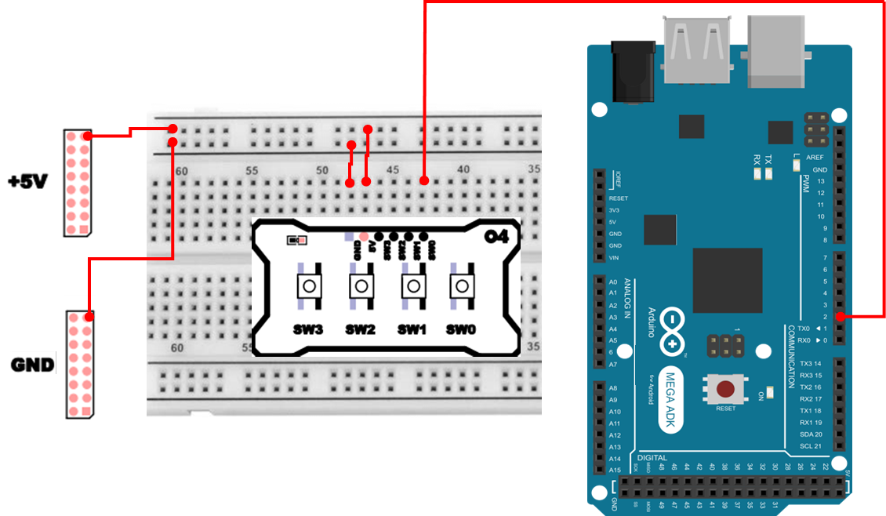
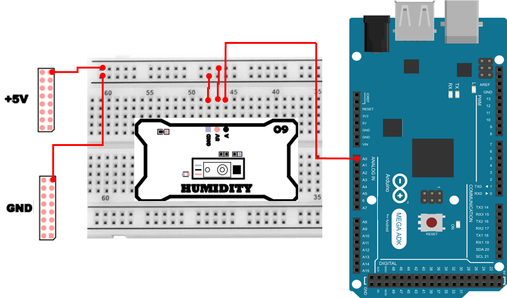
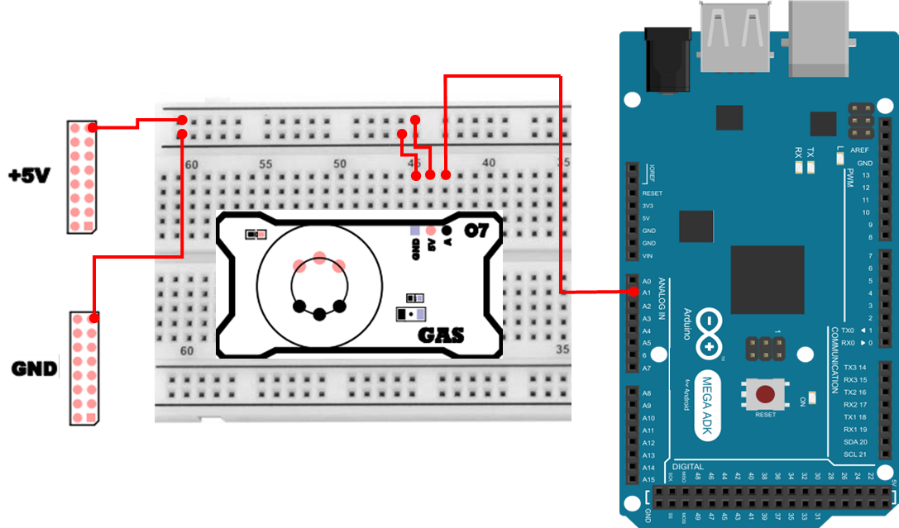
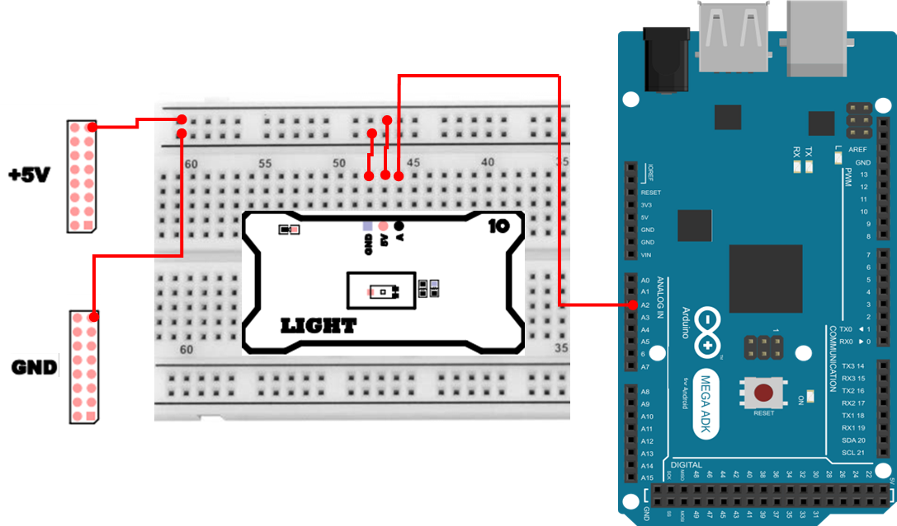

# 환경 모니터링 시스템 구현 
환경 모니터링은 주변 환경의 상태(온도, 습도, 가스, 조도 등)를 계속 측정하고, 그 값을 기준과 비교하여 이상 여부를 판단한 뒤, 사람이 빠르게 알아볼 수 있도록 화면이나 표시 장치로 상태를 알려주는 방식입니다.
환경 요소 중에서도 온도, 습도, 가스, 조도는 인간의 쾌적한 생활뿐 아니라 설비의 안정성과 직결되는 핵심 지표입니다. 

예를 들어, 

- 온도와 습도가 적절하지 않으면 전자기기 동작이 불안정해지거나, 저장 물품의 품질이 저하될 수 있습니다.
- 가스 농도가 비정상적으로 증가하면 누출로 이어질 수 있고, 화재·폭발 같은 위험으로 번질 수 있습니다.
- 조도가 낮아지면 작업 환경의 가시성이 떨어지고, 반대로 불필요한 조명 사용이 늘면 에너지 소비가 커질 수 있습니다.

여기서는 네 가지 센서를 결합해 실시간으로 환경 데이터를 측정하고, 직관적인 방식으로 표시·경보하는 시스템을 구축하였습니다. 단순히 센서를 읽는 수준을 넘어서, 각 센서의 특성과 데이터를 활용한 임계치 판정을 통해 위험 상황을 감지하고 사용자에게 즉시 알림을 주는 기능이 포함됩니다. 

궁극적으로 이 프로젝트는 센서 제어와 데이터 처리, 사용자 인터페이스를 모두 아우르는 통합형 환경 모니터링 시스템의 기초 모델을 제시하는 것이며, 이를 통해 개별 센서 제어를 넘어선 시스템적 설계를 실습합니다. 또한 로컬 수준의 경보 체계에서 더 나아가 IoT·스마트홈·스마트팩토리 분야로 확장 가능한 기반을 마련하는 데 의미가 있습니다.

## 구성 요소별 역할
### 온도 센서
온도 센서는 주변 온도를 측정하여 환경 상태를 파악합니다. 온도는 전자기기 동작 안정성, 보관 품질, 작업 공간 쾌적성과 연결되기 때문에 자주 모니터링 대상이 됩니다. 이 시스템에서는 I²C 방식의 온도 센서(TMP102)를 사용하여 온도 값을 읽고, 기준 온도 이상인지 판단하여 알람 상태를 표시합니다.

### 습도 센서
습도 센서는 공기 중 수분의 비율(상대습도, %RH)을 측정합니다. 습도는 곰팡이, 부식, 정전기, 공정 품질 등과 연관될 수 있어 모니터링이 유용합니다. 이 시스템에서는 아날로그 습도 센서(HIH4030)를 사용하며, ADC 값(0~1023)을 전압으로 환산한 뒤 습도(%)로 변환하여 표시합니다. 또한 습도가 일정 기준을 넘으면 알람 상태로 표시합니다.

### 가스 센서
가스 센서는 가연성 또는 유해 가스의 농도 변화를 감지합니다. 이 시스템에서는 MQ-5 센서의 아날로그 출력값을 읽고, 기준값 이상인지 판단하여 알람 상태를 표시합니다. 가스 값은 주변 환경이나 센서 상태에 따라 흔들릴 수 있으므로, 기준값 근처에서 알람이 빈번하게 켜졌다 꺼지지 않도록 판정 로직을 안정적으로 구성합니다.

### 조도 센서
조도 센서는 빛의 세기를 측정합니다. 이 시스템에서는 TEMT6000 조도 센서의 아날로그 출력값을 읽고, 조도가 낮아질 때 위험 상태로 보는 방식(임계치 이하일 때 알람)으로 구성합니다. 따라서 조도는 “값이 낮을수록 경보”처럼 역방향 판정을 적용합니다.

### TextLCD
TextLCD는 측정값과 상태를 사용자에게 보여주는 표시 장치입니다. 이 시스템에서는 한 화면에 모든 센서를 동시에 나열하기보다, 화면(View)을 나누어 온도/습도(TH), **가스/조도(GL)** 를 번갈아 표시합니다. 화면에는 수치뿐 아니라 현재 모드(AUTO/MANUAL)와 알람 상태(T/H 또는 G/L)를 함께 표시하여, 값과 상태를 동시에 확인할 수 있도록 구성합니다.

### LED
LED는 상태를 즉시 시각적으로 보여주는 인디케이터입니다. 이 시스템에서는 LED 8개를 4개씩 두 그룹으로 나누어, 화면(View)에 따라 표시 대상을 바꿉니다.

- TH 화면에서는 온도(왼쪽 4개) + 습도(오른쪽 4개)
- GL 화면에서는 가스(왼쪽 4개) + 조도(오른쪽 4개)

각 그룹의 4개 LED는 센서 값을 **레벨(0~3)** 로 표시하고, 알람 상태일 때는 마지막 LED가 점멸하여 경보를 강조합니다.

## 프로젝트 개요 
이 시스템은 온도, 습도, 가스, 조도 센서를 하나의 마이크로컨트롤러에서 동시에 다룹니다. 각 센서에서 측정한 값을 LCD에 표시하고, LED로 레벨/알람 상태를 표현합니다. 버튼 입력은 인터럽트 기반으로 받아 **모드 전환(AUTO/MANUAL)** 과 **화면 전환(TH/GL)** 을 수행합니다.

## 동작 구조 
시스템은 크게 `측정(Measurement)` – `판정(Decision)` – `표시(Display)` 세 단계로 동작합니다.

1. 센서 데이터 수집
    - 온도 센서: I²C 통신을 통해 온도를 읽음 (12bit 데이터 → 섭씨 변환)
    - 습도, 가스, 조도 센서: ADC 입력으로 0~1023 값을 읽어 기준값과 비교 
    - 각 센서의 측정 주기는 약 120ms, 자동 모드에서는 4초 주기로 화면 전환

2. 임계값 판정 (Hysteresis 적용)
    - 각 센서는 상·하한 임계값(ON/OFF)을 가지고 있으며, 일정 범위 내에서 토글되지 않도록 히스테리시스(hysteresis) 처리
    - 임계값 초과 시 해당 알람 플래그(aTemp, aHumi, aGas, aLux)가 활성화
    - 예를 들어 온도 알람을 단일 임계값 30°C로만 판단하면 29.9 ~ 30.1처럼 흔들릴 때 알람이 계속 토글될 수 있습니다. 따라서 30°C 이상이면 ON, 29°C 이하로 내려가면 OFF 처럼 기준을 분리하여 상태를 안정적으로 유지하도록합니다. 

### 동작 모드 및 버튼 제어 
버튼(D2)은 인터럽트 방식으로 처리합니다. 버튼이 눌리고 떼어지는 시간을 측정해 짧게/길게 누름을 구분합니다.

| 버튼 조작 | 기능 | 설명 |
| :--- | :--- | :--- |
| 짧게 누름 (0.03~1.5초) | 화면 전환(View Change) | 수동 모드일 때만 온습도 ↔ 가스조도 화면 전환 |
| 길게 누름 (1.5초 이상) | 모드 전환(Mode Change) | 자동 모드(AUTO) ↔ 수동 모드(MANUAL) 전환 |

### LED 인디케이터 
8개의 LED는 두 개의 센서 쌍을 표현합니다. 각 4개의 LED는 해당 센서의 상태 레벨(0~3단계) 을 시각화하며, 임계 초과 시 마지막 LED가 점멸(blink) 형태로 알람을 표시합니다.

| LED 그룹 | 대응 센서 | 표시 의미 |
| :--- | :--- | :--- |
| L0~L3 | 온도/가스 | 값이 커질수록 LED 점등 수 증가 |
| L4~L7 | 습도/조도 | 값이 커질수록(또는 조도는 낮을수록) LED 점등 수 증가 |
| 마지막 칸(3번,7번) | - | 알람 발생 시 점멸 (blink) 표시 |

## 하드웨어 연결 
<details>
<summary><b>TextLCD 연결 정보 [Click]</b></summary>

| Pin | 연결 대상 | 설명 |
|:---:|:---:|:---|
| 5V | +5V | 전원 |
| GND | GND | 접지 |
| 20 | SDA | I2C Data |
| 21 | SCL | I2C Clock |


</details>

<details>
<summary><b>LED 연결 정보 [Click]</b></summary>

| Pin | 연결 대상 | 설명 |
|:---:|:---:|:---|
| GND | GND | 접지 |
| 4 | D0 | LED 0 |
| 5 | D1 | LED 1 |
| 6 | D2 | LED 2 |
| 7 | D3 | LED 3 |
| 8 | D4 | LED 4 |
| 9 | D5 | LED 5 |
| 10 | D6 | LED 6 |
| 11 | D7 | LED 7 |


</details>

<details>
<summary><b>PushSwitch 연결 정보 [Click]</b></summary>

| Pin | 연결 대상 | 설명 |
|:---:|:---:|:---|
| 5V | +5V | 전원 |
| GND | GND | 접지 |
| 2 | SW0 | Push Switch 0 |



</details>

<details>
<summary><b>온도 센서 연결 정보[Click]</b></summary>

| Pin | 연결 대상 | 설명 |
|:---:|:---:|:---|
| 5V | +5V | 전원 |
| GND | GND | 접지 |
| 20 | SDA | I2C Data |
| 21 | SCL | I2C Clock |


</details>

<details>
<summary><b>습도 센서 연결 정보 [Click]</b></summary>

| Pin | 연결 대상 | 설명 |
|:---:|:---:|:---|
| 5V | +5V | 전원 |
| GND | GND | 접지 |
| A0 | A | Humidity Sensor |



</details>

<details>
<summary><b>가스 센서 연결 정보 [Click]</b></summary>

| Pin | 연결 대상 | 설명 |
|:---:|:---:|:---|
| 5V | +5V | 전원 |
| GND | GND | 접지 |
| A1 | A | GAS Sensor |



</details>

<details>
<summary><b>조도 센서 연결 정보 [Click]</b></summary>

| Pin | 연결 대상 | 설명 |
|:---:|:---:|:---|
| 5V | +5V | 전원 |
| GND | GND | 접지 |
| A2 | A | Light Sensor |



</details>

## 프로그램 작성 
```cpp
#include <Wire.h>
#include <LiquidCrystal_I2C.h>
#include <stdarg.h>

#define TMP102_ADDR 0x48
#define LCD_ADDR 0x3F
#define LCD_COLS 20
#define LCD_ROWS 4

const int PIN_BTN = 2;
const int LEDS[8] = {4,5,6,7,8,9,10,11};
const int PIN_A_HUMI = A0;
const int PIN_A_GAS = A1;
const int PIN_A_LUX = A2;

LiquidCrystal_I2C lcd(LCD_ADDR, LCD_COLS, LCD_ROWS);

enum View { VIEW_TH=0, VIEW_GL=1, VIEW_COUNT };
enum Mode { MODE_AUTO=0, MODE_MANUAL=1 };
Mode mode = MODE_AUTO;
View view = VIEW_TH;

unsigned long lastCycleMs = 0;
const unsigned long cyclePeriodMs = 4000;
unsigned long blinkMs = 0;
bool blinkOn = false;

const float TEMP_ON = 30.0f, TEMP_OFF = 29.0f;
const float HUMI_ON = 80.0f, HUMI_OFF = 75.0f;
const int GAS_ON = 500, GAS_OFF = 450;
const int LUX_ON = 20, LUX_OFF = 25;

bool aTemp=false, aHumi=false, aGas=false, aLux=false;

volatile bool btnIsDown = false;
volatile uint32_t btnLastChangeUs = 0;
volatile uint32_t btnPressStartUs = 0;
volatile uint8_t  btnEvent = 0;

const uint32_t DEBOUNCE_US = 20000;
const uint32_t LONGPRESS_MS = 1500;
const uint32_t SHORT_MIN_MS = 30;

static inline void lcdPrintLine(uint8_t row, const char* s) {
  lcd.setCursor(0, row);
  char buf[21];
  uint8_t i=0;
  while (s[i] && i<20) { buf[i] = s[i]; i++; }
  while (i<20) { buf[i++] = ' '; }
  buf[20] = '\0';
  lcd.print(buf);
}

#ifndef IRAM_ATTR
#define IRAM_ATTR
#endif

void IRAM_ATTR onBtnChange() {
  uint32_t now = micros();
  if (now - btnLastChangeUs < DEBOUNCE_US) 
    return;
  btnLastChangeUs = now;

  int level = digitalRead(PIN_BTN);
  if (level == LOW && !btnIsDown) {
    btnIsDown = true;
    btnPressStartUs = now;
  } else if (level == HIGH && btnIsDown) {
    btnIsDown = false;
    uint32_t dur_ms = (now - btnPressStartUs) / 1000UL;
    if (dur_ms >= LONGPRESS_MS)      
      btnEvent = 2;
    else if (dur_ms > SHORT_MIN_MS)  
      btnEvent = 1;
  }
}

void processButtonEvents() {
  uint8_t ev;
  noInterrupts(); 
  ev = btnEvent; btnEvent = 0; 
  interrupts();
  if (ev == 0) 
    return;

  if (ev == 2) {
    mode = (mode==MODE_AUTO)? MODE_MANUAL : MODE_AUTO;
  } else if (ev == 1) {
    if (mode == MODE_MANUAL) 
      view = (View)((view + 1) % VIEW_COUNT);
  }
}

float readTMP102C() {
  Wire.beginTransmission(TMP102_ADDR);
  Wire.write(0x00);
  Wire.endTransmission(false);
  Wire.requestFrom(TMP102_ADDR, 2);
  if (Wire.available() < 2) 
    return NAN;
  uint8_t msb = Wire.read();
  uint8_t lsb = Wire.read();
  int16_t raw = ((msb << 8) | lsb) >> 4;
  if (raw & 0x800) 
    raw |= 0xF000;
  return raw * 0.0625f;
}

float readHIH4030() {
  int raw = analogRead(PIN_A_HUMI);
  float v = raw * (5.0f/1023.0f);
  float ratio = v / 5.0f;
  float rh = (ratio - 0.16f) / 0.0062f;
  if (rh < 0) rh = 0; if (rh > 100) rh = 100;
  return rh;
}

int readMQ5() { 
  return analogRead(PIN_A_GAS); 
}

int readTEMT6000() { 
  return analogRead(PIN_A_LUX); 
}

void evalAlarms(float tC, float rh, int gas, int lux) {
  if (!aTemp && tC > TEMP_ON) 
    aTemp = true;
  else if (aTemp && tC < TEMP_OFF) 
    aTemp = false;

  if (!aHumi && rh > HUMI_ON) 
    aHumi = true;
  else if (aHumi && rh < HUMI_OFF) 
    aHumi = false;

  if (!aGas && gas > GAS_ON) 
    aGas = true;
  else if (aGas && gas < GAS_OFF) 
    aGas = false;

  if (!aLux && lux < LUX_ON) 
    aLux = true;
  else if (aLux && lux > LUX_OFF) 
    aLux = false;
}

uint8_t levelFromBand(float val, float off, float on, bool invert) {
  if (!invert) {
    if (val <= off) return 0;
    if (val >= on)  return 4;
    float p = (val - off) / (on - off);
    uint8_t lvl = (uint8_t)(p * 4.0f + 0.001f);
    return (lvl>3)?3:lvl;
  } else {
    if (val >= off) return 0;
    if (val <= on)  return 4;
    float p = (off - val) / (off - on);
    uint8_t lvl = (uint8_t)(p * 4.0f + 0.001f);
    return (lvl>3)?3:lvl;
  }
}

void drawBarGroup(uint8_t groupStartIndex, uint8_t level, bool alarm, bool blinkOn) {
  for (int i=0;i<4;i++) {
    bool on = (i < level);
    if (alarm) {
      if (i < 3) on = true;
      else on = blinkOn;
    }
    digitalWrite(LEDS[groupStartIndex + i], on ? HIGH : LOW);
  }
}

void updateLEDs(uint8_t lvlLeft, bool alarmLeft, uint8_t lvlRight, bool alarmRight) {
  unsigned long now = millis();
  if (now - blinkMs >= 250) { 
    blinkMs = now; 
    blinkOn = !blinkOn; 
  }
  drawBarGroup(0, lvlLeft,  alarmLeft,  blinkOn);
  drawBarGroup(4, lvlRight, alarmRight, blinkOn);
}

void renderTH(float tC, float rh) {
  char line[32];
  lcd.setCursor(0, 0); lcd.print("TEMP :   "); lcd.print(tC,2); lcd.print("C");
  lcd.setCursor(0, 1); lcd.print("HUMI :   "); lcd.print(rh,2); lcd.print("%");
  snprintf(line, sizeof(line), "MODE : %s", (mode==MODE_AUTO?"AUTO":"MANUAL"));
  lcdPrintLine(2, line);
  snprintf(line, sizeof(line), "ALRM : T%c  H%c",(aTemp?'*':'-'), (aHumi?'*':'-'));
  lcdPrintLine(3, line);
}

void renderGL(int gas, int lux) {
  char line[32];
  snprintf(line, sizeof(line), "GAS  : %7d", gas);
  lcdPrintLine(0, line);
  snprintf(line, sizeof(line), "LUX  : %7d", lux);
  lcdPrintLine(1, line);
  snprintf(line, sizeof(line), "MODE : %s", (mode==MODE_AUTO?"AUTO":"MANUAL"));
  lcdPrintLine(2, line);
  snprintf(line, sizeof(line), "ALRM : G%c  L%c",(aGas?'*':'-'), (aLux?'*':'-'));
  lcdPrintLine(3, line);
}

void setup() {
  Wire.begin();
  Serial.begin(115200);

  for (int i=0;i<8;i++) { 
    pinMode(LEDS[i], OUTPUT); 
    digitalWrite(LEDS[i], LOW); 
  }

  pinMode(PIN_BTN, INPUT_PULLUP);
  attachInterrupt(digitalPinToInterrupt(PIN_BTN), onBtnChange, CHANGE);

  lcd.init();
  lcd.backlight();
  lcdPrintLine(0, "Env Monitor Init...");
  lcdPrintLine(1, "TMP/HUMI/GAS/LUX");
  lcdPrintLine(2, "Mode:AUTO  View:TH");
  lcdPrintLine(3, "Ready");
  delay(1000);
  lcd.clear();
}

void loop() {
  processButtonEvents();
  unsigned long now = millis();
  if (mode==MODE_AUTO && now - lastCycleMs >= cyclePeriodMs) {
    view = (View)((view + 1) % VIEW_COUNT);
    lastCycleMs = now;
  }

  float tC = readTMP102C();
  float rh = readHIH4030();
  int gas = readMQ5();
  int lux = readTEMT6000();
  evalAlarms(tC, rh, gas, lux);

  uint8_t lvlT = levelFromBand(tC, TEMP_OFF, TEMP_ON, false);
  uint8_t lvlH = levelFromBand(rh, HUMI_OFF, HUMI_ON, false);
  uint8_t lvlG = levelFromBand(gas, GAS_OFF, GAS_ON, false);
  uint8_t lvlL = levelFromBand(lux, LUX_OFF, LUX_ON, true);

  if (view == VIEW_TH) {
    updateLEDs(lvlT, aTemp, lvlH, aHumi);
    renderTH(tC, rh);
  } else {
    updateLEDs(lvlG, aGas, lvlL, aLux);
    renderGL(gas, lux);
  }
  delay(120);
}
```

### 환경 모니터링 시스템 주요 코드 설명
> **#include <Wire.h>**
> - I²C 통신을 사용하기 위한 라이브러리입니다. TMP102(온도 센서)와 I²C LCD가 같은 SDA/SCL 라인을 공유하므로 필수입니다.

> **#include <LiquidCrystal_I2C.h>**
> - I²C 방식 LCD를 제어하기 위한 라이브러리입니다. lcd.init(), lcd.setCursor(), lcd.print() 같은 함수가 이 라이브러리에서 제공됩니다.

> **#define TMP102_ADDR 0x48 / #define LCD_ADDR 0x3F**
> - I²C 장치 주소입니다. 같은 버스에 여러 장치가 연결되므로 주소로 장치를 구분합니다. LCD 주소는 모듈에 따라 0x27 등으로 달라질 수 있습니다.

> **const int PIN_BTN = 2; / pinMode(PIN_BTN, INPUT_PULLUP);**
> - 버튼 입력 핀을 D2로 사용합니다. INPUT_PULLUP을 사용하면 기본 상태는 HIGH이고, 버튼을 누르면 LOW가 됩니다(“눌림 = LOW”).

> **attachInterrupt(digitalPinToInterrupt(PIN_BTN), onBtnChange, CHANGE);**
> - 버튼 핀 상태가 바뀔 때마다 ISR(onBtnChange)이 호출됩니다. 루프에서 LCD 출력이나 센서 측정이 진행 중이어도 버튼 입력 변화를 놓치지 않게 됩니다.

> **volatile 변수(btnIsDown, btnLastChangeUs, btnEvent 등)**
> - ISR과 loop가 같은 변수를 공유하므로 volatile로 선언합니다.
> - ISR에서 값이 바뀐 것을 loop가 정상적으로 읽을 수 있도록 합니다.

> **DEBOUNCE_US = 20000**
> - 버튼 채터링(접점 튐)을 줄이기 위한 시간 기준입니다. 마지막 변화 이후 20ms 이내의 변화는 무시합니다.

> **LONGPRESS_MS = 1500 / SHORT_MIN_MS = 30**
> - 버튼을 짧게/길게 누름으로 구분하는 기준입니다. 30ms 이하의 입력은 잡음 가능성이 있어 제외하고, 1.5초 이상이면 길게 누른 것으로 처리합니다.

> **onBtnChange()**
> - 버튼이 눌렸을 때(LOW) 시작 시간을 기록하고, 버튼이 떼어졌을 때(HIGH) 눌린 시간을 계산합니다.
> - 눌린 시간에 따라 이벤트를 btnEvent에 저장합니다.
>   - btnEvent = 1 : 짧게 누름
>   - btnEvent = 2 : 길게 누름

> **processButtonEvents()**
> - ISR에서 저장한 이벤트 값을 loop에서 꺼내 실제 동작(모드 전환/화면 전환)을 수행합니다.
> - noInterrupts()/interrupts()로 잠깐 보호하여 이벤트 값을 읽는 도중 ISR이 끼어들어 값이 꼬이는 것을 막습니다.
> - 길게 누름(ev==2): AUTO ↔ MANUAL 전환
> - 짧게 누름(ev==1): MANUAL일 때만 TH ↔ GL 화면 전환

> **readTMP102C()**
> - TMP102의 온도 레지스터(0x00)를 2바이트 읽고 섭씨로 변환합니다.
> - Wire.endTransmission(false)는 STOP을 보내지 않고 이어서 읽기 요청을 하기 위한 반복 시작(Repeated Start) 패턴입니다.
> - ((msb<<8)|lsb)>>4는 TMP102 데이터 포맷에 맞게 12비트를 정렬하는 과정입니다.
> - 음수 온도 처리를 위해 부호 확장(sign extension)을 적용합니다.

> **readHIH4030()**
> - 아날로그 값(0~1023)을 전압으로 바꾸고, 전압 비율을 이용해 습도(%)로 환산합니다.
> - 계산 결과가 0 미만 또는 100 초과로 튈 수 있어 0~100 범위로 제한합니다.

> **evalAlarms(tC, rh, gas, lux)**
> - 각 센서 알람 플래그를 히스테리시스 방식으로 갱신합니다.

> **levelFromBand(val, off, on, invert)**
> - 값을 LED 레벨(0~3)로 변환하는 함수입니다.
>   - invert=false : 값이 클수록 레벨 증가(온도/습도/가스)
>   - invert=true : 값이 작아질수록 레벨 증가(조도)

> **updateLEDs() / blinkOn**
> - 250ms마다 blinkOn을 토글하여 점멸 상태를 만듭니다.

> **renderTH() / renderGL()**
> - LCD에 표시할 내용을 화면별로 구성합니다.
> - TH 화면: TEMP, HUMI, MODE, ALRM(T/H)
> - GL 화면: GAS, LUX, MODE, ALRM(G/L)

> **loop() 전체 흐름**
> - 버튼 이벤트 처리 → (AUTO면 4초마다 화면 전환) → 센서 읽기 → 알람 판정 → 레벨 계산 → LED/LCD 갱신 → delay(120) 반복