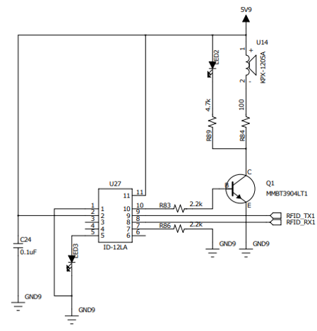

# RFID
## RFID
RFID(Radio Frequency Identification) 기술은 무선 주파수를 이용하여 태그(Tag)에 저장된 정보를 비접촉 방식으로 읽어내는 기술입니다.  
이 시스템은 크게 **리더기(Reader)** 와 **태그(Tag)** 로 구성되며, 카드나 열쇠고리 형태의 태그가 많이 사용됩니다.

### RFID 시스템 구성 요소 
RFID 시스템은 다음 세 가지 구성 요소로 이루어집니다.
- 리더기(Reader) : RFID 태그를 인식하고, 그 안의 데이터를 읽어 MCU나 PC로 전달
- 태그(Tag) : 안테나와 IC 칩으로 구성되어 있으며, 고유한 ID 번호를 저장
- 안테나(Antenna) : 리더기와 태그 간의 전자기파 신호를 송수신

### RFID 동작 원리
1. 리더기(ID-12LA)가 125kHz 주파수의 자기장을 생성합니다.
2. 태그가 근접하면 자기장에 의해 유도 전류가 발생하고, 태그 내부 칩이 동작합니다.
3. 태그는 저장된 고유 ID 정보를 변조(modulation)하여 리더기로 전송합니다.
4. 리더기는 이 정보를 디코딩하여 MCU(예: Arduino)로 전달합니다.

### RFID 특징 
- 비접촉식으로 빠르게 인식 가능
- 방향 제약이 적고, 다중 태그 인식 가능
- 환경에 따라 인식 거리는 약 2~10cm (ID-12LA 기준)
- 전원 공급 방식에 따라 패시브형(무전원), 액티브형(전원 내장) 으로 구분



## RFID 연결 
| Pin | 연결 대상 | 설명 |
|:---:|:---:|:---|
| 5V | +5V | 전원 |
| GND | GND | 접지 |
| RX | 18 | UART RX |
| TX | 19 | UART TX |

## RFID 제어 
다음 코드는 ID-12LA에서 송신되는 ASCII 형식의 RFID 태그 데이터를 읽어 출력하는 예제입니다. 각 태그의 데이터는 시작 바이트(STX, 0x02)부터 종료 바이트(ETX, 0x03)까지 구성되어 있으며, 태그의 고유 ID(10자리 HEX)와 체크섬(2자리 HEX)을 포함합니다.

```cpp
uint8_t hex2byte(char hi, char lo) {
  auto h = (hi <= '9') ? (hi - '0') : (10 + (toupper(hi) - 'A'));
  auto l = (lo <= '9') ? (lo - '0') : (10 + (toupper(lo) - 'A'));
  return (uint8_t)((h << 4) | l);
}

void setup() {
  Serial.begin(115200);
  Serial1.begin(9600);
  Serial.println(F("\n[ID-12LA] Ready. Present a 125kHz tag..."));
}

bool readFrame(char* id10, char* cs2) {
  while (true) {
    if (Serial1.available()) {
      uint8_t b = Serial1.read();
      if (b == 0x02) break;
    }
  }

  for (int i = 0; i < 10; i++) {
    while (!Serial1.available());
    id10[i] = (char)Serial1.read();
  }

  for (int i = 0; i < 2; i++) {
    while (!Serial1.available());
    cs2[i] = (char)Serial1.read();
  }

  while (!Serial1.available());
  (void)Serial1.read();
  while (!Serial1.available());
  (void)Serial1.read();

  if (Serial1.peek() == 0x03) (void)Serial1.read();

  return true;
}

bool verifyChecksum(const char* id10, const char* cs2) {
  uint8_t xorv = 0;
  for (int i = 0; i < 10; i += 2) {
    uint8_t b = hex2byte(id10[i], id10[i+1]);
    xorv ^= b;
  }
  uint8_t cs = hex2byte(cs2[0], cs2[1]);
  return (xorv == cs);
}

void loop() {
  if (Serial1.available()) {
    char id10[10];
    char cs2[2];

    if (readFrame(id10, cs2)) {
      char id_str[11]; memcpy(id_str, id10, 10); id_str[10] = '\0';
      char cs_str[3];  memcpy(cs_str, cs2,  2);  cs_str[2]  = '\0';

      bool ok = verifyChecksum(id10, cs2);

      Serial.print(F("TAG: ")); Serial.print(id_str);
      Serial.print(F("  CS: ")); Serial.print(cs_str);
      Serial.print(F("  CHECKSUM: "));
      Serial.println(ok ? F("OK") : F("FAIL"));

      delay(50);
    }
  }
}
```

