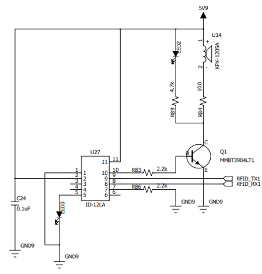

# RFID
## RFID
RFID(Radio Frequency Identification) 기술은 무선 주파수(RF) 를 이용하여 태그(Tag) 에 저장된 정보를 접촉 없이(비접촉) 읽어내는 기술입니다.
겉으로 보기에는 `카드를 갖다 대면 인식된다` 정도로 단순해 보이지만, 실제로는 다음과 같은 과정이 단계적으로 일어납니다.

- 리더기(Reader)가 특정 주파수(예: 125kHz)의 전자기장을 만들어 태그가 동작할 수 있는 환경을 만듭니다.
- 태그는 리더기의 전자기장을 이용해(또는 자체 전원으로) 동작하면서 자신의 고유 ID 정보를 전송합니다.
- 리더기는 태그가 보낸 신호를 디코딩(해석) 하여, MCU(예: Arduino)가 읽을 수 있는 형태(보통 UART 시리얼 데이터)로 출력합니다.
- 아두이노는 그 데이터를 받아서 ID를 출력하거나, 특정 ID면 문 열림/출입 허용 같은 제어로 확장할 수 있습니다.

즉, RFID를 다룬다는 것은 단순히 “ID를 읽는 것”이 아니라, (1) 리더기와 태그의 무선 동작 방식, (2) MCU와의 통신(UART), (3) 프레임(데이터 형식) 파싱과 검증(체크섬) 까지를 함께 이해하는 것이라고 보면 됩니다.

<details>
<summary><b>RFID와 NFC는 같은 기술인가요?</b></summary>

RFID는 “무선 주파수로 식별한다”는 큰 범주를 뜻하며, 125kHz/13.56MHz/900MHz 등 다양한 주파수 대역과 방식이 있습니다.

NFC는 주로 13.56MHz 대역에서 동작하며, 스마트폰 결제/교통카드 등과 연관이 깊습니다.

이번 실습의 ID-12LA는 주로 “출입 태그(열쇠고리/카드)에서 ID를 읽는” 용도로 많이 쓰이는 125kHz 저주파 RFID 리더기로 이해하면 됩니다.
</details><br>

### RFID 시스템 구성 요소 
RFID 시스템은 크게 리더기(Reader) 와 태그(Tag) 를 중심으로 동작하며, 이를 연결하는 안테나(Antenna) 가 핵심 역할을 합니다.
- 리더기(Reader) : RFID 태그를 인식하고, 그 안의 데이터를 읽어 MCU나 PC로 전달
- 태그(Tag) : 안테나와 IC 칩으로 구성되어 있으며, 고유한 ID 번호를 저장
- 안테나(Antenna) : 리더기와 태그 간의 전자기파 신호를 송수신

### RFID 동작 원리
아래는 ID-12LA(125kHz) 기반 RFID가 동작하는 대표적인 흐름입니다.
1. 리더기(ID-12LA)가 125kHz 주파수의 자기장을 생성합니다.
2. 태그가 근접하면 자기장에 의해 유도 전류가 발생하고, 태그 내부 칩이 동작합니다.
3. 태그는 저장된 고유 ID 정보를 변조(modulation)하여 리더기로 전송합니다.
4. 리더기는 이 정보를 디코딩하여 MCU(예: Arduino)로 전달합니다.

### RFID 특징 
- 비접촉식으로 빠르게 인식 가능
- 방향 제약이 적고, 다중 태그 인식 가능
- 환경에 따라 인식 거리는 약 2~10cm (ID-12LA 기준)
- 전원 공급 방식에 따라 패시브형(무전원), 액티브형(전원 내장) 으로 구분



## RFID 연결 
| Pin | 연결 대상 | 설명 |
|:---:|:---:|:---|
| 5V | +5V | 전원 |
| GND | GND | 접지 |
| RX | 18 | UART RX |
| TX | 19 | UART TX |


## RFID 제어 
다음 코드는 ID-12LA에서 송신되는 ASCII 형식의 RFID 태그 데이터를 읽어 출력하는 예제입니다. 각 태그의 데이터는 시작 바이트(STX, 0x02)부터 종료 바이트(ETX, 0x03)까지 구성되어 있으며, 태그의 고유 ID(10자리 HEX)와 체크섬(2자리 HEX)을 포함합니다.

```cpp
uint8_t hex2byte(char hi, char lo) {
  auto h = (hi <= '9') ? (hi - '0') : (10 + (toupper(hi) - 'A'));
  auto l = (lo <= '9') ? (lo - '0') : (10 + (toupper(lo) - 'A'));
  return (uint8_t)((h << 4) | l);
}

void setup() {
  Serial.begin(115200);
  Serial1.begin(9600);
  Serial.println(F("\n[ID-12LA] Ready. Present a 125kHz tag..."));
}

bool readFrame(char* id10, char* cs2) {
  while (true) {
    if (Serial1.available()) {
      uint8_t b = Serial1.read();
      if (b == 0x02) break;
    }
  }

  for (int i = 0; i < 10; i++) {
    while (!Serial1.available());
    id10[i] = (char)Serial1.read();
  }

  for (int i = 0; i < 2; i++) {
    while (!Serial1.available());
    cs2[i] = (char)Serial1.read();
  }

  while (!Serial1.available());
  (void)Serial1.read();
  while (!Serial1.available());
  (void)Serial1.read();

  if (Serial1.peek() == 0x03) (void)Serial1.read();

  return true;
}

bool verifyChecksum(const char* id10, const char* cs2) {
  uint8_t xorv = 0;
  for (int i = 0; i < 10; i += 2) {
    uint8_t b = hex2byte(id10[i], id10[i+1]);
    xorv ^= b;
  }
  uint8_t cs = hex2byte(cs2[0], cs2[1]);
  return (xorv == cs);
}

void loop() {
  if (Serial1.available()) {
    char id10[10];
    char cs2[2];

    if (readFrame(id10, cs2)) {
      char id_str[11]; memcpy(id_str, id10, 10); id_str[10] = '\0';
      char cs_str[3];  memcpy(cs_str, cs2,  2);  cs_str[2]  = '\0';

      bool ok = verifyChecksum(id10, cs2);

      Serial.print(F("TAG: ")); Serial.print(id_str);
      Serial.print(F("  CS: ")); Serial.print(cs_str);
      Serial.print(F("  CHECKSUM: "));
      Serial.println(ok ? F("OK") : F("FAIL"));

      delay(50);
    }
  }
}
```

### RFID 주요 코드 설명
> **uint8_t hex2byte(char hi, char lo)**
> - RFID 프레임에서 ID/체크섬은 보통 “HEX 문자(0 ~ 9, A ~ F)”로 들어옵니다. 이 함수는 문자 2개(예: 'A', 'F')를 실제 1바이트 값(0xAF)으로 변환해 줍니다. 즉, “사람이 보기 쉬운 문자 데이터”를 “계산 가능한 숫자 데이터”로 바꾸는 단계입니다.

> **auto h = ... / auto l = ...**
> - '0' ~ '9'인 경우와 'A' ~ 'F'인 경우를 구분해 각각 숫자 값으로 바꿉니다.
> - toupper()를 쓰는 이유는 소문자 'a'~'f'가 와도 대문자로 바꿔 동일하게 처리하기 위함입니다.

> **return (uint8_t)((h << 4) | l);**
> - 상위 니블(4비트)을 왼쪽으로 4칸 밀어 상위 자리에 두고, 하위 니블을 OR로 합쳐 1바이트를 만듭니다.

> **Serial.begin(115200);**
> - PC의 Serial Monitor로 결과를 보기 위한 설정입니다. 보드레이트는 Serial Monitor 설정과 반드시 동일해야 합니다.

> **Serial1.begin(9600);**
> - ID-12LA 모듈이 UART로 데이터를 보내는 속도(보통 9600bps)에 맞춰 Serial1을 초기화합니다. 만약 이 값이 다르면, 데이터가 깨지거나(문자 이상), 아예 읽히지 않을 수 있습니다.

> **bool readFrame(char id10, char cs2)**
> - RFID 리더기에서 들어오는 데이터 중, `프레임(태그 한 번 인식에 해당하는 한 묶음)` 을 읽어 id10(10자리), cs2(2자리)로 분리해 담는 함수입니다.

> **while (true) { ... if (b == 0x02) break; }**
> - 프레임의 시작을 의미하는 STX(0x02) 를 만날 때까지 계속 읽습니다.
> - RFID 데이터는 중간부터 읽기 시작하면 프레임 경계가 어긋나므로, 반드시 “시작 바이트”를 기준으로 동기화하는 과정이 필요합니다.

> **for (int i = 0; i < 10; i++) { ... id10[i] = ... }**
> - STX 이후로 들어오는 10개의 ASCII 문자를 읽어 ID(10자리 HEX 문자) 로 저장합니다.

> **for (int i = 0; i < 2; i++) { ... cs2[i] = ... }**
> - ID 뒤에 따라오는 2개의 ASCII 문자를 읽어 체크섬(2자리 HEX 문자) 로 저장합니다.

> **if (Serial1.peek() == 0x03) (void)Serial1.read();**
> - peek()는 “버퍼에서 값을 꺼내지 않고 미리 보기”입니다. 다음 바이트가 ETX(0x03)라면, 프레임 종료 바이트를 하나 소비해 프레임을 깔끔하게 마무리합니다. 이렇게 해두면 다음 프레임을 읽을 때 STX를 찾는 과정이 더 안정적이 됩니다.

> **bool verifyChecksum(const char id10, const char cs2)**
> - 수신한 ID가 정상인지 확인하는 함수입니다.
> - ID(10자리 HEX)는 실제로 5바이트 값에 해당하므로, 이를 2글자씩 묶어 바이트로 변환한 뒤 XOR을 누적합니다.

> **for (int i = 0; i < 10; i += 2) { ... xorv ^= b; }**
> - 10자리 문자를 2자리씩 끊어 총 5바이트로 바꾼 뒤, XOR을 누적합니다. XOR 체크섬은 간단하지만, 전송 중 일부 비트가 깨지는 문제를 감지하는 데 꽤 유용합니다.

> **uint8_t cs = hex2byte(cs2[0], cs2[1]);**
> - 프레임에서 받은 체크섬(문자 2개)을 실제 바이트 값으로 변환합니다.

> **return (xorv == cs);**
> - “계산한 체크섬”과 “프레임에 포함된 체크섬”이 같으면 정상(OK), 다르면 오류(FAIL)로 판단합니다.

> **if (Serial1.available()) { ... }**
> - loop에서 “데이터가 들어왔을 때만” 프레임 처리 루틴에 들어가도록 만든 조건입니다. 불필요한 읽기 시도를 줄이고, 코드 흐름을 깔끔하게 유지합니다.

> **Serial.print(F("TAG: ")); ... Serial.println(ok ? F("OK") : F("FAIL"));**
> - 최종적으로 ID와 체크섬을 출력하고, 체크섬 검증 결과를 함께 표시합니다.
