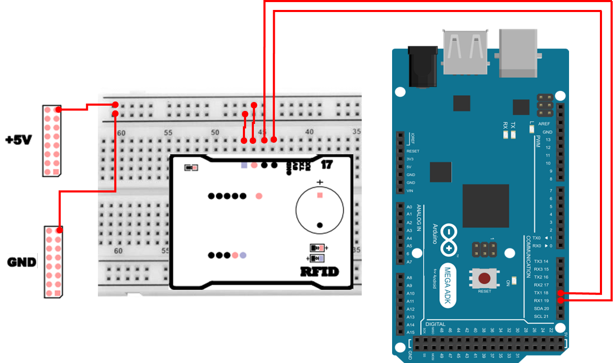
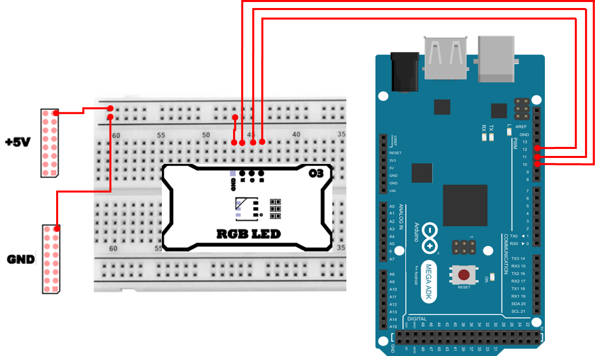

# 보안 출입 시스템 구현 
보안 출입 시스템(Security Access Control)은 허가된 사용자만 특정 공간에 출입할 수 있도록 통제하는 시스템입니다. 단순히 `문을 여는 장치`를 만드는 것이 아니라, 누가(인증) / 언제(조건) / 어떤 방식으로(동작) / 어떤 상태인지(피드백) 를 한 흐름으로 설계하는 것이 핵심입니다.

예를 들어,
- 사무실, 연구실, 창고처럼 외부인이 무단으로 들어오면 문제가 되는 공간은 출입 권한 관리가 필요합니다.
- 출입 기록을 남기거나, 특정 시간대만 허용하는 등 정책(Policy) 을 적용할 수도 있습니다.
- 문이 열렸는지/잠겼는지 사용자가 즉시 알 수 있도록 시각적 피드백(LED) 이 중요합니다.

본 프로젝트는 RFID, 인체감지(PIR) 센서, 서보모터, RGB LED를 결합하여 “허가된 사용자만 접근 가능한 스마트 도어락 시스템” 을 구현합니다.
단일 센서 제어를 넘어, 인체 감지 + 태그 인증의 논리 결합을 통해 “사람이 실제로 접근했을 때만 인증을 유효하게 처리”하도록 구성하며, 인증 결과는 서보모터(물리 동작) 와 RGB LED(상태 표시) 로 명확히 드러나게 됩니다.

## 구성 요소별 역할
### RFID
125kHz 대역 RFID 태그를 인식하여 사용자 ID(태그 값) 를 확인합니다. 이 시스템에서는 RFID 모듈이 ASCII 출력 모드로 태그 정보를 UART(9600bps)로 전송하며, MCU는 이를 읽어 허용된 ID와 비교합니다.

- 허용된 ID(예: 3D00920EE5)와 일치할 경우에만 출입을 허가합니다.
- RFID는 “태그만 갖다 대면 된다”는 장점이 있지만, 태그만으로 인증하면 원격에서 태그만 가져다 대는 상황도 이론상 가능하므로, 본 시스템은 PIR과 결합하여 보안을 강화합니다.

### PIR
PIR(Passive Infrared) 센서는 사람의 움직임에 의해 발생하는 적외선 변화를 감지하여 출력 신호를 내보냅니다. 본 시스템에서는 PIR을 통해 “최근 10초 이내에 사람이 접근했는지” 를 기록하고, 이 조건이 만족될 때만 RFID 인증을 유효하게 처리합니다.

- PIR 인터럽트가 발생하면 “최근 감지 시각”이 갱신됩니다.
- 이후 10초(MOTION_WINDOW_MS) 동안은 RFID 인증이 유효한 “출입 창(window)”으로 간주합니다.
- 인터럽트 기반이므로, 루프에서 RFID를 읽고 있거나 LED를 제어 중이어도 감지 이벤트를 놓치지 않습니다.

### 서보모터
서보모터는 인증 성공 시 문을 여닫는 물리적 동작 장치(락 구동부) 입니다.

- 인증 성공 시 특정 각도(예: 90°)로 이동하여 “열림” 상태를 만들고,
- 일정 시간(기본 5초) 후 자동으로 원래 각도(예: 0°)로 돌아가 “잠김” 상태가 됩니다.
- 코드 내 DOOR_OPEN_MS 값을 바꾸면 개방 시간을 쉽게 조정할 수 있습니다.

### RGB LED
RGB LED는 시스템 상태를 즉시 알아볼 수 있도록 시각적으로 표현합니다. 사용자는 LED만 보고도 “현재 잠김인지, 인증 성공인지, 오류인지”를 직관적으로 판단할 수 있어야 합니다.
| 상태 | LED 색상 | 의미 |
|:---:|:---:|:---|
| 잠김 | 🔴 빨강 | 기본 대기 상태 |
| 열림 | 🟢 초록 | 인증 성공, 문 개방 중 |
| 잘못된 태그 | 🟣 보라색 깜빡임 | 미허가 태그 감지, 3초간 경고 표시 |

## 동작 구조 
시스템은 아래의 흐름으로 동작합니다.

1. 대기(LOCKED)
    - 문이 잠긴 상태이며 LED는 빨간색입니다.
    - PIR 센서가 인체 움직임을 감지할 때까지 대기합니다.
2. 인체 감지(ARMED)
    - PIR 인터럽트가 발생하면 “최근 감지 시각”이 갱신됩니다.
    - 이후 10초 동안은 RFID 인증이 유효합니다.
3. RFID 인증(ACCESS)
    - RFID 모듈이 태그를 인식하면 ID 문자열을 읽습니다.
    - 태그가 허용 목록에 있으면 서보모터를 구동하여 문을 열고, LED를 초록색으로 변경합니다.
    - 다른 태그일 경우 LED를 보라색으로 3초간 점멸시켜 경고를 표시합니다.
4. 자동 잠금(LOCK RETURN)
    - 문이 열린 지 5초가 경과하면 자동으로 닫히고 LED가 다시 빨간색으로 바뀝니다.

## 하드웨어 연결 
<details> 
<summary><b>RFID 연결 정보 [Click]</b></summary>

| Pin | 연결 대상 | 설명 |
|:---:|:---:|:---|
| 5V | +5V | 전원 |
| GND | GND | 접지 |
| RX | 18 | UART RX |
| TX | 19 | UART TX |



</details>
<details> 
<summary><b>PIR 센서 연결 정보 [Click]</b></summary>

| Pin | 연결 대상 | 설명 |
|:---:|:---:|:---|
| 5V | +5V | 전원 |
| GND | GND | 접지 |
| 2 | D | Pir |


</details>

<details> <summary><b>서보모터 연결 정보 [Click]</b></summary>

| Pin | 연결 대상 | 설명 |
|:---:|:---:|:---|
| 5V | Red Cable | 전원 |
| GND | Brown Cable | 접지 |
| 9 | Yellow Cable | Servo Motor PWM |


서보모터 모듈 출처 : Freepik

</details>

<details> <summary><b>RGB LED 연결 정보 [Click]</b></summary>

| Pin | 연결 대상 | 설명 |
|:---:|:---:|:---|
| GND | GND | 접지 |
| 10 | R | Red |
| 11 | G | Green |
| 12 | B | Blue |



</details>

## 프로그램 작성 
```cpp
#include <Servo.h>

#define RFID_SERIAL   Serial1

const uint8_t PIN_PIR = 2;
const uint8_t PIN_SERVO = 9;
const uint8_t PIN_LED_R = 10;
const uint8_t PIN_LED_G = 11;
const uint8_t PIN_LED_B = 12;
const char ALLOWED_TAG[] = "3D00920EE5"; 
unsigned long DOOR_OPEN_MS = 5000;
const unsigned long MOTION_WINDOW_MS = 10000;
const unsigned long WRONG_BLINK_MS = 3000;
const unsigned long BLINK_INTERVAL_MS = 200;

const int SERVO_LOCK_ANGLE = 0;
const int SERVO_OPEN_ANGLE = 90;

enum DoorState { LOCKED, OPENING, ALERT_WRONG };
DoorState state = LOCKED;

volatile bool pirTriggered = false;   
volatile unsigned long pirEdgeMs = 0; 
unsigned long lastMotionMs = 0;       

unsigned long openedAtMs = 0;         
unsigned long alertStartMs = 0;       
unsigned long lastBlinkMs = 0;        
bool blinkOn = false;                 

Servo door;

inline void ledWrite(uint8_t r, uint8_t g, uint8_t b) {
  analogWrite(PIN_LED_R, r);
  analogWrite(PIN_LED_G, g);
  analogWrite(PIN_LED_B, b);
}
inline void ledRed() { ledWrite(255, 0, 0); }
inline void ledGreen()  { ledWrite(0, 255, 0); }
inline void ledPurple() { ledWrite(180, 0, 200); }

inline void lockDoor() {
  door.write(SERVO_LOCK_ANGLE);
  state = LOCKED;
  ledRed();
}

inline void openDoor() {
  door.write(SERVO_OPEN_ANGLE);
  openedAtMs = millis();
  state = OPENING;
  ledGreen();
}

static inline uint8_t hex2nib(char c){
  if (c>='0'&&c<='9') 
    return (uint8_t)(c-'0');
  c = (char)toupper(c);
  if (c>='A'&&c<='F') 
    return (uint8_t)(10 + c - 'A');
  return 0;
}

static inline uint8_t hex2byte(char hi, char lo){
  return (uint8_t)((hex2nib(hi)<<4) | hex2nib(lo));
}

static bool verifyChecksum10hex(const char* id10, const char* cs2){
  uint8_t x = 0;
  for(int i=0;i<10;i+=2) 
    x ^= hex2byte(id10[i], id10[i+1]);
  return x == hex2byte(cs2[0], cs2[1]);
}

bool tryReadRFID(char* outTag10 /* size>=11 */){
  static enum {WAIT_STX, READ_ID, READ_CS, READ_CR, READ_LF, READ_ETX} st = WAIT_STX;
  static char id10[10];
  static char cs2[2];
  static uint8_t idx = 0;
  static unsigned long t0 = 0;
  const unsigned long FRAME_TO = 50;

  auto reset_state = [&](){
    st = WAIT_STX; idx = 0;
  };

  while (RFID_SERIAL.available()){
    int b = RFID_SERIAL.read();
    if (st == WAIT_STX){
      if (b == 0x02){ st = READ_ID; idx = 0; t0 = millis(); }
      continue;
    }
    if (millis() - t0 > FRAME_TO){ reset_state(); continue; }

    if (st == READ_ID){
      id10[idx++] = (char)b;
      if (idx >= 10){ st = READ_CS; idx = 0; }
    } else if (st == READ_CS){
      cs2[idx++] = (char)b;
      if (idx >= 2){ st = READ_CR; }
    } else if (st == READ_CR){
      if (b != '\r'){ reset_state(); continue; }
      st = READ_LF;
    } else if (st == READ_LF){
      if (b != '\n'){ reset_state(); continue; }
      st = READ_ETX;
    } else if (st == READ_ETX){
      if (b != 0x03){
      }
      if (!verifyChecksum10hex(id10, cs2)){ reset_state(); return false; }
      for (int i=0;i<10;i++) outTag10[i] = (char)toupper(id10[i]);
      outTag10[10] = '\0';
      Serial.print(F("[RFID] TAG=")); Serial.print(outTag10);
      Serial.print(F(" CS=")); Serial.write(cs2,2);
      Serial.println(F(" OK"));

      reset_state();
      return true;
    }
  }
  return false;
}

void pirISR() {
  pirTriggered = true;
  pirEdgeMs = millis();
}

void setup() {
  pinMode(PIN_LED_R, OUTPUT);
  pinMode(PIN_LED_G, OUTPUT);
  pinMode(PIN_LED_B, OUTPUT);
  ledRed();

  door.attach(PIN_SERVO);
  lockDoor();

  pinMode(PIN_PIR, INPUT);
  attachInterrupt(digitalPinToInterrupt(PIN_PIR), pirISR, CHANGE);

  RFID_SERIAL.begin(9600);
  Serial.begin(115200);
  Serial.println(F("[System] Ready (RFID+PIR+Servo+RGB)"));
  Serial.print(F("Allowed TAG: "));
  Serial.println(ALLOWED_TAG);
}

void loop() {
  unsigned long now = millis();
  if (pirTriggered) {
    pirTriggered = false;
    static unsigned long lastPirEdge = 0;
    if (now - lastPirEdge > 100) {
      lastPirEdge = now;
      if (digitalRead(PIN_PIR) == HIGH) {
        lastMotionMs = now;
        if (state == LOCKED) {
          Serial.println(F("[PIR] Motion detected (window refreshed)"));
        }
      }
    }
  }

  char tag[11];
  if (tryReadRFID(tag)) {
    Serial.print(F("[RFID] TAG: "));
    Serial.println(tag);

    bool inMotionWindow = (now - lastMotionMs) <= MOTION_WINDOW_MS;
    if (inMotionWindow) {
      if (strcmp(tag, ALLOWED_TAG) == 0) {
        if (state != OPENING) {
          openDoor();
          Serial.println(F("[ACCESS] Granted -> Door OPEN"));
        }
      } else {
        alertStartMs = now;
        lastBlinkMs = 0;
        blinkOn = false;
        state = ALERT_WRONG;
        Serial.println(F("[ACCESS] DENIED (wrong TAG)"));
      }
    } else {
      alertStartMs = now;
      lastBlinkMs = 0;
      blinkOn = false;
      state = ALERT_WRONG;
      Serial.println(F("[ACCESS] DENIED (no recent motion)"));
    }
  }

  if (state == OPENING) {
    if (now - openedAtMs >= DOOR_OPEN_MS) {
      lockDoor();
      Serial.println(F("[Door] Auto LOCK"));
    }
  } else if (state == ALERT_WRONG) {
    if (now - alertStartMs <= WRONG_BLINK_MS) {
      if (now - lastBlinkMs >= BLINK_INTERVAL_MS) {
        lastBlinkMs = now;
        blinkOn = !blinkOn;
        if (blinkOn) 
          ledPurple();
        else 
          ledWrite(0, 0, 0); 
      }
    } else {
      if (state != LOCKED) {
        lockDoor(); 
      }
    }
  }
}
```

### 보안 출입 시스템 주요 코드 설명
> **#include <Servo.h>**
> - 서보모터 제어를 위한 라이브러리입니다. Servo door;, door.attach(), door.write() 같은 서보 제어 함수가 이 라이브러리에서 제공됩니다.

> **#define RFID_SERIAL Serial1**
> - RFID 모듈과의 UART 통신 포트를 Serial1으로 고정합니다. Mega2560에서 Serial1은 하드웨어 UART이므로 RFID처럼 일정 속도로 데이터를 지속 수신하는 장치에 적합합니다.

> **PIN 정의(PIN_PIR, PIN_SERVO, PIN_LED_R/G/B)**
> - 센서/모터/LED가 연결된 핀을 상수로 선언합니다. 이렇게 하면 회로가 바뀌어도 “핀 번호만 수정”하면 전체 코드에 반영되므로 유지보수가 쉬워집니다.

> **ALLOWED_TAG[]**
> - 허용된 태그 ID 문자열입니다. 실제 시스템에서는 여러 개의 허용 태그 목록(배열/리스트)으로 확장할 수 있습니다.

> **시간 상수(DOOR_OPEN_MS, MOTION_WINDOW_MS, WRONG_BLINK_MS, BLINK_INTERVAL_MS)**
> - DOOR_OPEN_MS : 문이 열린 후 자동으로 잠기기까지의 시간입니다.
> - MOTION_WINDOW_MS : PIR 감지 이후 RFID 인증을 유효로 인정하는 시간 창입니다.
> - WRONG_BLINK_MS : 경고 상태(보라색 점멸)를 유지하는 시간입니다.
> - BLINK_INTERVAL_MS : LED가 깜빡이는 주기(점멸 속도)입니다.

> **enum DoorState { LOCKED, OPENING, ALERT_WRONG }**
> - 상태 머신의 핵심입니다. 시스템이 “지금 무엇을 하는 중인지”를 state 변수로 명확히 구분합니다.

> **volatile 변수(pirTriggered, pirEdgeMs)**
> - 인터럽트 서비스 루틴(ISR)과 loop()가 같은 변수를 공유하므로 volatile로 선언합니다.
> - ISR에서 값이 바뀐 것을 loop()에서 정확히 읽을 수 있도록 보장하는 역할을 합니다.

> **ledWrite(), ledRed(), ledGreen(), ledPurple()**
> - RGB LED에 대한 “색상 표현”을 함수로 묶은 부분입니다. ledWrite(r,g,b)는 PWM 밝기(0~255)를 이용해 색을 만들고, 나머지 함수는 자주 쓰는 색을 빠르게 호출할 수 있도록 도와줍니다.

> **lockDoor() / openDoor()**
> - 문을 잠그는 동작과 여는 동작을 함수로 분리합니다.

> **hex2nib(), hex2byte()**
> - RFID 문자열의 체크섬(Checksum)을 검사하기 위한 보조 함수입니다.
> - 'A'~'F' 같은 16진 문자를 실제 숫자 값(0~15)로 변환하고, 두 자리(hi,lo)를 합쳐 1바이트를 만듭니다.

> **verifyChecksum10hex(id10, cs2)**
> - 10자리 ID를 2자리씩 끊어 5바이트로 만들고 XOR 연산으로 체크섬을 계산한 뒤, 프레임에 포함된 체크섬(cs2)과 일치하는지 확인합니다.

> **tryReadRFID(outTag10)**
> - RFID 데이터를 “그때그때 읽는 방식”이 아니라, 프레임 단위로 파싱하는 상태 머신 방식으로 처리합니다.
> - WAIT_STX → READ_ID → READ_CS → READ_CR → READ_LF → READ_ETX 순서로 진행하며,
>   - STX(0x02)로 프레임 시작을 확인하고,
>   - ID 10문자와 체크섬 2문자를 읽고,
>   - CR/LF 종료를 확인한 뒤,
>   - ETX(0x03)로 프레임 끝을 확인합니다.
> - 또한 FRAME_TO(50ms)를 두어, 프레임 수신이 중간에 끊기면 상태를 리셋합니다.

> **pirISR()**
> - PIR 핀 변화가 발생할 때 호출되는 인터럽트 함수입니다. ISR에서는 최대한 짧게 처리해야 하므로, 여기서는 “감지되었다”는 플래그(pirTriggered)만 세우고, 자세한 처리는 loop()에서 수행합니다.

> **loop()의 PIR 처리 흐름**
> - pirTriggered가 서 있으면 이를 해제한 후, 100ms 간격 필터를 적용하여 너무 잦은 이벤트를 줄입니다.
> - PIR 핀이 HIGH일 때만 lastMotionMs를 갱신하여 “최근 감지 시각”을 저장합니다.

> **loop()의 RFID 처리 흐름**
> - tryReadRFID(tag)가 true이면 태그 문자열을 확보한 상태입니다.
> - now - lastMotionMs <= MOTION_WINDOW_MS 조건으로 “인체 감지 창” 안인지 판단합니다.
> - 창 안이면 허용 태그인지 비교하여 openDoor() 또는 경고 상태로 전환합니다.
> - 창 밖이면 “사람 감지 없이 태그만 찍힘”으로 보고 경고 상태로 전환합니다.

> **OPENING 상태 처리(자동 잠금)**
> - 문을 연 뒤 DOOR_OPEN_MS가 지나면 lockDoor()로 복귀합니다. 이때 LED도 빨간색으로 돌아가며, 시스템은 다시 대기 상태가 됩니다.

> **ALERT_WRONG 상태 처리(경고 점멸)**
> - WRONG_BLINK_MS 동안 BLINK_INTERVAL_MS 주기로 보라색/꺼짐을 반복하여 점멸 효과를 만듭니다. 시간이 끝나면 lockDoor()로 복귀하여 기본 대기 상태로 돌아갑니다.