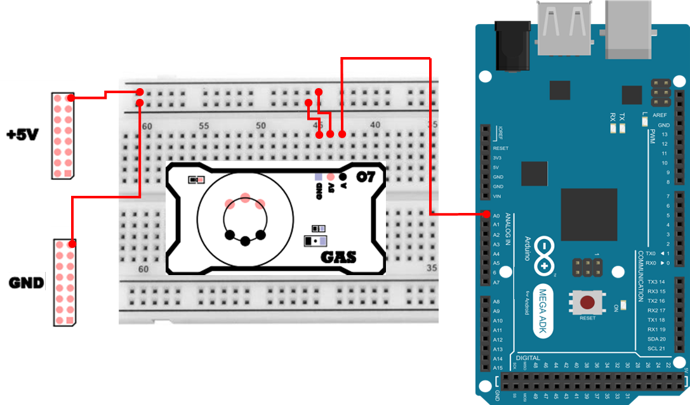
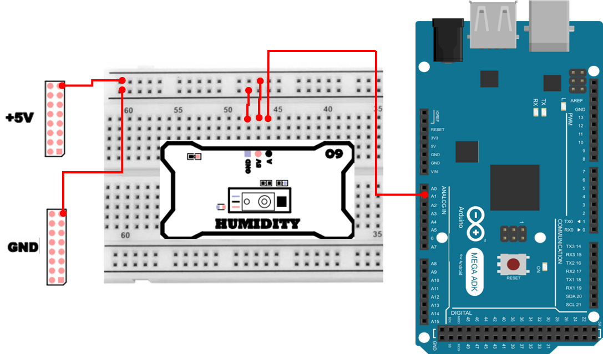
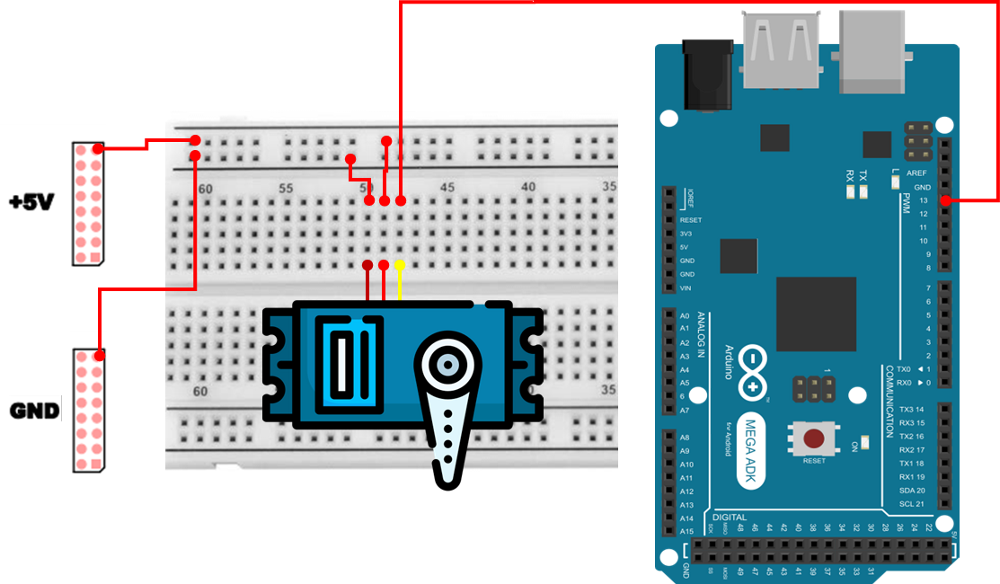

# 스마트 홈 응용 
## 스마트 창문 제어 시스템 
본 프로젝트는 가스 누출 감지와 사용자 인증(비밀번호 입력) 을 결합하여, 실내 환기(창문 개폐)를 자동/수동으로 제어하는 스마트홈 응용 시스템을 구현하는 것을 목표로 합니다. 

단순히 `센서 값을 읽고 모터를 움직이는 예제`가 아니라, 실제 스마트홈 제품에서 중요한 다음 요소들을 하나의 흐름으로 설계하는 것이 핵심입니다.

- 언제 자동으로 창문을 열어야 하는지(가스 농도 임계값 기반 판단)
- 사용자가 수동으로 개입할 수 있는지(키패드 비밀번호 인증)
- 시스템 상태를 어떻게 명확히 보여줄지(Text LCD에 실시간 표시)
- 자동 제어와 수동 제어가 충돌하지 않도록(상태 머신/우선순위)

예를 들어,

- 사용자가 비밀번호로 창문을 여는 `일상 동작`과, 가스 누출 시 환기를 위한 `안전 동작`은 성격이 다르며, 안전 동작이 우선되어야 합니다. 
- 센서 값은 계속 변하므로, 화면에는 현재 값(가스/습도) 과 시스템이 무엇을 하는 중인지(READY/OPENING/VENTILATING 등) 가 함께 표시되어야 사용자가 혼란스럽지 않습니다. 
- 창문을 연 뒤 `영구히 열림`이 아니라, 일정 시간 후 자동으로 닫히도록 하면 실습에서도 제어 흐름(타이머/상태 전이) 를 배우기에 좋습니다. 

## 구성 요소별 역할 
### 가스 센서
- 메탄, 부탄, 액화가스 등의 농도를 감지하는 아날로그 센서입니다.
- 전압 출력을 이용해 ppm 단위로 가스 농도를 계산합니다.
- 설정된 임계값(예: 300ppm)을 초과할 경우 자동 환기 모드가 활성화됩니다.
  - 창문이 부분적으로(45°) 열리고 10초간 유지 후 자동으로 닫힙니다.

### 습도 센서
- 공기 중 상대습도를 0~100% 범위로 측정합니다.
- LCD에 실시간으로 표시되어 환경 모니터링 기능을 제공합니다.
- 향후 확장 시, 습도 조건에 따른 자동 제어(예: 결로 방지)에도 활용 가능합니다.

### Keypad
- 비밀번호 입력 인터페이스 역할을 합니다.
- 기본 비밀번호는 “1234”, 확인키는 F로 설정되어 있습니다.
- 0 올바른 비밀번호 입력 시 서보 모터가 90° 회전하여 창문을 완전히 엽니다.
- LCD에 입력 중인 비밀번호와 시스템 상태가 표시됩니다.
- 입력 후 5초 동안 열림 상태를 유지하고 자동으로 닫힙니다.

### Servo 모터
- 창문을 개폐하는 구동 장치입니다.
- 닫힘(0°), 환기(45°), 열림(90°)의 세 가지 위치로 동작합니다.
- Keypad 입력과 가스 감지 두 경우 모두 동일 모터를 사용하지만, 동작 각도가 달라 상황별 동작을 시각적으로 구분할 수 있습니다.

| 동작 조건 | 각도 | 상태 | 유지 시간 |
| :---- | :---: | :--- | :---: |
| 키패드 비밀번호 입력 성공 | 90° | 완전 개방 | 5초 |
| 가스 농도 임계 초과 | 45° | 부분 개방(환기) | 10초 |
| 자동 닫힘 | 0° | 닫힘(READY) | 즉시 |

### TextLCD
- 각 센서 데이터와 시스템 상태를 실시간으로 표시합니다.

| 줄 번호 | 내용 |
| :---: | :--- |
| 0행 | 가스 농도 (ppm) |
| 1행 | 습도 (%) |
| 2행 | 비밀번호 입력 상태 (`PW: ****`) |
| 3행 | 현재 시스템 상태 (`READY`, `OPEN(90deg)`, `VENTILATING(45deg)` 등) |

## 동작 구조 
1. 정상 대기(READY)
    - LCD에 가스·습도 값 표시
    - Keypad 입력 대기
    - 가스 농도 < 300ppm
    - 서보 모터 각도: 0°
2. 수동 열림(Keypad 비밀번호 입력)
    - 올바른 비밀번호 입력 시 → “OPENING” 상태
    - 서보가 90°로 이동
    - LCD: STATUS: OPEN(90deg)
    - 5초 후 자동 닫힘 → READY로 복귀
3. 자동 환기(Gas 감지)
    - 가스 농도 ≥ 300ppm → “VENTILATING” 상태
    - 서보가 45°로 이동
    - LCD: STATUS: VENTILATING(45deg)
    - 10초 후 자동 닫힘 → READY로 복귀

## 하드웨어 연결 
<details> 
<summary><b>가스 센서 연결 정보 [Click]</b></summary>

|  Pin | 연결 대상 | 설명 |
| :---: | :---: | :--- |
| VCC | +5V | 전원 |
| GND | GND | 접지 |
| A | A0 | 가스 농도 아날로그 출력 |



</details> 
<details>
<summary><b>습도 센서 연결 정보 [Click]</b></summary>

| Pin | 연결 대상 | 설명 |
| :---: | :---: | :--- |
| VCC | +5V | 전원 |
| GND | GND | 접지 |
| A | A1 | 습도 아날로그 출력 |



</details> 
<details> 
<summary><b>Keypad 연결 정보 [Click]</b></summary>

|  Pin | 연결 대상 | 설명 |
| :---: | :---: | :--- |
| 7~4 | R0~R3 | 감지선 (INPUT_PULLUP) |
| 11~8 | C0~C3 | 스캔선 (OUTPUT) |


</details> 
<details> 
<summary><b>Servo 모터 연결 정보 [Click]</b></summary>

| Pin | 연결 대상 | 설명 |
|:---:|:---:|:---|
| 5V | Red Cable | 전원 |
| GND | Brown Cable | 접지 |
| 13 | Yellow Cable | Servo Motor PWM |



</details> 
<details> 
<summary><b>TextLCD 연결 정보 [Click]</b></summary>

| Pin | 연결 대상 | 설명 |
|:---:|:---:|:---|
| 5V | +5V | 전원 |
| GND | GND | 접지 |
| 20 | C | I2C Clock |
| 21 | D | I2C Data |


</details>

## 스마트 창문 제어 코드
```cpp
#include <Wire.h>
#include <LiquidCrystal_I2C.h>
#include <Keypad.h>
#include <Servo.h>

#define LCD_ADDR 0x3F
#define LCD_COLS 20
#define LCD_ROWS 4
LiquidCrystal_I2C lcd(LCD_ADDR, LCD_COLS, LCD_ROWS);

const int PIN_GAS = A0;
const int PIN_HUM = A1;
float VCC=5.0, RL=10000.0, R0=9000.0;
float A_coef=574.25, B_coef=-2.222;
const float GAS_THRESH_PPM=300.0;

const int SERVO_PIN = 13;
const int SERVO_OPEN_ANGLE_KEYPAD = 90;
const int SERVO_OPEN_ANGLE_VENT = 45;
const int SERVO_CLOSE_ANGLE = 0;
Servo servoWindow;

const byte ROWS=4, COLS=4;
char keys[ROWS][COLS]={
  {'1','2','3','A'},
  {'4','5','6','B'},
  {'7','8','9','C'},
  {'E','0','F','D'}
};
byte rowPins[4] = {11,10,9,8};
byte colPins[4] = {7,6,5,4};  
Keypad keypad(makeKeymap(keys), rowPins, colPins, ROWS, COLS);

const char* DEFAULT_PW="1234";
String inputBuffer="";
const unsigned long SENSOR_UPDATE_MS=300;
unsigned long t_sensor=0;
enum WindowState{WIDLE, OPENING, OPENED, CLOSING};
WindowState wstate=WIDLE;
bool ventilationActive=false;

const unsigned long OPEN_LABEL_MS=5000;
bool openLabelActive=false;
unsigned long openLabelEndAt_ms=0;

const unsigned long VENT_HOLD_MS=10000;
enum VentState{VENT_IDLE, VENT_OPENING, VENT_HOLD, VENT_CLOSING};
VentState vstate=VENT_IDLE;
unsigned long ventHoldEndAt_ms=0;

void lcdClearLine(uint8_t row){
  lcd.setCursor(0,row);
  for(int i=0;i<LCD_COLS;i++) 
    lcd.print(' ');
  lcd.setCursor(0,row);
}

void printFixed1(float v){
  long s=(long)(v*10.0f + (v>=0?0.5f:-0.5f));
  long ip=s/10; int dp=abs((int)(s%10));
  lcd.print(ip); lcd.print('.'); lcd.print(dp);
}

float readGasPPM(){
  int adc=analogRead(PIN_GAS);
  float v=(adc/1023.0f)*VCC; if(v<=0.05f) v=0.05f;
  float ratio=(RL*(VCC/v-1.0f))/R0;
  float ppm=A_coef*pow(ratio,B_coef);
  if(!isfinite(ppm)||ppm<0) ppm=0;
  return ppm;
}

float readHumidity(){
  int adc=analogRead(PIN_HUM);
  float vout=(adc/1023.0f)*VCC;
  float RH_lin=(vout/VCC - 0.16f)/0.0062f;
  float RH=RH_lin/(1.0546f - 0.00216f*25.0f);
  if(!isfinite(RH)) RH=0; 
  if(RH<0) RH=0; 
  if(RH>100) RH=100;
  return RH;
}

String statusText(){
  if(ventilationActive){
    if(vstate==VENT_HOLD) return "VENTILATING(45deg)";
    return "VENT";
  }
  switch(wstate){
    case OPENING: return "OPENING";
    case OPENED:  return openLabelActive ? "OPEN(90deg)" : "OPEN";
    case CLOSING: return "CLOSING";
    default:      return openLabelActive ? "OPEN(90deg)" : "READY";
  }
}

void refreshLCD(float gas,float hum){
  lcdClearLine(0); lcd.print("GAS: "); printFixed1(gas); lcd.print(" ppm");
  lcdClearLine(1); lcd.print("HUM: "); printFixed1(hum); lcd.print(" %");
  lcdClearLine(2);
  if(inputBuffer.length()){
    lcd.print("PW: "); lcd.print(inputBuffer.substring(0,16));
  }else{
    lcd.print("PW:0-9,D=Back,F=OK");
  }
  lcdClearLine(3); lcd.print("STATUS: "); lcd.print(statusText());
}

void startOpenManual(){
  wstate = OPENING;
  servoWindow.write(SERVO_OPEN_ANGLE_KEYPAD);
  wstate = OPENED;
}

void startOpenVent(){  
  wstate = OPENING;
  servoWindow.write(SERVO_OPEN_ANGLE_VENT);
  wstate = OPENED;
}

void startClose(){
  wstate = CLOSING;
  servoWindow.write(SERVO_CLOSE_ANGLE);
  wstate = WIDLE;
}

void startManualOpenLabel(){
  openLabelActive = true;
  openLabelEndAt_ms = millis() + OPEN_LABEL_MS;
}

void serviceManualOpenLabel(){
  if(openLabelActive && (long)(millis()-openLabelEndAt_ms)>=0){
    openLabelActive=false;
    if(wstate == OPENED){
      startClose();
    }
  }
}

void startVentCycle(){
  ventilationActive = true;
  vstate = VENT_OPENING;
  startOpenVent();
  vstate = VENT_HOLD;
  ventHoldEndAt_ms = millis() + VENT_HOLD_MS;
}

void serviceVentFSM(){
  switch(vstate){
    case VENT_IDLE: break;
    case VENT_OPENING:
      vstate=VENT_HOLD;
      ventHoldEndAt_ms=millis()+VENT_HOLD_MS;
      break;
    case VENT_HOLD:
      if((long)(millis()-ventHoldEndAt_ms)>=0){
        vstate=VENT_CLOSING;
        startClose();
      }
      break;
    case VENT_CLOSING:
      vstate=VENT_IDLE;
      ventilationActive=false;
      break;
  }
}

void handleKeypadFast(){
  keypad.setDebounceTime(5);
  keypad.setHoldTime(250);

  if(keypad.getKeys()){
    for(int i=0;i<LIST_MAX;i++){
      if(keypad.key[i].stateChanged && keypad.key[i].kstate==PRESSED){
        char k = keypad.key[i].kchar;

        if(k>='0' && k<='9'){
          if(inputBuffer.length()<16) inputBuffer+=k;
        }else if(k=='D'){
          if(inputBuffer.length()>0) inputBuffer.remove(inputBuffer.length()-1);
        }else if(k=='F'){
          if(inputBuffer.equals(DEFAULT_PW)){
            if(wstate==WIDLE && !ventilationActive){
              startOpenManual();
              startManualOpenLabel();
            }
          }
          inputBuffer="";
        }
      }
    }
  }
}

void setup(){
  Wire.begin();
  lcd.init(); lcd.backlight();

  servoWindow.attach(SERVO_PIN);
  servoWindow.write(SERVO_CLOSE_ANGLE);

  keypad.setDebounceTime(5);
  keypad.setHoldTime(250);

  Serial.begin(115200);
  t_sensor=0;

  refreshLCD(readGasPPM(), readHumidity());
  Serial.println(F("[SmartHome/Servo] Ready"));
}

void loop(){
  handleKeypadFast();
  serviceVentFSM();
  serviceManualOpenLabel();

  unsigned long now=millis();
  if(now - t_sensor >= SENSOR_UPDATE_MS){
    t_sensor = now;
    float gas=readGasPPM();
    float hum=readHumidity();
    if(!ventilationActive && wstate==WIDLE && gas>=GAS_THRESH_PPM){
      startVentCycle();
    }

    refreshLCD(gas,hum);
  }
}
```

### 스마트 창문 제어 주요 코드 설명
> **#include <Wire.h>, <LiquidCrystal_I2C.h>**
> - I²C 통신을 사용하는 장치(Text LCD)를 제어하기 위한 라이브러리입니다. Wire는 I²C 버스를 초기화/통신할 때 사용하며, LiquidCrystal_I2C는 LCD에 문자열을 출력하기 위한 고수준 함수를 제공합니다.

> **LCD_ADDR(0x3F), LCD_COLS(20), LCD_ROWS(4)**
> - I²C LCD 모듈은 보드/백팩 종류에 따라 주소가 다를 수 있습니다.

> **PIN_GAS(A0), PIN_HUM(A1)**
> - 아날로그 센서가 연결된 핀을 상수로 분리하여 선언합니다.

> **VCC, RL, R0 / A_coef, B_coef**
> - 가스 센서의 ADC 값을 `ppm처럼 해석`하기 위해 사용하는 파라미터들입니다.
> - RL은 부하저항, R0는 기준 저항(보정 값)이며, A_coef, B_coef는 센서 특성 곡선 근사를 위한 계수입니다.

> **GAS_THRESH_PPM(300.0)**
> - 가스 농도가 이 값을 넘으면 자동 환기(부분 개방) 동작을 시작합니다. 임계값은 환경에 따라 달라질 수 있으므로, 실습에서는 Serial 출력/실측을 통해 조정해보는 것이 좋습니다. 

> **Servo 관련 상수(0°, 45°, 90°)**
> - SERVO_CLOSE_ANGLE = 0 : 닫힘(READY)
> - SERVO_OPEN_ANGLE_VENT = 45 : 환기(부분 개방)
> - SERVO_OPEN_ANGLE_KEYPAD = 90 : 수동 열림(완전 개방)

> **Keypad 매핑(keys[][], rowPins, colPins)**
> - 4x4 키패드는 `행/열 스캔`으로 어떤 키가 눌렸는지 판별합니다.
> - rowPins, colPins가 실제 배선과 다르면 입력이 뒤섞여 잘못된 문자가 들어오므로, 핀 표와 코드가 일치해야 합니다.

> **DEFAULT_PW, inputBuffer**
> - DEFAULT_PW="1234"는 비교 기준이 되는 비밀번호입니다.
> - inputBuffer는 사용자가 누르는 숫자를 누적 저장하는 버퍼입니다.
> - 실제 제품 적용시 암호화를 고려하는것이 좋습니다. 

> **SENSOR_UPDATE_MS(300), t_sensor**
> - 센서 값을 너무 자주 읽으면 LCD 갱신이 과도해지고, 시스템이 바쁘게 동작합니다. 300ms 주기로 가스/습도를 읽고 화면을 업데이트하여 `실시간처럼 보이되 안정적`인 갱신을 수행합니다.

> **WindowState / VentState**
> - 이 프로젝트의 핵심은 `상태에 따라 동작을 나누는 것`입니다. WindowState는 창문(서보)의 일반 동작 상태(대기/열림/닫힘 등)를 표현하고, VentState는 자동 환기 사이클의 진행 단계(열기→유지→닫기→종료)를 표현합니다. 이렇게 분리하면 `수동 제어 로직`과 `자동 환기 로직`이 서로 꼬이는 것을 줄일 수 있습니다.

> **printFixed1(v)**
> - 소수점 1자리 출력(예: 123.4)을 위해, 단순 lcd.print(float) 대신 “반올림 + 정수화” 방식으로 포맷을 고정합니다.

> **readGasPPM() 흐름**
> - analogRead(PIN_GAS)로 ADC 값을 읽고 전압 v로 변환합니다.
> - v가 너무 작아지면 분모가 불안정해지므로 최소값(0.05V)을 강제로 보정해 폭주를 막습니다.
> - 저항비 ratio를 계산한 다음, ppm = A * pow(ratio, B) 형태로 환산합니다.
> - 계산 결과가 NaN/Inf이거나 음수가 되면 0으로 정리하여 `화면/제어 로직이 깨지는 상황`을 방지합니다.

> **readHumidity() 흐름**
> - ADC→전압 vout 변환 후, 센서 데이터시트의 선형식 형태로 1차 습도 RH_lin을 계산합니다.
> - 이후 (1.0546 - 0.00216*25°C) 형태의 보정으로 습도를 보정합니다.
>   - 코드에서는 온도가 25°C 인것으로 가정 
> - 결과가 0~100 범위를 벗어나면 클램프하여 LCD 표시/제어 판단이 안정적으로 유지되게 합니다.

> **statusText()**
> - LCD 3행의 STATUS 문자열을 “현재 상태에 맞게” 만들어 반환합니다.
> - 환기 중(ventilationActive)일 때는 VENTILATING(45deg)처럼 명확한 텍스트를 우선 표시하여, 사용자가 “자동 환기 중임”을 즉시 이해할 수 있게 합니다.

> **refreshLCD(gas, hum)**
> - 0행: GAS ppm, 1행: HUM %, 2행: PW 입력(또는 도움말), 3행: STATUS를 갱신합니다.

> **startOpenManual(), startOpenVent(), startClose()**
> - 서보 모터 각도를 바꾸는 “동작 트리거 함수”입니다. 

> **OPEN_LABEL_MS / openLabelActive**
> - 수동으로 열었을 때 “OPEN(90deg)” 라벨을 일정 시간(5초) 유지하기 위한 타이머입니다. 시간이 끝나면 자동으로 닫히도록 serviceManualOpenLabel()에서 처리합니다.

> **VENT_HOLD_MS / ventilationActive / serviceVentFSM()**
> - 자동 환기는 `열기 → 유지(10초) → 닫기 → 종료`의 순서로 진행됩니다.
> - serviceVentFSM()은 loop에서 계속 호출되며, 시간이 되었는지 확인해 다음 단계로 넘어갑니다.

> **handleKeypadFast()**
> - keypad.getKeys()로 이번 loop에서 변화가 있는 키들을 받아옵니다.
> - 비밀번호가 맞고, 현재가 대기 상태(WIDLE)이며 환기 중이 아닐 때만 수동 열림을 시작해 충돌을 방지합니다.

