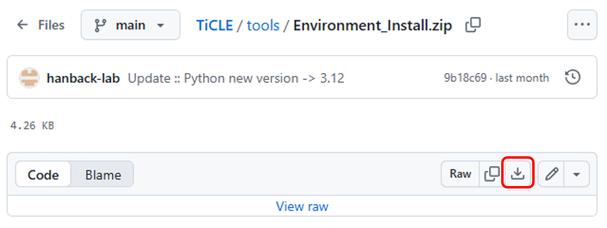
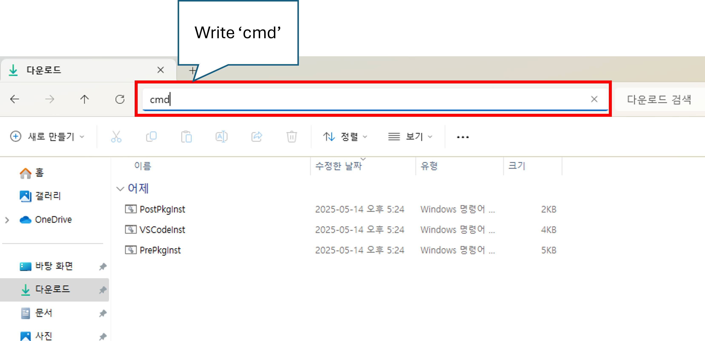
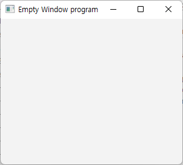
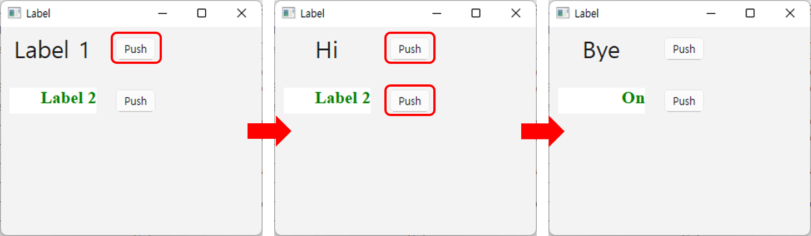
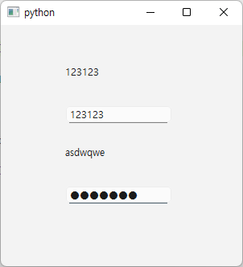
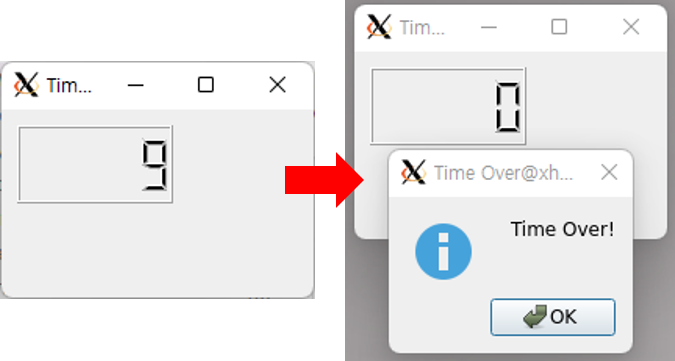
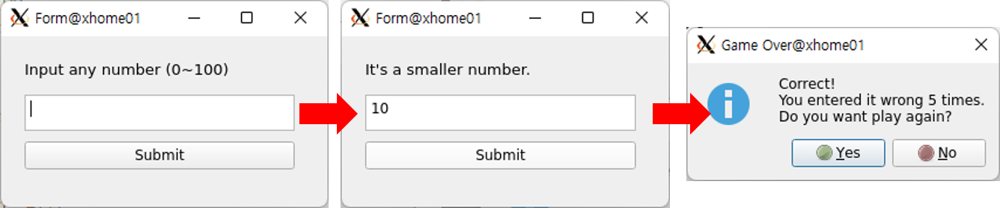

# GUI
GUI(Graphical User Interface)는 사용자가 컴퓨터와 상호작용할 수 있도록 도와주는 시각적인 인터페이스입니다. 명령어 기반의 CLI와 달리, 버튼, 창, 아이콘, 메뉴 등의 그래픽 요소를 통해 보다 직관적이고 사용자 친화적인 환경을 제공합니다. GUI는 CLI(Command Line Interface)에 비해 사용이 쉬우며, 시각적 요소 중심의 피드백을 통해 조작 편의성을 극대화 합니다. 

GUI 프로그램 개발은 다양한 프레임워크를 통해 빠르고 효율적으로 개발이 가능하며, 사용하는 프로그래밍 언어에 따라 효율적인 프레임워크를 선택해 개발할 수 있습니다. 파이썬을 이용하는 대표적인 프레임워크는 Qt, Tkinter, Kivy 등이 있습니다. 

## Qt  
Qt는 크로스 플랫폼 응용 프로그램 및 사용자 인터페이스(UI) 개발을 위한 C++ 기반의 프레임워크 입니다. Qt는 다양한 운영체제에서 동작하며, 이를 통해 개발자는 한 번의 코드 작성으로 여러 플랫폼에서 동작하는 어플리케이션을 만들 수 있습니다. 데스크톱, 모바일, 임베디드 장치 등 다양한 플랫폼을 지원합니다. 

 

Qt는 다양한 기능을 포함하고 있으며, 주요기능 및 상세 내용은 Qt 홈페이지를 참고하시기 바랍니다. 

- [Qt Home Page](https://qt.io/)

### Qt Python binding 
Qt 는 C++ 기반의 프레임워크입니다. 하지만 최근 파이썬 사용자가 늘어나면서 파이썬 기반에서 Qt를 활용할 수 있도록 여러곳에서 파이썬으로 바인딩된 라이브러리를 제공하고 있습니다. 이중 대표적으로 많이 활용되는 것이 PySide와 PyQt 입니다. 두가지 모두 사용이 가능하지만 라이선스나 지원 범위 APi등의 차이가 있습니다. 두가지의 차이점을 정리하면 다음과 같이 정리할 수 있습니다. 

| 항목 | PySide | PyQt |
|:-------|:------|:------|
| 정식 명칭 | Qt for Python | PyQt5 / PyQt6 | 
| 제작사 | Qt Company | Riverbank Computing | 
| 라이선스 | LGPL(무료 상업용 사용 가능) | GPL(무료) 또는 상업용 라이선스 유료 | 
| API 유사성 | Qt C++ API와 거의 동일 | 일부 비슷한 내용이 있지만, 함수 명칭 등의 차이가 있음 | 
| 최신 버전 | PySide6(Qt 6.x) | PyQt6(Qt 6.x) | 

## Visual Studio Code

Visual Studio Code(VSCode) 란 MS에서 Electron 프레임워크를 기반으로 개발된 무료 프로그램으로으로 추가로 원하는 확장 기능을 설치해야 IDE로 사용 가능합니다. 윈도우를 비롯해 리눅스 Mac을 모두 지원하며 파이썬을 비롯해 다양한 언어와 부가 기능을 수 많은 확장 기능으로 지원합니다.

### VSCode 설치 및 세팅

상술하였듯 VSCode 편집기를 IDE로 사용하기 위해선 다양한 Extension들을 설치해주고 직접 설정해주어야 하는 불편함이 있습니다. 한백전자에서는 이러한 불편함을 해소시키기 위해 Windows에서 VSCode 및 pwsh 등 여러 편리한 개발환경들을 자동으로 설치해주는 스크립트를 제공합니다. 설치하는 방법은 다음과 같습니다.

1. 위 링크에 접속한 후 설치에 필요한 zip 파일을 다운로드 받습니다. 그 후, 압축을 해제합니다.



&nbsp; [Installation files](https://github.com/hanback-lab/TiCLE/blob/main/tools/Environment_Install.zip)

2. 파일 탐색기를 열어 배치파일을 설치한 위치로 이동한 뒤, 탐색기 주소창에 'cmd' 라고 입력하여 명령 프롬프트 창을 띄웁니다.



<br>

3. 다음 명령어들을 순차적으로 실행합니다.

```sh
.\PrePkgInst.cmd
.\VSCodeInst.cmd
.\PostPkgInst.cmd
```


이 후, 파일 탐색기를 열어 다음 경로로 이동합니다.

```sh
C:\VSCode\
```

Code.exe 파일을 실행시켜 VSCode를 실행시킵니다.

### PySide 설치 
데스크톱이나 랩톱에 설치하는 경우에 다음과 같은 명령으로 설치하여 활용할 수 있습니다.
VSCode 의 상단 메뉴중 'Teminal->New Terminal' 을 실행 후 하단의 창에서 다음의 명령을 입력합니다. 

```sh 
> pip install pyside6 
```

## First Qt Program
처음 작성해볼 GUI 프로그램은 별다른 기능을 포함하지 않은 상태에서 1개의 창을 생성하는것 입니다. 

```python
import sys
from PySide6.QtWidgets import QApplication, QWidget

app = QApplication(sys.argv)

window = QWidget()
window.setWindowTitle('Empty Window program')
window.setGeometry(100, 100, 300, 240)
window.show()

app.exec()
```

### First Qt Program 주요 코드 설명
> **import sys**
> - sys.argv를 사용하기 위해 불러옵니다. Qt 프로그램은 실행 옵션(인자)을 QApplication에 전달할 수 있는데, 이때 보통 sys.argv를 그대로 넘겨줍니다.

> **from PySide6.QtWidgets import QApplication, QWidget**
> - QApplication은 Qt 애플리케이션 전체를 관리하는 객체이고, QWidget은 가장 기본이 되는 `창/위젯` 클래스입니다.

> **app = QApplication(sys.argv)**
> - Qt GUI 프로그램은 반드시 QApplication 객체가 필요합니다. 운영체제 이벤트(마우스, 키보드, 창 이벤트 등)를 처리할 준비를 하고, 이후 app.exec()로 이벤트 루프를 실행하게 됩니다.

> **window = QWidget()**
> - 실제 화면에 나타날 `창` 객체를 생성합니다. QWidget은 단독으로 창이 될 수도 있고, 다른 위젯의 부모(컨테이너)가 될 수도 있습니다.

> **window.setWindowTitle('Empty Window program')**
> - 창의 제목 표시줄에 들어갈 텍스트를 설정합니다.

> **window.setGeometry(100, 100, 300, 240)**
> - 창의 위치와 크기를 한 번에 지정합니다. 의미는 (x, y, width, height)이며, 예제에서는 화면 좌표 (100,100) 위치에 가로 300, 세로 240 크기의 창을 만들겠다는 뜻입니다.

> **window.show()**
> - 창을 화면에 표시합니다. 이 호출이 없으면 객체는 만들어져도 화면에 나타나지 않습니다.

> **app.exec()**
> - 이벤트 루프를 시작합니다. GUI 프로그램은 사용자 입력이 올 때까지 계속 동작해야 하므로, 이 구문이 실행되면 프로그램은 이벤트를 처리하며 “계속 실행 상태”를 유지합니다.

프로그램 시작을 위해 PySide6.QtWidgets 모듈에서 QApplication과 QMainWindow 클래스를 import 합니다. 그리고 Qt 프로그램은 반드시 QApplication 객체를 가져야합니다. 
>- QApplication의 역할 
>    - 애플리케이션 초기화: 애플리케이션을 시작하기 위해 필요한 리소스를 초기화하고, 운영체제와의 상호 작용 설정
>    - 이벤트 루프 실행: app.exec() 메서드를 통해 애플리케이션의 이벤트 루프 시작
>        - 이벤트 루프는 마우스 클릭, 키보드 입력, 창 크기 조절 등 사용자의 입력과 시스템 이벤트를 처리하고, 이를 애플리케이션의 위젯에 전달하여 적절한 동작을 수행하도록 함
>    - 애플리케이션 설정 관리: 애플리케이션 전반의 설정, 스타일, 테마 등을 관리
>    - 위젯 트리 관리: 애플리케이션의 모든 위젯은 트리 형태로 구성됨
>        - QApplication 객체는 이 위젯 트리의 루트 역할을 하며, 위젯의 생성, 소멸, 관리 등을 담당
>    - 리소스 관리: 애플리케이션에서 사용하는 이미지, 폰트, 번역 파일 등의 리소스를 로드하고 관리

QWidget은 모든 사용자 인터페이스 객체의 기본 클래스입니다. 즉, 버튼, 레이블, 텍스트 상자 등 화면에 보이는 모든 UI 요소들은 QWidget을 상속받아 만들어집니다. QWidget은 자체적으로 화면에 나타날 수도 있고, 다른 QWidget 객체의 자식으로 포함되어 복잡한 UI를 구성하는 데 사용될 수도 있습니다.

 

## 시그널과 슬롯 
Qt의 시그널과 슬롯은 객체 간의 통신을 위한 강력한 메커니즘입니다. 마치 특정 사건을 알리는 신호와 이 신호에 반응하는 행동처럼, 시그널과 슬롯은 객체들이 서로 유기적으로 동작하도록 돕습니다.

시그널은 객체에서 특정 이벤트가 발생했을 때 방출되는 신호입니다. 예를 들어 버튼이 클릭되거나 값이 변경되는 등의 상황에서 시그널이 방출됩니다. 그에 반해 슬롯은 시그널에 연결된 함수로, 시그널이 방출될 때 자동으로 호출되어 특정 작업을 수행합니다.

시그널과 슬롯을 사용하면 객체 간의 직접적인 연결 없이도 유연하게 통신할 수 있으며, 코드의 재사용성과 유지보수성을 높일 수 있습니다.

## 위젯 시그널 처리 
Qt에서 위젯의 시그널 처리는 이벤트 기반 프로그래밍의 핵심입니다. 사용자 인터페이스에서 발생하는 다양한 이벤트(마우스 클릭, 키보드 입력, 창 크기 조정 등)에 대해 위젯이 어떻게 반응하고 동작할지 결정하는 방식입니다.

위젯의 시그널 처리 과정은 다음과 같습니다.

- 이벤트 발생: 사용자가 버튼을 클릭하거나 텍스트 상자에 입력하는 등의 동작을 하면 위젯에서 이벤트가 발생함
- 시그널 방출: 이벤트가 발생하면 위젯은 해당 이벤트에 해당하는 시그널 방출
- 슬롯 연결: 개발자는 시그널과 슬롯을 연결하여 특정 시그널이 방출될 때 어떤 함수(슬롯)가 실행될지 지정
- 슬롯 실행: 시그널이 방출되면 연결된 슬롯 함수가 자동으로 호출되어 이벤트에 대한 동작 수행

## Label & Button 
Label과 PushButton은 GUI에서 가장 기본적이며 자주 사용되는 위젯입니다.

Label은 텍스트나 이미지를 표시하는 용도로 사용되며, 주로 정보를 전달하는 데 활용됩니다.
다만 Label은 사용자 입력이나 이벤트에 대한 직접적인 상호작용 기능은 제공하지 않습니다.

반면, PushButton은 사용자가 특정 동작을 수행하도록 유도할 때 사용됩니다.
예를 들어, 버튼을 클릭하여 프로그램을 실행하거나 기능을 전환하는 등의 인터랙션에 주로 활용됩니다.

아래 코드는 2개의 Label 과 2개의 PushButton 을 배치하고, PushButton 을 클릭 할때 Label 의 출력되고 있는 문자를 변경하는 코드입니다. 

```python
import sys
from PySide6.QtWidgets import QApplication, QWidget, QLabel, QPushButton
from PySide6.QtCore import Qt

class Window(QWidget):
    def __init__(self):
        super().__init__()
        self.setWindowTitle('Label')
        self.setGeometry(100, 100, 300, 240)

        self.label1 = QLabel(self)
        self.label1.setGeometry(10,10,100,30)
        self.label1.setAlignment(Qt.AlignmentFlag.AlignCenter)
        self.label1.setText('Label 1')
        self.font1 = self.label1.font()
        self.font1.setPointSize(20)
        self.label1.setFont(self.font1)

        self.btn1 = QPushButton(self)
        self.btn1.setGeometry(130, 10, 50, 30)
        self.btn1.setText("Push")
        self.btn1.clicked.connect(self.on_clicked1)

        self.label2 = QLabel(self)
        self.label2.setAlignment(Qt.AlignmentFlag.AlignRight)
        self.label2.setGeometry(10,70,100,30)
        self.label2.setText('Label 2')
        self.font2 = self.label2.font()
        self.font2.setPointSize(15)
        self.font2.setFamily('Times New Roman')
        self.font2.setBold(True)
        self.label2.setFont(self.font2)
        self.label2.setStyleSheet("color : green; background-color: white")

        self.btn2 = QPushButton(self)
        self.btn2.setGeometry(130, 70, 50, 30)
        self.btn2.setText("Push")
        self.btn2.clicked.connect(self.on_clicked2)

        self.btn1_toggle = True
        self.btn2_toggle = True

    def on_clicked1(self):
        if self.btn1_toggle:
            self.label1.setText("Hi")
            self.btn1_toggle = False
        else:
            self.label1.setText("Bye")
            self.btn1_toggle = True

    def on_clicked2(self):
        if self.btn2_toggle:
            self.label2.setText("On")
            self.btn2_toggle = False
        else:
            self.label2.setText("Off")
            self.btn2_toggle = True

app = QApplication(sys.argv)

window = Window()
window.show()

app.exec()
```

### Label & Button 주요 코드 설명
> **class Window(QWidget)**
> - QWidget을 상속받아 `하나의 창(Window)`을 클래스로 구성합니다. 이렇게 만들면 위젯(라벨/버튼)들을 self에 묶어서 관리하기 쉬워집니다.

> **self.setWindowTitle(...) / self.setGeometry(...)**
> - 창의 제목과 위치/크기를 설정합니다.

> **self.label1 = QLabel(self)**
> - label1을 생성하면서 부모를 self(창)로 지정합니다. 부모가 지정된 위젯은 창 안에 포함되어 함께 표시/관리됩니다.

> **self.label1.setGeometry(...)**
> - 라벨의 위치와 크기를 지정합니다. 여기서도 (x, y, width, height) 순서로 해석합니다.

> **self.label1.setAlignment(Qt.AlignmentFlag.AlignCenter)**
> - 라벨 내부 텍스트의 정렬을 중앙으로 맞춥니다.

> **self.font1 = self.label1.font() ... self.label1.setFont(self.font1)**
> - 라벨이 사용하는 폰트 객체를 가져와(font()), 크기(setPointSize)를 바꾼 뒤 다시 적용합니다.

> **self.btn1 = QPushButton(self) ... self.btn1.clicked.connect(self.on_clicked1)**
> - 버튼을 만들고, 클릭 시 발생하는 clicked 시그널을 on_clicked1 슬롯(함수)에 연결합니다. 즉, 사용자가 버튼을 누르면 on_clicked1()이 자동 호출됩니다.

> **self.btn1_toggle / self.btn2_toggle**
> - 버튼을 누를 때마다 상태가 바뀌도록(토글) 하기 위한 플래그 변수입니다. True/False를 번갈아 바꾸면서 라벨 텍스트를 `Hi/Bye`, `On/Off`로 교체합니다.

> **def on_clicked1(self): ...**
> - btn1_toggle 값에 따라 라벨 텍스트를 바꾸고, 플래그를 반대로 뒤집습니다.

> **self.label2.setStyleSheet("color : green; background-color: white")**
> - 라벨의 글자색/배경색을 스타일시트로 지정합니다. 예제 화면에서 label2가 시각적으로 구분되도록 만든 설정입니다.

작성된 코드는 2개의 Label을 생성하여 각각 'Label 1', 'Label 2' 라는 문자를 설정하여 출력하고, 2개의 PushButton은 'Push' 문자를 설정하여 출력합니다.

Label 과 PushButton 에 설정된 문자는 setAlignment() 를 통해 정렬 기능을 사용할 수 있습니다. 설정가능한 정렬 기능은 다음과 같습니다. '|' 를 통해 조합하여 활용도 가능합니다. 

- Qt.AlignmentFlag.AlignLeft : 좌측 정렬 
- Qt.AlignmentFlag.AlignCenter : 중앙 정렬 
- Qt.AlignmentFlag.AlignRight : 우측 정렬 
- Qt.AlignmentFlag.AlignTop : 상단 정렬 
- Qt.AlignmentFlag.AlignBottom : 하단 정렬 

PushButton을 사용자가 클릭 했을때 발생하는 이벤트를 처리하기 위해 2개의 메소드를 작성하여 clicked.connect() 를 통해 연결합니다. 
사용자가 버튼을 클릭했을때 연결된 메소드가 호출되어 실행되며, 이때 원하는 액션을 구현하면됩니다. 앞의 코드는 Label 의 문자를 변경합니다. 

 

## LineEdit
LineEdit 은 한줄의 문자열 혹은 숫자를 입력할 수 있는 위젯입니다. 여러줄의 문자열을 입력받고 싶은 경우에는 TextEdit을 활용하면 됩니다. 

LineEdit의 기능중 setEchoMode() 를 활용하여 일반적인 문자를 입력받는 경우와 비밀번호와 같이 외부에 노출어서는 안 되는 정보를 입력받는 기능을 구현해보겠습니다. 

```python
import sys
from PySide6.QtWidgets import QApplication, QWidget, QLabel, QLineEdit

class Window(QWidget):
    def __init__(self):
        super().__init__()

        self.label1 = QLabel('Normal Mode Line Edit',self)
        self.label1.move(80, 50)

        self.le1 = QLineEdit(self)
        self.le1.move(80, 100)
        self.le1.textChanged[str].connect(self.onLine1Changed)

        self.label2 = QLabel('Password Mode Line Edit',self)
        self.label2.move(80, 150)

        self.le2 = QLineEdit(self)
        self.le2.setEchoMode(QLineEdit.Password)
        self.le2.move(80, 200)
        self.le2.textChanged[str].connect(self.onLine2Changed)

        self.show()
        self.resize(300,300)

    def onLine1Changed(self, text):
        self.label1.setText(text)
        self.label1.adjustSize()

    def onLine2Changed(self, text):
        self.label2.setText(text)
        self.label2.adjustSize()

app = QApplication(sys.argv)

window = Window()
window.show()

app.exec()
```

### LineEdit 주요 코드 설명
> **self.label1 = QLabel('Normal Mode Line Edit', self)**
> - 첫 번째 라벨을 만들면서 기본 안내 문구를 넣습니다.

> **self.label1.move(80, 50)**
> - move(x, y)는 위젯의 좌표만 간단히 옮길 때 사용합니다.

> **self.le1 = QLineEdit(self) / self.le1.textChanged[str].connect(self.onLine1Changed)**
> - 첫 번째 입력창을 만들고, 입력 내용이 바뀔 때마다(textChanged) 슬롯 함수가 호출되도록 연결합니다. 따라서 사용자가 글자를 입력/삭제할 때마다 onLine1Changed(text)가 자동 실행됩니다.

> **self.le2.setEchoMode(QLineEdit.Password)**
> - 두 번째 입력창은 Password 모드로 설정하여 입력 문자가 그대로 보이지 않게 합니다.

> **onLine1Changed / onLine2Changed**
> - 전달받은 text를 라벨에 그대로 출력합니다. adjustSize()는 라벨 텍스트 길이에 맞춰 라벨 크기를 자동 조정하여, 글자가 잘리지 않도록 돕습니다.

> **self.show() / self.resize(300, 300)**
> - show()로 창을 표시하고, resize()로 창 크기를 지정합니다.

2개의 Label과 2개의 LienEdit 을 표기하고, LineEdit 에 문자를 입력하면 각 Label에 입력한 문자가 출력됩니다. 두개의 차이는 setEchoMode()의 설정 여부인데, QLineEdit.Password 로 설정하면 비밀번호 입력과 같이 입력된 문자가 표시되지 않습니다. 

 

## QTimer
QTimer는 지정된 시간 간격마다 특정 작업을 자동으로 수행하도록 도와주는 클래스입니다. 
주기적으로 화면을 갱신해야하거나, 일정 시간동안 동작 후 멈춰야하거나, 시간 제한 기능을 만들 때 사용됩니다. 

```python
import sys
from PySide6.QtWidgets import QApplication, QWidget, QLCDNumber, QMessageBox
from PySide6.QtCore import Signal, QTimer

class Window(QWidget):
    timeSignal = Signal(int)

    def __init__(self):
        super().__init__()
        self.setWindowTitle('Timer program')
        self.setGeometry(100, 100, 200, 120)

        self.timeSignal.connect(self.update_time)

        self.lcd = QLCDNumber(self)
        self.lcd.setGeometry(10,10,100,50)
        self.lcd.display(10)

        self.timer = QTimer(self)
        self.timer.setInterval(1000)
        self.timer.timeout.connect(self.timeout)
        self.timer.start()
    
    def timeout(self):
        self.timeSignal.emit(self.lcd.intValue())

    def update_time(self, value):
        if value == 0:
            QMessageBox.information(self, 'Time Over', 'Time Over!', QMessageBox.StandardButton.Ok)
            self.timer.stop()
        else:
            self.lcd.display(str(value-1))

app = QApplication(sys.argv)

window = Window()
window.show()

app.exec()
```

### QTimer 주요 코드 설명
> **timeSignal = Signal(int)**
> - Window 클래스에 정수(int)를 전달하는 시그널을 하나 정의합니다.

> **self.timeSignal.connect(self.update_time)**
> - timeSignal이 발생(emit)하면 update_time(value)가 호출되도록 연결합니다. 즉, 타이머 → 시그널 emit → update_time 실행 흐름이 됩니다.

> **self.lcd = QLCDNumber(self) / self.lcd.display(10)**
> - LCD 형태로 숫자를 표시하는 위젯을 만들고, 초기 표시 값을 10으로 설정합니다. 이 값이 카운트다운의 시작점이 됩니다.

> **self.timer = QTimer(self) / self.timer.setInterval(1000)**
> - 타이머 객체를 생성하고, 1초(1000ms) 간격으로 동작하도록 설정합니다.

> **self.timer.timeout.connect(self.timeout) / self.timer.start()**
> - 타이머가 1초마다 timeout 시그널을 발생시키면, 이를 self.timeout()에 연결해 실행합니다. start()를 호출해야 실제로 타이머가 동작합니다.

> **def timeout(self): self.timeSignal.emit(self.lcd.intValue())**
> - 타이머가 울릴 때마다 LCD에 현재 표시된 값을 읽어(intValue()), 그 값을 시그널로 내보냅니다. 여기서는 “값 계산을 timeout에서 직접 하지 않고, update_time으로 넘긴다”는 구조를 사용합니다.

> **def update_time(self, value):**
> - 전달받은 값이 0이면 메시지 박스를 띄우고 타이머를 멈춥니다. 0이 아니라면 LCD 표시 값을 1 감소시켜 갱신합니다.

작성한 프로그램은 10초간 카운트다운이 시작되며 0초가되면 메시지박스와 함께 종료되었음을 나타냅니다. 이때 카운트다운은 Timer를 통해 설정하는데 setInterval()에 설정된 값은 밀리초(ms) 입니다. 
타이머는 시그널 설정을하여 활용하는것이 일반적이며, 설정된 타이머 간격마다 시그널을 발생하여 동작을 수행합니다. 여기서는 1초마다 timeout() 메소드를 호출하도록 되어 있습니다. timeout 메소드에서는 현재 값을 전달하는데 전달된 값이 0 이면 메시지 박스를 호출하여 종료되었음을 알리고, 아니라면 1씩 감소하여 LCD에 갱신합니다. 

 

## 숫자 맞추기 게임 
단순한 숫자 맞추기 게임을 구현해 보겠습니다. 구현할 게임은 다음의 조건을 충족해야합니다. 
>- 정보 표기 Label 
>    - 처음 실행시 입력 숫자 범위 안내 
>    - 숫자 입력 후 버튼 클릭에 따라 입력한 숫자가 생성된 목표에 비교하여 큰 값인지, 작은값인지 표기 
>    - 정답을 맞췄을때 'Game Over.' 문구를 통해 종료됨을 안내 
>- 숫자 입력 TextEdit
>- 결과 확인 PushButton
>    - 버튼 클릭 시, 입력된 숫자를 정답과 비교해 정답이 아니면 안내 문구를 Label에 표시
>    - 정답인 경우 메시지 박스를 출력하여 게임이 종료됨을 알리고, 몇번만에 숫자를 맞췄는지 표기 
>    - 새로운 게임을 시작할것인지 물어보며, Yes인 경우 난수를 다시 생성하고 게임을 다시 시작하며 No라면 현재 상태 유지 
>- 난수 생성 
>    - 게임 시작 및 재시작의 경우에 난수를 생성하며, 1~100 의 값을 지니도록 설정 

### UI 구성 
UI는 다음 코드와 같이 작성할 수 있습니다. 창의 크기는 279x146 으로 설정되어 있으며 TextEdit, PushButton, Label을 각각 1개씩 배치합니다. 

각 위젯은 setGeometry()를 통해 위치를 설정합니다. 여기서 QRect()에 전달되는 4개의 숫자는 (x 좌표 시작, y 좌표 시작, 가로 넓이, 세로 넓이) 입니다. 

아래 코드는 num_ui.py 로 저장합니다. 
```python
from PySide6 import QtCore, QtGui, QtWidgets

class Ui_Form(object):
    def setupUi(self, Form):
        Form.setObjectName("Form")
        Form.resize(279, 146)
        self.textEdit = QtWidgets.QTextEdit(parent=Form)
        self.textEdit.setGeometry(QtCore.QRect(20, 50, 231, 31))
        self.textEdit.setObjectName("textEdit")
        self.submitBtn = QtWidgets.QPushButton(parent=Form)
        self.submitBtn.setGeometry(QtCore.QRect(20, 90, 231, 24))
        self.submitBtn.setObjectName("submitBtn")
        self.infoLabel = QtWidgets.QLabel(parent=Form)
        self.infoLabel.setGeometry(QtCore.QRect(20, 20, 181, 16))
        font = QtGui.QFont()
        font.setPointSize(10)
        self.infoLabel.setFont(font)
        self.infoLabel.setObjectName("infoLabel")

        self.retranslateUi(Form)
        QtCore.QMetaObject.connectSlotsByName(Form)

    def retranslateUi(self, Form):
        _translate = QtCore.QCoreApplication.translate
        Form.setWindowTitle(_translate("Form", "Form"))
        self.submitBtn.setText(_translate("Form", "Submit"))
        self.infoLabel.setText(_translate("Form", "Input any number (0~100)"))
```

#### UI 구성 코드 주요 설명
> **from PySide6 import QtCore, QtGui, QtWidgets**
> - UI 코드에서 필요한 모듈을 한 번에 가져옵니다. 위젯은 QtWidgets, 좌표/사각형 관련은 QtCore, 폰트는 QtGui가 주로 담당합니다.

> **class Ui_Form(object) / def setupUi(self, Form)**
> - UI를 구성하는 클래스를 정의하고, setupUi()에서 실제 위젯들을 생성해 Form(부모 위젯)에 붙입니다.

> **Form.resize(279, 146)**
> - 전체 창(Form)의 초기 크기를 지정합니다.

> **self.textEdit = QtWidgets.QTextEdit(parent=Form)**
> - 숫자 입력을 받을 TextEdit 위젯을 생성하고, 부모를 Form으로 지정합니다.

> **setGeometry(QtCore.QRect(...))**
> - 위젯의 위치/크기를 사각형(Rect)으로 지정합니다.

> **self.submitBtn / self.infoLabel**
> - 버튼과 안내 라벨을 생성하고, 동일한 방식으로 위치/크기를 설정합니다.

> **font = QtGui.QFont(); font.setPointSize(10); self.infoLabel.setFont(font)**
> - 안내 라벨의 폰트 크기를 10pt로 지정합니다.

> **self.retranslateUi(Form)**
> - 위젯에 표시될 문자열(창 제목, 버튼 텍스트, 라벨 텍스트)을 설정합니다.

> **QtCore.QMetaObject.connectSlotsByName(Form)**
> - Qt Designer 기반 UI 코드에서 흔히 포함되는 연결 함수 호출입니다.

이렇게 작성된 코드는 동작 구현 코드에서 import 하여 사용 가능합니다. 여기서 작성한 UI 코드는 위젯의 위치나 크기 등을 하나씩 코드로 작성해야 하기 때문에 불편함이 있습니다. 

### 숫자 맞추기 어플리케이션 
이제 앞서 작성한 UI 코드를 활용하여 창을 실행하고 게임 동작에 관련된 코드를 작성하여 게임을 실행해보도록 하겠습니다. 우선 작성할 코드의 전체 내용은 다음과 같습니다. 

```python
import sys
import random
from PySide6.QtWidgets import QApplication, QWidget, QMessageBox
from num_ui import Ui_Form

class Window(QWidget):
    def __init__(self):
        super().__init__()
        self.ui = Ui_Form()
        self.ui.setupUi(self)
        self.init_ui()

    def init_ui(self):
        self.wrongCnt = 0
        self.correctNum = random.randint(1,101)
        self.ui.submitBtn.clicked.connect(self.check_num)
    
    def check_num(self):
        if int(self.ui.textEdit.toPlainText()) == self.correctNum:
            reply = QMessageBox.information(self, 'Game Over', f'Correct!\nYou entered it wrong {self.wrongCnt} times.\nDo you want play again?', QMessageBox.StandardButton.Yes | QMessageBox.StandardButton.No )
            if reply == QMessageBox.StandardButton.Yes:
                self.wrongCnt = 0
                self.correctNum = random.randint(1,101)
                self.ui.infoLabel.setText("Input any number (0~100)")
            else:
                self.ui.infoLabel.setText("Game Over.")
        else:
            self.wrongCnt += 1
            if int(self.ui.textEdit.toPlainText()) > self.correctNum:
                self.ui.infoLabel.setText("It's a bigger number.")
            else:
                self.ui.infoLabel.setText("It's a smaller number.")

app = QApplication(sys.argv)
window = Window()
window.show()
app.exec()
```

#### 숫자 맞추기 어플리케이션 주요 코드 설명
> **import random / random.randint(1,101)**
> - 정답 숫자를 난수로 만들기 위해 random을 사용합니다.

> **from num_ui import Ui_Form**
> - 앞에서 num_ui.py로 저장한 UI 클래스를 불러옵니다. 즉, “화면 구성(UI)”과 “동작 로직(게임)”을 분리한 구조입니다.

> **self.ui = Ui_Form(); self.ui.setupUi(self)**
> - UI 객체를 생성한 뒤, 현재 창(self)에 UI 위젯들을 실제로 배치합니다. 이 과정이 끝나면 self.ui.textEdit, self.ui.submitBtn, self.ui.infoLabel 같은 위젯을 사용할 수 있습니다.

> **self.init_ui()**
> - 게임에 필요한 초기값(오답 횟수, 정답 난수)과 시그널 연결(버튼 클릭)을 한 번에 설정하기 위한 초기화 함수 호출입니다.

> **self.wrongCnt = 0**
> - 사용자가 정답을 맞히기 전까지 `틀린 횟수`를 누적해서 세기 위한 변수입니다.

> **self.ui.submitBtn.clicked.connect(self.check_num)**
> - Submit 버튼이 클릭되면 check_num()이 실행되도록 연결합니다.

> **int(self.ui.textEdit.toPlainText())**
> - TextEdit에 입력된 문자열을 가져와 정수로 변환합니다.

> **QMessageBox.information(...)**
> - 정답이면 메시지 박스를 띄우고, 오답 횟수(wrongCnt) 정보를 함께 보여줍니다. 또한 Yes/No 버튼을 함께 제공하여 “재시작 여부”를 선택하게 합니다.

> **reply == QMessageBox.StandardButton.Yes**
> - 사용자가 Yes를 눌렀다면 게임을 재시작합니다. 오답 횟수를 0으로 만들고, 정답 난수를 다시 생성하며, 안내 라벨 문구도 초기 상태로 되돌립니다.

> **reply가 No인 경우: self.ui.infoLabel.setText("Game Over.")**
> - No를 선택하면 안내 라벨에 “Game Over.”를 표시해 종료 상태임을 보여줍니다.

> **정답이 아닌 경우: wrongCnt 증가 + 큰/작은 힌트 출력**
> - 오답이면 wrongCnt를 1 증가시키고, 입력값이 정답보다 큰지/작은지에 따라 힌트 문구를 라벨에 출력합니다. 이 과정을 반복하면서 사용자가 정답에 점점 가까워지도록 유도합니다.

구성은 단순합니다. 게임이 시작되면 1~100 숫자중 1개의 난수를 정답으로 저장하고 사용자가 입력한 숫자가 있다면 정답과 비교하여 정답이 아닌경우 현재 입력한 숫자가 큰 숫자인지, 작은 숫자인지 Label에 출력합니다. 이를 반복하여 정답을 맞추면 메시지 박스와 함께 정답을 몇 번 만에 맞췄는지 나타냅니다. 

QMessageBox 는 별도의 UI 구성 없이 알림 용도로 활용가능한 윈도우로 간단한 선택을 요구하거나, 정보를 알릴때 활용됩니다. 알리고 싶은 메시지를 작성하여 전달하면 되며, 선택 버튼 혹은 확인 버튼등을 추가 하고 싶다면 원하는대로 추가 가능합니다. 아래 그림은 게임 실행 과정을 간략하게 표현한 그림입니다. 


