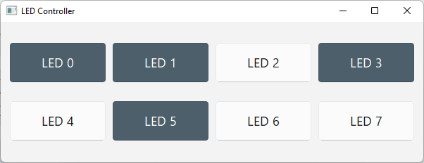
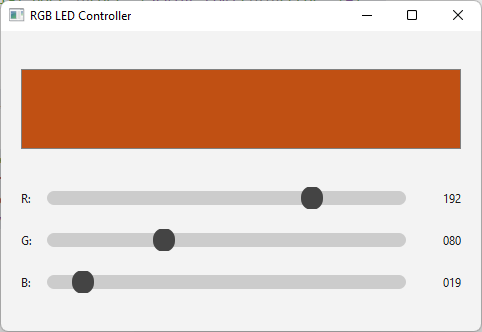
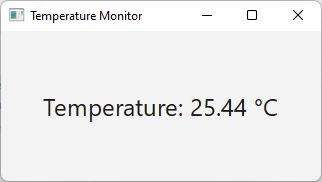

# GUI 기반 제어 
앞서 실습한 Qt 프로그램을 기반으로, PC에서 직접 장치를 제어하거나 센서 데이터를 확인하는 GUI 프로그램을 작성해 보겠습니다.

GUI를 활용하면 사용자가 버튼, 슬라이더 등을 이용해 직관적으로 장치를 다룰 수 있으며, Serial 통신을 통해 아두이노와 실시간으로 데이터를 교환할 수 있습니다.

아래 예제들은 “PC(PySide6) ↔ 아두이노(Serial)” 방식으로 동작하며,
Qt의 GUI 요소와 시리얼 통신을 함께 활용하는 기초적인 하드웨어 연동 실습입니다.

## 주의 사항 
Serial 통신에 사용되는 포트는 동시에 하나의 프로그램만 접근할 수 있습니다. 아두이노 Mega2560 의 기본 Serial 은 USB와 연결되어 있고 이를 통해 프로그램 다운로드 및 각종 정보 출력, 키보드 입력등을 받을 수 있습니다. 

아두이노 IDE 의 Serial Monitor도 Serial 을 활용하고 있으며, 이때 외부 프로그램(예: Qt등)에서 접근은 불가능합니다. 반대로 외부 프로그램이 포트를 활용중인 상태에서 아두이노에 프로그램을 다운로드하거나, 아두이노 IDE의 Serial Monitor 도 정상적인 활용이 어렵습니다. 

따라서, 아래 실습을 진행할 때는 아두이노 IDE의 Serial Monitor와 외부 Qt 프로그램이 동시에 같은 포트를 사용하지 않도록 주의해야 합니다.

## LED 제어 GUI 
LED 8개를 PC GUI에서 제어하는 예제입니다. Python(PySide6) 프로그램에서 버튼을 누르면 ON/OFF 상태를 시리얼로 전송하고, 아두이노는 이 값을 받아 LED 상태를 업데이트합니다.

### 하드웨어 연결 
LED는 아두이노 디지털 핀 4~11번에 연결되며, PC는 USB를 통해 아두이노와 연결됩니다.

| Pin | 연결 대상 | 설명 |
|:---:|:---:|:---|
| GND | GND | 접지 |
| 4 | D0 | LED 0 |
| 5 | D1 | LED 1 |
| 6 | D2 | LED 2 |
| 7 | D3 | LED 3 |
| 8 | D4 | LED 4 |
| 9 | D5 | LED 5 |
| 10 | D6 | LED 6 |
| 11 | D7 | LED 7 |


### 아두이노 프로그램 
아두이노는 시리얼로 1바이트(0~255) 를 전송받으면, 각 비트를 LED ON/OFF 정보로 해석하여 LED 핀에 반영합니다.

- 1바이트 8비트 → LED 8개 상태
- bit0 → LED0, bit1 → LED1 … bit7 → LED7
- Serial.read() 로 수신 → 비트 마스크 연산 → digitalWrite() 로 출력

```cpp
const int LED_PINS[8] = {4, 5, 6, 7, 8, 9, 10, 11};

void setup() {
  for (int i = 0; i < 8; i++) {
    pinMode(LED_PINS[i], OUTPUT);
    digitalWrite(LED_PINS[i], LOW);
  }
  Serial.begin(115200);
}

void loop() {
  if (Serial.available() > 0) {
    int value = Serial.read();
    for (int i = 0; i < 8; i++) {
      int bitState = (value >> i) & 0x01;
      digitalWrite(LED_PINS[i], bitState ? HIGH : LOW);
    }
  }
}
```

#### 아두이노 프로그램 주요 코드 설명
> **const int LED_PINS[8] = {4, 5, 6, 7, 8, 9, 10, 11};**
> - LED 8개가 연결된 디지털 핀 번호를 배열로 정리합니다.

> **pinMode(LED_PINS[i], OUTPUT);**
> - LED가 연결된 핀을 출력 모드로 설정합니다. 출력 모드로 설정해야 digitalWrite()로 HIGH/LOW를 줄 수 있습니다.

> **digitalWrite(LED_PINS[i], LOW);**
> - 프로그램 시작 직후 LED가 모두 꺼진 상태(LOW)에서 시작하도록 초기 상태를 잡아줍니다.

> **Serial.begin(115200);**
> - PC(Qt)와 통신하기 위한 시리얼 통신 속도를 설정합니다. Qt 프로그램의 BAUDRATE(115200)과 동일해야 정상 통신됩니다.

> **if (Serial.available() > 0)**
> - 시리얼 수신 버퍼에 읽을 데이터가 있는지 확인합니다. 데이터가 없을때 불필요한 동작을 방지하는 효과가 있습니다. 

> **int value = Serial.read();**
> - PC에서 보낸 1바이트 값을 읽어옵니다. 이 값(0~255)의 각 비트가 LED 8개의 ON/OFF 상태를 담고 있습니다.

> **int bitState = (value >> i) & 0x01;**
> - 핵심 비트 추출 코드입니다. value를 i만큼 오른쪽으로 이동시킨 뒤(& 1)로 마지막 비트만 남겨서, i번째 비트가 0인지 1인지 얻습니다.

> **digitalWrite(LED_PINS[i], bitState ? HIGH : LOW);**
> - 추출한 bitState가 1이면 HIGH(켜기), 0이면 LOW(끄기)를 출력합니다. 이렇게 해서 1바이트로 LED 8개 상태를 한 번에 업데이트합니다.

### Qt 프로그램 
Qt 프로그램은 다음과 같은 구조로 이루어져 있습니다.

1. 직렬 포트 열기
    - Python의 pyserial 라이브러리를 이용하여 아두이노가 연결된 포트를 엽니다. 시리얼 포트가 정상적으로 열렸는지 확인하여, 오류 시 메시지를 보여줍니다.
2. LED 상태 저장
    - 버튼 8개의 현재 상태(ON/OFF)를 리스트로 저장합니다.
3. GUI 구성
    - 버튼 8개를 2행 × 4열 GridLayout에 배치
    - 각 버튼을 Toggle(토글) 형태로 설정
    - 버튼 클릭 시 LED 상태를 변경하고, 즉시 시리얼로 전송
4. LED 상태 전송
    - 버튼 상태 리스트를 하나의 1바이트(bit mask)로 변환하여 아두이노로 전송합니다.
    - bit로 묶어 하나의 정수로 만들기
5. 종료 처리
    - 창을 닫을 때 시리얼 포트를 정리(close)하여 안전하게 종료됩니다.

```python
import sys
import serial
from PySide6.QtWidgets import (
    QApplication, QWidget, QPushButton, QGridLayout, QMessageBox
)

SERIAL_PORT = "COM10"
BAUDRATE = 115200

class LedControlApp(QWidget):
    def __init__(self):
        super().__init__()
        self.setWindowTitle("LED Controller")
        self.led_states = [0] * 8
        try:
            self.ser = serial.Serial(SERIAL_PORT, BAUDRATE, timeout=1)
        except serial.SerialException as e:
            self.ser = None
            QMessageBox.critical(
                self,
                "Serial Error",
                f"Failed to open serial port.\n"
                f"Port: {SERIAL_PORT}\n\nError: {e}"
            )

        self.init_ui()

    def init_ui(self):
        layout = QGridLayout()
        self.buttons = []

        for i in range(8):
            btn = QPushButton(f"LED {i}")
            btn.setCheckable(True)
            btn.setMinimumHeight(60)
            btn.setStyleSheet("font-size: 18px;")
            btn.toggled.connect(lambda checked, idx=i: self.on_button_toggled(idx, checked))
            self.buttons.append(btn)
            row = 1 + (i // 4)
            col = i % 4
            layout.addWidget(btn, row, col)

        self.setLayout(layout)
        self.resize(600, 200)

    def on_button_toggled(self, index: int, checked: bool):
        self.led_states[index] = 1 if checked else 0
        self.send_state_to_serial()

    def send_state_to_serial(self):
        mask = 0
        for i, state in enumerate(self.led_states):
            if state:
                mask |= (1 << i)

        if self.ser and self.ser.is_open:
            try:
                self.ser.write(bytes([mask]))
                self.ser.flush()
            except serial.SerialException as e:
                QMessageBox.critical(
                    self,
                    "Serial Error",
                    f"Error while sending data:\n{e}"
                )
        else:
            QMessageBox.warning(
                self,
                "Serial Not Open",
                "Serial port is not open.\nPlease check the port settings."
            )

    def closeEvent(self, event):
        if self.ser and self.ser.is_open:
            self.ser.close()
        event.accept()

def main():
    app = QApplication(sys.argv)
    window = LedControlApp()
    window.show()
    sys.exit(app.exec())

if __name__ == "__main__":
    main()
```

#### Qt 프로그램 주요 코드 설명
> **class LedControlApp(QWidget)**
> - LED 제어용 메인 윈도우 클래스입니다. QWidget을 상속받아 하나의 독립적인 GUI 창을 구성합니다.

> **self.led_states = [0] * 8**
> - LED 8개의 현재 상태를 저장하기 위한 리스트입니다. 각 인덱스는 LED 번호에 대응하며, 0은 OFF, 1은 ON 상태를 의미합니다.

> **serial.Serial(SERIAL_PORT, BAUDRATE, timeout=1)**
> - pyserial 라이브러리를 이용해 아두이노와 직렬 통신을 시작합니다. 포트가 열리지 않을 경우 예외를 발생시키며, 이때 사용자에게 오류 메시지를 출력합니다.

> **btn.setCheckable(True)**
> - 버튼을 토글 버튼으로 설정합니다. 버튼을 누를 때마다 눌림/해제 상태가 유지되며, LED의 ON/OFF 상태와 직접적으로 연결됩니다.

> **btn.toggled.connect(lambda checked, idx=i: self.on_button_toggled(idx, checked))**
> - 버튼의 토글 상태가 변경될 때 on_button_toggled() 메서드가 호출됩니다. lambda를 사용해 버튼 번호(idx)를 함께 전달함으로써 하나의 함수로 여러 버튼을 처리합니다.

> **self.led_states[index] = 1 if checked else 0**
> - 버튼의 상태에 따라 해당 LED의 상태를 리스트에 저장합니다.

> **mask |= (1 << i)**
> - LED 상태 리스트를 1바이트 비트 마스크로 변환하는 핵심 부분입니다. LED 상태를 비트 단위로 묶어 아두이노로 전송할 수 있도록 합니다.

> **self.ser.write(bytes([mask]))**
> - 계산된 비트 마스크 값을 1바이트 데이터로 아두이노에 전송합니다.

> **closeEvent()**
> - 프로그램 종료 시 시리얼 포트를 정상적으로 닫아 자원 누수를 방지합니다.



## RGB LED 제어 GUI 
이번 예제는 슬라이더 3개(R, G, B) 를 사용하여 RGB LED 색상을 제어하는 실습입니다.
PC GUI에서 RGB 값을 조절하면, 아두이노는 “R,G,B\n” 형태의 문자열을 수신하여 PWM을 적용합니다.

### 하드웨어 연결 
PWM 핀을 사용하므로 Red/Green/Blue 핀은 반드시 PWM 핀이어야 합니다.

| Pin | 연결 대상 | 설명 |
|:---:|:---:|:---|
| GND | GND | 접지 |
| 4 | R | Red |
| 5 | G | Green LED |
| 6 | B | Blue |


### 아두이노 프로그램 
다음에 작성된 프로그램의 동작 구조는 다음과 같습니다. 
- 문자열 "R,G,B\n" 을 수신
- sscanf 로 세 값을 분리
- analogWrite() 로 PWM 출력
- 0~255 범위로 제한(constrain)

```cpp
const int PIN_R = 4;
const int PIN_G = 5;
const int PIN_B = 6;

void setup() {
  pinMode(PIN_R, OUTPUT);
  pinMode(PIN_G, OUTPUT);
  pinMode(PIN_B, OUTPUT);

  analogWrite(PIN_R, 0);
  analogWrite(PIN_G, 0);
  analogWrite(PIN_B, 0);

  Serial.begin(115200);
}

void loop() {
  if (Serial.available()) {
    String line = Serial.readStringUntil('\n');

    int r, g, b;
    if (sscanf(line.c_str(), "%d,%d,%d", &r, &g, &b) == 3) {
      r = constrain(r, 0, 255);
      g = constrain(g, 0, 255);
      b = constrain(b, 0, 255);

      analogWrite(PIN_R, r);
      analogWrite(PIN_G, g);
      analogWrite(PIN_B, b);
    }
  }
}
```

#### 아두이노 프로그램 주요 코드 설명
> **const int PIN_R = 4; / PIN_G = 5; / PIN_B = 6;**
> - RGB LED의 각 채널(R/G/B)이 연결된 핀 번호를 상수로 선언합니다.

> **pinMode(PIN_R, OUTPUT) ...**
> - R/G/B 각 채널 핀을 출력 모드로 설정합니다.

> **analogWrite(PIN_R, 0) ...**
> - 시작 시 RGB 값이 모두 0(꺼짐) 상태가 되도록 초기 PWM 값을 설정합니다.

> **Serial.begin(115200);**
> - PC(Qt)에서 “R,G,B\n” 문자열을 받을 시리얼 통신을 시작합니다. Qt 프로그램과 통신 속도를 반드시 맞춥니다.

> **if (Serial.available()) { ... }**
> - 수신 데이터가 있을 때만 읽어서 처리합니다.

> **String line = Serial.readStringUntil('\n');**
> - 한 줄(개행 문자 \n까지)을 문자열로 읽어옵니다. Qt에서 “r,g,b\n” 형태로 보내므로, 한 번에 한 세트의 RGB 값을 받는 구조가 됩니다.

> **sscanf(line.c_str(), "%d,%d,%d", &r, &g, &b) == 3**
> - "숫자,숫자,숫자" 형태의 문자열을 r/g/b로 분리합니다. `== 3` 조건은 “정상적으로 3개의 값이 모두 읽혔다”는 뜻입니다.

> **r = constrain(r, 0, 255); ...**
> - PWM 허용 범위를 벗어나는 값이 들어와도 안전하게 0~255 범위로 제한합니다.

> **analogWrite(PIN_R, r); analogWrite(PIN_G, g); analogWrite(PIN_B, b);**
> - 각 채널에 PWM을 출력해 RGB LED 밝기(색상)를 제어합니다. 결과적으로 Qt 슬라이더에서 조절한 값이 그대로 LED 색으로 반영됩니다.

### Qt 프로그램 
Qt 프로그램은 다음과 같은 구조로 이루어져 있습니다.

1. 메인 UI 구성
    - 색상 미리보기 박스(Color Box)
    - R / G / B 슬라이더 3개
    - 각 슬라이더 오른쪽에 값 표시용 라벨(폭 고정)
2. 슬라이더 스타일 적용
    - Qt의 스타일시트를 사용해 슬라이더를 두껍게 만들고 클릭/드래그 시 조작이 편하도록 handle 크기를 조정합니다.
3. 슬라이더 값 변경 이벤트
    - 각 슬라이더의 값이 바뀌면 다음이 실행됩니다:
        - self.r, self.g, self.b 값 갱신
        - 라벨을 3자리 정수 형태(000~255)로 업데이트
        - 색 미리보기 박스를 업데이트
        - 시리얼로 "R,G,B\n" 전송
4. 시리얼 전송
    - 아두이노가 문자열을 쉽게 처리할 수 있도록 "128,64,255\n" 같은 CSV 포맷으로 보냅니다.
5. 종료 처리
    - 시리얼 포트를 닫고 안전하게 종료합니다.

```python
import sys
import serial
from PySide6.QtWidgets import (
    QApplication, QWidget, QSlider, QLabel, QGridLayout,
    QMessageBox, QVBoxLayout, QFrame
)
from PySide6.QtCore import Qt

SERIAL_PORT = "COM10"
BAUDRATE = 115200

class RgbControlApp(QWidget):
    def __init__(self):
        super().__init__()
        self.setWindowTitle("RGB LED Controller")

        self.r = 0
        self.g = 0
        self.b = 0

        try:
            self.ser = serial.Serial(SERIAL_PORT, BAUDRATE, timeout=1)
        except serial.SerialException as e:
            self.ser = None
            QMessageBox.critical(
                self,
                "Serial Error",
                f"Failed to open serial port.\nPort: {SERIAL_PORT}\n\nError: {e}"
            )

        self.init_ui()
        self.send_rgb()

    def init_ui(self):
        main = QVBoxLayout()
        main.setContentsMargins(20, 20, 20, 20)
        main.setSpacing(20)

        self.color_box = QFrame()
        self.color_box.setFixedHeight(80)
        self.color_box.setStyleSheet("background-color: rgb(0, 0, 0); border: 1px solid gray;")
        main.addWidget(self.color_box)

        grid = QGridLayout()
        grid.setVerticalSpacing(20)
        grid.setHorizontalSpacing(15)

        slider_style = """
            QSlider::groove:horizontal {
                height: 14px;
                background: #ccc;
                border-radius: 7px;
            }
            QSlider::handle:horizontal {
                width: 22px;
                background: #444;
                border-radius: 11px;
                margin: -5px 0;
            }
        """

        self.slider_r = QSlider(Qt.Orientation.Horizontal)
        self.slider_r.setRange(0, 255)
        self.slider_r.setValue(0)
        self.slider_r.valueChanged.connect(self.on_slider_r)
        self.slider_r.setStyleSheet(slider_style)

        self.label_r = QLabel("000")
        self.label_r.setFixedWidth(40)
        self.label_r.setAlignment(Qt.AlignmentFlag.AlignRight | Qt.AlignmentFlag.AlignVCenter)

        grid.addWidget(QLabel("R:"), 0, 0)
        grid.addWidget(self.slider_r, 0, 1)
        grid.addWidget(self.label_r, 0, 2)

        self.slider_g = QSlider(Qt.Orientation.Horizontal)
        self.slider_g.setRange(0, 255)
        self.slider_g.setValue(0)
        self.slider_g.valueChanged.connect(self.on_slider_g)
        self.slider_g.setStyleSheet(slider_style)

        self.label_g = QLabel("000")
        self.label_g.setFixedWidth(40)
        self.label_g.setAlignment(Qt.AlignmentFlag.AlignRight | Qt.AlignmentFlag.AlignVCenter)

        grid.addWidget(QLabel("G:"), 1, 0)
        grid.addWidget(self.slider_g, 1, 1)
        grid.addWidget(self.label_g, 1, 2)

        self.slider_b = QSlider(Qt.Orientation.Horizontal)
        self.slider_b.setRange(0, 255)
        self.slider_b.setValue(0)
        self.slider_b.valueChanged.connect(self.on_slider_b)
        self.slider_b.setStyleSheet(slider_style)

        self.label_b = QLabel("000")
        self.label_b.setFixedWidth(40)
        self.label_b.setAlignment(Qt.AlignmentFlag.AlignRight | Qt.AlignmentFlag.AlignVCenter)

        grid.addWidget(QLabel("B:"), 2, 0)
        grid.addWidget(self.slider_b, 2, 1)
        grid.addWidget(self.label_b, 2, 2)

        main.addLayout(grid)
        self.setLayout(main)
        self.resize(480, 300)

    def on_slider_r(self, v):
        self.r = v
        self.label_r.setText(f"{v:03d}")
        self.update_color()
        self.send_rgb()

    def on_slider_g(self, v):
        self.g = v
        self.label_g.setText(f"{v:03d}")
        self.update_color()
        self.send_rgb()

    def on_slider_b(self, v):
        self.b = v
        self.label_b.setText(f"{v:03d}")
        self.update_color()
        self.send_rgb()

    def update_color(self):
        self.color_box.setStyleSheet(
            f"background-color: rgb({self.r}, {self.g}, {self.b});"
            "border: 1px solid gray;"
        )

    def send_rgb(self):
        if self.ser and self.ser.is_open:
            try:
                msg = f"{self.r},{self.g},{self.b}\n"
                self.ser.write(msg.encode("ascii"))
            except serial.SerialException as e:
                QMessageBox.critical(self, "Serial Error", f"Error sending data:\n{e}")

    def closeEvent(self, e):
        if self.ser and self.ser.is_open:
            self.ser.close()
        e.accept()

def main():
    app = QApplication(sys.argv)
    w = RgbControlApp()
    w.show()
    sys.exit(app.exec())

if __name__ == "__main__":
    main()
```

#### Qt 프로그램 주요 코드 설명
> **self.r, self.g, self.b**
> - 현재 RGB LED의 Red, Green, Blue 값을 각각 저장하는 변수입니다. 각 값은 0~255 범위의 PWM 출력 값과 직접 대응됩니다.

> **QSlider(Qt.Orientation.Horizontal)**
> - 수평 방향 슬라이더를 생성하여 RGB 값을 직관적으로 조절할 수 있도록 합니다.

> **slider.setRange(0, 255)**
> - 아두이노의 PWM 범위에 맞추어 슬라이더 값을 0~255로 제한합니다.

> **valueChanged.connect(self.on_slider_x)**
> - 슬라이더 값이 변경될 때마다 대응되는 슬롯 함수가 호출되어 즉시 반영됩니다.

> **self.label_r.setText(f"{v:03d}")**
> - 현재 슬라이더 값을 항상 3자리 숫자로 표시하여 UI의 가독성을 높입니다.

> **update_color()**
> - 현재 RGB 값에 따라 색상 미리보기 박스의 배경색을 즉시 갱신합니다. 사용자는 실제 LED 색상을 보내기 전에 화면에서 미리 확인할 수 있습니다.

> **msg = f"{self.r},{self.g},{self.b}\n"**
> - 아두이노에서 쉽게 처리할 수 있도록 CSV 문자열 형태로 데이터를 구성합니다.

> **self.ser.write(msg.encode("ascii"))**
> - 문자열 데이터를 아두이노로 전송하여 PWM 출력에 반영되도록 합니다.



## 온도 센서 모니터링 GUI
이번에는 온도 센서의 값을 모니터링 하는 GUI 입니다. Label 에 수신된 데이터를 주기적으로 갱신합니다. 

### 하드웨어 연결 

| Pin | 연결 대상 | 설명 |
|:---:|:---:|:---|
| 5V | +5V | 전원 |
| GND | GND | 접지 |
| 20 | SDA | I2C Data |
| 21 | SCL | I2C Clock |


### 아두이노 프로그램
아두이노 프로그램 동작은 다음과 같습니다.  
- 센서의 레지스터(0x00)에서 2바이트 읽기
- 12bit 온도 데이터로 변환
- 해상도: 0.0625°C
- 1초마다 시리얼로 출력

```cpp
#include <Wire.h>

#define TMP102_ADDR 0x48

void setup() {
  Wire.begin();
  Serial.begin(115200);
}

float readTemp() {
  Wire.beginTransmission(TMP102_ADDR);
  Wire.write(0x00);
  Wire.endTransmission(false);
  Wire.requestFrom(TMP102_ADDR, 2);

  int msb = Wire.read();
  int lsb = Wire.read();

  int16_t raw = ((msb << 8) | lsb) >> 4;
  if (raw & 0x800) raw |= 0xF000;

  return raw * 0.0625;
}

void loop() {
  float t = readTemp();
  Serial.println(t, 2);

  delay(1000);
}
```

#### 아두이노 프로그램 주요 코드 설명
> **#include <Wire.h>**
> - I2C 통신을 사용하기 위해 Wire 라이브러리를 포함합니다.

> **#define TMP102_ADDR 0x48**
> - TMP102 센서의 I2C 주소를 상수로 정의합니다.

> **void setup() { Wire.begin(); Serial.begin(115200); }**
> - Wire.begin()으로 I2C 통신을 시작합니다. Serial.begin(115200)으로 PC(Qt)로 온도 값을 출력할 시리얼 통신을 시작합니다.

> **float readTemp() { ... }**
> - TMP102에서 온도를 읽어 float 값(섭씨)으로 반환하는 함수입니다.

> **Wire.beginTransmission(TMP102_ADDR);**
> - I2C 통신을 시작하고, 대상 장치(TMP102)를 지정합니다.

> **Wire.write(0x00);**
> - TMP102의 온도 레지스터(0x00)를 읽겠다는 의미로 레지스터 주소를 지정합니다.

> **Wire.endTransmission(false);**
> - 전송을 끝내되(false), 버스를 완전히 놓지 않고 다음 요청(requestFrom)과 이어지는 형태로 동작합니다.

> **Wire.requestFrom(TMP102_ADDR, 2);**
> - TMP102로부터 2바이트를 읽어옵니다. TMP102의 온도 데이터가 2바이트로 제공되기 때문입니다.

> **int msb = Wire.read(); / int lsb = Wire.read();**
> - 상위 바이트(MSB)와 하위 바이트(LSB)를 순서대로 읽어옵니다.

> **int16_t raw = ((msb << 8) | lsb) >> 4;**
> - 두 바이트를 합쳐 16비트 값으로 만들고, 필요 없는 하위 비트를 제거하기 위해 4비트 오른쪽 시프트합니다.

> **if (raw & 0x800) raw |= 0xF000;**
> - 온도가 음수일 수 있는 경우를 처리하는 코드입니다. 부호 비트가 설정되어 있으면(음수 범위) 상위 비트를 채워 음수 값으로 확장합니다.

> **return raw * 0.0625;**
> - TMP102의 해상도(LSB 단위)가 0.0625°C이므로, raw 값에 곱해 실제 섭씨 온도를 계산합니다.

> **void loop() { float t = readTemp(); Serial.println(t, 2); delay(1000); }**
> - 1초마다 온도를 읽고, 소수점 둘째 자리까지 출력합니다. Qt 프로그램은 이 한 줄을 받아 화면(Label)에 갱신합니다.

### Qt 프로그램 
1. 시리얼 초기화
    - TMP102 데이터는 1초마다 숫자(float) 한 줄이 전송되므로, Qt 프로그램에서는 시리얼을 읽고 문자열을 float로 변환합니다.
2. UI 구성
    - 가운데에 크게 온도 값 표시
    - "Temperature: 23.84 °C" 형태로 표시
    - 숫자가 변경될 때마다 바로 갱신
3. 타이머(QTimer) 사용
    - 1초마다 실행되는 타이머를 이용해 시리얼 버퍼에 쌓인 최신 데이터만 읽어냅니다.
    - 최신 줄만 반영 (오래된 줄 무시)
    - float 변환 실패 시 무시
4. 종료 처리
    - 창을 닫을 때 시리얼 포트를 정리합니다.

```python
import sys
import serial
from PySide6.QtWidgets import QApplication, QWidget, QLabel, QVBoxLayout, QMessageBox
from PySide6.QtCore import Qt, QTimer

SERIAL_PORT = "COM10"
BAUDRATE = 115200

class TempMonitorApp(QWidget):
    def __init__(self):
        super().__init__()
        self.setWindowTitle("Temperature Monitor")

        self.ser = None
        self.init_serial()
        self.init_ui()
        self.init_timer()

    def init_serial(self):
        try:
            self.ser = serial.Serial(SERIAL_PORT, BAUDRATE, timeout=0.1)
        except serial.SerialException as e:
            self.ser = None
            QMessageBox.critical(
                self,
                "Serial Error",
                f"Failed to open serial port.\nPort: {SERIAL_PORT}\n\nError: {e}",
            )

    def init_ui(self):
        layout = QVBoxLayout()
        layout.setContentsMargins(20, 20, 20, 20)
        layout.setSpacing(10)

        self.label_value = QLabel("Temperature: --.- °C")
        self.label_value.setAlignment(Qt.AlignmentFlag.AlignCenter)
        self.label_value.setStyleSheet("font-size: 24px;")
        layout.addWidget(self.label_value)

        self.setLayout(layout)
        self.resize(320, 150)

    def init_timer(self):
        self.timer = QTimer(self)
        self.timer.setInterval(1000)
        self.timer.timeout.connect(self.update_temperature)
        self.timer.start()

    def update_temperature(self):
        if not (self.ser and self.ser.is_open):
            return

        latest_line = None
        try:
            while self.ser.in_waiting > 0:
                line = self.ser.readline().decode("ascii", errors="ignore").strip()
                if line:
                    latest_line = line
        except serial.SerialException as e:
            QMessageBox.critical(self, "Serial Error", f"Error while reading data:\n{e}")
            return

        if latest_line is None:
            return

        try:
            temp = float(latest_line)
        except ValueError:
            return

        self.label_value.setText(f"Temperature: {temp:.2f} °C")

    def closeEvent(self, event):
        if self.ser and self.ser.is_open:
            self.ser.close()
        event.accept()

def main():
    app = QApplication(sys.argv)
    window = TempMonitorApp()
    window.show()
    sys.exit(app.exec())

if __name__ == "__main__":
    main()
```

#### Qt 프로그램 주요 코드 설명
> **QTimer(self)**
> - 일정 시간 간격으로 반복 동작을 수행하기 위한 타이머 객체입니다.

> **self.timer.setInterval(1000)**
> - 타이머를 1초 간격으로 설정하여 아두이노에서 전송되는 온도 데이터 주기와 맞춥니다.

> **self.timer.timeout.connect(self.update_temperature)**
> - 타이머가 동작할 때마다 update_temperature() 함수가 호출되어 온도 값을 갱신합니다.

> **while self.ser.in_waiting > 0:**
> - 시리얼 버퍼에 쌓인 데이터 중 가장 최신 데이터만 사용하기 위해 반복적으로 읽어옵니다.

> **line = self.ser.readline().decode(...).strip()**
> - 시리얼로 수신된 한 줄의 문자열을 읽어 디코딩한 뒤 공백을 제거합니다.

> **temp = float(latest_line)**
> - 문자열로 수신된 온도 값을 실수(float)로 변환합니다. 변환이 실패할 경우(ValueError) 해당 데이터는 무시됩니다.

> **self.label_value.setText(...)**
> - 변환된 온도 값을 소수점 둘째 자리까지 표시하여 화면에 갱신합니다.


