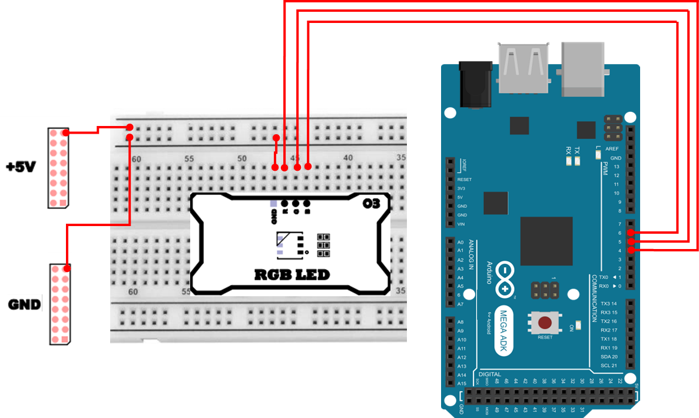

# 음성 인식
음성 인식(Speech Recognition)은 인간의 음성을 분석하여 컴퓨터가 이해할 수 있는 텍스트나 명령으로 변환하는 기술입니다.

스마트 스피커, 음성 비서, 차량용 음성 제어 시스템 등 다양한 장치에서 활용되며, 사람과 기계 간 상호작용을 더욱 자연스럽게 만들어줍니다.

특히 프로그래밍 환경에서는 마이크 입력을 기반으로 특정 단어를 인식하거나 장치를 직접 제어하는 등, 실습과 응용 범위가 매우 넓습니다.

## SpeechRecognition
SpeechRecognition 패키지는 STT(Speech To Text) 패키지들 중 가장 대표적인 라이브러리입니다. 이 패키지는 Host PC의 마이크 및 오디오 파일을 통해 음성 데이터를 확보한 후, 이를 음성인식 API와 통신하여 음성 데이터를 텍스트로 변환해줍니다.

또한, 간편한 설치와 함께 Google, Azure, OpenAI 등 다양한 STT API 서버를 지원합니다. 이 중 일부는 별도의 추가 설정 없이 바로 활용하실 수 있습니다.
본 매뉴얼에서는 Google Speech API를 활용하여 실습을 진행합니다. 다만, 기본 제공되는 무료 사용량은 한정되어 있으므로, 한도를 초과하면 기능 사용이 제한됩니다.

## SpeechRecognition 설치 
다음 명령을 이용해 필수 패키지를 설치합니다.

```sh
> pip install PyAudio
> pip install SpeechRecognition==3.9.0
```

## 첫번째 음성 인식 
다음 예제는 SpeechRecognition 라이브러리를 이용하여 간단히 음성인식을 수행하는 코드입니다. 정상적으로 음성이 인식되면 인식된 음성과 변환된 텍스트가 출력되며, 오류가 발생하면 해당 에러 메시지가 표시됩니다.

```python
import speech_recognition as sr

recognizer = sr.Recognizer()

with sr.Microphone() as source:
    print("Please speech...")
    audio = recognizer.listen(source)

try:
    print("Recognized text: " + recognizer.recognize_google(audio, language='en-US'))
except sr.UnknownValueError:
    print("Google Web Speech API can't understand your speech")
except sr.RequestError as e:
    print(f"Google Web Speech API has something error : {e}")
```

### 첫번째 음성 인식 주요 코드 설명
> **sr.Recognizer()**
> - 음성 인식을 수행하는 인식기(Recognizer) 객체를 생성합니다. 마이크로부터 받은 오디오를 분석하고, STT API 호출 결과를 받아 텍스트로 변환하는 역할을 합니다.

> **with sr.Microphone() as source:**
> - PC의 기본 마이크 입력 장치를 열어 오디오 소스로 사용합니다. with 블록을 사용하면 사용이 끝났을 때 장치가 안전하게 정리됩니다.

> **recognizer.listen(source)**
> - 마이크로부터 음성 데이터를 수집합니다. 사용자가 말한 내용을 오디오 데이터(audio)로 저장합니다.

> **recognizer.recognize_google(audio, language='en-US')**
> - 수집된 오디오 데이터를 Google Web Speech API에 전달하여 텍스트로 변환합니다. language='en-US'는 영어(미국) 인식 설정입니다.

> **except sr.UnknownValueError**
> - 음성은 수집되었지만, STT 결과가 불명확하여 텍스트로 변환하지 못한 경우 발생할 수 있는 예외입니다.

> **except sr.RequestError**
> - 네트워크 문제, API 서버 문제 등 “요청 자체”가 실패했을 때 발생하는 예외입니다. 에러 원인이 e로 전달됩니다.

## 음성 인식 후 키워드 추출하기
이번 단계에서는 인식된 텍스트로부터 특정 키워드를 추출하는 예제를 실습합니다.
이전 코드와 동일하게 음성을 인식한 뒤, 변환된 텍스트를 text_parsing 함수에 전달하면 해당 함수는 텍스트 내 특정 키워드를 탐색하여 결과를 반환합니다.

만약 'forward', 'backward', 'stop' 키워드 중 하나가 포함되어 있으면 해당 문자열을 반환하며, 키워드가 없을 경우 None을 반환합니다.

```python
import speech_recognition as sr

def text_parsing(text):
    text = text.strip()

    if 'forward' in text:
        return 'forward'
    elif 'backward' in text:
        return 'backward'
    elif 'stop' in text:
        return 'stop'
    else:
        return None

recognizer = sr.Recognizer()

with sr.Microphone() as source:
    print("Please speech...")
    audio = recognizer.listen(source)

try:
    text = recognizer.recognize_google(audio, language='en-US')
    print("Recognized text : " + text)
    print("Parsing text : " + str(text_parsing(text)))
except sr.UnknownValueError:
    print("Google Web Speech API can't understand your speech")
except sr.RequestError as e:
    print(f"Google Web Speech API has something error : {e}")
```

### 키워드 추출 주요 코드 설명
> **def text_parsing(text):**
> - STT 결과(문장/단어)에서 특정 키워드가 포함되어 있는지 검사하는 함수입니다. 포함 여부에 따라 명령 문자열을 반환하거나(None) 반환합니다.

> **text.strip()**
> - 텍스트의 앞뒤 공백/개행 등을 제거합니다. STT 결과에 불필요한 공백이 붙어 있어도 키워드 판별이 흔들리지 않도록 정리합니다.

> **if 'forward' in text:**
> - 문자열 포함 여부를 검사합니다. 예를 들어 “go forward please”처럼 문장 형태로 인식되더라도 forward가 포함되어 있으면 명령으로 판단합니다.

> **return 'forward' / 'backward' / 'stop'**
> - 판별된 키워드를 그대로 반환합니다. 이후 단계에서 이 반환값을 기반으로 장치 제어(또는 다른 동작)를 수행할 수 있습니다.

> **print("Parsing text : " + str(text_parsing(text)))**
> - text_parsing() 결과는 문자열 또는 None일 수 있으므로, str()로 감싸 출력 시 오류 없이 표시되도록 합니다.

## 음성 인식을 통한 장치 제어
이제 음성 인식 결과를 단순히 출력하는 수준을 넘어서, PC에서 인식한 음성 → 텍스트 → 키워드 → 시리얼(UART) 전송 → 아두이노에서 RGB LED 제어 까지 연동해보겠습니다.

전체 흐름은 다음과 같습니다.
1. PC에서 마이크 입력을 통해 음성을 받습니다.
2. SpeechRecognition + Google STT를 이용해 텍스트로 변환합니다.
3. 변환된 텍스트에서 색상 키워드를 추출합니다. (예: "red", "blue" 등)
4. 색상 키워드를 시리얼(UART)을 통해 아두이노 보드로 전송합니다.
5. 아두이노는 수신한 문자열을 분석하여 RGB LED 색상을 변경합니다.

### 하드웨어 연결 
PWM 핀을 사용하므로 Red/Green/Blue 핀은 반드시 PWM 핀이어야 합니다.

| Pin | 연결 대상 | 설명 |
|:---:|:---:|:---|
| GND | GND | 접지 |
| 4 | R | Red |
| 5 | G | Green LED |
| 6 | B | Blue |



### 아두이노 프로그램 
아두이노는 PC로부터 "RED", "GREEN", "BLUE" 등 문자열을 시리얼로 수신한 뒤, 해당 명령에 맞게 RGB LED의 색상을 변경합니다.

```cpp
const int PIN_RED   = 4;
const int PIN_GREEN = 5;
const int PIN_BLUE  = 6;

void setColor(bool r, bool g, bool b) {
  digitalWrite(PIN_RED,   r ? HIGH : LOW);
  digitalWrite(PIN_GREEN, g ? HIGH : LOW);
  digitalWrite(PIN_BLUE,  b ? HIGH : LOW);
}

void setup() {
  Serial.begin(115200);

  pinMode(PIN_RED,   OUTPUT);
  pinMode(PIN_GREEN, OUTPUT);
  pinMode(PIN_BLUE,  OUTPUT);
  setColor(false, false, false);

  Serial.println("RGB Voice Control Ready");
  Serial.println("Commands: RED, GREEN, BLUE, YELLOW, PURPLE, BLACK");
}

void loop() {
  if (Serial.available()) {
    String cmd = Serial.readStringUntil('\n');
    cmd.trim();
    cmd.toUpperCase();

    Serial.print("Received command: ");
    Serial.println(cmd);

    if (cmd == "RED") {
      setColor(true, false, false);
    } else if (cmd == "GREEN") {
      setColor(false, true, false);
    } else if (cmd == "BLUE") {
      setColor(false, false, true);
    } else if (cmd == "YELLOW") {
      setColor(true, true, false); 
    } else if (cmd == "PURPLE") {
      setColor(true, false, true);
    } else if (cmd == "BLACK") {
      setColor(false, false, false);
    } else {
      Serial.println("Unknown command");
    }
  }
}
```

#### 아두이노 프로그램 주요 코드 설명
> **const int PIN_RED / PIN_GREEN / PIN_BLUE**
> - RGB LED의 각 색상 채널을 연결한 아두이노 핀 번호를 상수로 정의합니다. 

> **pinMode(PIN_*, OUTPUT)**
> - 해당 핀을 출력 모드로 설정합니다. LED를 켜고 끄려면 아두이노가 전압(HIGH/LOW)을 “출력”해야 하므로 OUTPUT 설정이 필요합니다.

> **setColor(false, false, false)**
> - 시작 시 LED를 모두 끈 상태로 초기화합니다. 전원 인가 직후 예기치 않게 LED가 켜지는 상황을 방지합니다.

> **Serial.begin(115200)**
> - PC와 통신할 시리얼 속도를 설정합니다. PC 프로그램의 BAUDRATE와 반드시 동일해야 정상 통신이 됩니다.

> **if (Serial.available())**
> - 시리얼 버퍼에 읽을 데이터가 있는지 확인합니다. 데이터가 있을 때만 읽도록 하여 불필요한 읽기 동작을 줄입니다.

> **String cmd = Serial.readStringUntil('\n')**
> - PC에서 보낸 문자열을 “한 줄(개행 전까지)”로 읽어옵니다. PC 쪽에서 cmd + "\n" 형태로 전송하기 때문에, 아두이노는 \n 기준으로 명령을 분리합니다.

> **cmd.trim()**
> - 문자열 앞뒤의 공백, 개행 등을 제거합니다. 통신 과정에서 섞일 수 있는 불필요 문자를 제거하여 비교가 정확해지도록 합니다.

> **cmd.toUpperCase()**
> - 명령을 대문자로 통일합니다. 이후 cmd == "RED" 같은 비교를 할 때, 입력이 소문자/대문자여도 동일하게 처리할 수 있습니다.

> **if (cmd == "RED") { ... }**
> - 수신한 명령 문자열에 따라 setColor()에 전달할 RGB 조합을 결정합니다. 예를 들어 "YELLOW"는 빨강+초록을 켜서 구현합니다.

### PC 프로그램 
PC에서는 마이크를 통해 음성을 입력받고, 색상 키워드를 인식한 후 해당 색상 문자열을 시리얼 포트를 통해 아두이노로 전송합니다.

```python
import speech_recognition as sr
import serial
import time

SERIAL_PORT = "COM10"
BAUDRATE = 115200

def text_parsing(text: str):
    text = text.strip().lower()
    print(f"[DEBUG] raw text = '{text}'")

    if 'red' in text:
        return 'RED'
    elif 'blue' in text:
        return 'BLUE'
    elif 'green' in text:
        return 'GREEN'
    elif 'yellow' in text:
        return 'YELLOW'
    elif 'purple' in text or 'violet' in text:
        return 'PURPLE'
    elif 'black' in text:
        return 'BLACK'
    else:
        return None

def main():
    try:
        ser = serial.Serial(SERIAL_PORT, BAUDRATE, timeout=1)
        time.sleep(2)
        print(f"[INFO] Serial opened on {SERIAL_PORT} @ {BAUDRATE}bps")
    except Exception as e:
        print(f"[ERROR] Cannot open serial port: {e}")
        return

    recognizer = sr.Recognizer()
    while True:
        with sr.Microphone() as source:
            print("Say a color (red, blue, green, yellow, purple, black)...")
            audio = recognizer.listen(source)
        try:
            text = recognizer.recognize_google(audio, language='en-US')
            print("Recognized text :", text)

            cmd = text_parsing(text)
            print("Parsed command  :", cmd)

            if cmd is not None:
                ser.write((cmd + "\n").encode('utf-8'))
                print(f"[INFO] Sent to Arduino: {cmd}")
            else:
                print("[WARN] No valid color detected in your speech.")

        except sr.UnknownValueError:
            print("Google Web Speech API can't understand your speech")
        except sr.RequestError as e:
            print(f"Google Web Speech API error: {e}")
        except KeyboardInterrupt:
            print("\n[INFO] Exit by user")
            break

    ser.close()
    print("[INFO] Serial closed")

if __name__ == "__main__":
    main()
```

#### PC 프로그램 주요 코드 설명
> **SERIAL_PORT / BAUDRATE**
> - 아두이노와 연결된 시리얼 포트 이름과 통신 속도를 지정합니다. 아두이노의 Serial.begin(115200)과 PC의 BAUDRATE = 115200이 일치해야 합니다.

> **serial.Serial(SERIAL_PORT, BAUDRATE, timeout=1)**
> - 지정한 포트로 시리얼 통신을 엽니다. timeout=1은 읽기 동작에서 최대 1초까지 대기할 수 있도록 하는 설정입니다.

> **time.sleep(2)**
> - 시리얼 포트를 열면 일부 환경에서 아두이노가 리셋되는 경우가 있어, 초기화 시간을 잠시 기다린 뒤 통신을 시작합니다.

> **recognizer = sr.Recognizer()**
> - 마이크 오디오를 받아 STT를 수행하는 Recognizer 객체를 생성합니다. 이후 반복 루프에서 계속 재사용합니다.

> **with sr.Microphone() as source:**
> - 마이크 입력을 오디오 소스로 설정합니다. 반복 루프 내부에서 매번 마이크를 열고 닫는 구조로 되어 있습니다.

> **audio = recognizer.listen(source)**
> - 사용자가 말한 음성을 오디오 데이터로 수집합니다. 이 audio가 STT 변환 입력으로 사용됩니다.

> **text = recognizer.recognize_google(audio, language='en-US')**
> - Google STT를 이용해 오디오를 텍스트로 변환합니다. 변환된 텍스트가 text에 저장됩니다.

> **text_parsing(text)**
> - STT 결과 문장에서 색상 키워드를 찾아 아두이노가 이해할 수 있는 명령 문자열(예: "RED")로 변환합니다. text.strip().lower()로 먼저 전처리하여, 인식 결과가 문장 형태이거나 대소문자가 섞여 있어도 키워드 탐지가 되도록 합니다.

> **ser.write((cmd + "\n").encode('utf-8'))**
> - 명령 문자열 뒤에 \n(개행)을 붙여 전송합니다.

> **if cmd is not None: ... else: ...**
> - 인식 결과에 유효한 색상 키워드가 없을 경우, 아두이노로 잘못된 명령을 보내지 않도록 전송을 막고 경고 메시지만 출력합니다.

> **except sr.UnknownValueError / sr.RequestError**
> - 음성 인식 실패(해석 불가) 또는 API 요청 실패(네트워크/서버 문제)를 분리하여 처리합니다. 문제 상황을 구체적으로 구분해 확인할 수 있습니다.

> **except KeyboardInterrupt**
> - 사용자가 Ctrl + C로 종료했을 때 루프를 빠져나가도록 처리합니다.

> **ser.close()**
> - 프로그램 종료 시 시리얼 포트를 닫아 자원을 정리합니다. 포트를 닫지 않으면 다음 실행에서 포트가 점유되어 열리지 않는 문제가 생길 수 있습니다.