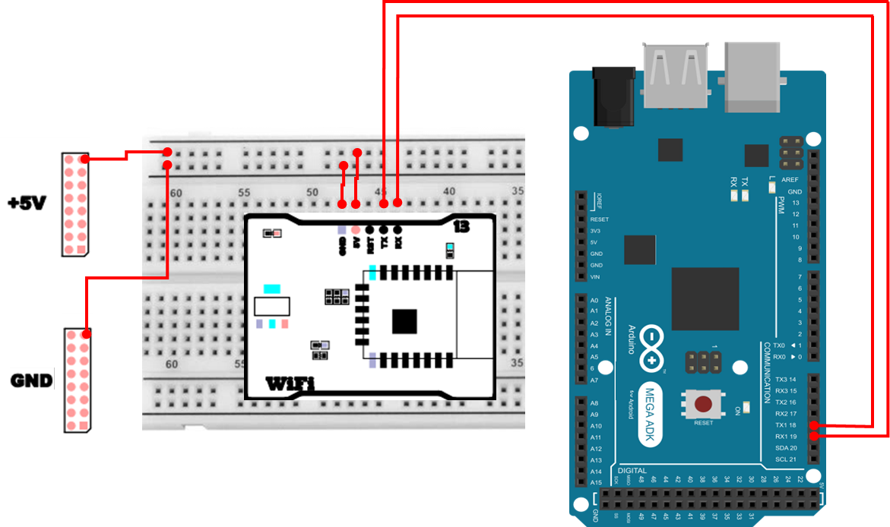

# Wi-Fi
## Wi-Fi란 무엇인가?
Wi-Fi는 전선을 사용하지 않고 무선 전파를 이용해 데이터를 송수신하는 통신 기술입니다. 주로 2.4GHz 또는 5GHz 대역에서 동작하며(최근에는 6GHz도 사용), 스마트폰·노트북·IoT 기기 등 대부분의 현대 전자기기가 이 기술을 통해 네트워크에 연결됩니다.

IoT(사물 인터넷) 분야에서 Wi-Fi는 다음과 같은 이유로 널리 사용됩니다:
- 케이블 없이 어디서나 연결 가능
  - 배선이 필요 없어 편리하며, 센서·장치 설치가 자유롭습니다.
- 네트워크 접속이 쉬움
  - 스마트홈, 모니터링 시스템, 웹 기반 제어 시스템에서 인터넷을 통한 원격 제어가 매우 간단합니다.
- 네트워크 통합에 유리
  - 스마트폰·PC·라즈베리파이 등 기존 네트워크 환경과 쉽게 통합할 수 있습니다.
- 비교적 높은 전송 속도
  - Bluetooth나 LoRa 같은 저속 무선보다 빠르고, ESP/WizFi 계열처럼 비교적 강력한 모듈을 이용하면 간단한 웹 서버까지 구동 가능합니다.

## 아두이노에서 Wi-Fi를 사용하는 방법
아두이노 UNO나 Mega2560 같은 기본 보드는 독자적으로 Wi-Fi 기능을 갖고 있지 않습니다. 따라서 별도의 무선 모듈을 연결해야 하며, 대표적인 방식은 다음과 같습니다:

1. UART 기반 Wi-Fi 모듈 (WizFi360, ESP8266 등)
  - AT Command 방식
  - 아두이노 ↔ 모듈 간 UART로 통신
  - 아두이노는 “명령 전송”, 모듈은 “Wi-Fi 기능 수행” 역할
  - 전력 소모와 동작 안정성이 좋아 교육 및 프로젝트에 널리 사용됨
2. 아두이노 Wi-Fi Shield
  - SPI 통신 기반 확장 보드
  - 상단에 바로 결합하여 사용

여기서는 UART 기반의 Wi-Fi 모듈을 활용합니다. 

## WizFi360 아두이노 라이브러리 설치 
WizFi360 모듈을 사용하려면 Arduino IDE에 라이브러리를 직접 설치해야 합니다.
이 라이브러리는 기본 라이브러리 매니저에서 검색되지 않으므로, GitHub 저장소에서 ZIP 파일을 다운로드하여 수동으로 추가합니다.
1. GitHub 저장소에서 ZIP 다운로드
    - [WizFi360 Arduino Library](https://github.com/Wiznet/WizFi360_arduino_library)
2. Arduino IDE → Sketch → Include Library → Add .ZIP Library…
3. 다운로드한 ZIP 파일 선택
4. 설치 후 File → Examples → WizFi360 메뉴에서 예제 확인 가능

## Wi-Fi 하드웨어 연결 
| Pin | 연결 대상 | 설명 |
|:---:|:---:|:---|
| 5V | +5V | 전원 |
| GND | GND | 접지 |
| 18 | RX | UART RX |
| 19 | TX | UART TX |



## Wi-Fi 접속 
이 예제는 WizFi360을 이용하여 공유기(AP) 에 접속하고 현재 네트워크 정보(SSID, BSSID, RSSI, IP, MAC 주소)를 출력하는 기본 코드입니다.

```cpp
#include "WizFi360.h"

char ssid[] = "YOUR_SSID";
char pass[] = "PASSWORD";
int status = WL_IDLE_STATUS;

void setup() {
  Serial.begin(115200);
  Serial1.begin(115200);
  WiFi.init(&Serial1);
  if (WiFi.status() == WL_NO_SHIELD) {
    Serial.println("WiFi shield not present");
    while (true);
  }

  while ( status != WL_CONNECTED) {
    Serial.print("Attempting to connect to WPA SSID: ");
    Serial.println(ssid);
    status = WiFi.begin(ssid, pass);
  }

  Serial.println("You're connected to the network");
}

void loop() {
  Serial.println();
  printCurrentNet();
  printWifiData();
  
  delay(10000);
}

void printWifiData() {
  IPAddress ip = WiFi.localIP();
  Serial.print("IP Address: ");
  Serial.println(ip);

  byte mac[6];
  WiFi.macAddress(mac);
  char buf[20];
  sprintf(buf, "%02X:%02X:%02X:%02X:%02X:%02X", mac[5], mac[4], mac[3], mac[2], mac[1], mac[0]);
  Serial.print("MAC address: ");
  Serial.println(buf);
}

void printCurrentNet() {
  Serial.print("SSID: ");
  Serial.println(WiFi.SSID());

  byte bssid[6];
  WiFi.BSSID(bssid);
  char buf[20];
  sprintf(buf, "%02X:%02X:%02X:%02X:%02X:%02X", bssid[5], bssid[4], bssid[3], bssid[2], bssid[1], bssid[0]);
  Serial.print("BSSID: ");
  Serial.println(buf);

  long rssi = WiFi.RSSI();
  Serial.print("Signal strength (RSSI): ");
  Serial.println(rssi);
}
```

### Wi-Fi 접속 주요 코드 설명
> **#include "WizFi360.h"**
> - WizFi360 모듈 제어에 필요한 라이브러리를 포함합니다. WiFi.begin(), WiFi.SSID() 같은 함수들을 사용할 수 있게 됩니다.

> **char ssid[] / char pass[]**
> - 접속할 공유기(AP)의 이름(SSID)과 비밀번호를 문자열로 저장합니다. 실제 환경에서는 "YOUR_SSID", "PASSWORD"를 자신의 공유기 정보로 교체합니다.

> **int status = WL_IDLE_STATUS;**
> - Wi-Fi 연결 상태를 저장하는 변수입니다. 연결 성공 여부를 WL_CONNECTED 등으로 판별할 때 사용합니다.

> **Serial.begin(115200)**
> - PC(시리얼 모니터)로 로그를 출력하기 위한 시리얼 통신을 시작합니다.

> **Serial1.begin(115200)**
> - 아두이노 Mega2560의 하드웨어 시리얼 포트(Serial1)를 시작합니다. WizFi360 모듈과 UART 통신을 하기 위해 사용합니다.

> **WiFi.init(&Serial1)**
> - WizFi360 라이브러리에 `모듈과 통신할 시리얼 포트가 Serial1`임을 알려 초기화합니다.

> **if (WiFi.status() == WL_NO_SHIELD)**
> - Wi-Fi 모듈이 감지되지 않거나 초기화가 실패한 경우를 확인합니다. 이때는 이후 단계가 진행되어도 정상 동작이 어렵기 때문에 멈추도록 구성합니다.

> **while (status != WL_CONNECTED) { ... }**
> - 연결될 때까지 반복해서 접속을 시도합니다. 즉, 정상적으로 연결되기 전에는 다음 코드로 진행하지 않습니다.

> **status = WiFi.begin(ssid, pass)**
> - 지정한 SSID/비밀번호로 AP 접속을 시도합니다. 결과 상태가 status에 저장되며, 성공하면 WL_CONNECTED가 됩니다.

> **loop()에서 printCurrentNet(), printWifiData()**
> - 접속 후에는 주기적으로 현재 네트워크 정보(SSID/BSSID/RSSI)와 장치 정보(IP/MAC)를 출력합니다.

> **delay(10000)**
> - 10초마다 한 번씩 정보를 갱신하여 출력하도록 대기합니다.

> **IPAddress ip = WiFi.localIP()**
> - DHCP 등을 통해 할당된 로컬 IP 주소를 가져옵니다. 웹 서버 접속 주소를 확인할 때도 중요합니다.

> **WiFi.macAddress(mac)**
> - 보드(또는 모듈)의 MAC 주소를 바이트 배열로 가져옵니다.

> **sprintf(buf, "%02X:%02X:...")**
> - 바이트 배열로 된 MAC/BSSID를 사람이 읽기 쉬운 AA:BB:CC:DD:EE:FF 형태 문자열로 변환합니다.

> **WiFi.SSID() / WiFi.BSSID(bssid) / WiFi.RSSI()**
> - 현재 접속 중인 SSID, AP의 BSSID(공유기 식별 주소), 신호 세기(RSSI)를 읽어옵니다. RSSI 값은 일반적으로 0에 가까울수록(덜 음수일수록) 신호가 강합니다.

## Wi-Fi WebServer
WizFi360을 이용하면 아두이노에서 간단한 웹 서버(WebServer) 를 만들 수 있습니다.
브라우저에서 아두이노의 IP 주소로 접속하면 HTML 페이지를 보내고, 필요할 때마다 AJAX로 센서값(A0)을 요청하여 실시간 갱신할 수 있습니다.

```cpp
#include "WizFi360.h"

char ssid[] = "YOUR_SSID";
char pass[] = "PASSWORD";
int status = WL_IDLE_STATUS;

WiFiServer server(80);

void setup() {
  Serial.begin(115200);
  Serial1.begin(115200);
  WiFi.init(&Serial1);

  if (WiFi.status() == WL_NO_SHIELD) {
    Serial.println("WiFi shield not present");
    while (true);
  }

  while (status != WL_CONNECTED) {
    Serial.print("Attempting to connect to SSID: ");
    Serial.println(ssid);
    status = WiFi.begin(ssid, pass);
    delay(1000);
  }

  Serial.println("WiFi connected.");
  printWifiStatus();
  server.begin();
}

void loop() {
  WiFiClient client = server.available();
  if (client) {
    Serial.println("New client");

    String reqLine = "";
    bool gotRequestLine = false;
    bool currentLineIsBlank = false;
    unsigned long startTime = millis();

    while (client.connected() && (millis() - startTime < 2000)) {
      if (client.available()) {
        char c = client.read();
        if (c == '\n') {
          if (!gotRequestLine) {
            gotRequestLine = true;
          }

          if (currentLineIsBlank) {
            break;
          } else {
            currentLineIsBlank = true;
          }
        } else if (c == '\r') {
        } else {
          if (!gotRequestLine) {
            reqLine += c; 
          }
          currentLineIsBlank = false;
        }
      }
    }

    Serial.print("Request line: ");
    Serial.println(reqLine);

    if (reqLine.startsWith("GET /a0")) {
      sendA0Value(client);
    } else {
      sendMainPage(client);
    }

    delay(1);
    client.stop();
    Serial.println("Client disconnected");
  }
}

void sendMainPage(WiFiClient &client) {
  client.print(
    "HTTP/1.1 200 OK\r\n"
    "Content-Type: text/html\r\n"
    "Connection: close\r\n"
    "Cache-Control: no-cache\r\n"
    "\r\n"
  );

  client.print(
    "<!DOCTYPE HTML>\r\n"
    "<html>\r\n"
    "<head>\r\n"
    "<meta charset=\"utf-8\">\r\n"
    "<title>A0 Monitor</title>\r\n"
    "</head>\r\n"
    "<body>\r\n"
    "<h1>A0 Monitor</h1>\r\n"
    "<p>A0 Value: <span id=\"a0\">-</span></p>\r\n"
    "<script>\r\n"
    "function scheduleNext() {\r\n"
    "  setTimeout(updateA0, 1000);\r\n"
    "}\r\n"
    "\r\n"
    "function updateA0() {\r\n"
    "  var xhr = new XMLHttpRequest();\r\n"
    "  xhr.onreadystatechange = function() {\r\n"
    "    if (xhr.readyState === 4) {\r\n"
    "      if (xhr.status === 200) {\r\n"
    "        document.getElementById('a0').textContent = xhr.responseText;\r\n"
    "      }\r\n"
    "      scheduleNext();\r\n"
    "    }\r\n"
    "  };\r\n"
    "  xhr.open('GET', '/a0', true);\r\n"
    "  xhr.send();\r\n"
    "}\r\n"
    "\r\n"
    "window.onload = function() {\r\n"
    "  updateA0();\r\n"
    "};\r\n"
    "</script>\r\n"
    "</body>\r\n"
    "</html>\r\n"
  );
}

void sendA0Value(WiFiClient &client) {
  int value = analogRead(A0);

  client.print(
    "HTTP/1.1 200 OK\r\n"
    "Content-Type: text/plain\r\n"
    "Connection: close\r\n"
    "Cache-Control: no-cache\r\n"
    "\r\n"
  );
  client.print(value);

  Serial.print("A0 sent: ");
  Serial.println(value);
}

void printWifiStatus() {
  Serial.print("SSID: ");
  Serial.println(WiFi.SSID());

  IPAddress ip = WiFi.localIP();
  Serial.print("IP Address: ");
  Serial.println(ip);

  Serial.print("Open browser: http://");
  Serial.println(ip);
  Serial.println();
}
```

### Wi-Fi WebServer 주요 코드 설명
> **WiFiServer server(80)**
> - 80번 포트(HTTP 기본 포트)로 서버를 생성합니다. 브라우저에서 http://IP주소로 접속하면 80번 포트로 접속하게 됩니다.

> **server.begin()**
> - 서버를 실제로 시작합니다. 이 코드가 실행된 뒤부터 클라이언트(브라우저) 접속을 받을 수 있습니다.

> **WiFiClient client = server.available()**
> - 접속해온 클라이언트를 확인합니다. 접속이 없으면 “비어 있는 client”가 반환되고, 접속이 있으면 통신 가능한 클라이언트 객체가 반환됩니다.

> **if (client) { ... }**
> - 실제 접속이 있을 때만 요청을 처리합니다. 웹 서버 동작의 시작점입니다.

> **String reqLine = ""**
> - 클라이언트가 보낸 HTTP 요청 중 “첫 줄(Request Line)”을 저장하기 위한 문자열입니다. 예를 들어 GET /a0 HTTP/1.1 같은 형태가 들어옵니다.

> **gotRequestLine**
> - 아직 첫 줄을 다 읽지 못했는지 여부를 표시합니다. 첫 줄만 reqLine에 모으고, 이후 헤더 영역은 reqLine에 추가하지 않도록 구분합니다.

> **currentLineIsBlank**
> - HTTP 요청은 “헤더 끝”이 빈 줄(\r\n)로 구분됩니다. 이 변수를 통해 빈 줄이 들어왔는지 확인하고, 빈 줄이 확인되면 요청 읽기를 종료합니다.

> **unsigned long startTime = millis() / (millis() - startTime < 2000)**
> - 요청을 끝까지 못 받는 상황을 대비해 최대 2초까지만 요청 수신을 기다립니다. 즉, 무한 대기를 방지하는 안전장치 역할을 합니다.

> **client.read()**
> - 클라이언트가 보낸 데이터를 1바이트씩 읽습니다. 읽은 문자를 바탕으로 줄바꿈(\n)과 빈 줄 여부를 판별합니다.

> **if (reqLine.startsWith("GET /a0"))**
> - 요청이 /a0 경로로 들어왔는지 확인합니다. 여기서는 센서값(A0)을 텍스트로 응답하는 “데이터 요청”으로 해석합니다.

> **sendA0Value(client)**
> - A0 값을 읽어 text/plain(텍스트) 형태로 응답합니다. AJAX 요청이 이 응답을 받아 화면에 표시합니다.

> **sendMainPage(client)**
> - HTML 문서를 응답합니다. 브라우저에서 처음 접속했을 때 보이는 페이지이며, 내부에 A0 값을 주기적으로 요청하는 JavaScript 코드가 포함되어 있습니다.

> **HTTP 응답 헤더( "HTTP/1.1 200 OK\r\n" ... )**
> - 브라우저가 응답 내용을 올바르게 해석하도록 MIME 타입과 연결 방식 등을 알려줍니다. HTML 페이지는 text/html, 센서값은 text/plain으로 설정되어 있습니다.

> **analogRead(A0)**
> - 아두이노의 아날로그 입력 A0 값을 읽습니다. 이 값은 0 ~ 1023 범위(10비트 ADC)로 반환됩니다.

> **client.stop()**
> - 요청 처리가 끝나면 연결을 종료합니다. 예제 구조는 “요청 1회 처리 후 연결 종료” 방식으로 동작합니다.

> **printWifiStatus()**
> - 접속한 SSID와 할당받은 IP를 출력하고, 브라우저 접속 주소(http://IP)를 안내합니다. 서버 테스트 시 가장 먼저 확인해야 하는 정보입니다.

> **(HTML 내부) setTimeout(updateA0, 1000)**
> - 1초마다 /a0로 요청을 보내도록 예약합니다. 즉, 웹 페이지가 열린 상태에서 A0 값이 주기적으로 갱신됩니다.

> **(HTML 내부) xhr.open('GET', '/a0', true)**
> - /a0 경로로 비동기(GET) 요청을 보냅니다. 이 요청을 아두이노가 받아 sendA0Value()로 응답하게 됩니다.