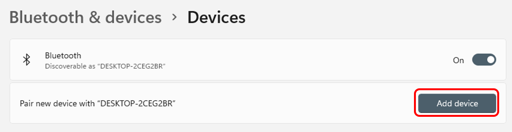
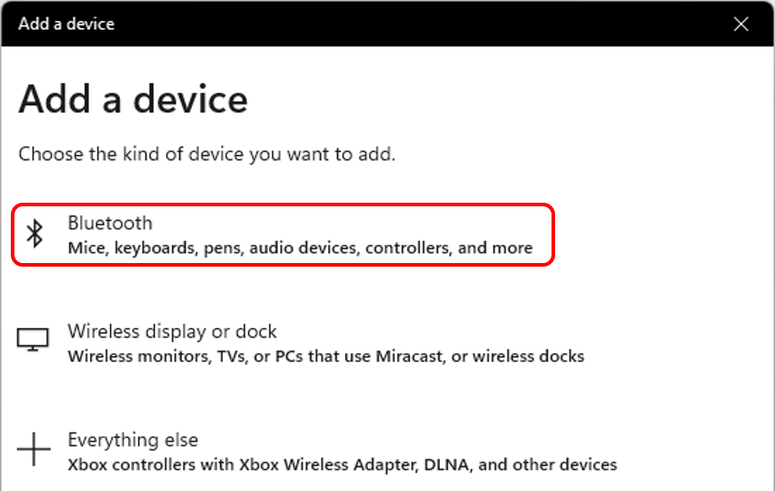
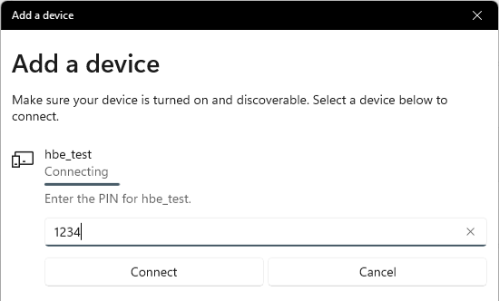
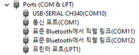
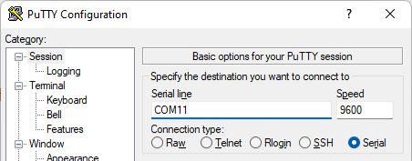

# Bluetooth
Bluetooth는 짧은 거리에서 무선으로 데이터를 주고받기 위한 통신 기술로, 케이블 없이도 다양한 전자기기를 서로 연결할 수 있도록 해주는 표준입니다. 스마트폰, 무선 이어폰, 키보드·마우스, 차량용 핸즈프리 등 일상적인 기기 대부분이 Bluetooth를 통해 서로 통신합니다.

## Bluetooth 란 무엇인가?
Bluetooth는 2.4 GHz 대역을 사용하는 근거리 무선 통신 규격으로, 주로 다음과 같은 특징을 가집니다.

- 근거리 통신
    - 보통 수 미터에서 수십 미터 거리 내에서 안정적으로 동작합니다.  
- 저전력·저속 데이터 전송
    - 대용량 파일 전송보다는, 센서 데이터, 제어 명령, 오디오 데이터처럼 상대적으로 적은 양의 데이터를 주고받는 데 적합합니다.
- 페어링(Pairing) 기반 연결 
    - 기기끼리 임의로 연결되는 것이 아니라, 한 번 페어링을 해 두면 이후에는 자동으로 다시 연결되는 구조를 사용합니다.
- 프로파일(Profile) 기반 역할 분리
    - 키보드, 이어폰, 시리얼 통신 등 용도에 따라 다양한 프로파일이 정의되어 있으며, HC-05 모듈은 이 중 SPP(Serial Port Profile) 를 사용하여 가상의 시리얼 포트를 공합니다.

Bluetooth에는 크게 Bluetooth Classic 과 BLE(Bluetooth Low Energy) 두 계열이 있는데, 여기서 활용하는 HC-05 모듈은 Bluetooth Classic 기반 SPP 모듈로, “무선 UART”처럼 사용하는 것이 기본적인 활용 방식입니다.

## 아두이노에서 Bluetooth를 사용하는 방법
아두이노에서 Bluetooth를 사용한다는 것은, 실제로는 UART 직렬 통신을 무선으로 확장하는 것과 같습니다.

- HC-05 모듈은 내부적으로 Bluetooth 프로토콜을 처리해 주고,
- 아두이노는 단순히 TX/RX 핀을 통해 시리얼 데이터만 주고받으면 되므로, 일반적인 `Serial` 또는 `Serial1` 사용법과 거의 동일하게 프로그래밍할 수 있습니다.

아두이노에서 Bluetooth를 활용하는 기본 흐름은 다음과 같습니다.

1. 하드웨어 연결
   - HC-05의 TX/RX를 아두이노의 직렬 포트(예: MEGA2560의 Serial1: 18/19번 핀)에 연결합니다.
2. 보레이트 설정  
   - HC-05의 기본 데이터 모드 속도(보통 9600bps)에 맞춰 `Serial1.begin(9600);` 으로 초기화합니다.
3. 페어링 및 가상 시리얼 포트 생성
   - PC나 스마트폰에서 HC-05를 검색하여 페어링하면, PC에서는 가상의 COM 포트가 생성되고, 스마트폰에서는 앱에서 장치를 선택해 접속할 수 있습니다.
4. 시리얼 데이터 송·수신
   - 아두이노 스케치에서는 `Serial1.read()`, `Serial1.write()` 를 이용해 데이터를 주고받습니다.
   - 외부에서는 시리얼 모니터 프로그램(PC)이나 전용 Bluetooth 터미널 앱(스마트폰)을 통해 텍스트 또는 제어 명령을 전송할 수 있습니다.

이렇게 구성하면, 기존에 USB 케이블을 통해 하던 시리얼 통신을 무선으로 대체하거나 원격 제어 용도로 확대할 수 있습니다.

## Bluetooth를 하드웨어 연결 
| Pin | 연결 대상 | 설명 |
|:---:|:---:|:---|
| 5V | +5V | 전원 |
| GND | GND | 접지 |
| 18 | RX | UART RX |
| 19 | TX | UART TX |

## Bluetooth Setting 
아래 예제는 HC-05 모듈과 PC(또는 스마트폰)를 페어링한 뒤, 양방향 에코 테스트를 수행하기 위한 기본 프로그램 입니다.

```cpp
void setup() {
  Serial.begin(115200);
  Serial1.begin(38400);
  Serial.println("HC-05 Setting ready");
}
void loop() {
  if (Serial1.available()) 
    Serial.write(Serial1.read());
  if (Serial.available())  
    Serial1.write(Serial.read());
}
```

프로그램을 작성후 Bluetooth 모듈의 전원을 인가하기전에, Bluetooth 모듈에 장착되어 있는 스위치를 누른 상태로 전원을 인가합니다. 이렇게 전원을 켜게되면 Bluetooth 모듈의 LED 가 느리게 점멸하는 상태로 표기되며, AT Command 를 입력받을 수 있는 설정모드가 됩니다. 이때, 아두이노 IDE 의 Serial Monitor 를 켜고 입력 설정을 "Both NL & CR" 로 설정합니다. 


이제 AT Command 를 입력합니다. 우선 통신이 정상적인지 확인할 때는 AT 를 입력합니다. OK 가 반환되면 명령이 정상적으로 전달되는 상황입니다. 

Bluetooth 는 각 장치별 고유한 이름을 가집니다. Wi-Fi의 SSID 와 같이 고유한 이름을 지닐 수 있는데, AT Command 를 통해 이름을 변경합니다. AT+NAME= 과 함께 원하는 이름을 지정합니다. 주변 Bluetooth 장치와 이름이 동일하다면 정상적인 실습이 이루어지지 않을 수 있으니 이름은 고유한 이름을 쓰도록 합니다. 
- ex) AT+NAME=hbe_test

OK 가 반환되면 이제 Bluetooth 모듈의 이름은 변경이 완료된 상태입니다. Bluetooth 모듈에 연결된 전원을 뺏다가 다시 꼽아 리셋을 진행합니다. 이후 Bluetooth 의 LED 를 확인해보면 페어링 대기 상태로 빠르게 점멸하는것을 확인할 수 있습니다. 

## Bluetooth Echo 
이제 Bluetooth 통신을 위한 프로그램을 다운로드 합니다. 앞서 작성한 설정 프로그램과 코드가 거의 동일하지만, Bluetooth 모듈과 통신을 위한 통신 속도가 차이가 있습니다. 

```cpp 
void setup() {
  Serial.begin(115200);
  Serial1.begin(9600);
  Serial.println("HC-05 echo ready");
}
void loop() {
  if (Serial1.available()) 
    Serial.write(Serial1.read());
  if (Serial.available())  
    Serial1.write(Serial.read());
}
```

프로그램 다운로드 후 페어링을 진행합니다. 여기서는 윈도우 PC 기반으로 설명합니다. 설정의 Bluetooth & devices 에서 Bluetooth 페어링을 진행할 수 있습니다. "Add device" 혹은 "장치 추가" 버튼을 누릅니다. 



Bluetooth 장치 추가하기 위에 Bluetooth 를 선택하면 주변 Bluetooth 장치가 검색됩니다. 



여기서 설정한 이름의 Bluetooth 장치를 찾습니다. 선택하면 페어링 진행에 앞서 PIN 번호를 묻는 과정지 선행됩니다. PIN 은 1234 입니다. 



정상적으로 연결이 완료되면 다음과 같은 화면을 확인할 수 있습니다. 


이렇게 연결이 완료되면 장치 관리자의 포트를 확인하면 "표준 Bluetooth 직렬 링크" 로 2개의 포트가 추가되는것을 확인할 수 있습니다. 이중 낮은 숫자의 포트를 활용합니다. 



하이퍼 터미널, Putty 와 같은 프로그램을 이용하여 새로 추가된 "표준 Bluetooth 직렬 링크" 장치를 엽니다. 

> ### **통신 속도 설정 관련 팁**  
> Windows에서는 Bluetooth 모듈(HC-05)이 가상 직렬 포트(COM 포트) 로 등록됩니다.
> 일반적인 유선 직렬 통신에서는 통신 속도(보레이트)를 잘못 설정하면 데이터가 손상되거나 통신이 이루어지지 않기 때문에 보레이트 설정이 매우 중요합니다.
> 
> 그러나 이번 실습에서 사용하는 Bluetooth 연결은 PC ↔ HC-05 사이가 실제 UART 통신이 아니라 Bluetooth 무선 패킷 통신입니다.
> PC에서 생성되는 COM 포트는 “직렬 포트처럼 보이도록 만든 가상 장치” 일 뿐,
> 실제로는 Bluetooth 드라이버가 모든 데이터를 무선 패킷으로 변환하여 처리합니다.
> 
> 따라서 Putty 등에서 설정하는 보레이트 값은 `실제 통신에 아무런 영향을 주지 않으며, 어떤 값을 설정하더라도 정상적으로 데이터 송·수신이 가능합니다.`
> 
> 반면, HC-05 ↔ 아두이노 간의 UART 구간은 실제 직렬 통신이기 때문에, 이 부분의 보레이트(예: 9600bps)는 반드시 일치해야 정상적으로 통신됩니다.



연결된 창에서 키보드를 입력하면 입력된 키의 값이 아두이노 IDE 의 Serial Monitor 에 출력되는것을 확인할 수 있습니다. 

## Bluetooth 기반 원격 제어 
Bluetooth를 이용하면 단순 텍스트 송·수신뿐 아니라, 외부 기기(PC/스마트폰)에서 아두이노에 원격 제어 명령을 보내는 방식으로 다양한 응용이 가능합니다.

여기서는 예시로, 숫자 0~7을 Bluetooth로 전송하면 해당 번호에 대응하는 LED를 토글(켜짐 ↔ 꺼짐 전환) 하는 간단한 제어 시스템을 구현합니다.

### LED 연결 
| Pin | 연결 대상 | 설명 |
|:---:|:---:|:---|
| GND | GND | 접지 |
| 4 | D0 | LED 0 |
| 5 | D1 | LED 1 |
| 6 | D2 | LED 2 |
| 7 | D3 | LED 3 |
| 8 | D4 | LED 4 |
| 9 | D5 | LED 5 |
| 10 | D6 | LED 6 |
| 11 | D7 | LED 7 |

### 원격 제어 코드 

```cpp 
int pin_leds[8] = {4,5,6,7,8,9,10,11};
int led_state[8] = {0,};
int i;

void setup() {
  Serial.begin(115200);
  Serial1.begin(9600);
  for(i=0;i<8;i++){
    pinMode(pin_leds[i], OUTPUT);
    digitalWrite(pin_leds[i], LOW);
    led_state[i] = 0;
  }
}

void loop() {
  if (Serial1.available()){
    char c = Serial1.read();

    if (c >= '0' && c <= '7') {
      int idx = c - '0';
      led_state[idx] = !led_state[idx];
      digitalWrite(pin_leds[idx], led_state[idx] ? HIGH : LOW);
    }
  }    
}
``` 